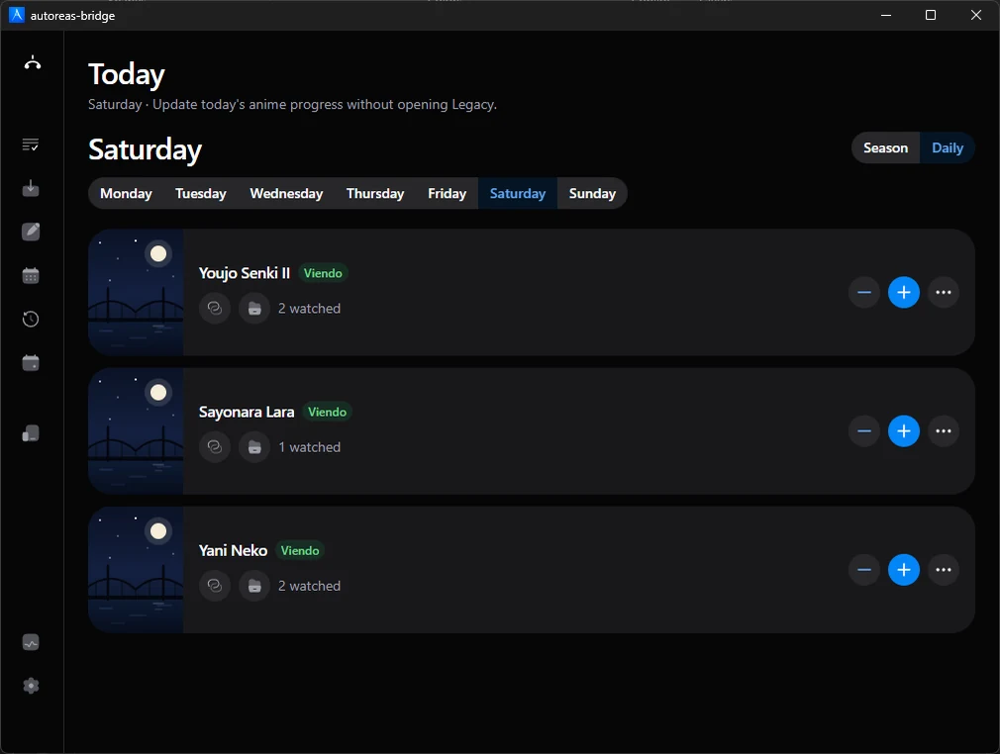
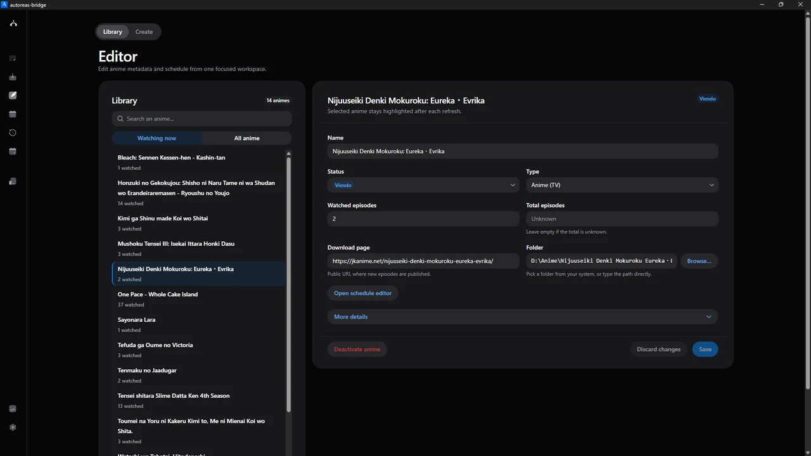
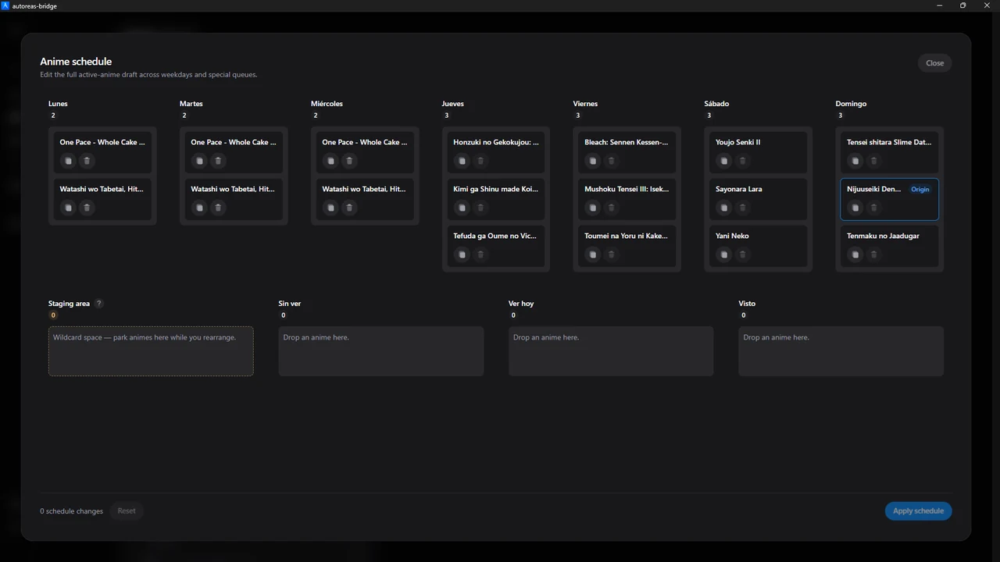
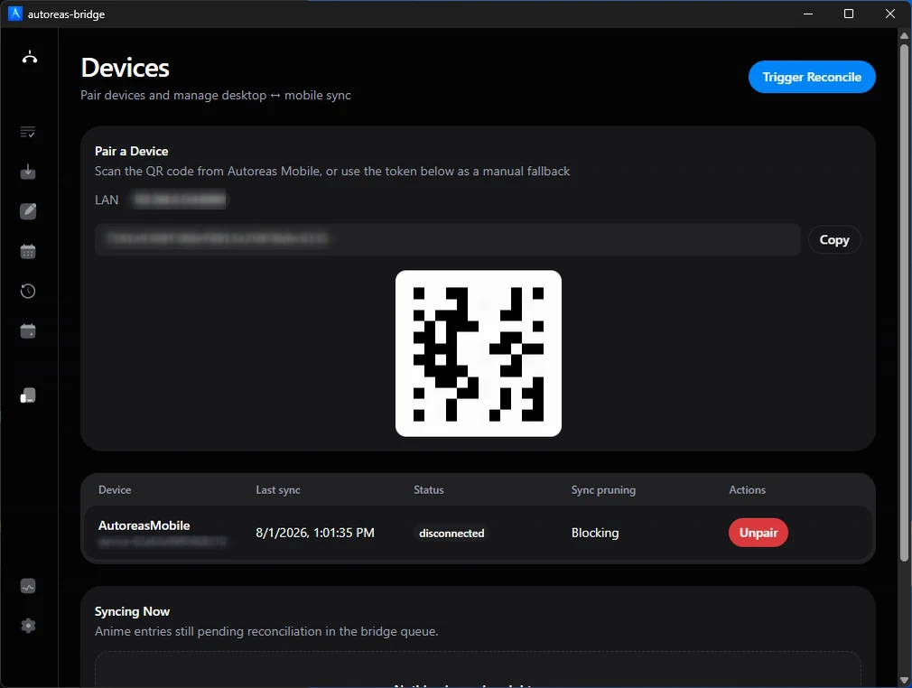
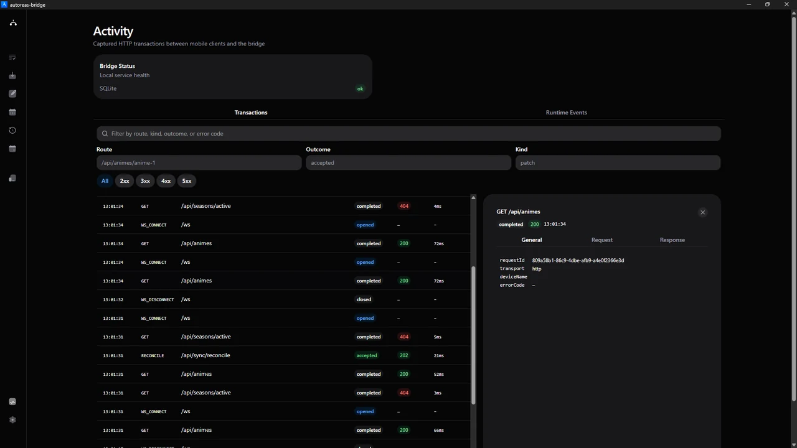
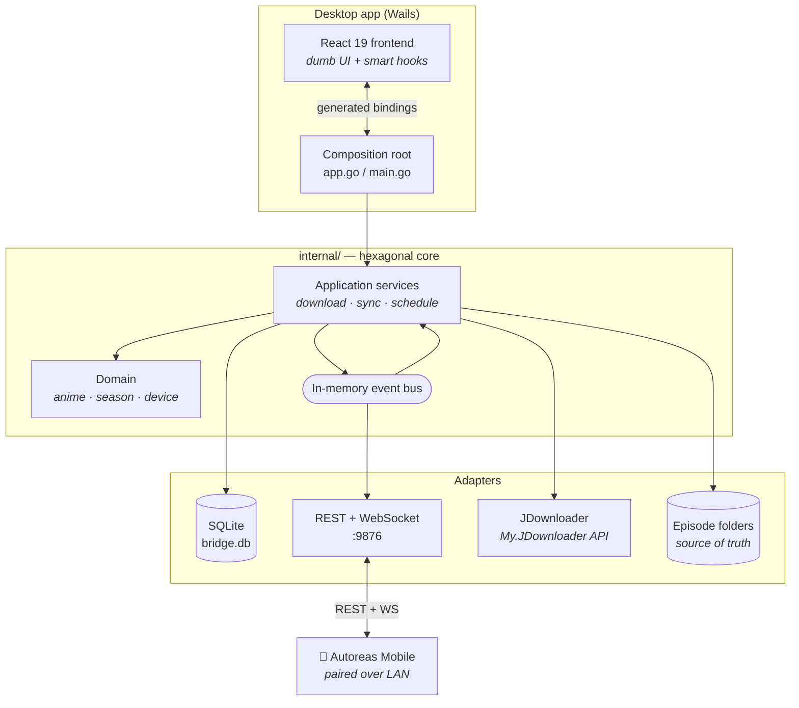

<div align="center">

# Autoreas Bridge

**A local-first desktop app that tracks your anime, downloads new episodes on a schedule, and syncs your progress to your phone over your own LAN — no cloud, no account, no internet required.**

[](https://github.com/Disble/autoreas-bridge/releases/latest)
[](https://github.com/Disble/autoreas-bridge/actions/workflows/release.yml)
[](https://go.dev)
[](https://wails.io)
[](https://react.dev)
[](#installation)



</div>

---

## Table of contents

- [Overview](#overview)
- [Features](#features)
- [Tech stack](#tech-stack)
- [Installation](#installation)
- [Running from source](#running-from-source)
- [Configuration](#configuration)
- [Project structure](#project-structure)
- [Architecture](#architecture)
- [Testing and quality gates](#testing-and-quality-gates)
- [Contributing](#contributing)
- [License](#license)

---

## Overview

Autoreas Bridge is a Windows/Linux desktop application for people who follow a
lot of seasonal anime and are tired of doing the same four chores by hand:
remembering what airs today, bumping the episode counter, fetching the new
episode, and keeping all of that in sync with the phone they actually watch on.

It does all four locally. Every catalog entry, schedule, rating and progress
value lives in **one embedded SQLite database on your machine**. There is no
account to create, no server to reach, and no telemetry. The only network
traffic the app generates is the traffic *you* ask for: your phone talking to
your desktop over your own LAN, and the download engine fetching episodes.

### Design principles

| Principle | What it means in practice |
| --- | --- |
| **Local-first** | The database is the product. It lives in your user profile, it is yours, and the app is fully usable with the network cable unplugged. |
| **One owner for state** | SQLite is the sole owner of anime state. No sidecar file, no companion process, no second source of truth to reconcile. |
| **The disk is the truth for downloads** | Episode-on-disk counts are read from the filesystem, never cached in the database, so the app can never disagree with your folder. |
| **Non-blocking conflict handling** | Concurrent edits from desktop and phone are detected with optimistic concurrency and surfaced as a conflict you resolve — never silently overwritten. |
| **Architecture enforced by linters, not by prose** | Hexagonal boundaries and frontend rails are checked by `depguard` and ESLint in a pre-commit gate, so the documented design and the shipped design cannot drift. |

<details>
<summary><strong>Historical note: why it is called a "Bridge"</strong></summary>

Bridge started as a synchronization bridge that observed a legacy Windows
desktop app's NeDB-style data file (`animes.dat`) and mirrored it to companion
devices over LAN.

That channel was retired entirely: Bridge no longer reads, writes or watches any
legacy file, and does not synchronize with the legacy desktop app. Anyone still
running the old app gets **no synchronization** from this version — the two
catalogs are independent going forward. The name is kept for continuity, even
though it no longer bridges to anything external. The decision is recorded in
[ADR-008](docs/adr/008-legacy-breakup-sqlite-sole-owner.md).

</details>

---

## Features

### Daily tracking

The landing screen answers one question — *what do I watch today?* — and lets you
bump progress in a single click. Episode counts accept half steps (`0.5`) for
split episodes and specials, and a counter can go **down**: correcting a mistake
is a legitimate edit, not a conflict.


### Library editor

A focused two-pane workspace: searchable library on the left, full metadata form
on the right. Title, status, watched and total episodes, download page, target
folder, cover art and repetition history — with the selection preserved across
refreshes so a save never loses your place.



### Weekly schedule board

Airing days are edited as a drag-and-drop board across the seven weekdays plus
the `Sin ver` / `Ver hoy` / `Visto` queues, with a staging area to park titles
mid-rearrange. Changes are drafted locally and committed atomically — the counter
in the footer tells you exactly how many moves are pending before you apply them.



### Automated episode downloads

- **Scheduled runs.** Pick the days and the daily run time; the app checks for
  new episodes on its own and reports each run's outcome (`ok`, `partial`,
  `jd_offline`, `no_animes_today`, `canceled`, …).
- **Hoster priority with fallback.** Reorder which hoster is tried first
  (Mediafire, Mega, Vidhide, Mp4upload, Mixdrop); if the preferred one has no
  working link, the next is tried automatically.
- **JDownloader integration.** Links are handed to JDownloader over the
  My.JDownloader API, with the app watching progress, renaming finished files and
  flattening them into the target folder.
- **Filesystem as source of truth.** What counts as "already downloaded" is what
  is actually on disk — never a cached number that can go stale.
- **Manual catch-up.** A one-off "download missing episodes" action for a single
  title, outside the schedule.

### Season selection and grading

A dedicated season workspace for the start-of-season ritual: grade first
episodes, let the verdict derive from the grade, and override it with explicit
considerations (`insufficient_quota`, `temporarily_approved`, `spare_quota`) when
the slots do not line up. Ordering across the week is drag-and-drop, and the
resulting selection feeds the daily view.

### LAN device pairing and sync

Pair the companion mobile app by scanning a QR code — or by copying a one-shot
token as a manual fallback. Paired devices hold a persistent auth token, receive
live updates over WebSocket, and can be revoked from the desktop at any time.
Concurrent edits are detected with optimistic concurrency (`base` version token)
and preserved as conflicts with both sides intact, rather than resolved by
overwrite.



> [!NOTE]
> The pairing token, LAN address and device identifier are intentionally blurred
> in this screenshot.

### Built-in API activity inspector

Every HTTP transaction and WebSocket event between mobile clients and the bridge
is captured and browsable in-app: filter by route, outcome, kind or status class,
then open a transaction to inspect its request and response. A separate runtime
events tab covers domain events. This is the debugging surface that removes the
need to attach a proxy when a phone misbehaves.



### And the rest

| Feature | Detail |
| --- | --- |
| **Notification center** | In-app notification history with actionable entries, plus native Windows toasts for run outcomes and missed schedules. |
| **Backup and restore** | Export a versioned backup bundle and import it back with an explicit safety model ([ADR-009](docs/adr/009-backup-bundle-format-and-decentralized-ownership.md), [ADR-010](docs/adr/010-backup-import-safety-model.md)). |
| **System tray and autostart** | Runs quietly in the tray and can register itself to start with the OS. |
| **Activity history** | An audit trail of user and system actions over the catalog. |
| **MCP sidecar** | `cmd/autoreas-request-mcp` exposes captured requests read-only over the Model Context Protocol, so an AI assistant can debug a sync session against real traffic. |

---

## Tech stack

| Layer | Technology | Why |
| --- | --- | --- |
| **Language (backend)** | [Go 1.27](https://go.dev) | Single static binary, first-class concurrency for the event bus and download workers. |
| **Desktop shell** | [Wails v2](https://wails.io) (`v2.15.0`) | Native webview instead of a bundled Chromium — a fraction of an Electron install. |
| **Database** | SQLite via [`modernc.org/sqlite`](https://pkg.go.dev/modernc.org/sqlite) | Pure-Go, **cgo-free**, so the app cross-compiles without a C toolchain. WAL mode + `busy_timeout` for concurrent writers. |
| **Transport** | `net/http` + [gorilla/websocket](https://github.com/gorilla/websocket) | REST for commands, WebSocket for live push to paired devices. |
| **Download engine** | [jdownloader-go](https://github.com/Disble/jdownloader-go) | Drives JDownloader through the My.JDownloader API. |
| **Desktop notifications** | [go-toast](https://git.sr.ht/~jackmordaunt/go-toast), [systray](https://github.com/getlantern/systray) | Native Windows toasts and tray integration. |
| **UI framework** | [React 19](https://react.dev) + [React Router 7](https://reactrouter.com) | |
| **Component library** | [HeroUI v3](https://www.heroui.com) + [Tailwind CSS v4](https://tailwindcss.com) | Accessible primitives (React Aria) over hand-rolled widgets. |
| **State** | [Zustand](https://zustand.docs.pmnd.rs) | Small, unopinionated stores for cross-feature state. |
| **Drag and drop** | [`@dnd-kit/react`](https://next.dndkit.com) | Pointer-based, React 19 + StrictMode safe, works inside WebView2. |
| **Charts / icons / QR** | [Nivo](https://nivo.rocks), [Iconify](https://iconify.design), [`qrcode`](https://github.com/soldair/node-qrcode) | |
| **Build tooling** | [Bun 1.3](https://bun.sh), [Vite 8](https://vite.dev), [TypeScript 6](https://www.typescriptlang.org) | |
| **Testing** | `go test`, [Vitest](https://vitest.dev) + Testing Library, [Stryker](https://stryker-mutator.io) & [ditto](https://github.com/Disble/ditto) for mutation testing | |
| **Quality gates** | [Lefthook](https://lefthook.dev), [golangci-lint](https://golangci-lint.run) (+ custom plugin), [ESLint 9](https://eslint.org) flat config, [Fallow](https://www.npmjs.com/package/fallow), [SonarQube](https://www.sonarsource.com) | |
| **CI/CD** | GitHub Actions | Tag-triggered cross-platform build and release. |
| **Interop** | [MCP Go SDK](https://github.com/modelcontextprotocol/go-sdk) | Read-only request-capture sidecar. |

---

## Installation

### From a release (recommended)

Grab the latest build from the [**Releases**](https://github.com/Disble/autoreas-bridge/releases/latest) page.

| Platform | Artifact |
| --- | --- |
| **Windows (x64)** | `autoreas-bridge-<version>-windows-amd64-installer.exe` — NSIS installer |
| **Debian / Ubuntu (x64)** | `autoreas-bridge-<version>-linux-amd64.deb` — declares its GTK/WebKit runtime dependencies |
| **Other Linux (x64)** | `autoreas-bridge-<version>-linux-amd64.tar.gz` — portable binary |

Every release ships per-platform `SHA256SUMS-*.txt`. Verify before running:

```bash
# Linux
sha256sum -c SHA256SUMS-linux-amd64.txt
```

```powershell
# Windows
Get-FileHash .\autoreas-bridge-1.8.3-windows-amd64-installer.exe -Algorithm SHA256
```

### Optional: JDownloader

The download features drive [JDownloader 2](https://jdownloader.org) through the
My.JDownloader API. Install it and sign in to My.JDownloader if you want
automated downloads; everything else in the app works without it.

### Where your data lives

| Platform | Path |
| --- | --- |
| Windows | `%APPDATA%\Autoreas\data\bridge.db` |
| Linux | `~/.config/Autoreas/data/bridge.db` |

The database is deliberately kept out of the install directory so Windows UAC
cannot block writes when the app is installed under `C:\Program Files`. Back it
up by copying that file, or use the in-app backup export.

---

## Running from source

### Prerequisites

| Tool | Version | Notes |
| --- | --- | --- |
| [Go](https://go.dev/dl/) | 1.27+ | Matches the `go` directive in `go.mod`. |
| [Bun](https://bun.sh/) | 1.3+ | Node.js works too, but the scripts and lockfile assume Bun. |
| [Wails CLI](https://wails.io/docs/gettingstarted/installation) | v2 | **Not optional** — see below. |
| Platform SDK | — | Windows: WebView2 runtime (preinstalled on Windows 11). Linux: `libgtk-3-dev`, `libwebkit2gtk-4.1-dev`. |

> [!IMPORTANT]
> The Wails CLI is required even for frontend-only work. `frontend/wailsjs/`
> holds the generated TypeScript bindings for every bound Go method, it is not
> tracked in git, and many frontend files import from it. `bun install`
> regenerates it through a postinstall hook — but without the CLI on your
> `PATH`, the frontend will not typecheck.

### Setup

```bash
git clone git@github.com:Disble/autoreas-bridge.git
cd autoreas-bridge

go mod download
bun --cwd="frontend" install    # also generates frontend/wailsjs/
```

### Development

```bash
wails dev
```

This starts a Vite dev server with hot reload for the frontend alongside the Go
backend. A browser-based inspector is available at `http://localhost:34115`.

After changing a **bound Go method**, regenerate the bindings so the frontend
sees the new signature:

```bash
bun --cwd="frontend" run generate:bindings
```

`wails dev` and `wails build` regenerate them too; the script exists for when you
are working on the frontend alone.

### Production build

```bash
wails build            # binary into build/bin/
wails build -nsis      # Windows: also produce the NSIS installer
```

A local build is a rehearsal for smoke-testing. Actual releases ship through CI:
pushing a `vX.Y.Z` tag builds both platforms and publishes a GitHub Release with
the installer, the Linux packages and the checksums. See
[`.claude/skills/bridge-release/SKILL.md`](.claude/skills/bridge-release/SKILL.md).

---

## Configuration

### Listen address

The HTTP API binds `0.0.0.0:9876` by default. Two things can change it, and the
environment wins over the stored value:

```bash
AUTOREAS_BRIDGE_ADDR=9911 ./autoreas-bridge    # a bare port works too
```

The persisted setting (`GetAPIAddress` / `SetAPIAddress`, editable in
**Settings**) is the ordinary route; the environment variable is the recovery
route. They are not redundant: if the configured port is already taken, the app
never reaches a settings screen, so an override that lived only behind the UI
would be unreachable in the one situation it exists for.

An unusable value is never fatal — it is logged, skipped, and the next source is
used, because refusing to start is exactly the failure this is meant to prevent.
A change of address applies on the **next start** rather than rebinding
underneath paired devices mid-session.

### Local HTTP API

The API consumed by the companion mobile app is documented in
[`docs/openapi.yaml`](docs/openapi.yaml).

| Method | Route | Purpose |
| --- | --- | --- |
| `POST` | `/api/devices/pair` | Redeem a one-shot pairing token |
| `GET` / `DELETE` | `/api/devices`, `/api/devices/{id}` | List and revoke paired devices |
| `GET` / `PATCH` | `/api/animes`, `/api/animes/{id}` | Read the catalog, patch anime state |
| `GET` | `/api/animes/changes` | Changes after a timestamp |
| `POST` | `/api/sync/reconcile` | Trigger reconciliation and fetch changes |
| `GET` / `POST` | `/api/conflicts`, `/api/conflicts/{id}/resolve` | Inspect and resolve conflicts |
| `GET` / `POST` | `/api/seasons/active`, `/api/seasons/active/ratings` | Active season snapshot and first-episode grades |
| `GET` | `/api/status` | Bridge health |
| `WS` | `/ws` | Live state push |

---

## Project structure

```text
autoreas-bridge/
├── app*.go                  # Wails composition root — bindings exposed to the frontend
├── main.go                  # Entry point and Wails options
├── cmd/
│   └── autoreas-request-mcp/  # Read-only MCP sidecar over captured requests
├── internal/                # Hexagonal core — no Wails runtime allowed below this line
│   ├── anime/               # Anime domain: aggregate, storage codec, write pipeline
│   │   ├── domain/          #   pure business rules (no I/O, no SQL, no HTTP)
│   │   └── store/           #   SQLite gateway, stage→finalize→publish, outbox
│   ├── season/              # Season selection: grading, verdicts, ordering
│   ├── download/            # Download orchestration
│   │   ├── jdownloader/     #   My.JDownloader client, launcher, renaming
│   │   ├── filesystem/      #   on-disk episode counting (source of truth)
│   │   └── sites/           #   per-site scraping adapters
│   ├── sync/                # Changelog, OCC conflict detection, SQLite bootstrap
│   ├── device/              # Pairing tokens, trusted devices, auth
│   ├── api/                 # HTTP router, handlers, capture middleware
│   │   ├── contracts/       #   ports — never imports handlers or drivers
│   │   └── handlers/        #   adapters
│   ├── realtime/            # WebSocket hub
│   ├── events/              # In-memory event bus
│   ├── notification/        # Dispatcher, desktop toasts, notification center
│   ├── observability/       # Request capture, event log
│   ├── persistence/         # Shared SQLite schema and helpers
│   ├── schedule/            # Scheduler for automated runs
│   ├── backup/              # Versioned export/import bundles
│   ├── settings/ activity/ tray/ autostart/ logger/ pathutil/
│   └── testsupport/         # Shared test fixtures and harnesses
├── frontend/
│   └── src/
│       ├── App.tsx          # Delivery/composition only — no hooks, no bindings
│       ├── app/             # Layout shell and routed surfaces
│       ├── features/        # Domain-driven modules (catalog, season, download, …)
│       ├── shared/          # Cross-feature UI, hooks, helpers, stores
│       ├── infrastructure/  # Source adapters over the Wails bindings
│       └── test/            # Test bootstrap
├── tools/                   # Repo-owned Go guards (file size, gofmt, architecture, OpenAPI…)
├── docs/                    # Architecture, ADRs, OpenAPI, postmortems, learning log
├── openspec/                # Spec-Driven Development artifacts
└── .github/workflows/       # Build Windows, Build Linux, Release
```

### Frontend module layout

Complex frontend modules use **strict colocation** and no barrel files
([ADR-011](docs/adr/011-no-barrel-files.md)) — every module is imported by
concrete path:

```text
features/season/ui/SeasonWorkspace/
├── SeasonWorkspace.tsx            # dumb UI: HeroUI + Tailwind, no hooks, no bindings
├── use-season-workspace.ts        # smart hook, strict 10-step anatomy
├── season-workspace.types.ts      # every *Props field is readonly
├── season-workspace.helpers.ts    # pure functions
├── season-workspace.constants.ts
└── __tests__/                     # colocated, test-first
```

---

## Architecture

The backend follows **Hexagonal Architecture (Ports & Adapters)** with strongly
separated bounded contexts; the frontend enforces a **smart hooks / dumb UI**
split.



Boundaries are **enforced, not documented**: `depguard` rules in
`.golangci.yml` fail the build if `internal/anime/domain` imports `net/http`,
`database/sql` or the Wails runtime; if `internal/api/contracts` imports
handlers or drivers; or if any `internal/**` package imports the Wails runtime.

Deeper reading:

- [`docs/architecture.md`](docs/architecture.md) — full architecture document (Spanish)
- [`ARCHITECTURE.md`](ARCHITECTURE.md) — frontend rails and enforcement barriers
- [`docs/adr/`](docs/adr/) — Architecture Decision Records
- [`docs/ubiquitous-language.md`](docs/ubiquitous-language.md) — domain vocabulary
- [`docs/openapi.yaml`](docs/openapi.yaml) — mobile-facing HTTP contract

---

## Testing and quality gates

Tests are not optional here — TDD is the working mode, and the cycle is
**RED → GREEN → MUTATE → REFACTOR**.

```bash
# Backend
go test ./...

# Frontend
bun --cwd="frontend" run test
bun --cwd="frontend" run validate       # lint + typecheck

# Go linting — reproduces the gate exactly
powershell -ExecutionPolicy Bypass -File scripts/lint.ps1 -Profile all

# Does the production bundle actually paint? (~4s, headless Edge)
bun --cwd="frontend" run render:smoke
```

`-Profile all` is `base` plus `advanced`: `base` is stock golangci-lint,
`advanced` builds the tracked plugin, and some rules — `gocognit` among them —
exist **only** in the plugin. Running `-Profile base` and reading `0 issues` is
therefore not evidence the gate will pass.

### What the pre-commit gate enforces

`git commit` runs the full [Lefthook](https://lefthook.dev) gate (budget ~90s for
a change touching both Go and the frontend; jobs are globbed to the files they
judge, so a docs-only commit runs almost nothing):

| Group | Jobs |
| --- | --- |
| **Go** | `gofmt` guard · file-size guard · architecture guard · `golangci-lint` (base + plugin) · `go vet` · `go test ./... -cover` |
| **Repo** | app-icon guard (`genicons -check`) · SDD artifact gate · OpenAPI contract guard |
| **Frontend** | TypeScript typecheck · ESLint 9 flat config (delivery purity, dumb-UI rules, hook anatomy, strict colocation, readonly props, JSDoc, no import cycles, cognitive complexity, 500-line max) · Vitest · render smoke · layout smoke · Stryker mutation testing on staged lines |

> [!TIP]
> Give `git commit` a generous timeout (≥ 5 minutes). A killed commit leaves the
> changes staged but unrecorded — just re-run it. Never use `--no-verify`.

### Mutation testing

Line coverage does not tell you whether a test *asserts* anything. Both surfaces
are covered:

```bash
# Frontend — automated in the pre-commit hook, over staged lines
bun --cwd="frontend" run test:mutation:staged

# Go — manual, scoped to the owning package
ditto staged --exclude-prefix frontend/ --threshold 0.80 \
  --test-command "go test -count=1 -json ./internal/<package>/"
```

Naming the owning package is not optional: ditto runs the test command once per
mutant, sequentially. See [`docs/mutation-testing.md`](docs/mutation-testing.md).

---

## Contributing

This project runs on **Spec-Driven Development (SDD)**, orchestrated through
`openspec/` and `.atl/`. Substantial changes move through a structured flow:

```text
Explore → Propose → Spec → Design → Tasks → Apply → Verify → Archive
```

Before opening a PR:

1. Read [`AGENTS.md`](AGENTS.md) — the primary project instruction file — and
   [`docs/learning-log.md`](docs/learning-log.md), the "why" journal.
2. Write the failing test first. Frontend helpers and hooks need a colocated
   `__tests__/` sibling.
3. Keep files under the size policy: warning at 400 effective lines, hard fail
   above 500, on both Go and the frontend
   ([`docs/file-size-policy.md`](docs/file-size-policy.md)).
4. Code, identifiers, comments and commit messages are **English**. Spanish is
   confined to the retained storage codec, runtime data literals (`Sin ver`,
   `Ver hoy`, `Visto`, `No me gusto`) and some UI copy
   ([ADR-007](docs/adr/007-english-code-spanish-boundaries.md)).
5. Use [Conventional Commits](https://www.conventionalcommits.org).
6. Make sure the full Lefthook gate passes locally.

### Branch model

`dev` carries development; `main` carries deployments. Land work on `dev` and
never commit development directly to `main`. A release exists only after `dev` is
merged into `main`, and the tag goes on the `main` commit — the `guard` job in
`.github/workflows/release.yml` fails a tag build whose commit is not an ancestor
of `main`.

Release notes live in [`CHANGELOG.md`](CHANGELOG.md) and become the GitHub
Release body; a tag whose version has no changelog section fails the pipeline.

---

## License

No license file is published for this repository yet, so the work is
**all rights reserved** by default. If you want to use, modify or redistribute
it, please [open an issue](https://github.com/Disble/autoreas-bridge/issues)
first.
