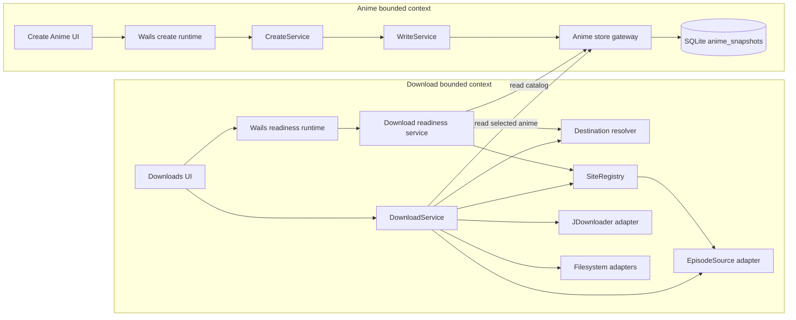
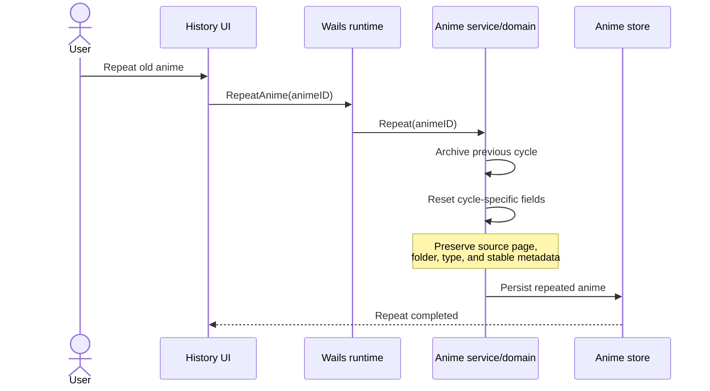
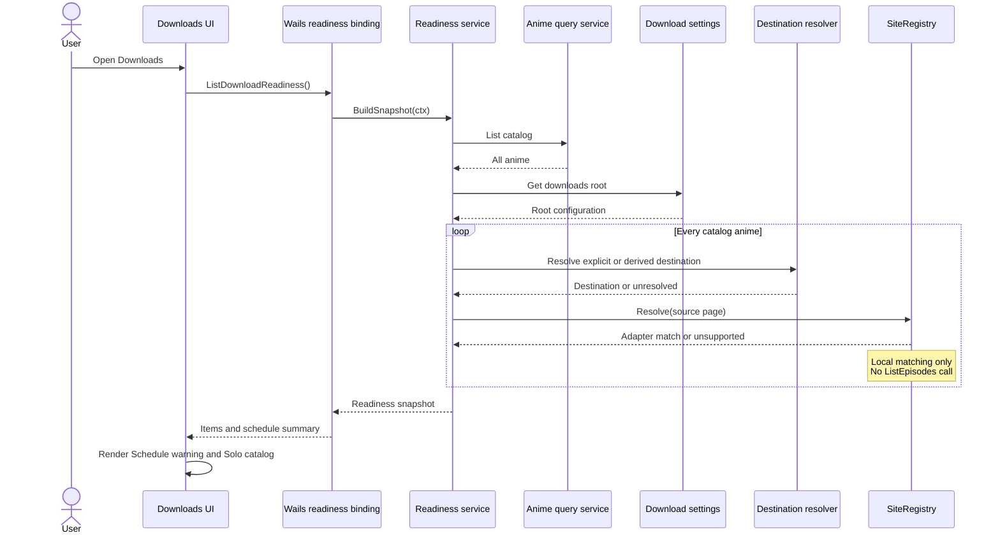
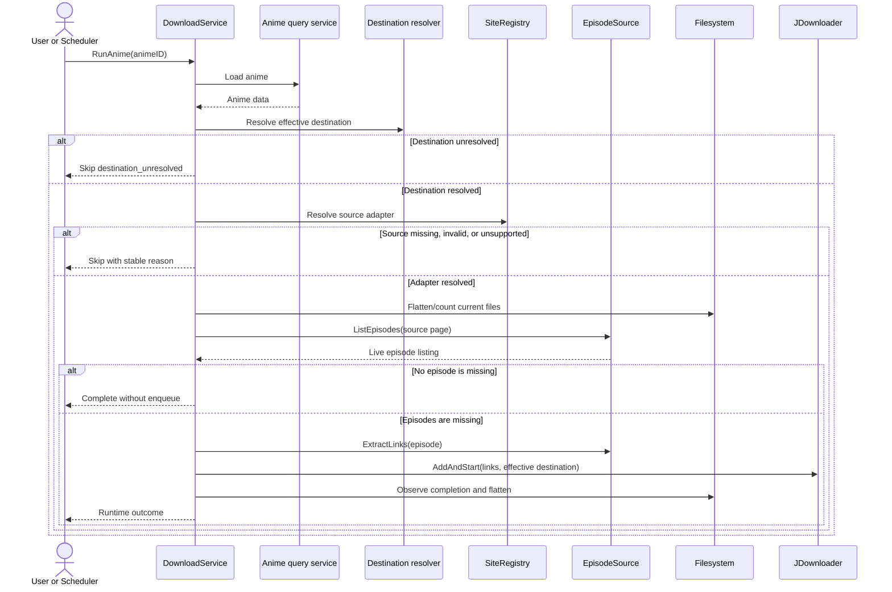
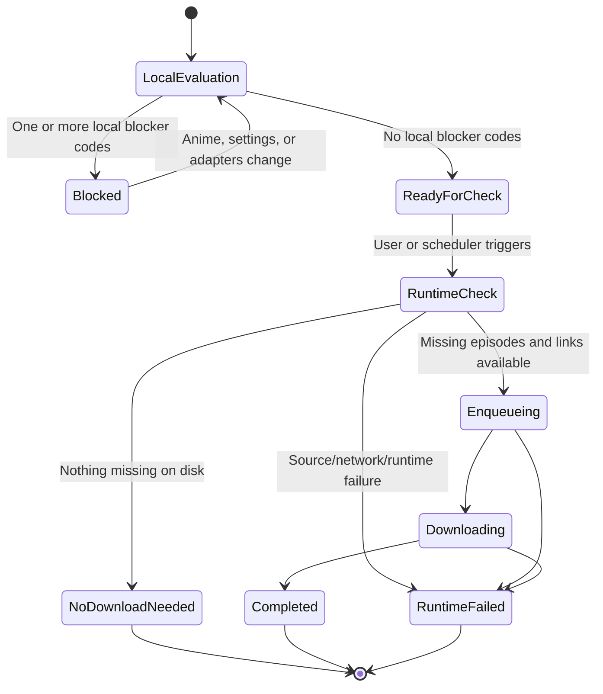

# Anime Creation and Download Readiness Architecture

**Status:** Accepted design; implementation pending
**Date:** 2026-08-03
**Scope:** Anime creation, repeat-from-history, scheduled download readiness, Solo Anime Download, and download execution boundaries

## Decision

Anime creation stores the page supplied by the user as an anime reference. It does not resolve a download adapter, list episodes, contact the source website, or report download compatibility.

Download capability belongs exclusively to the Download bounded context. The Downloads page performs a local readiness evaluation when it opens, and download execution repeats that evaluation before doing runtime work.

The governing rule is:

> **Anime creation stores the page. Download execution interprets its capabilities.**

This separation preserves valid creation and repeat workflows when a page is useful only for consultation, when a supported site changes over time, or when an old anime points to a source that no longer supports downloads.

---

## 1. Problem Statement

The current creation path attempts to resolve the anime page through the download site registry. A page without a registered adapter causes creation to fail with an error such as:

```text
create anime batch: lookup anime metadata for "https://pixeldrain.net/l/qyupHs6T":
resolve anime metadata source: download: no site adapter registered for this page URL
```

That behavior couples two independent concerns:

1. **Catalog ownership:** creating and retaining anime information.
2. **Download execution:** determining whether the current source can provide downloadable episodes.

An anime page can have several valid meanings:

- A page supported by an `EpisodeSource` adapter.
- A direct download or collection page.
- A consultation or reference page.
- A historical page retained with an old anime.
- A page that was supported when the anime was created and is unsupported today.

Download compatibility can change over time. Catalog validity must remain stable when that happens.

### User-visible consequences of the current coupling

- A valid anime cannot be created because its page is unsupported for downloading.
- One unsupported page aborts an entire atomic create batch before persistence.
- A historical anime can become impossible to repeat even though its existing data remains valid.
- The creation form reports a download-domain failure in the wrong user context.
- The production metadata lookup adds a network and adapter failure point without changing persisted state.

---

## 2. Verified Current Behavior

This decision is grounded in the current implementation.

### 2.1 Creation currently blocks on download metadata

`internal/anime/create_service.go` calls the configured `MetadataProvider` before building a create operation. Both single-anime creation and batch creation return immediately when metadata lookup fails.

The production provider in `app_season_anime_gateway.go` performs this sequence:

1. Resolve the page with the download `SiteRegistry`.
2. Call `EpisodeSource.ListEpisodes`.
3. Return `CreateMetadata.LatestEpisode`.

`internal/download/registry.go` returns `ErrSiteUnsupported` when no adapter matches the page.

### 2.2 The production lookup does not enrich persisted creation state

`internal/anime/write_service.go::buildCanonicalCreate` consumes supplied creation metadata such as announced total, duration, and cover URL. It does not consume `CreateMetadata.LatestEpisode`.

The production lookup therefore introduces adapter and network failure coupling while contributing no persisted value to the created anime.

### 2.3 Repeat already preserves the historical page

`internal/anime/domain/anime.go::Anime.Repeat` archives the previous cycle and resets the cycle-specific progress, status, activity, and date fields. It keeps the source page, folder, type, and stable anime metadata.

This is the desired behavior. A historical page remains valid catalog data even when it cannot currently drive a download.

### 2.4 Download execution already owns adapter resolution

`internal/download/service_pipeline.go::prepareAnimeDownload` performs the download-specific work:

1. Evaluate local download prerequisites.
2. Inspect the destination filesystem.
3. Resolve the source adapter through `SiteRegistry.Resolve`.
4. Call `EpisodeSource.ListEpisodes`.
5. Compare online availability with files on disk.
6. Extract and enqueue links when episodes are missing.

Unsupported sources already become a download-specific skip outcome with reason `site_unsupported`.

---

## 3. Architectural Boundaries

### 3.1 Responsibility table

| Concern | Owner | Rule |
|---|---|---|
| Store an anime page | Anime bounded context | Persist the supplied reference without consulting download adapters. |
| Decide whether a page is required or syntactically acceptable for creation | Anime form/domain validation | This rule stays independent from adapter support and network availability. |
| Determine source adapter compatibility | Download bounded context | Use `SiteRegistry.Resolve` during local readiness evaluation and runtime revalidation. |
| List available episodes | Download bounded context | Run only during an explicit or scheduled download execution. |
| Derive an effective destination | Download bounded context | Use the explicit anime folder, then the configured downloads root plus a sanitized anime name. |
| Create or use a destination directory | Download/JDownloader/filesystem adapters | A directory that does not exist yet is a normal execution state. |
| Report why a download cannot start | Download bounded context | Return stable reason codes and map them to user-facing copy in the frontend. |
| Repeat an old anime | Anime bounded context | Preserve its page and stable metadata without testing current download support. |

### 3.2 Component diagram



The creation path has no dependency on `SiteRegistry`, `EpisodeSource`, JDownloader, or a source website.

### 3.3 Dependency direction

The Download context may read anime data through an anime query port. The Anime context must not import or call download registry abstractions during creation.

This preserves the intended hexagonal direction:

```text
UI adapter -> application service -> domain/store ports -> infrastructure adapters
```

Download-specific capability does not become an Anime-domain invariant.

---

## 4. Target Anime Creation Flow

### 4.1 Sequence diagram

```mermaid
sequenceDiagram
    actor User
    participant UI as Create Anime UI
    participant Runtime as Wails CreateAnimeBatch
    participant Create as anime.CreateService
    participant Write as anime.WriteService
    participant Store as anime/store.Gateway
    participant DB as SQLite

    User->>UI: Submit one or more anime
    UI->>Runtime: CreateAnimeBatch(requests)
    Runtime->>Create: CreateBatch(ctx, requests)

    loop Each request
        Create->>Create: Validate creation fields
        Note over Create: No adapter resolution<br/>No episode listing<br/>No source network request
        Create->>Write: BuildCreateOperation(request)
        Write-->>Create: Staged operation
    end

    Create->>Store: ApplyBatch(operations)
    Store->>DB: Stage and finalize atomically
    DB-->>Store: Commit success
    Store-->>Create: Created anime
    Create-->>Runtime: Batch result
    Runtime-->>UI: Success
```

### 4.2 Creation invariants

- Unsupported download sources do not create errors.
- Unsupported download sources do not create warnings.
- Creation performs no `SiteRegistry.Resolve` call.
- Creation performs no `EpisodeSource.ListEpisodes` call.
- Creation performs no source-site network request.
- Batch atomicity remains owned by `WriteService` and the store gateway.
- Existing creation validation may still require a page or validate its basic syntax. Such validation is an Anime-domain/form decision and cannot depend on registered download adapters.
- Supplied metadata continues to flow through `BuildCreateOperation` as it does today.

### 4.3 Creation result

The creation result describes creation success or creation-domain validation failures. It carries no download readiness warnings.

If the product later needs source metadata discovery, that capability should be an explicit, separately triggered operation with its own UX and failure model. It should not become a prerequisite for persistence.

---

## 5. Repeat-from-History Flow

Repeat is a catalog lifecycle action. It remains valid for an anime whose page is missing, malformed for downloading, or unsupported by the current adapter registry.



Download readiness is evaluated later, when the user opens Downloads or requests a download.

---

## 6. Download Readiness Model

### 6.1 Purpose

Readiness answers a narrow question:

> Can the application begin a download check for this anime using locally available information?

It does not promise that episodes exist, a hoster will work, JDownloader is online, or the eventual download will succeed.

The UI therefore uses the phrase **“Ready for download check”**.

### 6.2 Local-only evaluation

Opening the Downloads page may perform these operations:

- Load the anime catalog.
- Load download settings required for destination derivation.
- Parse the stored source page for download use.
- Resolve a matching adapter with `SiteRegistry.Resolve`.
- Resolve an effective destination path.
- Select today's scheduled candidates using schedule rules.

Opening the Downloads page must not:

- Call `EpisodeSource.ListEpisodes`.
- Fetch source-site HTML or APIs.
- Extract episode links.
- Count episodes on disk.
- Connect to or launch JDownloader.
- Poll download packages.
- Infer live episode availability.

These restrictions keep page-open readiness fast, deterministic, and free from external side effects.

### 6.3 Stable blocker reason codes

The backend owns readiness decisions and returns stable machine-readable codes. The frontend maps those codes to English UI copy.

| Code | Meaning | Example UI copy | Page-open blocker |
|---|---|---|---|
| `missing_source` | The anime has no source page. | “Source page is missing.” | Yes |
| `invalid_source` | The stored page cannot be interpreted as a supported source URL shape. | “Source page is invalid.” | Yes |
| `unsupported_source` | The page is syntactically usable, but no registered adapter handles it. | “This source is not supported for downloads.” | Yes |
| `destination_unresolved` | No explicit folder exists and no deterministic folder can be derived. | “Download destination could not be resolved.” | Yes |

Reasons should be returned in the deterministic order shown above. An item can retain multiple reasons so the UI can explain all local corrections needed in one pass.

### 6.4 Explicit non-blockers

The following properties are not readiness blockers:

| Property or condition | Decision |
|---|---|
| Anime is inactive | Solo Download can still run it. Activity only participates in scheduled candidate selection. |
| Anime type is Movie or OVA | Type does not establish adapter capability. Remove the current `unsupported_tipo` policy gate. |
| Destination directory does not exist | This is a normal pre-download state. Existing filesystem counting and flattening already tolerate absence. |
| Episode progress or watched count | Irrelevant to the Downloads UI and download trigger decision. Do not show it in Solo Download. |
| Latest online episode | Unknown until runtime calls the source adapter. |
| Files currently on disk | Runtime information used for the actual download decision. |

### 6.5 Runtime-only outcomes

These conditions occur after an actual download request starts. They must not appear as page-open readiness blockers:

- Source-site timeout, DNS failure, HTTP failure, or malformed live response.
- No new episode available.
- No missing episode relative to the filesystem.
- Episode link extraction failure.
- Hoster failure or fallback exhaustion.
- JDownloader authentication, connectivity, or device availability failure.
- Download timeout or interrupted run.
- Filesystem permission or I/O failures encountered during execution.

They belong in run progress, run details, notifications, and terminal download outcomes.

---

## 7. Destination Resolution

### 7.1 Resolution order

Readiness and execution must call the same backend-owned destination resolver.

```text
1. Use the anime's explicit folder when non-empty.
2. Otherwise, load the global downloads root.
3. If the root is usable, append the sanitized anime name.
4. If no deterministic path can be produced, return destination_unresolved.
```

### 7.2 Why directory existence is not readiness

Current filesystem behavior already supports a path whose directory does not exist:

- Episode counting treats a nonexistent or unreadable folder as zero episodes.
- Flattening treats a nonexistent folder as a successful no-op.
- JDownloader receives the destination through `AddAndStart` when a non-empty path is supplied.

The important invariant is a deterministic path. Physical directory creation can happen as part of download execution or through JDownloader.

### 7.3 Shared resolver requirement

Readiness and execution cannot implement destination derivation independently. A single pure resolver must produce the effective path used for:

- Readiness status.
- Filesystem counting.
- JDownloader `DestinationDir`.
- JDownloader package correlation by normalized destination.
- Completion polling.
- Folder flattening.

This prevents a “ready” UI result from using a different destination than runtime.

### 7.4 Persistence policy

Deriving an effective destination does not require mutating the anime record during page-open readiness. The execution path can use the resolved value directly. Persisting a derived folder, if desired later, is a separate product decision because it changes catalog state.

---

## 8. Proposed Readiness Contract

The exact exported names may follow repository conventions during implementation. The contract should preserve this semantic shape.

```go
type DownloadReadinessReason string

const (
    DownloadReadinessMissingSource        DownloadReadinessReason = "missing_source"
    DownloadReadinessInvalidSource        DownloadReadinessReason = "invalid_source"
    DownloadReadinessUnsupportedSource    DownloadReadinessReason = "unsupported_source"
    DownloadReadinessDestinationUnresolved DownloadReadinessReason = "destination_unresolved"
)

type AnimeDownloadReadiness struct {
    AnimeID        string                    `json:"anime_id"`
    Name           string                    `json:"name"`
    Ready          bool                      `json:"ready"`
    Reasons        []DownloadReadinessReason `json:"reasons"`
    ScheduledToday bool                      `json:"scheduled_today"`
}

type DownloadReadinessSnapshot struct {
    Items              []AnimeDownloadReadiness `json:"items"`
    ScheduledTotal     int                      `json:"scheduled_total"`
    ScheduledReady     int                      `json:"scheduled_ready"`
    ScheduledBlocked   int                      `json:"scheduled_blocked"`
}
```

### Contract rules

- `items` is always a JSON array, including an empty catalog.
- `reasons` is always a JSON array, including ready items.
- `Ready` is true exactly when `Reasons` is empty.
- All catalog anime appear in `Items` so Solo search never hides blocked entries.
- `ScheduledToday` expresses schedule membership. It is not a readiness reason.
- Counts are derived from items to prevent summary/detail drift.
- Effective destination paths need not cross into the frontend unless a separate UI requirement needs them.
- The backend returns codes; frontend constants/helpers own user-facing copy.

### Readiness evaluation pseudocode

```text
for each anime in catalog:
    reasons = []

    if source is empty:
        add missing_source
    else if source is invalid for download interpretation:
        add invalid_source
    else if site registry cannot resolve an adapter:
        add unsupported_source

    if destination resolver cannot produce a deterministic path:
        add destination_unresolved

    item.ready = reasons is empty
    item.scheduled_today = schedule policy selects anime for today
```

Adapter resolution is local matching only. It does not call the adapter's network methods.

---

## 9. Downloads Page-Open Flow

### 9.1 Sequence diagram



### 9.2 Failure behavior

Catalog or settings failures that prevent a trustworthy snapshot are top-level query failures. The UI should show a retryable `Alert` and must not fabricate readiness statuses.

One anime's unsupported source is ordinary domain data and does not fail the whole snapshot.

---

## 10. Scheduled Downloads UX

### 10.1 Candidate selection

The schedule continues selecting anime according to schedule policy, including activity and weekday rules where applicable. Activity determines membership in the scheduled run. It does not become a readiness blocker or a Solo Download restriction.

### 10.2 Summary behavior

When scheduled candidates contain blockers, show a warning `Alert` near the Schedule section before a run begins.

Example:

> **2 scheduled anime need attention**
> 6 of 8 scheduled anime are ready for download checks. 2 will be skipped.

The alert should identify blocked anime and their specific reasons. Long lists may be grouped or progressively disclosed while preserving every blocked item.

Example details:

```text
- Example Anime A — This source is not supported for downloads.
- Example Anime B — Download destination could not be resolved.
```

### 10.3 Scheduled execution

The scheduler revalidates readiness at execution time. It skips blocked candidates with download-domain reason codes and continues processing eligible candidates. One blocked anime must not abort the whole scheduled run.

Page-open readiness is advisory and can become stale after settings, adapters, or anime data change.

---

## 11. Solo Anime Download UX

### 11.1 Catalog visibility

Solo search covers the full anime catalog.

- Inactive anime remain searchable.
- Movie and OVA entries remain searchable.
- Anime with missing or unsupported sources remain visible.
- Blocked entries are never filtered out merely because they cannot currently download.

Visibility prevents users from interpreting a blocked result as missing catalog data.

### 11.2 Row content

Each result row shows:

- Anime name.
- A success `Chip` with **“Ready for download check”**, or
- A warning/danger status with the specific blocker text.

Episode progress and watched counts are removed from this panel because they do not help decide whether a download check can start.

### 11.3 Interaction behavior

Blocked rows should remain inspectable so users can read their reason. The primary Download action is disabled while a blocked anime is selected.

The interface should avoid a generic warning when a specific correction is known.

Recommended component use:

| Need | HeroUI v3 primitive |
|---|---|
| Search | `SearchField` |
| Readiness status | `Chip` |
| Blocker details | `Alert` |
| Primary action | `Button variant="primary"` |
| Scrollable result region | `ScrollShadow` when needed |

Feature `.tsx` files remain presentation-only. Wails calls, effects, readiness mapping, and action guards belong in the feature hook and pure helpers according to the repository's frontend architecture rules.

### 11.4 Conceptual layout

```text
┌──────────────────────────────────────────────────────────────┐
│ Solo Anime Download                                          │
│ [ Search the full anime catalog...                       × ] │
│                                                              │
│ Anime A                                      [Ready]          │
│ Anime B                         [Unsupported download source] │
│ Anime C                         [Destination needs attention] │
│                                                              │
│ ┌ Warning ─────────────────────────────────────────────────┐ │
│ │ Anime B cannot start a download check.                  │ │
│ │ This source is not supported for downloads.             │ │
│ └──────────────────────────────────────────────────────────┘ │
│                                              [Download]       │
└──────────────────────────────────────────────────────────────┘
```

---

## 12. Download Execution Flow

Readiness is re-evaluated when the user or scheduler triggers a download. Runtime work starts only after local blockers are clear.



### Runtime authority

- The filesystem remains the success authority for downloaded episodes.
- JDownloader may provide failure signals for hoster fallback.
- Live source responses determine current episode availability.
- Readiness never precomputes or caches those runtime facts.

---

## 13. State Model



`ReadyForCheck` is deliberately narrower than “downloadable” or “will succeed.”

---

## 14. Current-to-Target Behavior Matrix

| Scenario | Current behavior | Target behavior |
|---|---|---|
| Create anime with unsupported page | Creation fails before persistence. | Anime is created; no download warning appears in creation. |
| Create batch with one unsupported page | Entire batch fails before append/apply. | Download support is irrelevant; normal creation validation and atomic persistence decide the batch. |
| Repeat historical anime with unsupported page | Vulnerable to create-time metadata failure in equivalent creation paths. | Repeat remains valid and preserves the page. |
| Open Downloads with unsupported scheduled anime | Support is discovered only during execution. | Local warning identifies the anime and states it will be skipped. |
| Search Solo for inactive anime | Entry may be visible but is silently non-downloadable. | Entry is visible and may run when local readiness passes. |
| Search Solo for Movie/OVA | Existing type policy can block it. | Type does not block; adapter and destination capability decide readiness. |
| Anime folder path points to an absent directory | Current decision logic can report missing folder based on stored value. | A resolved path is ready even when its directory does not exist yet. |
| Anime has no explicit folder but downloads root exists | Backend currently lacks shared runtime derivation for old records. | Effective destination is derived from root plus sanitized anime name. |
| Solo result display | Shows episode progress and generic warning behavior. | Shows readiness status and exact blocker; episode progress is absent. |

---

## 15. Implementation Impact

The following map describes expected ownership. Exact splitting should respect the 400-line warning and 500-line ceiling.

### 15.1 Backend

| Area | Expected change |
|---|---|
| `internal/anime/create_service.go` | Remove create-time metadata lookup from single and batch creation. |
| `internal/anime/create_service_test.go` | Replace the test that expects metadata failure to block persistence with tests proving unsupported download sources do not participate in creation. |
| `app_season_anime_gateway.go` | Remove the obsolete create-time `seasonAnimeMetadataProvider` wiring if it has no remaining consumer. |
| `internal/download/decision.go` | Replace type/folder-field policy gates with the accepted local readiness semantics. Remove `unsupported_tipo`. |
| `internal/download/service_pipeline.go` | Resolve the effective destination and revalidate source readiness before runtime work. Preserve runtime-only skip/failure behavior. |
| `internal/download/registry.go` | Continue to own adapter matching; expose or reuse local resolution without network calls. |
| Download contracts | Add stable readiness reason codes, per-anime items, and a snapshot contract. |
| Download readiness service | Add a local catalog-wide query and scheduled summary. |
| Wails runtime bindings | Expose readiness snapshot loading to the frontend. |
| Destination resolver | Centralize explicit-folder and downloads-root derivation for readiness and runtime. |

### 15.2 Frontend

| Area | Expected change |
|---|---|
| `SoloAnimeDownloadPanel.tsx` | Render readiness status and blocker detail; remove episode progress; keep TSX presentation-only. |
| `use-solo-anime-download-panel.ts` | Load backend readiness items, preserve full-catalog search, guard only the primary action. |
| `solo-anime-download-panel.helpers.ts` | Map stable reason codes to UI labels and sort/filter without hiding blocked items. |
| `solo-anime-download-panel.types.ts` | Model readonly readiness props and options. |
| Schedule UI module | Render scheduled readiness summary and per-anime reasons on page open. |
| Wails infrastructure adapter | Add the readiness query behind the existing frontend infrastructure boundary. |

### 15.3 Test-first requirement

Frontend hook or helper changes require corresponding colocated tests before production changes. Go decision and service behavior should also begin with failing tests that describe the corrected boundaries.

---

## 16. Required Test Matrix

### 16.1 Anime creation

- Create one anime with a page unmatched by every download adapter; persistence succeeds.
- Create a batch containing supported and unsupported pages; all otherwise valid items persist atomically.
- Verify creation does not call a metadata provider, site registry, episode source, or network seam.
- Preserve existing creation-domain validation for genuinely invalid creation requests.
- Repeat a historical anime whose page is unsupported; repeat succeeds and preserves the page.

### 16.2 Readiness classification

- Empty source produces `missing_source`.
- Malformed source produces `invalid_source` when that distinction is implemented.
- Valid unmatched source produces `unsupported_source`.
- Matched source produces no source blocker without invoking `ListEpisodes`.
- Explicit destination produces no destination blocker even when the directory does not exist.
- Empty explicit destination plus a configured downloads root derives a deterministic destination.
- Empty explicit destination plus no usable root produces `destination_unresolved`.
- Inactive anime receives no activity-related reason.
- Movie and OVA receive no type-related reason.
- Reasons remain in deterministic order.
- Empty slices serialize as `[]`, never `null`, across the Wails boundary.

### 16.3 Schedule readiness

- Only schedule-selected anime contribute to scheduled totals.
- A blocked scheduled anime increments `scheduled_blocked` and remains present in details.
- One blocked scheduled anime does not hide or block other ready candidates.
- Summary counts equal the item-derived counts.

### 16.4 Solo Anime Download

- Search includes active and inactive anime.
- Search includes series, Movie, and OVA entries.
- Search retains blocked anime.
- Ready row displays “Ready for download check.”
- Every blocker code maps to specific English copy.
- Episode progress is absent.
- Selecting a blocked anime exposes its reason and disables the Download action.
- Selecting a ready anime enables the Download action.
- Runtime trigger is not called for a blocked selection.

### 16.5 Runtime revalidation

- A previously ready anime that becomes unsupported is skipped at execution.
- A changed downloads root is reflected by execution-time destination resolution.
- Source network failure is recorded as a runtime outcome, never rewritten as page-open `unsupported_source`.
- Missing directory does not block execution.
- Existing filesystem count and hoster-fallback semantics remain intact.

### 16.6 Mutation checks

Tests guarding readiness conditions must prove they fail when the corresponding guard is removed. This is especially important for:

- Missing/invalid/unsupported source branches.
- Destination fallback and unresolved destination branches.
- Runtime revalidation.
- “Blocked item remains visible” frontend filtering.
- Disabled action guards.

Follow `docs/mutation-testing.md` and the repository's Go/manual and frontend/Stryker workflows.

---

## 17. Observability and User Feedback

### 17.1 Creation

Creation logs and errors should describe only creation and persistence. There is no `download.skipped` event, compatibility warning, or adapter error during creation.

### 17.2 Page-open readiness

Readiness is a query. Ordinary blocked items are returned as data. They should not create noisy error logs.

A top-level inability to build the snapshot may log a bounded warning/error with the operation and safe reason. Source URLs and destination paths should follow the project's privacy and logging policy.

### 17.3 Download execution

Execution continues using download-specific events and run records. Stable readiness codes should align with execution skip reasons so UI previews and actual run details use the same vocabulary.

Recommended canonicalization:

| Existing concept | Canonical code |
|---|---|
| `missing_pagina` | `missing_source` |
| malformed source grouped into unsupported | `invalid_source` when distinguishable |
| `site_unsupported` | `unsupported_source` |
| `missing_carpeta` | `destination_unresolved` only after derivation fails |
| `unsupported_tipo` | Remove |

Compatibility mapping may be needed for historical persisted run details. New runtime events should use the canonical codes.

---

## 18. Performance and Resilience

### 18.1 Complexity

Local readiness is approximately `O(anime_count × adapter_count)`. The registry is small and adapter `Matches` checks are local, so this is appropriate for page-open evaluation.

### 18.2 No page-open network fan-out

Avoiding `ListEpisodes` on page open prevents:

- Slow page loads.
- Rate-limit amplification.
- One site outage degrading the entire Downloads UI.
- JDownloader launching merely because the user opened a page.
- Nondeterministic readiness caused by transient infrastructure.

### 18.3 Staleness

The snapshot is informational. Anime edits, settings changes, adapter registration changes, and time/day changes can invalidate it. Runtime revalidation is authoritative.

The UI can refresh readiness after relevant local mutations and when re-entering Downloads. It does not need aggressive polling.

### 18.4 Failure isolation

- One blocked anime remains a per-item result.
- One source adapter mismatch does not fail the catalog query.
- One blocked scheduled anime does not abort the schedule run.
- A top-level catalog/settings failure prevents a trustworthy snapshot and is shown as such.

---

## 19. Migration and Compatibility

### 19.1 Data migration

No anime snapshot rewrite is required. Existing source pages and folders remain stored as-is.

### 19.2 Historical anime

Old anime remain valid catalog records. Their current download readiness is computed from current settings and adapters without changing their historical data.

### 19.3 Persisted download runs

Historical runs may contain earlier skip codes such as `site_unsupported`, `missing_pagina`, `missing_carpeta`, or `unsupported_tipo`. The UI may retain legacy label mappings for old records while all new readiness and execution results use canonical codes.

Historical `unsupported_tipo` entries remain historical facts about the old policy. They do not justify retaining that policy for new runs.

### 19.4 API evolution

The readiness contract is additive. Existing download trigger bindings can remain while the new query is introduced. Runtime trigger behavior changes to use the shared readiness and destination rules.

---

## 20. Rejected Designs

### 20.1 Best-effort metadata enrichment during creation

Rejected because it still assigns download-source interpretation to creation. Turning failures into warnings changes severity while preserving the wrong boundary.

### 20.2 Creation warnings for unsupported sources

Rejected because an unsupported download adapter is not anomalous during creation. The page may be a valid reference, direct-download page, or historical value.

### 20.3 Frontend-only readiness classification

Rejected because the slim frontend anime model does not contain the source URL, and adapter compatibility is backend-owned. Duplicating registry rules in TypeScript would drift from execution.

### 20.4 Network validation when Downloads opens

Rejected because live availability and source health are runtime facts. Page-open network work creates latency, side effects, rate-limit risk, and transient false blockers.

### 20.5 Activity as a universal blocker

Rejected because activity is a scheduler-selection concern. Solo Anime Download can intentionally target any catalog anime.

### 20.6 Type-based blocking

Rejected because Movie/OVA classification does not determine whether a registered adapter can supply downloadable content.

### 20.7 Stored folder presence as the destination rule

Rejected because a deterministic destination can be derived from the global downloads root. A missing directory on disk is already tolerated by the filesystem adapters.

### 20.8 Hide blocked Solo results

Rejected because hidden entries look like missing catalog data and prevent users from understanding what needs correction.

---

## 21. Out of Scope

- Proving live episode availability when the Downloads page opens.
- Guaranteeing a hoster or JDownloader operation will succeed.
- Automatically replacing unsupported historical source pages.
- Persisting derived destinations back into anime records.
- Adding per-site configuration tables.
- Changing filesystem episode count as the runtime download truth.
- Changing hoster fallback, polling, flattening, or completion semantics beyond using the shared effective destination.
- Redesigning creation-field requiredness or URL syntax rules beyond removing download-adapter coupling.

---

## 22. Acceptance Checklist

### Creation boundary

- [ ] Anime creation has no dependency on download site resolution.
- [ ] Unsupported pages neither fail creation nor generate creation warnings.
- [ ] Batch persistence retains its atomic behavior.
- [ ] Repeat preserves historical pages and succeeds independently of current adapter support.

### Readiness backend

- [ ] A local-only catalog readiness query exists.
- [ ] It evaluates source shape, adapter support, and deterministic destination.
- [ ] It performs no source-site, filesystem-count, or JDownloader runtime work.
- [ ] Stable reason codes are returned as non-null arrays.
- [ ] Readiness and execution share one destination resolver.
- [ ] Execution revalidates readiness.

### Schedule UI

- [ ] Opening Downloads shows scheduled readiness.
- [ ] Blocked scheduled anime are named with specific reasons.
- [ ] The summary states how many will be skipped.
- [ ] One blocked anime does not prevent ready candidates from running.

### Solo UI

- [ ] Search covers the full catalog.
- [ ] Blocked entries stay visible.
- [ ] Inactive, Movie, and OVA entries are not blocked by those attributes.
- [ ] Episode progress is removed.
- [ ] Ready and blocked statuses use precise copy.
- [ ] The Download action is disabled for blocked selections.

### Runtime integrity

- [ ] Missing physical directories are accepted when a deterministic path exists.
- [ ] Runtime-only failures remain runtime outcomes.
- [ ] Existing filesystem and JDownloader completion authorities remain intact.
- [ ] Old persisted skip codes remain readable.

---

## 23. Relevant Code and Records

### Current runtime code

- `internal/anime/create_service.go`
- `internal/anime/create_service_test.go`
- `internal/anime/write_service.go`
- `internal/anime/domain/anime.go`
- `internal/anime/store/gateway.go`
- `app_runtime_create.go`
- `app_season_anime_gateway.go`
- `app_download.go`
- `internal/download/decision.go`
- `internal/download/registry.go`
- `internal/download/service_pipeline.go`
- `internal/download/filesystem/counter.go`
- `internal/settings/store.go`
- `frontend/src/features/download/ui/SoloAnimeDownloadPanel/SoloAnimeDownloadPanel.tsx`
- `frontend/src/features/download/ui/SoloAnimeDownloadPanel/use-solo-anime-download-panel.ts`
- `frontend/src/features/download/ui/SoloAnimeDownloadPanel/solo-anime-download-panel.helpers.ts`

### Architecture and historical planning

- `docs/adr/008-legacy-breakup-sqlite-sole-owner.md`
- `docs/adr/006-frontend-runtime-read-models.md`
- `openspec/changes/2026-06-21-sdd-28-auto-download/design.md`
- `openspec/changes/2026-07-17-sdd-51-download-failure-hoster-fallback/design.md`
- `docs/mutation-testing.md`

Historical SDD documents describe the reasoning valid at their time. Current code remains runtime truth, and this accepted design records the corrected product boundary for future implementation.
