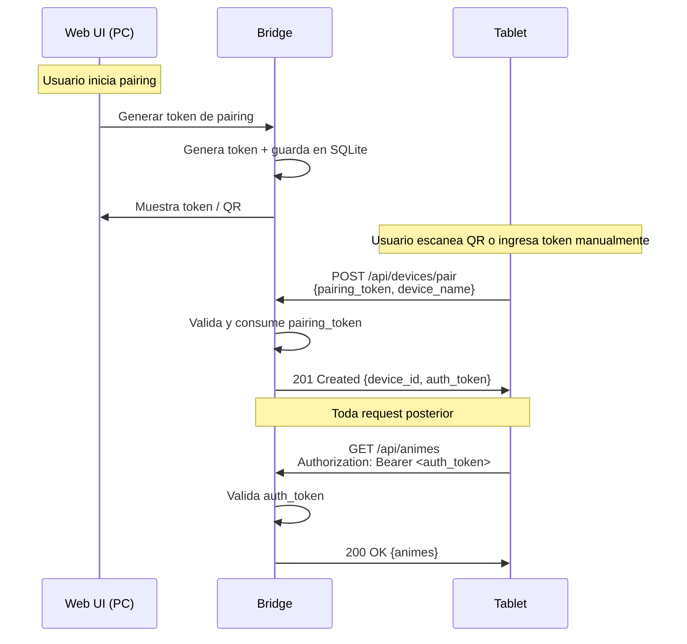

# RFC: Autoreas Bridge

**Autor:** Disble
**Fecha:** 2026-04-05
**Estado:** Histórico — registro de la justificación de diseño original. No es la verdad de runtime.

> ### Aviso de vigencia (SDD-55)
>
> Este RFC se escribió sobre una premisa que **ya no rige**: que `animes.dat` (el
> archivo NeDB de Autoreas Desktop) era la *fuente de verdad*, observada por un
> file watcher y escrita en append-only. **SDD-55 cortó ese canal por completo.**
> Hoy **SQLite es el dueño único y exclusivo** del estado de animes: no hay file
> watcher, ni parser `.dat`, ni writer de archivo, ni catch-up de arranque, ni
> sincronización de ningún tipo con la app Legacy. Las secciones que describían
> esa arquitectura (§4.1-§4.6) y el plan de fases (§6) fueron removidas.
>
> | Qué buscás | Dónde está |
> |---|---|
> | La decisión y su justificación | `docs/adr/008-legacy-breakup-sqlite-sole-owner.md` (Accepted) |
> | La arquitectura vigente | `docs/architecture.md` |
> | El contrato HTTP/WS vigente | `docs/openapi.yaml` |
>
> Lo que se conserva acá es lo que sigue teniendo valor y **no vive en ningún otro
> lado**: el problema que originó el proyecto (§1-§2), **por qué se descartaron las
> alternativas** (§3), la filosofía de resolución de conflictos (§4.7) y el
> contrato de descubrimiento y pairing (§4.8-§4.9).

---

## 1. Contexto y problema

Autoreas Desktop es una aplicación Electron 7 que funciona como Sistema de Control de Capítulos (SCC) de anime. Tiene más de 800 registros, está en uso activo desde hace años, y es completamente funcional. Su última versión (v2.2.0) fue publicada en mayo de 2020. Es software legacy y no recibirá más actualizaciones.

El problema: el patrón de consumo de anime migró del escritorio a la tablet. Autoreas Desktop no funciona en Android, y no existe forma de registrar un capítulo visto desde la tablet.

Crear una app mobile independiente fragmentaría los datos. Reescribir autoreas desktop no es viable ni deseable — funciona bien. Sincronizar directamente entre la app legacy y una app mobile es inviable porque autoreas desktop no expone ninguna API ni protocolo de comunicación.

Se necesita un servicio intermediario que actúe como puente de sincronización entre ambos dispositivos, sin modificar la aplicación legacy.

## 2. Objetivos

- Sincronizar el estado de seguimiento de anime entre el PC de escritorio y una tablet Android a través de la red WiFi local, sin requerir internet.
- Permitir al usuario actualizar capítulos vistos desde la tablet y que el cambio se refleje en `animes.dat` del PC.
- Funcionar de forma transparente: el usuario no debería tener que intervenir para que la sincronización ocurra. Cuando ambos dispositivos están encendidos en la misma red, el sync es automático.
- No modificar ni un solo byte del código de Autoreas Desktop.
- Nunca perder datos del usuario.

### No-objetivos

- **No es un reemplazo de Autoreas Desktop.** El bridge no implementa funciones de gestión de anime (agregar, editar, eliminar, estadísticas). Eso podría suceder en el futuro, pero no es parte de este diseño.
- **No es una app mobile.** La app Android queda fuera del scope. Este documento cubre solo el bridge que corre en el PC.
- **No es un servicio cloud.** No hay servidores, no hay cuentas, no hay internet. Todo es local.
- **No sincroniza `pendientes.dat`.** Solo `animes.dat`.
- **No soporta múltiples usuarios.** Es un sistema personal, un PC, una tablet.

## 3. Alternativas evaluadas

### 3.1 Syncthing directo

Usar Syncthing para sincronizar la carpeta `data` de Autoreas entre el PC y la tablet.

**Pros:** Zero desarrollo. Syncthing ya existe y resuelve sincronización de archivos en LAN.

**Contras:** Syncthing sincroniza archivos, no registros. Un conflicto en `animes.dat` resulta en dos copias del archivo completo (800+ registros) que habría que reconciliar manualmente. Además, la tablet necesitaría una app que entienda el formato NeDB para mostrar y editar los datos, así que de todos modos hay que construir algo.

**Decisión:** Descartado. La granularidad de sincronización necesaria es a nivel de registro, no de archivo.

### 3.2 App mobile standalone (sin sync)

Crear una app Android independiente donde el usuario gestiona su lista de anime por separado.

**Pros:** Simple. Sin sincronización, sin bridge.

**Contras:** Fragmentación de datos. El usuario tendría que mantener dos listas separadas o migrar completamente y abandonar autoreas desktop.

**Decisión:** Descartado. Contradice el objetivo principal.

### 3.3 Reescribir Autoreas Desktop como web app

Rehacer toda la aplicación como una web app accesible desde cualquier dispositivo.

**Pros:** Una sola app para todo. Sin sincronización necesaria.

**Contras:** Esfuerzo masivo. Autoreas desktop funciona bien. Requiere replicar todas las funciones existentes antes de ser útil. Alto riesgo de abandono a mitad del desarrollo.

**Decisión:** Descartado. Sobredimensionado para el problema actual.

### 3.4 Bridge de sincronización (elegido)

Un servicio liviano que corre en background en el PC, observa `animes.dat`, y expone una API en la red local para que una futura app mobile se sincronice.

**Pros:** No toca autoreas desktop. Scope acotado. Validación rápida del concepto. Si funciona, puede evolucionar incrementalmente.

**Contras:** Requiere manejar acceso concurrente a `animes.dat`. Requiere un parser de NeDB custom.

**Decisión:** Elegido. Es la opción con mejor ratio valor/esfuerzo y menor riesgo.

## 4. Diseño propuesto — partes vigentes

> **§4.1-§4.6 removidas.** Describían la arquitectura general sobre `animes.dat`,
> el stack elegido para sostenerla, el esquema del archivo NeDB como fuente de
> verdad, la detección de cambios por file watcher, la escritura append-only con
> check de actividad, y el protocolo de reconciliación por intercambio de
> changelogs. Nada de eso existe desde SDD-55. La arquitectura real está en
> `docs/architecture.md`.

### 4.7 Resolución de conflictos

Modelo inspirado en Syncthing. Principio: **nunca se pierde data silenciosamente.**
Ese principio sobrevivió intacto; el mecanismo concreto cambió.

> **Superseded (SDD-30):** la regla CRDT-`MAX(local, remote)` que este RFC proponía
> para el progreso fue **descartada y removida** (nunca se cableó en producción):
> un capítulo **puede bajar**, porque bajarlo es una corrección legítima, así que
> `MAX` era incorrecto. El modelo vigente es **Concurrencia Optimista (OCC)
> no-bloqueante**: el Bridge mantiene un token de versión `modified_at` por anime,
> el cliente lo reenvía como `base`, y si difiere se registra un conflicto que
> preserva ambas versiones sin pisar ni bloquear al cliente. La resolución es del
> usuario (modelo git/Syncthing). Ver `docs/architecture.md` §1.

Lo que sigue vigente del diseño original:

1. **Solo un lado cambió un registro:** se aplica el cambio. No hay conflicto.
2. **Ambos lados cambiaron el mismo registro:** se registra el conflicto y **se preservan las dos versiones** — `local_snapshot_json` y `remote_snapshot_json` en la tabla `conflicts`, con `status` `pending`/`resolved`. Ninguna versión se descarta automáticamente.
3. **Nada se borra físicamente.** El borrado es lógico (`active == false` más `deletedAt`) y la fila permanece en `anime_snapshots`, así que un "un lado borró, el otro modificó" nunca destruye el registro.
4. **Los conflictos son consultables y resolubles:** `GET /api/conflicts` y `POST /api/conflicts/:id/resolve`. El UI de escritorio avisa del conflicto en el momento mismo de la escritura (feature `anime-detail`); la pantalla dedicada de revisión de conflictos que este RFC imaginaba **todavía no existe**.

### 4.8 Descubrimiento de dispositivos

**Principal: IP local + QR/Token.** El bridge expone su IP/puerto efectivo y un QR para que la tablet se conecte sin depender de discovery multicast.

**mDNS: despriorizado / best-effort futuro.** Puede explorarse más adelante como mejora de conveniencia, pero deja de ser requisito del flujo principal porque la experiencia mobile real mostró mejor confiabilidad con IP explícita.

### 4.9 Seguridad

Semántica oficial de autenticación:

- `pairing_token`: token de un solo uso generado desde el Web UI del bridge para iniciar el alta del dispositivo.
- `auth_token`: token persistente devuelto por el bridge al completar el pairing y usado luego como `Authorization: Bearer <auth_token>` en requests REST/WS.
- El QR v1 transporta `pairing_token`, nunca `auth_token`.

Contrato QR v1:

`autoreas-mobile://pair?v=1&ip={LAN_IP}&port={PORT}&token={PAIRING_TOKEN}`

---

## 5. Qué pasó con el resto de este RFC

| Sección original | Estado |
|---|---|
| §4.1-§4.6 (watcher, parser, writer, reconciliación por changelogs) | **Retirada** por SDD-55. Ver `docs/adr/008-legacy-breakup-sqlite-sole-owner.md`. |
| §4.10 API REST | **Superada.** El contrato vivo, con sus consumidores mobile, es `docs/openapi.yaml`. |
| §4.11 Web UI (vistas del MVP) | **Ejecutada y superada.** El frontend real vive en `frontend/src/features/`; sus rails están en `docs/architecture.md` §5. |
| §4.12 Comportamiento del sistema (tray, auto-start) | **Ejecutada.** Sigue siendo el comportamiento del binario. |
| §5 Impacto (riesgos, costes, migraciones) | **Retirada.** Sus riesgos eran todos sobre `animes.dat`: corrupción por escritura concurrente, cobertura del parser NeDB, mDNS bloqueado por firewall. |
| §6 Plan de implementación (Fases 1-7) | **Retirada.** Proyecto ejecutado; era historia del proyecto, no diseño. |
| §7 Métricas globales | **Retirada.** Medían parseo de `animes.dat`, detección por fsnotify y escritura al archivo. |
