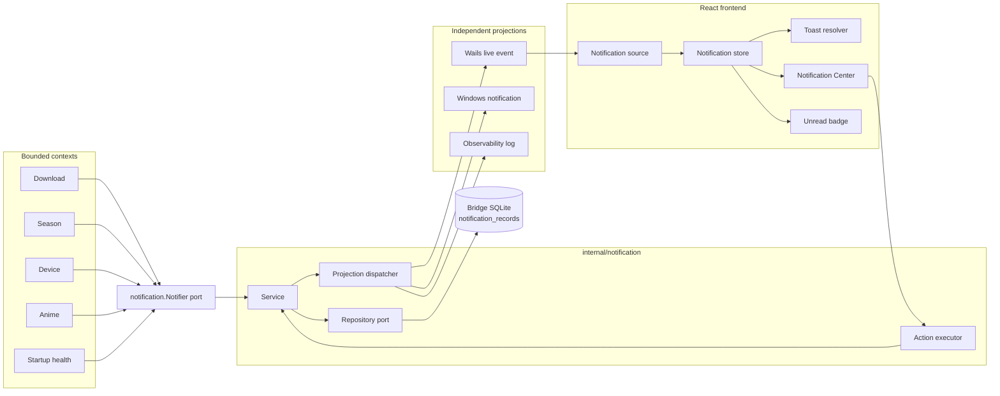
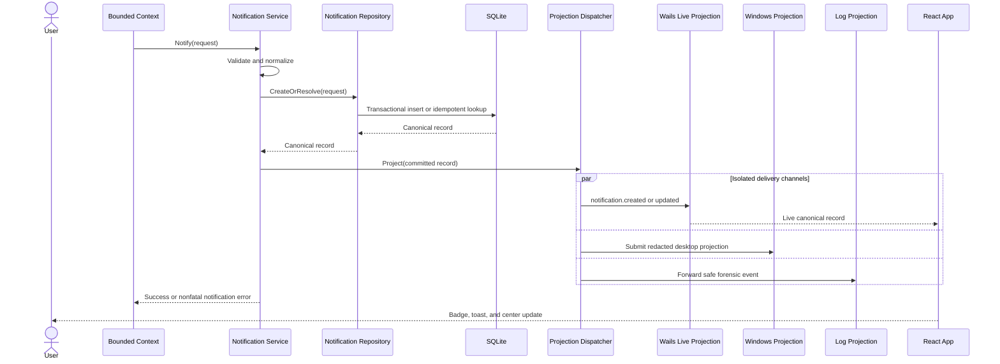
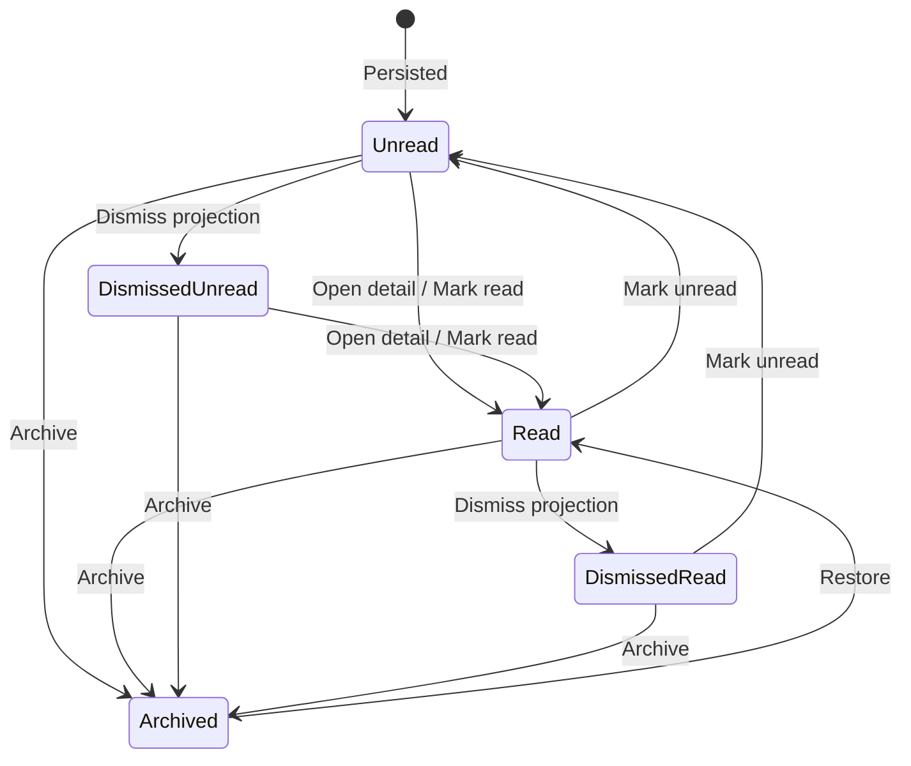
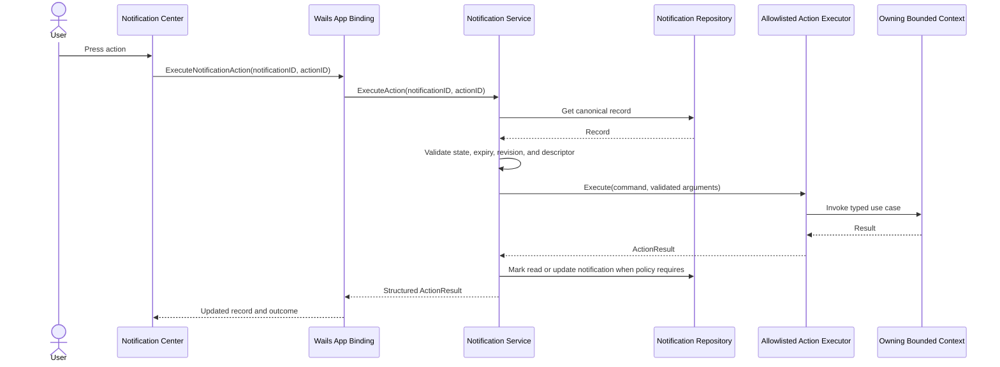
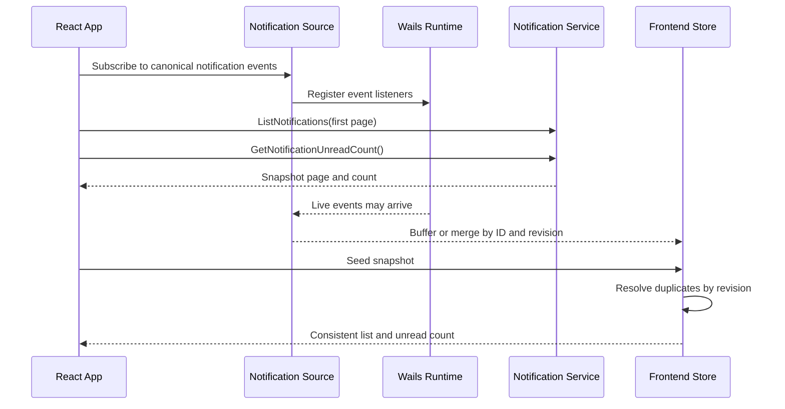

# Notification Center Proposal

**Status:** Proposed architecture; implementation pending  
**Date:** 2026-08-03  
**Scope:** Backend notification context, SQLite persistence, Wails contracts, app-shell delivery, and Notification Center UI  
**Related design:** [`anime-creation-and-download-readiness.md`](./anime-creation-and-download-readiness.md)

## Decision summary

Autoreas Bridge should evolve its existing transient notification pipeline into a durable, backend-owned Notification Center.

The governing rule is:

> A user-notable event is committed to the Notification Center before any toast or desktop projection is attempted.

The existing `notification.Notifier` remains the producer-facing port. A new notification application service implements that port, validates and persists a canonical notification record in SQLite, and then projects the committed record to the existing delivery channels:

- the in-app HeroUI toast surface;
- the Windows desktop notification adapter;
- the runtime observability log;
- the live Notification Center feed.

The Notification Center becomes the durable place where users can review warnings, errors, and useful information after a toast disappears. Toasts remain short-lived attention signals. Inline feature alerts remain contextual guidance. Observability remains engineering telemetry.

## Quick path

1. A bounded context decides that a moment is important to the user.
2. It calls the injected `notification.Notifier` with a typed notification request.
3. The notification service validates, deduplicates, and persists a canonical record in SQLite.
4. Independent projectors deliver the committed record to the app, Windows, and observability.
5. The app updates the unread badge and live Notification Center list.
6. The user can read, mark unread, dismiss, archive, restore, or execute an allowlisted action.

## 1. Problem statement

Autoreas Bridge already produces user-facing notifications for download runs, season availability, pairing, and device sync health. The frontend also creates actionable missed-schedule toasts and local success/error toasts.

The current delivery model is transient:

- HeroUI toasts disappear;
- Windows notifications are outside the app and may be missed;
- renderer restarts lose frontend-only state;
- `notification.push` has no replay or acknowledgement;
- there is no read/unread state;
- there is no notification history;
- there is no stable notification identity;
- there is no durable deduplication;
- actions are JavaScript closures and cannot survive a restart;
- warnings discovered in a feature can be difficult to find later.

The Downloads readiness work makes this gap visible. The Downloads page can explain which anime need attention, yet the user also needs a central place to revisit important warnings and failures after leaving that page.

The answer is a curated Notification Center. It must preserve clear boundaries so it does not become a second observability log or an archive of every successful button click.

## 2. User outcomes

The design must let a user:

1. See an unread count from the app shell.
2. Open one Notification Center from desktop and mobile navigation surfaces.
3. Find recent information, warnings, and errors.
4. Filter notifications by state, severity, and source.
5. Search user-facing title and body text.
6. Open a notification and understand what happened, when it happened, and which entity or operation it concerns.
7. Follow a safe action such as opening Downloads, opening an anime, retrying an allowlisted operation, or resolving a missed schedule.
8. Mark records read or unread.
9. Dismiss transient presentation without destroying history.
10. Archive resolved records and restore them later.
11. Restart the app without losing notification history or unread state.
12. Trust that repeated startup checks will not create duplicate noise.

## 3. Goals

### 3.1 Product goals

- One durable location for curated user-facing notices.
- Clear distinction between attention, history, and diagnostics.
- Reliable unread state across renderer and application restarts.
- Specific, actionable explanations for warnings and failures.
- Stable behavior for Downloads readiness, scheduled downloads, device health, pairing, and season availability.
- Accessible desktop and mobile information architecture.

### 3.2 Architecture goals

- Keep `notification.Notifier` as the explicit producer dependency.
- Keep `events.Bus` as the backend domain-event mediator.
- Make SQLite the sole source of truth for notification history and state.
- Persist before projecting to user-visible channels.
- Isolate projection failures from producers and from each other.
- Represent persistent actions as data interpreted by an allowlisted backend executor.
- Use keyset pagination for a growing inbox.
- Preserve existing `notification.push` behavior during migration.
- Follow the frontend dumb UI, strict colocation, named-function, readonly-props, and TDD rules.

## 4. Non-goals

The first version does not include:

- cloud push notifications;
- email, SMS, or webhooks;
- cross-device read-state synchronization;
- arbitrary user-authored notification rules;
- arbitrary executable actions;
- notification deletion from the UI;
- a replacement for the Activity or Network observability surfaces;
- a copy of every runtime log entry;
- persistence of routine local mutation feedback;
- guaranteed proof that a Windows notification was seen by a human;
- operating-system action buttons before the Windows activation contract is proven;
- notification grouping driven by heuristics;
- per-user state inside one Bridge profile;
- an automatic conversion of every domain event into a notification.

## 5. Verified current runtime baseline

This section records current behavior. The target architecture starts in section 6.

### 5.1 Backend notification contract

`internal/notification/notifier.go` currently defines:

```go
type Notification struct {
    Title         string
    Body          string
    Level         Level
    Source        string
    CorrelationID string
    Timestamp     time.Time
}

type Notifier interface {
    Notify(context.Context, Notification) error
}
```

The current levels are `info`, `success`, `warning`, and `error`.

The package documentation explicitly separates the user-facing `Notifier` from `internal/events.Bus`.

### 5.2 Dispatcher

`internal/notification/dispatcher.go` implements the canonical transient notifier today.

It:

- calls every configured adapter sequentially;
- skips nil adapters;
- joins adapter errors;
- allows zero adapters;
- treats a nil dispatcher as a successful no-op.

Current feature callers generally isolate notifier failures. Most app-level producers discard the returned error. Download orchestration logs it and continues.

### 5.3 Delivery adapters

`app_defaults.go::defaultNotifier` registers:

1. `UIToastAdapter`;
2. `DesktopToastAdapter`;
3. `LogForwardAdapter` when a shared logger exists.

#### UI toast adapter

`internal/notification/ui_toast.go` emits the Wails runtime event `notification.push` with the complete current `Notification` value.

This transport is push-only. It has no replay, cursor, acknowledgement, or persistence.

#### Windows desktop adapter

`internal/notification/desktop_windows.go` uses `go-toast/v2` and WinRT COM. It projects title and body with default audio and short duration.

The current projection has no activation target, action buttons, durable identity, correlation metadata, delivery retry state, or sensitivity policy.

The non-Windows implementation is an explicit no-op.

#### Log-forward adapter

`internal/notification/log_forward.go` forwards every notification to the shared runtime logger.

It preserves `Source` as the log domain and preserves `CorrelationID`. The event type is `notification`. Title and body become one log message. Success maps to the logger's information level.

This creates a forensic trace. It does not provide inbox semantics.

### 5.4 Existing producers

Verified production producers include:

| Producer | Current user-notable moments |
| --- | --- |
| Download service | Download started, JDownloader offline, partial/error completion, successful completion with downloaded episodes |
| Season availability | Newly available season anime |
| Season window handling | Anime moved to `Ver hoy` after the download window |
| Device sync health | Warning or stale health status during startup |
| Device pairing | Pairing token consumed successfully |

Download notifications use the run ID as `CorrelationID`. Several other producers currently omit correlation identifiers.

`Anime.WriteServiceDeps.Notifier` is wired, while the current anime write service does not produce notifications. Tests intentionally prevent pre-commit conflict notices.

The old anime watcher notification described during SDD-29 no longer exists. SDD-55 retired the Legacy file channel.

### 5.5 Frontend toast pipeline

The current frontend uses a Chain of Responsibility:

```text
Notification resolver hooks
        │ push/remove
        ▼
NotificationToasts controller
        │
        ▼
renderAppNotificationToast
        │
        ▼
HeroUI ToastProvider
```

Relevant files:

- `frontend/src/shared/contracts/app-notification.types.ts`;
- `frontend/src/infrastructure/notification-source/`;
- `frontend/src/features/notifications/ui/NotificationToasts/`;
- `frontend/src/app/AppLayout/AppLayout.tsx`.

The Wails source subscribes to `notification.push`. Browser contexts degrade to a no-op subscription.

The current controller keeps a renderer-session `Map<persistedId, toastId>`. Backend notifications do not provide `persistedId`, so every backend event becomes a new ephemeral toast.

The backend resolver currently drops source, correlation ID, and timestamp when it converts the wire event into `AppNotification`.

The current renderer accepts multiple actions in the contract and renders only the first action. The missed-schedule resolver supplies two actions, so the second action is not presented by the toast helper.

### 5.6 Existing persistence precedent

There is no notification table today.

The strongest feed precedent is `internal/observability/eventlog`:

- context-owned schema;
- keyset pagination;
- bounded pages;
- filters;
- non-null empty arrays;
- retention pruning;
- write-path failure isolation.

Notification storage should follow these persistence mechanics while keeping its product semantics independent from observability.

## 6. Core boundary decisions

### 6.1 Curated notification versus domain event

A domain event describes something that occurred inside the system. A notification states that the human should know about it.

Features continue to decide which moments are user-notable and call the injected `Notifier` directly. This keeps the decision visible at the feature call site and unit-testable with a fake notifier.

`events.Bus` continues to fan out backend domain events. It does not become the notification transport.

### 6.2 Notification versus inline feature state

Inline feature state explains the current page and remains the primary place for immediate remediation.

Examples:

- Downloads readiness summary and per-anime blocker reasons stay in Downloads.
- A Notification Center record can announce that scheduled anime need attention and link back to Downloads.
- The center does not replace the detailed readiness list.

### 6.3 Notification versus toast

A canonical notification is durable product state.

A toast is a temporary projection used to attract attention while the app is open.

Closing a toast does not mark its notification read, archive it, or delete it.

### 6.4 Notification versus observability

Notifications use user-facing language and contain information the user can act on.

Observability records operational evidence for diagnosis. It can contain technical event types, request outcomes, and diagnostic context.

The Notification Center must not query the observability event log as its backing store.

### 6.5 Routine mutation feedback

Routine local feedback remains ephemeral by default.

Examples:

- “Folder path copied to clipboard” remains a local toast.
- “Preferences saved” remains local feedback.
- “Download failed after all configured hosters failed” becomes durable.
- “Six scheduled anime need attention” becomes durable when the blocker set changes.

## 7. Target component architecture



## 8. Persist-first sequence



Persistence occurs before projection. A database failure therefore cannot produce a toast that is absent from history.

Notification failure must never fail the producing business operation. The feature can log the notification failure and continue.

## 9. Backend domain model

### 9.1 Producer request

The producer-facing value should remain concise and domain-agnostic:

```go
type Notification struct {
    Kind           string
    Title          string
    Body           string
    Level          Level
    Source         string
    CorrelationID  string
    Entity         *EntityReference
    IdempotencyKey string
    GroupKey       string
    Actions        []ActionDescriptor
    Sensitivity    Sensitivity
    OccurredAt     time.Time
    ExpiresAt      *time.Time
}
```

`Notification` is an intent to create or resolve one user-notable occurrence. It does not expose storage state.

### 9.2 Canonical record

```go
type Record struct {
    ID              string
    Kind            string
    Title           string
    Body            string
    Level           Level
    Source          string
    CorrelationID   string
    Entity          *EntityReference
    IdempotencyKey  string
    GroupKey        string
    Actions         []ActionDescriptor
    Sensitivity     Sensitivity
    OccurredAt      time.Time
    CreatedAt       time.Time
    UpdatedAt       time.Time
    ReadAt          *time.Time
    DismissedAt     *time.Time
    ArchivedAt      *time.Time
    ExpiresAt       *time.Time
    OccurrenceCount int
    Revision        int64
}
```

The record is the source returned by queries and live events.

### 9.3 Entity reference

```go
type EntityReference struct {
    Type string
    ID   string
}
```

Initial entity types can include:

- `anime`;
- `download_run`;
- `device`;
- `season`;
- `schedule_date`.

The pair is metadata for navigation and filtering. It does not grant permission to execute arbitrary operations.

### 9.4 Level

The canonical levels remain:

- `info`;
- `success`;
- `warning`;
- `error`.

Unknown values are rejected at the service boundary and constrained by SQLite.

### 9.5 Sensitivity

```go
type Sensitivity string

const (
    SensitivityPublic    Sensitivity = "public"
    SensitivityPrivate   Sensitivity = "private"
    SensitivitySensitive Sensitivity = "sensitive"
)
```

- `public`: title and body may be shown in the app and Windows projection.
- `private`: full text is visible in the unlocked app; the Windows body uses a generic summary.
- `sensitive`: the Windows projection is suppressed by default; the app requires its normal unlocked context.

No notification may contain credentials, tokens, authorization headers, raw request bodies, database snapshots, stack traces, or arbitrary environment values.

## 10. Stable notification kinds

`Kind` is a machine contract. UI copy can evolve independently.

Initial examples:

| Source | Kind | Typical level |
| --- | --- | --- |
| `download` | `download.run_started` | info |
| `download` | `download.run_completed` | success |
| `download` | `download.run_partial` | warning |
| `download` | `download.run_failed` | error |
| `download` | `download.run_stopped_early` | warning |
| `download` | `download.run_canceled` | info |
| `download` | `download.jdownloader_offline` | warning |
| `download` | `download.readiness_attention` | warning |
| `download` | `download.missed_schedule` | warning |
| `season` | `season.anime_available` | info |
| `season` | `season.download_window_passed` | info |
| `device` | `device.paired` | success |
| `device` | `device.sync_health_warning` | warning |
| `anime` | `anime.operation_failed` | error |
| `system` | `system.notification_delivery_degraded` | warning |

Kinds must describe a product event. Free-form strings generated from an error message are forbidden.

## 11. SQLite schema

The notification context owns its schema and contributes it through the existing bootstrap composition.

### 11.1 Proposed table

```sql
CREATE TABLE IF NOT EXISTS notification_records (
    notification_id TEXT PRIMARY KEY,
    kind TEXT NOT NULL,
    source TEXT NOT NULL,
    level TEXT NOT NULL CHECK (level IN ('info', 'success', 'warning', 'error')),
    title TEXT NOT NULL,
    body TEXT NOT NULL DEFAULT '',
    correlation_id TEXT NOT NULL DEFAULT '',
    entity_type TEXT NOT NULL DEFAULT '',
    entity_id TEXT NOT NULL DEFAULT '',
    idempotency_key TEXT NOT NULL DEFAULT '',
    group_key TEXT NOT NULL DEFAULT '',
    actions_json TEXT NOT NULL DEFAULT '[]',
    sensitivity TEXT NOT NULL DEFAULT 'public'
        CHECK (sensitivity IN ('public', 'private', 'sensitive')),
    occurred_at_ms INTEGER NOT NULL,
    created_at_ms INTEGER NOT NULL,
    updated_at_ms INTEGER NOT NULL,
    read_at_ms INTEGER,
    dismissed_at_ms INTEGER,
    archived_at_ms INTEGER,
    expires_at_ms INTEGER,
    occurrence_count INTEGER NOT NULL DEFAULT 1 CHECK (occurrence_count >= 1),
    revision INTEGER NOT NULL DEFAULT 1 CHECK (revision >= 1)
);
```

### 11.2 Proposed indexes

```sql
CREATE INDEX IF NOT EXISTS idx_notification_records_feed
ON notification_records (occurred_at_ms DESC, notification_id DESC);

CREATE INDEX IF NOT EXISTS idx_notification_records_source_feed
ON notification_records (source, occurred_at_ms DESC, notification_id DESC);

CREATE INDEX IF NOT EXISTS idx_notification_records_level_feed
ON notification_records (level, occurred_at_ms DESC, notification_id DESC);

CREATE INDEX IF NOT EXISTS idx_notification_records_unread
ON notification_records (occurred_at_ms DESC, notification_id DESC)
WHERE read_at_ms IS NULL AND archived_at_ms IS NULL;

CREATE INDEX IF NOT EXISTS idx_notification_records_archived
ON notification_records (archived_at_ms DESC, notification_id DESC)
WHERE archived_at_ms IS NOT NULL;

CREATE UNIQUE INDEX IF NOT EXISTS idx_notification_records_idempotency
ON notification_records (source, idempotency_key)
WHERE idempotency_key <> '';
```

### 11.3 Optional delivery-attempt table

V1 can omit persistent delivery attempts when all projections remain best-effort.

If Windows retries or operational delivery diagnostics become product requirements, add a separate table:

```sql
CREATE TABLE IF NOT EXISTS notification_delivery_attempts (
    notification_id TEXT NOT NULL,
    channel TEXT NOT NULL CHECK (channel IN ('wails', 'windows', 'log')),
    status TEXT NOT NULL CHECK (status IN ('pending', 'submitted', 'failed', 'suppressed')),
    attempt_count INTEGER NOT NULL DEFAULT 0,
    last_attempt_at_ms INTEGER,
    last_error_code TEXT NOT NULL DEFAULT '',
    PRIMARY KEY (notification_id, channel),
    FOREIGN KEY (notification_id)
        REFERENCES notification_records(notification_id)
        ON DELETE CASCADE
);
```

Raw adapter errors do not belong in this table. Store bounded error codes and send technical details to observability.

## 12. Repository contract

```go
type Repository interface {
    CreateOrResolve(context.Context, Notification) (Record, CreateOutcome, error)
    Get(context.Context, string) (Record, error)
    List(context.Context, ListQuery) (Page, error)
    CountUnread(context.Context) (int, error)
    MarkRead(context.Context, []string, time.Time) ([]Record, error)
    MarkUnread(context.Context, []string) ([]Record, error)
    Dismiss(context.Context, []string, time.Time) ([]Record, error)
    Archive(context.Context, []string, time.Time) ([]Record, error)
    Restore(context.Context, []string) ([]Record, error)
    Prune(context.Context, RetentionPolicy) (PruneResult, error)
}
```

All mutations are idempotent. Repeating `MarkRead` or `Archive` produces the same final state.

Batch methods avoid one Wails round trip per selected notification.

## 13. Service contract

```go
type Service struct {
    repository Repository
    projector  Projector
    clock      Clock
    ids        IDGenerator
    actions    ActionExecutor
}

func (s *Service) Notify(context.Context, Notification) error
func (s *Service) List(context.Context, ListQuery) (Page, error)
func (s *Service) Get(context.Context, string) (Record, error)
func (s *Service) CountUnread(context.Context) (int, error)
func (s *Service) MarkRead(context.Context, []string) ([]Record, error)
func (s *Service) MarkUnread(context.Context, []string) ([]Record, error)
func (s *Service) Dismiss(context.Context, []string) ([]Record, error)
func (s *Service) Archive(context.Context, []string) ([]Record, error)
func (s *Service) Restore(context.Context, []string) ([]Record, error)
func (s *Service) ExecuteAction(context.Context, string, string) (ActionResult, error)
```

`Service.Notify` implements the existing `Notifier` port.

The service returns a notification error to the producer for observability. Producer business outcomes remain unchanged.

## 14. Idempotency, grouping, and noise control

### 14.1 Idempotency key

An idempotency key identifies one logical occurrence.

Repeated requests with the same `(source, idempotency_key)` resolve to the existing record. They do not create another record or another attention projection.

Recommended keys:

| Producer | Key shape |
| --- | --- |
| Download lifecycle | `<run-id>:<kind>` |
| Download readiness | stable hash of blocker codes and affected anime IDs |
| Missed schedule | `<local-date>:<notice-kind>` |
| Pairing success | `<device-id>:paired` |
| Device health | `<device-id>:<health-transition>:<revision>` |
| Season availability | `<season-id>:<stable-hash-of-new-anime-ids>` |

The key contains opaque identifiers and stable codes. It must not contain user-facing copy or secrets.

### 14.2 Group key

A group key associates related records in the UI.

Examples:

- all notices for one download run;
- all health transitions for one device;
- all availability notices for one season.

Grouping does not automatically merge records.

### 14.3 Coalescing policy

Coalescing requires an explicit policy per kind.

For `download.readiness_attention`, a changed blocker fingerprint can update one active record:

- update title/body and actions;
- increment `occurrence_count`;
- increment `revision`;
- clear `read_at_ms` when the changed content requires attention;
- emit `notification.updated`;
- avoid a second active card for the same readiness scope.

Completed historical download runs remain separate records.

### 14.4 Rate control

The service can apply per-kind quiet periods after durable idempotency exists. Rate control never discards a distinct error silently. A suppressed projection still leaves its canonical record available.

## 15. Lifecycle semantics

### 15.1 Read state

- A new record starts unread.
- Opening detail may mark it read after the detail is successfully loaded.
- An explicit “Mark as read” action is available from list selection.
- “Mark as unread” clears `read_at_ms`.
- Read state survives application restart.

### 15.2 Dismissal

Dismissal stops current and future attention projections for that record.

It:

- sets `dismissed_at_ms`;
- closes an active in-app toast when possible;
- leaves the record in the default inbox;
- leaves read state unchanged;
- keeps the notification searchable.

### 15.3 Archive

Archive means the user considers the item resolved or no longer relevant to the default inbox.

It:

- sets `archived_at_ms`;
- sets `read_at_ms` when still unread;
- closes active projections;
- removes the record from the default Active filter;
- keeps the record available in Archived.

### 15.4 Restore

Restore clears `archived_at_ms`. It does not automatically mark the record unread.

### 15.5 Expiry

Expiry controls action validity and optional projection eligibility. It does not automatically erase history.

An expired action is shown as unavailable with a clear reason.

### 15.6 State diagram



Dismissed state is an attention flag layered over read state. The storage model therefore keeps separate timestamps.

## 16. Safe persistent actions

### 16.1 Action descriptor

Persistent actions are data:

```go
type ActionDescriptor struct {
    ID                   string
    Label                string
    Kind                 ActionKind
    Command              string
    Arguments            map[string]string
    RequiresConfirmation bool
    Style                ActionStyle
}
```

Allowed action kinds:

- `navigate`;
- `command`.

Allowed visual styles:

- `primary`;
- `secondary`;
- `danger`;
- `ghost`.

### 16.2 Security rules

The persisted descriptor cannot contain:

- a JavaScript callback;
- an arbitrary URL;
- a filesystem executable;
- a shell command;
- a Wails method name;
- source code;
- credentials;
- unrestricted JSON passed directly into another subsystem.

The backend action executor owns an allowlist such as:

```text
navigation.open_downloads
navigation.open_anime
navigation.open_device
download.run_missed_schedule
download.ignore_missed_schedule
download.retry_run
```

Every command defines and validates its exact argument schema.

### 16.3 Action execution sequence



### 16.4 Action concurrency

Action execution uses the notification revision or an operation idempotency key. Double presses cannot trigger duplicate domain work.

The UI disables the pressed action until the structured result returns.

## 17. Wails application API

Suggested bindings:

```go
func (a *App) ListNotifications(query contracts.NotificationListQuery) (contracts.NotificationPage, error)
func (a *App) GetNotification(id string) (contracts.NotificationRecord, error)
func (a *App) GetNotificationUnreadCount() (int, error)
func (a *App) MarkNotificationsRead(ids []string) ([]contracts.NotificationRecord, error)
func (a *App) MarkNotificationsUnread(ids []string) ([]contracts.NotificationRecord, error)
func (a *App) DismissNotifications(ids []string) ([]contracts.NotificationRecord, error)
func (a *App) ArchiveNotifications(ids []string) ([]contracts.NotificationRecord, error)
func (a *App) RestoreNotifications(ids []string) ([]contracts.NotificationRecord, error)
func (a *App) ExecuteNotificationAction(notificationID string, actionID string) (contracts.NotificationActionResult, error)
```

Every list field crosses the boundary as a non-null array. Empty pages return `items: []`.

### 17.1 List query

```go
type NotificationListQuery struct {
    Cursor   string
    Limit    int
    State    string
    Levels   []string
    Sources  []string
    Search   string
}
```

`State` values:

- `active`;
- `unread`;
- `read`;
- `archived`;
- `all`.

The backend clamps `Limit` to a safe maximum.

### 17.2 Page response

```go
type NotificationPage struct {
    Items       []NotificationRecord
    NextCursor string
    HasMore    bool
    UnreadCount int
}
```

Keyset pagination uses `(occurred_at_ms, notification_id)`. Offset pagination is avoided because new live records would shift page boundaries.

## 18. Live event contract

Introduce canonical record events:

```text
notification.created
notification.updated
notification.archived
notification.restored
notification.unread_count_changed
```

All record events carry a complete normalized record or a typed envelope with the record and revision.

The frontend merges by `notification_id` and accepts only newer revisions.

The current `notification.push` event remains temporarily as a compatibility projection for the existing toast resolver. It can be removed after the toast pipeline consumes canonical record events.

## 19. Startup and reconnect consistency

### 19.1 Subscribe-first merge

The frontend initialization sequence must prevent a gap between snapshot and subscription:



### 19.2 Toast catch-up policy

Application startup does not replay the whole unread backlog as toasts.

Toast catch-up is limited to:

- unresolved actionable warnings or errors;
- records whose kind explicitly opts into startup reminder behavior;
- records that have not been dismissed, archived, or expired.

Historical information and success notifications remain visible in the center without interrupting the user.

### 19.3 Runtime reconnection

After a runtime subscription interruption, the frontend refreshes the first page and unread count. Canonical IDs and revisions reconcile missed live events.

## 20. Projection policy

Each notification kind declares its channel policy centrally.

```go
type ProjectionPolicy struct {
    InAppToast    bool
    WindowsToast  bool
    StartupRemind bool
    LogForward    bool
}
```

Example defaults:

| Level/kind | Center | In-app toast | Windows | Startup reminder |
| --- | --- | --- | --- | --- |
| Routine info | Yes | Optional | No | No |
| Success | Yes when user-notable | Yes | Optional | No |
| Warning | Yes | Yes | Yes when safe | Actionable only |
| Error | Yes | Yes | Yes when safe | Unresolved actionable only |
| Local mutation feedback | No | Yes | No | No |

Projection policy belongs to stable notification kinds. Individual producers do not decide arbitrary delivery channels.

## 21. Notification Center information architecture

### 21.1 Route and shell entry

Add a dedicated `/notifications` route.

Desktop navigation adds **Notifications** under the System group with an unread badge.

Mobile uses a header bell that opens the same route. The compressed bottom navigation should not gain another permanent item.

The app shell stays composition-only. State and Wails subscriptions live in feature hooks and infrastructure sources.

### 21.2 Center layout

Desktop uses a responsive master/detail layout:

```text
┌─────────────────────────────────────────────────────────────────────┐
│ Notifications                                      Mark all as read │
│ 12 unread                                                           │
├─────────────────────────────────────────────────────────────────────┤
│ Search         State       Level       Source                        │
├──────────────────────────────────┬──────────────────────────────────┤
│ ● Scheduled anime need attention │ Warning                          │
│   Downloads · 5m ago             │ Scheduled anime need attention  │
│                                  │                                  │
│ ○ Download completed             │ 2 of 8 scheduled anime cannot   │
│   Downloads · 1h ago             │ be checked for downloads.       │
│                                  │                                  │
│ ● Device sync needs attention    │ Reasons                          │
│   Device · yesterday             │ • Missing source: Anime A       │
│                                  │ • Unsupported source: Anime B   │
│                                  │                                  │
│                                  │ [Open Downloads] [Archive]      │
└──────────────────────────────────┴──────────────────────────────────┘
```

Mobile uses a list followed by a full-width detail surface or a route-owned detail view.

### 21.3 HeroUI primitives

Use HeroUI v3 components:

- `SearchField` for text search;
- `ToggleButtonGroup` for compact state filters;
- `Select` and `ListBox` for source and severity filters;
- `Table` for the desktop list when density justifies it;
- `Card` or `Surface` for mobile records and detail;
- `Chip` for severity, source, and state;
- `Alert` for degraded loading or action outcomes;
- `Button` for explicit actions;
- `CloseButton` only for dismissing transient surfaces;
- `Pagination` only if the installed API and cursor behavior can be represented accessibly.

Semantic colors:

- information: `accent` or default information treatment;
- success: `success`;
- warning: `warning`;
- error: `danger`.

No raw color values are introduced.

### 21.4 List row content

Each row shows:

- unread indicator;
- title;
- source label;
- relative time;
- severity chip;
- optional entity label;
- occurrence count when coalesced;
- archived state when viewing all records.

The list does not expose correlation IDs as primary content.

### 21.5 Detail content

Detail shows:

- title;
- full user-facing body;
- exact timestamp;
- source;
- severity;
- related entity;
- safe actions;
- occurrence count;
- read/dismiss/archive state;
- correlation ID behind a diagnostic disclosure when present.

Technical stack traces and raw payloads remain in observability.

### 21.6 Empty states

Distinct empty states are required:

- no notifications yet;
- no unread notifications;
- no archived notifications;
- no results for current filters;
- notification service unavailable.

### 21.7 Bulk actions

Initial bulk actions:

- mark selected read;
- mark selected unread;
- archive selected;
- restore selected from Archived;
- mark all visible unread records read.

Bulk delete is excluded.

## 22. Frontend module structure

Use the repository generator for the complex feature module.

Suggested structure:

```text
frontend/src/features/notifications/ui/NotificationCenter/
  NotificationCenter.tsx
  use-notification-center.ts
  notification-center.helpers.ts
  notification-center.types.ts
  notification-center.constants.ts
  __tests__/
    NotificationCenter.test.tsx
    use-notification-center.test.ts
    notification-center.helpers.test.ts
```

Infrastructure:

```text
frontend/src/infrastructure/notification-center-source/
  notification-center-source.helpers.ts
  notification-center-source.types.ts
  notification-center-source.constants.ts
  __tests__/
```

Shared store only when multiple consumers need the same canonical state:

```text
frontend/src/shared/store/notification-store/
  notification-store.ts
  notification-store.helpers.ts
  notification-store.types.ts
  __tests__/
```

The shell badge, toast resolver, and center then consume one store and one shared runtime connection.

All feature `.tsx` files remain dumb UI. The hook follows the mandated ten-step anatomy. Helpers are pure, exported helpers have JSDoc, props are readonly, and the main component/hook symbols use named functions.

## 23. Relationship with the existing toast pipeline

The current resolver architecture remains valuable.

Target resolver chain:

```text
Canonical notification store
        │
        ├─ useCanonicalNotificationToastResolver
        ├─ useMissedScheduleResolver during migration
        └─ future specialized renderer-session resolvers
                 │
                 ▼
        Notification toast controller
                 │
                 ▼
          HeroUI ToastProvider
```

Required corrections during implementation:

1. Preserve canonical ID, source, correlation ID, timestamp, and revision.
2. Define replacement behavior for an updated active notification.
3. Render all supported actions in a surface that HeroUI can represent accessibly.
4. Move controller logic out of governed feature `.tsx` files when needed to satisfy the dumb UI rule.
5. Add runtime payload validation at the infrastructure boundary.
6. Close active toasts when a record is dismissed or archived.
7. Avoid duplicate toast projection across remounts.

## 24. Downloads integration

The Downloads page remains responsible for calculating and presenting readiness.

Stable readiness blockers remain:

- `missing_source`;
- `invalid_source`;
- `unsupported_source`;
- `destination_unresolved`.

Inactive state, anime type, absent physical directory, and episode progress remain outside readiness blocking.

### 24.1 When to create a center record

Create or update `download.readiness_attention` when:

- the scheduled candidate blocker fingerprint changes from ready to blocked;
- the set of blocked scheduled anime changes materially;
- a previously resolved blocker reappears;
- scheduled execution skips candidates for a stable readiness reason.

Opening Downloads repeatedly with the same blocker set does not create new records.

### 24.2 Record content

Example:

```text
Title: Scheduled anime need attention
Body: 6 of 8 scheduled anime are ready for download checks. 2 need attention and will be skipped.
Level: warning
Source: download
Kind: download.readiness_attention
Action: Open Downloads
```

Detail can include bounded named reasons or a concise summary. The Downloads page remains the authoritative complete list.

### 24.3 Resolution

When all scheduled candidates become ready:

- update or archive the active readiness notification according to policy;
- emit `notification.updated` or `notification.archived`;
- remove any active reminder toast;
- preserve historical evidence when useful.

### 24.4 Runs that end with episodes never attempted

This is the strongest case in the download domain for durable notification, because the run's own summary is currently incapable of stating it.

A run can reach a terminal status while episodes it discovered were never tried. There are two paths:

1. **An episode fails on every configured hoster.** The anime stops there by design. The on-disk episode count *is* the catch-up cursor, so downloading episode 5 while 4 is missing would create a gap the counter cannot represent. Every episode after the failure is abandoned.
2. **The user stops the run.** The run finalizes as `canceled`; the remaining episodes were never attempted.

Neither is a failure of the episodes that were skipped. They have no outcome at all, and that is precisely what makes them easy to lose.

#### Why the current signal is insufficient

The run already emits `download.run_partial` — *"Some episodes failed to download."* That sentence is true about the one episode that failed and silent about the nine that never ran. A user reading it has no way to learn that the season is incomplete.

The run detail actively misleads here. `episodesDownloading` is derived as `episodesFound - episodesDownloaded - episodesFailed`, so unattempted episodes are counted and rendered as **Downloading** on a run that has already terminated. A finished run can therefore display "11 down" in progress styling for episodes that will never be downloaded.

This is exactly the class of moment section 6.5 already assigns to durable storage: not routine feedback, but a state the user must decide what to do about, discovered after the toast is gone.

#### Record content

```text
Title: Download stopped before the season finished
Body: Solo Anime: 2 of 12 episodes downloaded. Episode 3 failed on every hoster, so 9 episodes were not attempted.
Level: warning
Source: download
Kind: download.run_stopped_early
Entity: download_run / <run-id>
Actions: Open Downloads, Retry run
```

The cancelled variant states the same shape at `info`, since the user initiated it and needs the record for discoverability rather than for attention:

```text
Title: Download stopped
Body: Solo Anime: 2 of 12 episodes downloaded before the run was stopped. 9 episodes were not attempted.
Kind: download.run_canceled
```

#### Vocabulary requirement

The record must distinguish **downloaded**, **failed**, and **not attempted**. It must never describe an unattempted episode as downloading, pending, or failed. A count that is merely derived by subtraction is not a state, and the notification body is the wrong place to publish an inference the run cannot actually support.

Adopting this kind implies correcting the same vocabulary in the run detail surface, so the center and the Downloads page cannot disagree about what happened.

#### Emission rules

Create the record when a run reaches a terminal status **and** `episodesFound` exceeds `episodesDownloaded + episodesFailed`.

Do not create it when:

- the run downloaded everything it found;
- the run found nothing to download;
- the run ended `jd_offline`, which already has its own kind and manual-link payload.

#### Idempotency, grouping, and resolution

- Idempotency key follows the existing download-lifecycle shape: `<run-id>:<kind>`. A run produces at most one such record.
- Group key is the affected anime, so repeated interrupted attempts on the same title read as one thread rather than unrelated warnings.
- A later run that completes the season archives the active record for that anime. Historical records for completed runs remain as evidence.
- `download.retry_run` already exists in the action allowlist and needs no new command.

## 25. Missed-schedule migration

The current missed-schedule notice is backend-owned schedule state combined with renderer-session presentation state.

Migration occurs after canonical storage and safe actions exist:

1. Create a durable `download.missed_schedule` record keyed by local date and notice kind.
2. Persist declarative `Run now`, `Ignore`, and `Open Downloads` actions.
3. Execute command actions through the allowlisted backend executor.
4. Update or archive the notification after resolution.
5. Retire specialized frontend persistence and duplicated toast lifecycle state.

During migration, the existing resolver remains functional and must not create duplicate canonical records.

## 26. Producer migration policy

Each producer migration defines:

- stable `Kind`;
- user-facing title/body;
- level;
- source;
- correlation ID;
- entity reference;
- idempotency key;
- optional group key;
- sensitivity;
- projection policy;
- actions;
- resolution/coalescing behavior.

Suggested order:

1. Download lifecycle notifications.
2. Download readiness attention.
3. Missed schedule.
4. Device sync health.
5. Pairing success.
6. Season availability and window handling.
7. Future anime operation failures supported by a real runtime seam.

## 27. Retention

Recommended initial policy:

- preserve every active unread record;
- preserve every unexpired actionable record;
- retain the newest 2,000 archived records;
- prune archived records transactionally after archive or insert maintenance;
- retain active records until resolved, archived, or explicitly governed by a future hard ceiling;
- emit a degraded observability event when maintenance fails;
- never silently delete active unread notifications to meet a size target.

Retention constants belong to the notification context and are covered by tests.

## 28. Privacy and data minimization

### 28.1 Allowed content

- concise user-facing title;
- concise user-facing body;
- stable source and kind;
- opaque entity identifiers;
- bounded action arguments;
- correlation identifier;
- timestamps and lifecycle state.

### 28.2 Forbidden content

- authentication tokens;
- pairing secrets;
- JDownloader credentials;
- HTTP authorization headers;
- raw request or response bodies;
- environment values;
- full database rows or snapshots;
- arbitrary absolute filesystem paths;
- stack traces;
- source code;
- private hostnames or usernames.

### 28.3 SQLite disclosure

The embedded database is not field-encrypted. User-facing notification copy must be written with that constraint in mind.

### 28.4 Backup behavior

Notification history should be excluded from portable backup/export by default. A future product decision can opt in to restoring inbox history.

### 28.5 Windows lock-screen behavior

Sensitive records suppress the desktop projection. Private records use a generic body such as “Open Autoreas Bridge for details.”

## 29. Failure isolation and degraded behavior

### 29.1 Persistence failure

- The producing business operation continues.
- No user-visible projection is emitted for the uncommitted record.
- A bounded technical error is written to observability without copying notification content.
- The frontend can show a generic Notification Center degraded state when health indicates storage failure.

### 29.2 Wails projection failure

- The record remains in SQLite.
- The app catches up through list refresh.
- Windows and log projections continue.

### 29.3 Windows projection failure

- The record remains in the center.
- In-app delivery continues.
- The failure is logged with a stable code.

### 29.4 Log projection failure

- The record and user-facing delivery continue.
- The dispatcher never recursively creates another notification through the same failed logger path.

### 29.5 Action execution failure

- The notification stays available.
- The action result returns a stable error code and user-facing message.
- A retryable action becomes enabled again.
- The record can be updated with bounded outcome information when the kind policy requires it.

### 29.6 Query failure

- Existing visible rows remain on screen.
- An `Alert` explains that refresh failed.
- The user can retry.
- The unread badge avoids fabricating a zero count.

## 30. Concurrency and consistency

- Repository writes use transactions.
- Idempotency uniqueness is enforced by SQLite.
- Revision increments occur in the same transaction as record changes.
- Live events are emitted after commit.
- Frontend merges accept records with newer revisions.
- Bulk mutations return updated records.
- Action execution uses idempotency or optimistic revision checks.
- Retention never races a record that remains active or actionable.
- The current single desktop process/window is the V1 scope.
- Future multi-window support requires one backend authority for attention projection to prevent duplicate toasts per window.

## 31. Observability

Notification operations should emit structured runtime events with safe metadata:

```text
notification.persisted
notification.idempotent_hit
notification.coalesced
notification.projected
notification.projection_failed
notification.marked_read
notification.marked_unread
notification.dismissed
notification.archived
notification.restored
notification.action_started
notification.action_completed
notification.action_failed
notification.pruned
notification.persistence_failed
```

Safe fields:

- notification ID;
- kind;
- source;
- level;
- correlation ID;
- channel;
- stable result/error code;
- duration;
- occurrence count;
- revision.

Do not repeat full title/body in every operational event. The current log-forward behavior should be reviewed to avoid unnecessary duplication of sensitive user-facing text.

## 32. Performance

- First page default: 50 records.
- Maximum page size: 100 records.
- Pagination: keyset cursor.
- Search: title/body with an escaped, bounded query.
- Unread count: indexed partial query.
- Live updates: merge by ID and revision.
- Bulk mutations: one transaction and one Wails call.
- Startup: subscribe, fetch first page, fetch count, merge.
- No full-history fetch into frontend memory.
- Retention pruning uses bounded transactions.

SQLite WAL and the existing busy timeout remain the shared database policy.

## 33. Accessibility and interaction quality

- Unread state uses text/semantics in addition to color.
- Severity has an accessible label.
- List selection is keyboard reachable.
- Filters have visible labels or accessible names.
- Bulk selection announces selected count.
- Action buttons expose pending state.
- Relative timestamps include exact accessible timestamps.
- Focus moves predictably when mobile detail opens or closes.
- Archiving preserves a recoverable workflow through the Archived filter.
- Destructive styling is reserved for truly destructive or high-risk actions.
- Reduced-motion preferences are respected by HeroUI defaults.

## 34. Testing strategy

### 34.1 Backend unit tests

Test:

- request validation;
- level and sensitivity validation;
- timestamp normalization;
- ID generation;
- successful persist-first ordering;
- no projection before commit;
- projection fan-out isolation;
- producer isolation from notification failure;
- idempotent duplicate handling;
- explicit coalescing;
- revision increments;
- read/unread transitions;
- dismiss semantics;
- archive/restore semantics;
- expiry behavior;
- retention preservation of active unread records;
- retention bounds for archived records;
- action allowlist validation;
- invalid action arguments;
- action double-submit protection;
- sensitive Windows projection suppression/redaction.

### 34.2 SQLite integration tests

Test against real SQLite:

- schema bootstrap;
- constraints;
- partial unique idempotency index;
- keyset ordering with identical timestamps;
- filtered pagination;
- empty arrays/pages;
- transactional bulk mutations;
- concurrent idempotent creation;
- retention pruning;
- restart persistence;
- migration from a database with no notification table.

### 34.3 Wails contract tests

Test:

- list/get/count bindings;
- non-null arrays;
- cursor validation;
- safe maximum page size;
- stable error codes;
- complete canonical live-event payloads;
- record revision behavior;
- action execution contract.

### 34.4 Frontend helper tests

Create tests before helper changes for:

- severity-to-color mapping;
- state labels;
- relative/exact time formatting;
- filter serialization;
- cursor page merge;
- revision conflict resolution;
- grouped occurrence labels;
- action availability;
- unread badge labels;
- empty-state selection.

### 34.5 Frontend hook tests

Create tests before hook changes for:

- initial loading;
- subscribe-first snapshot merge;
- live creation/update/archive events;
- unread count changes;
- filter and search refresh;
- stale request cancellation;
- pagination;
- retry after load failure;
- mark read/unread;
- archive/restore;
- action pending/success/failure;
- reconnect catch-up;
- no whole-backlog toast replay.

### 34.6 Component tests

Test:

- accessible headings and filters;
- unread badge semantics;
- rows remain visible under each state filter;
- list/detail selection;
- empty and degraded states;
- keyboard interaction;
- responsive rendering behavior;
- disabled and pending actions;
- all declared supported actions are represented;
- archived records can be restored.

### 34.7 Mutation testing

Mutation-check guards that protect:

- idempotency uniqueness handling;
- persist-before-project ordering;
- read/archive state transitions;
- retention protection for active unread rows;
- action allowlist rejection;
- sensitivity redaction;
- revision merge logic;
- no-toast replay policy;
- projection failure isolation.

For Go, delete each guard manually, run the focused test, confirm failure, and restore the file. For frontend changed lines, use the staged Stryker path defined by the repository.

## 35. Migration plan

### Phase 1: Canonical storage

- Add notification schema and repository.
- Add service implementing `Notifier`.
- Preserve the current adapter dispatcher behind the service.
- Persist before invoking adapters.
- Add list/get/count and lifecycle APIs.

### Phase 2: Canonical live source

- Emit created/updated/archive events after commit.
- Add frontend infrastructure source with runtime validation.
- Add shared notification store.
- Keep `notification.push` compatibility.

### Phase 3: Notification Center UI

- Generate the complex feature module.
- Add `/notifications`.
- Add desktop navigation and mobile header entry.
- Add unread badge, filters, list/detail, and lifecycle actions.

### Phase 4: Toast convergence

- Drive backend toasts from canonical records.
- Preserve renderer-session-only local feedback.
- Fix multi-action rendering.
- Implement update/replacement and close-on-dismiss behavior.
- Retire obsolete `notification.push` conversion after compatibility is proven.

### Phase 5: Producer hardening

- Add stable kinds and idempotency keys.
- Add entity references and correlation IDs.
- Add Downloads readiness attention.
- Migrate missed schedule to durable declarative actions.
- Review projection policies and sensitivity.

### Phase 6: Retention and operational hardening

- Enable bounded archived retention.
- Add projection health events.
- Validate restart/reconnect behavior.
- Document backup exclusions and privacy policy.

## 36. Current-to-target matrix

| Concern | Current | Target |
| --- | --- | --- |
| Producer API | `Notifier.Notify` | Preserved |
| Canonical state | None | SQLite notification record |
| Identity | None | Opaque notification ID |
| Idempotency | Renderer-only optional ID | Backend unique key |
| Live transport | `notification.push` | Canonical created/updated events |
| Toast | Ephemeral | Projection of committed record |
| Windows | Best-effort title/body | Policy-driven redacted projection |
| History | None | Keyset-paginated center |
| Read state | None | Durable read/unread timestamps |
| Dismiss | Toast close only | Durable projection dismissal |
| Archive | None | Durable archive/restore |
| Actions | JavaScript closures | Declarative allowlisted actions |
| Startup | No replay | Snapshot/live merge and targeted reminder |
| Deduplication | Lost on remount | SQLite-enforced idempotency |
| Retention | None | Preserve active, bound archived |
| Search/filter | None | Backend query contract |
| Privacy | Implicit | Sensitivity and redaction policy |

## 37. Implementation impact

### Backend additions

Likely additions under `internal/notification/`:

```text
model.go
service.go
repository.go
schema.go
sqlite_store.go
query.go
retention.go
actions.go
projection.go
```

Tests remain colocated by Go package convention.

### Backend modifications

Likely modifications:

- `internal/notification/notifier.go`;
- `internal/notification/dispatcher.go`;
- `internal/notification/ui_toast.go`;
- `internal/notification/desktop_windows.go`;
- `internal/notification/log_forward.go`;
- `internal/sync/sqlite_bootstrap.go`;
- `app.go`;
- `app_defaults.go`;
- `app_startup_runtime.go`;
- `app_runtime_services.go`;
- producer call sites in download, season, and device flows;
- Wails contracts and generated bindings.

### Frontend additions

- Notification Center feature module;
- notification-center infrastructure source;
- shared notification store when selected;
- route component;
- navigation badge component or prepared shell prop.

### Frontend modifications

- `frontend/src/App.tsx` route composition;
- `frontend/src/app/AppLayout/AppLayout.tsx` composition;
- shared navigation constants;
- current NotificationToasts controller and resolvers;
- backend notification contract adapter;
- app-shell desktop and mobile navigation rendering.

## 38. Rejected designs

### 38.1 Use the observability event log as the Notification Center

Rejected because observability events serve diagnostic needs, use technical vocabulary, and have different retention and privacy requirements.

### 38.2 Keep notifications only in frontend memory

Rejected because renderer restart loses history, read state, deduplication, and actions.

### 38.3 Persist after showing the toast

Rejected because persistence failure creates a visible notification with no durable record.

### 38.4 Translate every Event Bus event automatically

Rejected because user relevance becomes implicit and far from the feature that understands the event.

### 38.5 Store JavaScript callbacks

Rejected because callbacks cannot survive restart and create an unsafe persistence boundary.

### 38.6 Create a record for every local success toast

Rejected because routine feedback would flood the center and hide important warnings and failures.

### 38.7 Delete on dismiss

Rejected because dismissing attention and removing history are separate user intentions.

### 38.8 Offset pagination

Rejected because live inserts shift pages and produce duplicates or gaps.

### 38.9 Replay every unread record as a toast on startup

Rejected because a restart could trigger an interruption storm.

### 38.10 Let producers select arbitrary channels

Rejected because delivery and privacy policy would drift across bounded contexts.

## 39. Risks and controls

| Risk | Impact | Control |
| --- | --- | --- |
| Duplicate startup warnings | Inbox noise | Stable idempotency keys |
| Ghost toast | Loss of trust | Persist-first ordering |
| Unsafe stored action | Arbitrary side effect | Typed backend allowlist |
| Lock-screen disclosure | Privacy exposure | Sensitivity and redaction |
| Startup replay storm | Severe interruption | Targeted reminder policy |
| Local feedback flooding history | Low signal | Curated durability policy |
| Silent early termination | Season left incomplete without the user knowing | Durable stopped-early record naming the unattempted count |
| Derived counters presented as state | User believes abandoned episodes are still downloading | Separate downloaded, failed, and not-attempted vocabulary |
| Log and inbox text duplication | Storage/privacy growth | Safe structured logging |
| Multi-window duplicate toasts | Repeated interruption | Single-window V1 scope |
| Stale live event overwrites state | Incorrect UI | Monotonic revisions |
| Retention deletes unresolved work | Lost user action | Protect active unread/actionable rows |
| SQLite degradation hides alerts | Reduced visibility | Explicit degraded health state |
| Action double submission | Duplicate domain work | Idempotent execution |
| Frontend architecture drift | Gate failure and maintenance cost | Generator, dumb UI, TDD |
| Existing first-action-only renderer | Missing controls | Correct before durable action migration |

## 40. Acceptance checklist

### Architecture

- [ ] `notification.Notifier` remains the producer-facing port.
- [ ] `events.Bus` remains the backend domain-event mediator.
- [ ] SQLite is the source of truth for notification records and state.
- [ ] Persistence completes before any user-visible projection.
- [ ] Projection failures are isolated.
- [ ] Producer business operations survive notification failures.

### Data

- [ ] Every record has a stable ID, kind, source, level, and timestamp.
- [ ] Levels and sensitivity values are constrained.
- [ ] Idempotency is enforced by SQLite.
- [ ] Lists and actions serialize as non-null arrays.
- [ ] Active unread records are protected from retention pruning.
- [ ] Keyset pagination remains stable under live insertion.

### User experience

- [ ] `/notifications` exists.
- [ ] Desktop and mobile provide clear access.
- [ ] Unread count is visible and accessible.
- [ ] Search and filters work against backend queries.
- [ ] Detail explains source, time, severity, and relevant entity.
- [ ] Read, unread, dismiss, archive, and restore semantics match this document.
- [ ] All supported actions are visible and keyboard reachable.
- [ ] Startup does not replay the unread backlog as toasts.

### Downloads integration

- [ ] Readiness details remain in Downloads.
- [ ] A changed scheduled blocker set creates or updates one durable warning.
- [ ] Reopening Downloads with unchanged blockers creates no duplicate.
- [ ] The notification links to Downloads.
- [ ] Resolved readiness updates or archives the active notice.
- [ ] A run ending with unattempted episodes creates one durable record naming that count.
- [ ] A run that downloaded everything it found creates no stopped-early record.
- [ ] Unattempted episodes are never labelled downloading, pending, or failed.

### Security and privacy

- [ ] Persistent actions use an allowlist.
- [ ] Action arguments are schema validated.
- [ ] Sensitive values are rejected from notification content.
- [ ] Windows projections apply sensitivity policy.
- [ ] Operational logs avoid repeating full private content.
- [ ] Backup/export behavior is documented.

### Verification

- [ ] Backend unit and SQLite integration tests pass.
- [ ] Frontend helper, hook, infrastructure, and component tests pass.
- [ ] Guard tests are mutation-checked.
- [ ] Generated Wails bindings are current.
- [ ] Frontend typecheck, lint, tests, Fallow, and file-size gates pass.
- [ ] Go formatting, vet, tests, coverage, and file-size gates pass.
- [ ] Restart and reconnect behavior is tested against real SQLite state.

## 41. Relevant current files

### Backend notification context

- `internal/notification/notifier.go`
- `internal/notification/dispatcher.go`
- `internal/notification/ui_toast.go`
- `internal/notification/desktop_windows.go`
- `internal/notification/desktop_other.go`
- `internal/notification/log_forward.go`
- `app_defaults.go`
- `app_startup_runtime.go`
- `app_season_availability.go`
- `internal/download/service_effects.go`

### Frontend notifications and shell

- `frontend/src/shared/contracts/notification.types.ts`
- `frontend/src/shared/contracts/app-notification.types.ts`
- `frontend/src/infrastructure/notification-source/`
- `frontend/src/features/notifications/ui/NotificationToasts/`
- `frontend/src/app/AppLayout/AppLayout.tsx`
- `frontend/src/shared/navigation/app-layout.constants.ts`
- `frontend/src/App.tsx`

### Persistence precedents

- `internal/sync/sqlite_bootstrap.go`
- `internal/persistence/schema.go`
- `internal/observability/eventlog/`

### Existing specifications and designs

- `openspec/specs/notifications/notifications.md`
- `openspec/changes/2026-06-21-sdd-28-auto-download/design.md`
- `openspec/changes/2026-06-23-sdd-29-notifications-rework/design.md`
- `docs/anime-creation-and-download-readiness.md`

## 42. Final proposal

Autoreas Bridge should retain the existing direct `Notifier` architecture and place a durable notification service behind it. That service owns canonical identity, SQLite persistence, idempotency, lifecycle state, safe actions, and projection policy.

The Notification Center then presents committed records through one accessible, searchable, restart-safe inbox. HeroUI toasts and Windows notifications become attention channels derived from those records. Feature pages continue to provide contextual detail. Observability continues to provide technical evidence.

The resulting rule is simple:

> Features decide what the user should know. The notification context remembers it. Delivery channels bring it to the user's attention.
