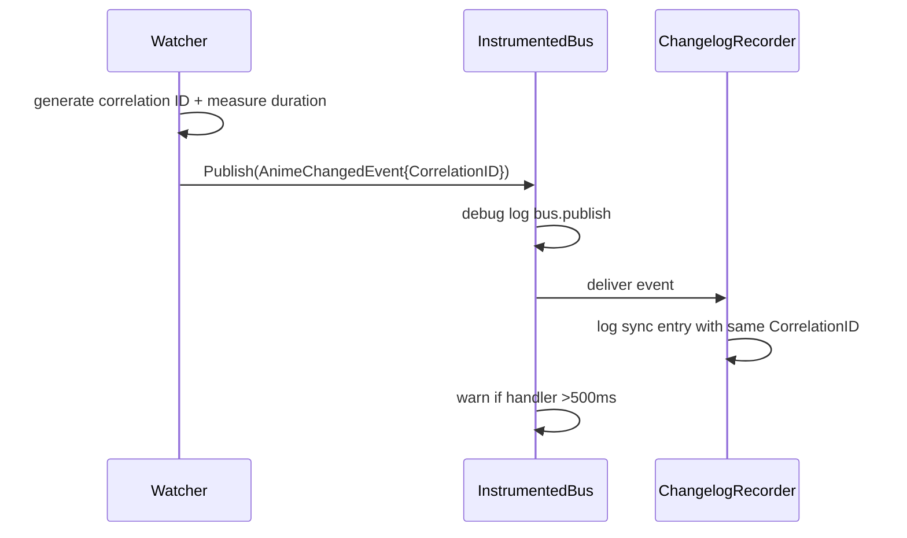

# Design: SDD-20 Observability V2

## Technical Approach

Extend the shared logger contract additively at the data level and intentionally at the API level. `LogEntry` gains optional structured fields with `omitempty`, stdout becomes the human-readable sink, mem logger remains the frontend/Wails source, and instrumentation is added at the domain boundaries that already own timing or entity knowledge. Event-bus logging is implemented as a decorator so publish semantics stay unchanged.

## Architecture Decisions

| Decision | Choice | Alternatives considered | Rationale |
|---|---|---|---|
| Structured entry shape | Add `CorrelationID`, `EntityID`, `EventType`, `DurationMs`, `Metadata` to `LogEntry` with `omitempty` JSON tags | Nested metadata object only; separate DTO for frontend | Additive fields preserve existing JSON consumers and keep Wails payloads backward compatible. |
| Logger API break | Extend `Logger` with `Debugf` and `Logf(domain, level string, fields Fields, format string, args ...any)`; update all in-repo impls/tests in one slice | Only add `Debugf`; downcast to sinks for structure; builder-only API | Compile-time break is desirable here because every implementation must understand debug + structured fields. `Logf` gives one explicit structured path. |
| Entry construction | Use a small `Fields` struct passed to `Logf`; `Debugf/Infof/Warnf/Errorf` call `Logf` with zero fields | Expand `newEntry(...)`; fluent builder/options chain | A struct is idiomatic Go, cheap, and test-friendly; no ambiguous variadics or per-call builder state. |
| Bus instrumentation | New `InstrumentedBus` wrapping `events.Bus`/`MemoryBus` | Modify `MemoryBus` directly | Keeps the core bus dependency-free and lets `app.go` opt into observability without changing delivery semantics. |
| HTTP logging insertion | Wrap `NewHandler(config)` inside `NewServer` with request-logging middleware | Add middleware chain to `Handler`; log in every route | One wrapper captures all mux routes, including `/ws` handshake, with minimal router churn. |
| Correlation threading | Primary carrier is explicit `CorrelationID` on event structs; HTTP middleware may also place it in request context for request-local reuse | `context.Context` only; explicit params everywhere | Bus events already cross async boundaries without context, so correlation must travel with the event payload itself. |

## Data Flow

```text
Watcher/API/Sync ──Logf──> FanoutLogger ──> StdoutLogger
       │                         └──────> MemLogger -> Wails/GetRecentLogs
       └── Publish(event+correlation) -> InstrumentedBus -> handlers
```



## File Changes

| File | Action | Description |
|------|--------|-------------|
| `internal/logger/logger.go` | Modify | Extend `LogEntry`, levels, `Logger`, and shared `Fields` contract. |
| `internal/logger/mem.go`, `stdout.go`, `fanout.go` | Modify | Route all writes through `Logf`; stdout formats `[ts] [LEVEL] [domain] ...`; default capacity 500. |
| `internal/events/event.go` | Modify | Add optional `CorrelationID` to emitted event structs used across domains. |
| `internal/events/bus.go` | Modify | Add instrumented bus wrapper/config while keeping `MemoryBus` as raw transport. |
| `internal/api/server.go` | Modify | Wrap handler with request-logging middleware and keep startup log. |
| `internal/api/router.go` | Minimal modify | No route redesign; preserve mux ownership. |
| `internal/anime/startup_catchup.go`, `watcher.go`, `writer.go`, `logger.go` | Modify | Emit structured domain logs with entity IDs, durations, event types, and propagated correlation IDs. |
| `internal/sync/service.go`, `changelog_recorder.go` | Modify | Log reconcile and changelog operations with timing/event metadata. |
| `internal/realtime/hub.go`, `internal/api/handlers/websocket_handler.go` | Modify | Log connection lifecycle and counts. |
| `app.go` | Modify | Construct instrumented bus and mem logger with new default capacity. |

## Interfaces / Contracts

```go
type Fields struct {
    CorrelationID string
    EntityID      string
    EventType     string
    DurationMs    int64
    Metadata      map[string]any
}

type Logger interface {
    Debugf(domain, format string, args ...any)
    Infof(domain, format string, args ...any)
    Warnf(domain, format string, args ...any)
    Errorf(domain, format string, args ...any)
    Logf(domain, level string, fields Fields, format string, args ...any)
}
```

## Testing Strategy

| Layer | What to Test | Approach |
|-------|-------------|----------|
| Unit | JSON `omitempty`, stdout formatting, mem capacity 500, debug support | `internal/logger/*_test.go` |
| Unit | Request middleware status/duration/level mapping | `internal/api/server_test.go` with `httptest` and response-recorder wrapper assertions |
| Unit | Instrumented bus publish logs, slow-handler warn threshold, correlation propagation | `internal/events/*_test.go` |
| Integration | Anime/sync/realtime flows emit structured entries with entity IDs and reused correlation IDs | Extend existing domain tests with recording logger fakes |
| Integration | `App.GetRecentLogs()` still returns richer entries to Wails/frontend consumers | `app_test.go` |

## Migration / Rollout

No migration required. This is runtime-only and backward compatible at the JSON boundary.

## Open Questions

- [ ] None blocking.
