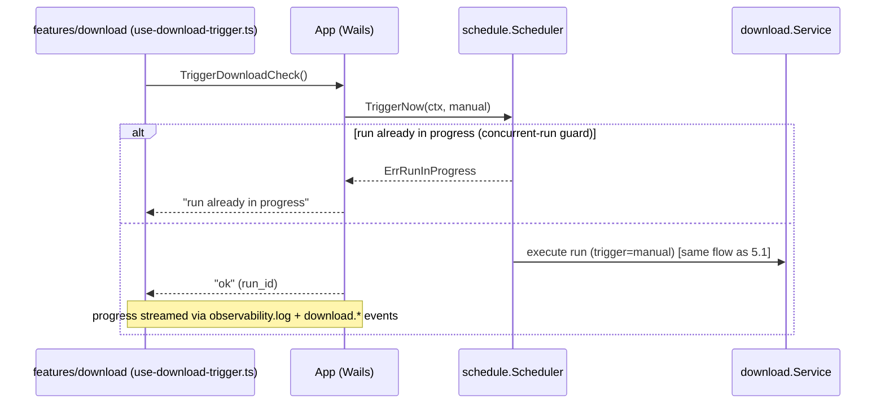
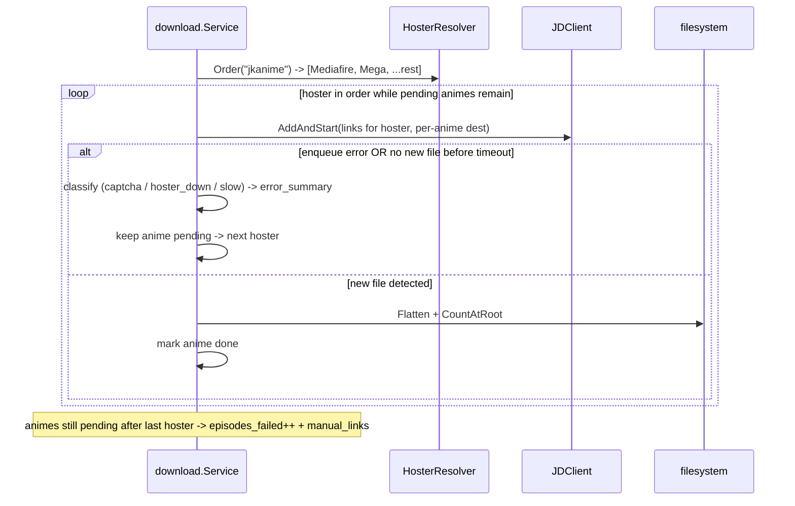

# Design: SDD-28 Automated Anime Downloading (`internal/download`)

**Change ID:** `2026-06-21-sdd-28-auto-download`
**Phase:** Design (architecture / separation of responsibilities — the priority of this change)

> All symbols, signatures and DDL below are PROPOSED. This document is the HOW at the architectural level; it intentionally does not contain implementation bodies. Every integration point cites a real, verified symbol from the current codebase (code is runtime truth).

---

## 1. Context & Goals

The PoC (`cmd/poc/*.go`, 10 files, all `package main`) proved the full pipeline end-to-end: read today's active animes from `bridge.db` → scrape jkanime → enqueue by hoster priority through MyJDownloader → poll filesystem for completion → flatten JD subfolders → notify. Feasibility is settled; architecture is not.

Goals of this design:

1. Turn the monolithic PoC into a single hexagonal bounded context `internal/download`, wired in `app.go` exactly like `internal/device` (verified template), with ports + adapters and clean separation of the 18 PoC responsibilities.
2. Replace every hardcoded seam (site `strings.Contains`, compiled `hosterPriority` map, plaintext env-var credentials, raw `database/sql` snapshot reads) with registry-driven, persisted, testable equivalents adopting the dlexa pattern catalog. The site/scraper registry stays IN CODE (a `StaticRegistry` of `EpisodeSource` adapters) — there is NO per-site `download_site_config` table, because adding a site requires writing its adapter code anyway (ADR-3).
3. Persist 4 new tables in `bridge.db` following the EXACT `internal/sync/sqlite_bootstrap.go` discipline.
8. Build the project's first SHARED, generic notification architecture — a new bounded context `internal/notification` (`Notifier` port + dispatcher + UI-toast and Windows-desktop-toast adapters) plus a shared frontend toast surface in the app-shell — with `internal/download` as its first consumer. Generic by design so SDD-29 migrates the other features onto it (see §14 "Notification Architecture" + ADR-NOTIF-1/2/3).
4. Run on an in-process scheduler inside the resident Wails tray, gated by config.
5. Integrate SDD-20 observability (`logger.LogEntry` shape) + a durable `download_runs` table.
6. Expose a desktop-only Wails binding surface on `App` and a dumb-UI `frontend/src/features/download`.
7. Preserve the hard-won trigger semantic (`online latest-episode-number > video-files-on-disk`, NOT `> NroCapVisto` and NOT `> any DB-cached count`), re-deriving the on-disk count from the filesystem every run. The `internal/download` context is strictly READ-ONLY against the anime context: NO `NroCapVisto` write-back, NO `AnimeWriteService` dependency (see ADR-5).

---

## 2. Bounded-Context Layout

Single context `internal/download` with strong internal sub-packages, mirroring dlexa's `source`/`fetch`/`parse` separation *inside* the context (not as separate top-level contexts — YAGNI, per Proposal decision 1). The `device` context (`Service` port + `SQLiteStore` adapter + `contracts.*` DTO) is the structural template.

```
internal/download/
  service.go              # download.Service — orchestrator (port). dlexa query.LookupService fan-out shape. [PoC #17]
  contracts.go            # DTOs: DownloadConfig, HosterPriorityEntry, JDConfig,
                          #       ScheduleConfig, DownloadRun, RunStatus, TriggerSource, ManualLink.
                          #       (No SiteConfig DTO — site registry is in code, ADR-3.)
  decision.go             # pure domain: trigger decision (online vs disk), Tipo gating, gap detection. [PoC #3,#9]
  decision_test.go        # pure unit tests, no I/O.
  errors.go               # sentinel errors (ErrJDOffline, ErrNoLinks, ErrSiteUnsupported, ErrGapPageMissing...).
  store.go                # DownloadStore port (all 4-table persistence) + interface assertions.
  sqlite_store.go         # SQLiteStore adapter (mirrors device.SQLiteStore). [PoC: replaces raw bridge.go SQL]
  sqlite_store_test.go    # temp-db store tests.
  registry.go             # SiteRegistry + HosterResolver (dlexa source.StaticRegistry + engine.Resolver). [PoC #4,#8]
  health.go               # HealthChecker (dlexa doctor.Runner shape): JD-online, site-reachable, dest-writable.

  sites/
    site.go               # EpisodeSource interface (port) + SiteDescriptor (name + priority).
    governed_doer.go      # fetch.GovernedDoer adapter (429/backoff). [dlexa fetch]
    jkanime/
      jkanime.go          # jkanime EpisodeSource adapter (regex extraction behind interface). [PoC #5,#6,#7]
      jkanime_test.go     # fixture-driven adapter tests (recorded HTML/JSON).
  jdownloader/
    client.go             # JDClient interface (port) — Connect/ListDevices online-gate/AddAndStart/PollPackages. [PoC #12,#13]
    myjd.go               # rkosegi/jdownloader-go adapter implementing JDClient + 90s auto-launch poll.
    launcher.go           # exe-path resolution (download_jd_config override → Autoreas Settings fallback). [PoC #15]
  filesystem/
    counter.go            # EpisodeCounter port + adapter (non-recursive tally + recursive poll). [PoC #10]
    flatten.go            # Flattener adapter (move JD subfolder files to root, observable). [PoC #11]
    counter_test.go       # temp-dir tests.
  schedule/
    scheduler.go          # Scheduler port + in-process ticker adapter, gated by ScheduleConfig. [PoC: new]
    scheduler_test.go     # fake-clock tests.
  # NOTE: NO local notify/ package. Download user-notable moments go through the SHARED
  #       notification.Notifier port (injected), NOT a download-owned notifier. [PoC #16 → §14]
  config/
    defaults.go           # named-constant defaults (dlexa config.static shape): hoster seed, poll intervals, video exts.
```

### 2.1 PoC responsibility → target file map (18 responsibilities)

| # | PoC responsibility | Target |
|---|---|---|
| 1 | Read animes from bridge SQLite | **REMOVED** raw SQL → `anime.QueryService.ListMobileAnimes()` injected into `download.Service` (READ-ONLY; see §3.8) |
| 2 | Read legacy `.dat` fallback | **DROPPED** for production (SQLite canonical) |
| 3 | Filter today's active by weekday | `decision.go` (uses `MobileAnime.Dias` + a new shared weekday helper — see §2.2; the Spanish `time.Weekday→name` map exists ONLY in `cmd/poc/poc.go` `weekDaySpanish` today and must be ported as new, testable, locale-sensitive code) |
| 4 | Site detection / scraper selection | `registry.go` `SiteRegistry` (dlexa `source.StaticRegistry`) |
| 5 | jkanime CSRF + anime-ID extraction | `sites/jkanime/jkanime.go` |
| 6 | Episode listing AJAX | `sites/jkanime/jkanime.go` |
| 7 | Download-link extraction (`var servers`) | `sites/jkanime/jkanime.go` (regex behind `EpisodeSource`) |
| 8 | Hoster priority ordering/batching | `registry.go` `HosterResolver` + `download_hoster_priority` table |
| 9 | Trigger decision (online vs disk) | `decision.go` (pure, the non-negotiable semantic) |
| 10 | Filesystem episode counting | `filesystem/counter.go` |
| 11 | Flatten JD subfolders | `filesystem/flatten.go` |
| 12 | JD connect/online-check/auto-launch | `jdownloader/myjd.go` + `launcher.go` (ListDevices online-gate) |
| 13 | JD enqueue (no package name) | `jdownloader/myjd.go` `AddAndStart` |
| 14 | JD credentials + device name | `download_jd_config` (DPAPI) — `store.go`/`sqlite_store.go` + §7 |
| 15 | Read JD exe path from Autoreas Settings | `jdownloader/launcher.go` (override-first, Settings fallback) |
| 16 | Desktop notification | **SHARED** `notification.Notifier` port (injected) — download EMITS `Notification` values through it; it owns NO notifier/toast code. PoC PowerShell toast DISCARDED. See §14. |
| 17 | Orchestration loop | `service.go` (fan-out + structured outcome + failure isolation) |
| 18 | CLI test harness | **DISCARDED**; replaced by Wails `TriggerDownloadCheck` + scheduler |

### 2.2 Weekday helper is NEW code (not a reuse)

The Spanish `time.Weekday → name` mapping the weekday filter depends on exists ONLY in `cmd/poc/poc.go` as the package-private `weekDaySpanish` map (verified — no equivalent in `internal/`). It is NOT a shared domain helper today. This design treats it as **new code**: port the PoC map into a small, exported, table-tested helper (e.g. `config/defaults.go` or `decision.go`), accepting a `time.Time` so tests can pin a fixed weekday without touching the wall clock. It is locale-sensitive (accented "Miércoles", "Sábado") and therefore must have its own unit tests rather than being assumed correct by reuse.

---

## 3. Ports & Interfaces (proposed signatures)

All ports follow the codebase's constructor-injection seam pattern (`device.NewService(store)` + overridable `new*` fields in `app.go`). Concrete adapters satisfy ports via `var _ Port = (*Adapter)(nil)` assertions, exactly like `device.go`.

### 3.1 EpisodeSource (site adapter port) — PoC #5,#6,#7

```go
// internal/download/sites/site.go
type SiteDescriptor struct {
    Name     string // "jkanime"
    Priority int    // registry ordering
}

type EpisodeListing struct {
    LatestEpisode int    // highest episode number available online
    EpisodePageURL string
}

type DownloadLink struct {
    URL    string // decoded (base64 already resolved by the adapter)
    Hoster string // e.g. "Mediafire"
    Size   string
}

type EpisodeSource interface {
    Descriptor() SiteDescriptor
    // Matches returns true if this source handles the given anime page URL.
    Matches(pageURL string) bool
    // ListEpisodes returns the latest online episode + episode page URL for the anime page.
    ListEpisodes(ctx context.Context, pageURL string) (EpisodeListing, error)
    // ExtractLinks returns hoster download links for a specific episode page.
    ExtractLinks(ctx context.Context, episodePageURL string) ([]DownloadLink, error)
}
```

### 3.2 SiteRegistry + HosterResolver — PoC #4,#8 (dlexa source.StaticRegistry + engine.Resolver)

```go
// internal/download/registry.go
type SiteRegistry interface {
    // Resolve returns the highest-priority EpisodeSource whose Matches(pageURL) is true.
    Resolve(pageURL string) (sites.EpisodeSource, error) // ErrSiteUnsupported when none
    Register(source sites.EpisodeSource)
}

type HosterResolver interface {
    // Order returns the configured hoster priority for a site (low int = first).
    // Falls back to alphabetical for unknown hosters; never panics on empty config.
    Order(site string) ([]HosterPriorityEntry, error)
}
```

### 3.3 JDClient (port) with ListDevices online-gate — PoC #12,#13

```go
// internal/download/jdownloader/client.go
type DeviceStatus struct {
    Name   string
    Online bool
}

type EnqueueRequest struct {
    URLs        []string
    Destination string // per-anime Carpeta; "" → JDConfig.DefaultDestDir
    // PackageName intentionally omitted — empty avoids JD subfolders (#13).
}

type JDClient interface {
    Connect(ctx context.Context) error
    // ListDevices is the ONLY liveness proof. Connect() can succeed while JD is offline. (#12 quirk)
    ListDevices(ctx context.Context) ([]DeviceStatus, error)
    // EnsureOnline connects, checks ListDevices for the configured device, and if absent
    // and launchIfMissing, launches the exe and polls ListDevices up to autoLaunchTimeout (90s).
    EnsureOnline(ctx context.Context, deviceName string, launchIfMissing bool) error
    AddAndStart(ctx context.Context, deviceName string, req EnqueueRequest) error
    PackagesFinished(ctx context.Context, deviceName string) (bool, error)
    Disconnect(ctx context.Context) error
}
```

### 3.4 EpisodeCounter + Flattener (filesystem ports) — PoC #10,#11

```go
// internal/download/filesystem/counter.go
type EpisodeCounter interface {
    // CountAtRoot tallies video files DIRECTLY in folder (non-recursive) — the canonical "downloaded" count.
    // This live filesystem tally is the SINGLE SOURCE OF TRUTH for download state (ADR-DISK).
    // It is re-derived every run; it is NEVER read from or cached in bridge.db.
    CountAtRoot(folder string) int
    // CountRecursive tallies video files in folder + subfolders — used during poll before flatten.
    CountRecursive(folder string) int
}

type Flattener interface {
    // Flatten moves video files from immediate subdirectories into folder root, then removes empty dirs.
    // Returns moved count; errors are non-fatal and reported via the supplied logger.
    Flatten(ctx context.Context, folder string) (moved int, err error)
}
```

### 3.5 Scheduler (port) — in-process, gated by config

```go
// internal/download/schedule/scheduler.go
type Scheduler interface {
    // Start begins the in-process loop. Reads ScheduleConfig each tick; no-op when disabled.
    Start(ctx context.Context)
    // Stop signals the loop to exit and BOUNDED-DRAINS an in-flight run (called from app.shutdown).
    // It cancels the active run context, waits up to a fixed shutdownDrainTimeout (5s), then abandons.
    // It NEVER blocks shutdown for the lifetime of an hour-long run (see §6 lifecycle contract).
    Stop()
    // TriggerNow runs an immediate check out-of-band (manual trigger), respecting the concurrent-run guard.
    TriggerNow(ctx context.Context, src contracts.TriggerSource) error
}
```

### 3.6 DownloadStore (port — all 4 tables) — PoC #14 + persistence

```go
// internal/download/store.go
type DownloadStore interface {
    // hoster priority
    ListHosterPriority(ctx context.Context, site string) ([]HosterPriorityEntry, error)
    SetHosterPriority(ctx context.Context, site string, entries []HosterPriorityEntry) error
    SeedHosterPriorityIfEmpty(ctx context.Context, site string, entries []HosterPriorityEntry) error
    // (No site-config methods — the site registry is in code, not a DB table, per ADR-3.
    //  Site enabled/disabled state, if ever needed, would be a code-level registry concern.)
    // jd config (singleton row id=1) — encrypted blob handled by adapter (§7)
    GetJDConfig(ctx context.Context) (JDConfig, error)
    SetJDConfig(ctx context.Context, cfg JDConfig, plaintextPassword *string) error // nil password => leave unchanged
    SetJDStatus(ctx context.Context, status string, atMs int64) error
    // schedule config (singleton row id=1)
    GetScheduleConfig(ctx context.Context) (ScheduleConfig, error)
    SetScheduleConfig(ctx context.Context, cfg ScheduleConfig) error
    MarkScheduleRun(ctx context.Context, lastAtMs int64, status string, nextAtMs int64) error
    // runs
    // OpenRun writes the row at run start with the CONCRETE provisional status "running"
    // (NEVER NULL/undefined) and finished_at_ms = NULL. See §8 run-status lifecycle.
    OpenRun(ctx context.Context, run DownloadRun) error
    // FinalizeRun writes the terminal row AND prunes download_runs to the most-recent
    // RUN_RETENTION_LIMIT (200) rows in the SAME transaction, so the table stays bounded (§4.5).
    FinalizeRun(ctx context.Context, run DownloadRun) error
    ListRuns(ctx context.Context, limit int) ([]DownloadRun, error)
    // ReconcileInterruptedRuns finalizes every non-terminal row (finished_at_ms IS NULL)
    // as status="interrupted" at startup, before the scheduler starts (crash-zombie cleanup, §8).
    ReconcileInterruptedRuns(ctx context.Context, atMs int64) (int, error)
}
```

`JDConfig` exposes a **decrypted** password ONLY to the JD adapter at connect time, never to the UI (§7). `JDConfig` returned to callers carries `HasPassword bool`, never the cleartext.

### 3.7 Notifier (SHARED port — consumed, not owned) — PoC #16

Download does NOT define its own notifier. It depends on the SHARED, generic `notification.Notifier` port (defined in the new `internal/notification` context, §14) and emits domain-agnostic `Notification` values through it:

```go
// internal/notification/notifier.go  (SHARED context — see §14)
type Level string // "info" | "success" | "warning" | "error"

type Notification struct {
    Title         string
    Body          string
    Level         Level
    Source        string    // domain string, e.g. "download" — NOT download-specific
    CorrelationID string    // e.g. run_id; optional
    Timestamp     time.Time
}

type Notifier interface {
    Notify(ctx context.Context, n Notification) error // fan-out; one adapter failing never blocks another or the caller
}
```

Download injects this port (see §3.9 `ServiceDeps.Notifier notification.Notifier`) and calls `Notify(ctx, Notification{Source:"download", ...})` for user-notable moments (download completed, run failed, JD offline, anime skipped for missing page/folder). The PoC's PowerShell toast is discarded entirely; download contains NO OS-toast code. Backend domain events still flow on `events.Bus` (§8) — the bus is the backend↔backend mediator; the `Notifier` is the user-facing sink. The two are distinct concerns (§14.1).

### 3.8 Anime read seam (REUSE — READ-ONLY, no new interface)

The download context reads via the EXISTING `contracts.AnimeQueryService` ONLY (verified in `internal/api/contracts/contracts.go` and implemented in `internal/anime/service.go`). It does NOT depend on `contracts.AnimeWriteService` at all — there is no write-back of any kind (ADR-5):

- **Read:** `ListMobileAnimes(ctx) ([]MobileAnime, error)` / `GetMobileAnime(id)` — **CRITICAL**: `contracts.AnimeListItem` carries `Tipo` (verified line 65) but does NOT carry the `Pagina`/`Carpeta` page+folder fields; only `contracts.MobileAnime` carries `Pagina`/`Carpeta` (verified lines 24,30–31). Because the download decision needs `Pagina` and `Carpeta`, the context consumes `ListMobileAnimes()` / `GetMobileAnime(id)`, NOT `ListAnimeItems()`. This corrects an assumption in the proposal that named `ListAnimeItems`. (The reason is the missing `Pagina`/`Carpeta`, NOT a missing `Tipo`.)
- **No write seam:** the former optional `NroCapVisto` write-back via `AnimeWriteService.PatchAnime` is REMOVED. The filesystem is the source of truth for download state (ADR-DISK); the context persists ONLY its own `download_*` tables.

### 3.9 `download.Service` constructor (the orchestrator seam)

```go
// internal/download/service.go
type ServiceDeps struct {
    Animes     contracts.AnimeQueryService // READ-ONLY; no AnimeWriteService dependency (ADR-5)
    Sites      SiteRegistry
    Hosters    HosterResolver
    JD         jdownloader.JDClient
    Counter    filesystem.EpisodeCounter
    Flattener  filesystem.Flattener
    Store      DownloadStore
    Notifier   notification.Notifier // SHARED generic port (§14); download is its first consumer
    Bus        events.Bus
    Logger     logger.Logger
    Clock      func() time.Time
    NewRunID   func() string
}
func NewService(deps ServiceDeps) *Service
```

Every dependency is an interface → in-memory fakes drive strict-TDD unit tests; `app.go` `newDownloadService` field defaults to the real wiring and is overridable in `app_test.go` (the established `new*` seam).

---

## 4. SQLite Schema (follows `internal/sync/sqlite_bootstrap.go` exactly)

**FOUR tables** — `download_hoster_priority`, `download_jd_config`, `download_schedule_config`, `download_runs`. There is NO `download_site_config` table: the site/scraper registry is in code (a `StaticRegistry` of `EpisodeSource` adapters), because adding a site requires writing its adapter anyway (ADR-3). Hoster priority IS runtime-configurable data with no code change, so it stays persisted.

DDL constants live in `internal/sync/sqlite_bootstrap.go` alongside the existing `*DDL` constants. `initializeBridgeDB` is extended with four new `db.Exec(...DDL)` / `ensureXSchema` calls AFTER the existing `devicesDDL` block (lines 144–158). PRAGMAs (`journal_mode=WAL` verified, `busy_timeout=5000` verified), `SetMaxOpenConns(1)` are already applied process-wide — the new tables inherit them. Singleton tables use the verified `id INTEGER PRIMARY KEY CHECK (id = 1)` pattern.

```sql
-- download_hoster_priority : user-configurable per-site hoster ordering (replaces compiled map). PoC #8
-- NOTE: `priority` is NOT unique per site (two hosters may share a priority value). Tie-breaks are
-- resolved DETERMINISTICALLY by HosterResolver.Order via a secondary alphabetical sort on hoster name
-- (see §4.4 / ADR-HOSTER) — we deliberately do NOT add UNIQUE(site, priority) so the user can save a
-- partial/duplicate ordering without the write failing; ordering stays stable regardless.
CREATE TABLE IF NOT EXISTS download_hoster_priority (
    site     TEXT    NOT NULL,
    hoster   TEXT    NOT NULL,
    priority INTEGER NOT NULL,
    enabled  INTEGER NOT NULL DEFAULT 1,
    PRIMARY KEY (site, hoster)
);

-- NOTE: there is intentionally NO download_site_config table. The site/scraper registry
-- lives in code (StaticRegistry of EpisodeSource adapters); adding a site requires writing
-- its adapter anyway, so a per-site DB config row would be over-engineering for one site (ADR-3).

-- download_jd_config : singleton MyJD config; password DPAPI-encrypted at rest. PoC #14
CREATE TABLE IF NOT EXISTS download_jd_config (
    id                       INTEGER PRIMARY KEY CHECK (id = 1),
    myjd_email               TEXT,
    myjd_password_encrypted  BLOB,           -- DPAPI ciphertext; NEVER plaintext (§7)
    device_name              TEXT,
    exe_path_override        TEXT,           -- nullable; fallback = Autoreas Settings downloader.dir
    default_dest_dir         TEXT,
    last_seen_status         TEXT,
    last_seen_at_ms          INTEGER,
    last_decrypt_error       TEXT             -- C4 sink: populated (non-fatal) when Unprotect() fails;
                                              -- NEVER contains plaintext. Cleared on a successful decrypt.
);

-- download_schedule_config : singleton scheduler config, single source of truth.
CREATE TABLE IF NOT EXISTS download_schedule_config (
    id              INTEGER PRIMARY KEY CHECK (id = 1),
    mode            TEXT    NOT NULL DEFAULT 'in_process', -- reserved; only in_process implemented
    daily_time_hhmm TEXT,                                   -- "HH:MM" local; primary cadence
    enabled         INTEGER NOT NULL DEFAULT 0,             -- OFF by default (rollback-safe dormant state)
    last_run_at_ms  INTEGER,
    last_run_status TEXT,
    next_run_at_ms  INTEGER
);

-- download_runs : durable per-run history for cross-restart observability (ring buffer is bounded/volatile).
-- HISTORICAL TELEMETRY ONLY — never consulted to decide whether to download (ADR-DISK).
-- BOUNDED: pruned on every run finalize to the most-recent RUN_RETENTION_LIMIT (200) rows so the
-- table can never grow unbounded (§4.5 / §8 retention; ADR-RETENTION).
CREATE TABLE IF NOT EXISTS download_runs (
    run_id              TEXT PRIMARY KEY,                  -- == CorrelationID in LogEntry
    started_at_ms       INTEGER NOT NULL,
    finished_at_ms      INTEGER,                           -- NULL while non-terminal; reconciled at startup (§8)
    trigger             TEXT NOT NULL,                     -- "scheduled" | "manual"
    animes_checked      INTEGER NOT NULL DEFAULT 0,        -- animes actually EVALUATED (excludes skipped, §8)
    episodes_found      INTEGER NOT NULL DEFAULT 0,
    episodes_downloaded INTEGER NOT NULL DEFAULT 0,
    episodes_failed     INTEGER NOT NULL DEFAULT 0,
    skipped_count       INTEGER NOT NULL DEFAULT 0,        -- W1: animes skipped (Tipo 1/2, missing pagina/carpeta,
                                                           -- unsupported/disabled site); excluded from animes_checked
    jd_available        INTEGER NOT NULL DEFAULT 0,
    status              TEXT NOT NULL,                     -- provisional "running"; terminal one of:
                                                           -- ok|partial|error|jd_offline|no_animes_today|interrupted (§8)
    error_summary       TEXT,                              -- captcha vs hoster-down vs slow distinction (§8)
    manual_links_json   TEXT                               -- JD-offline degradation: JSON array of contracts.ManualLink
                                                           -- {anime, episode, links[]} (§8); bounded — see §8
);

-- Matches the ListRuns access pattern (most-recent-first run history).
CREATE INDEX IF NOT EXISTS idx_download_runs_started_at ON download_runs(started_at_ms DESC);
```

### 4.1 `initializeBridgeDB` extension shape

```go
// inside initializeBridgeDB(db), after the devices block (sqlite_bootstrap.go:158):
if _, err := db.Exec(downloadHosterPriorityDDL); err != nil { return fmt.Errorf("ensure download_hoster_priority schema: %w", err) }
if err := ensureDownloadJDConfigSchema(db);      err != nil { return err }   // column-introspection migration shape
if _, err := db.Exec(downloadScheduleConfigDDL); err != nil { return fmt.Errorf("ensure download_schedule_config schema: %w", err) }
if _, err := db.Exec(downloadRunsDDL);           err != nil { return fmt.Errorf("ensure download_runs schema: %w", err) }
// No download_site_config: the site registry is in code (ADR-3).
```

### 4.2 Migration shape (future evolution only)

Any later column add follows the verified `ensureChangelogSchema` precedent: `tableColumns(db, "download_jd_config")` → if missing the new column, run a transactional rename-old → create-new → copy-rows → drop-old migration (NEVER `ALTER`-in-place without a column-introspection guard). `download_jd_config` is the most likely candidate (e.g. adding `cached_devices_json`), hence the `ensureDownloadJDConfigSchema` wrapper from day one; the other three use plain `CREATE TABLE IF NOT EXISTS` until they actually evolve.

### 4.3 DPAPI credential column handling

`myjd_password_encrypted` is a `BLOB`. The `sqlite_store.go` adapter calls `crypto.Protect(plaintext) []byte` (DPAPI, §7) before write and `crypto.Unprotect(blob) string` only when handing the password to the JD adapter at connect time. `GetJDConfig` for the UI returns `HasPassword = len(blob) > 0` and NEVER decrypts. `SetJDConfig` with a nil `plaintextPassword` leaves the existing blob untouched (edit email/device without re-entering password).

### 4.4 Deterministic hoster ordering (`HosterResolver.Order`) — W2/W3

`HosterResolver.Order(site)` produces a TOTAL, deterministic order from `download_hoster_priority` plus any hosters discovered in scraped links that are absent from the table:

1. **Configured hosters** sort by `priority` ascending.
2. **Priority ties** (two configured hosters with the same `priority`) break alphabetically by hoster name (case-insensitive). This is why no `UNIQUE(site, priority)` constraint is needed (ADR-HOSTER).
3. **Unconfigured hosters** (present in scraped links but with no `download_hoster_priority` row) sort AFTER all configured hosters, ordered alphabetically among themselves — matching the PoC's "everything else alphabetical" (`cmd/poc/scraper.go`: unlisted hosters get priority 99, then alphabetical).
4. **Empty config** → the whole list falls back to alphabetical; never panics.

Seeded defaults (first run, `SeedHosterPriorityIfEmpty`) match the validated PoC: `Mediafire`=priority 0, `Mega`=priority 1. Spec, this doc, and the seed MUST agree on these three rules.

### 4.5 `download_runs` retention (bounded table) — ADR-RETENTION

`download_runs` is the only download table that grows per run, so it MUST be bounded. Policy: **keep only the most recent `RUN_RETENTION_LIMIT = 200` runs**; prune older rows on every run finalize.

- **Where:** `FinalizeRun` performs the prune in the same transaction that writes the terminal row, e.g. delete every row whose `started_at_ms` is below the 200th-most-recent (a `DELETE ... WHERE run_id NOT IN (SELECT run_id FROM download_runs ORDER BY started_at_ms DESC LIMIT 200)`). The exact statement is an apply detail; the contract is "≤ 200 rows remain after finalize."
- **Why this is safe / cheap:** no other feature ever reads `download_runs` (it is download-private telemetry), and writes happen ~once/day (scheduled) or on manual trigger — NOT a hot path. The extra delete on finalize is negligible. `journal_mode=WAL` (verified process-wide PRAGMA) keeps the run-history reader concurrent with the prune write; `SetMaxOpenConns(1)` already serializes writers.
- **200 is a deliberate cap:** ~7 months of daily runs — far more than the run-history UI surfaces — while guaranteeing the table cannot grow without bound across years of operation.
- **`RUN_RETENTION_LIMIT` is a named constant** in `config/defaults.go` so spec, store, and tests agree on the single value (mirrors the hoster-seed-defaults discipline).

---

## 5. Sequence Diagrams

### 5.1 Full scheduled download run

```mermaid
sequenceDiagram
    participant SCH as schedule.Scheduler
    participant SVC as download.Service
    participant Q as anime.QueryService
    participant ST as DownloadStore
    participant REG as SiteRegistry
    participant SRC as jkanime EpisodeSource
    participant FS as filesystem (Counter/Flattener)
    participant JD as JDClient
    participant LOG as logger + events.Bus

    SCH->>SVC: TriggerNow(scheduled)
    SVC->>ST: OpenRun(run_id, started, trigger=scheduled)
    SVC->>LOG: Logf(domain=download, EventType=download.run_started, CorrelationID=run_id)
    SVC->>Q: ListMobileAnimes()
    SVC->>SVC: decision.FilterToday + Tipo gate (§ decision.go)
    loop per active anime (fan-out, failure-isolated)
        SVC->>SVC: gap check (Pagina/Carpeta present?)
        alt gap
            SVC->>LOG: download.skipped EntityID=animeID reason=no_page/no_folder
        else ok
            SVC->>REG: Resolve(pagina)
            REG-->>SVC: jkanime source (or ErrSiteUnsupported -> skip+surface)
            SVC->>SRC: ListEpisodes(pagina) -> LatestEpisode
            SVC->>FS: CountAtRoot(carpeta) -> onDisk
            alt LatestEpisode > onDisk  (NON-NEGOTIABLE trigger semantic)
                SVC->>SRC: ExtractLinks(episodeURL)
                SVC->>SVC: append pendingEpisode
            else
                SVC->>LOG: download.up_to_date EntityID=animeID
            end
        end
    end
    SVC->>JD: EnsureOnline(deviceName, launchIfMissing=true)
    alt JD offline (see 5.2)
        Note over SVC,JD: degrade path
    else JD online
        SVC->>ST: SetJDStatus(online)
        loop per hoster in HosterResolver.Order (5.4 fallback)
            SVC->>JD: AddAndStart(urls for this hoster batch, dest=carpeta)
            SVC->>FS: poll CountRecursive(carpeta) until > initial OR timeout
            SVC->>FS: Flatten(carpeta); CountAtRoot -> final (live disk count = source of truth, ADR-DISK)
            SVC->>LOG: download.episode_downloaded EntityID=animeID DurationMs=...
        end
    end
    SVC->>ST: FinalizeRun(run_id, counts, status, error_summary)
    SVC->>LOG: download.run_finished CorrelationID=run_id
    SVC->>ST: MarkScheduleRun(last, status, next)
```

### 5.2 JD-offline degradation path

```mermaid
sequenceDiagram
    participant SVC as download.Service
    participant JD as JDClient
    participant ST as DownloadStore
    participant N as Notifier
    participant LOG as logger + events.Bus

    SVC->>JD: EnsureOnline(deviceName, launchIfMissing=true)
    JD->>JD: Connect() ok BUT ListDevices() lacks device after 90s poll
    JD-->>SVC: ErrJDOffline
    SVC->>ST: SetJDStatus("jd_offline")
    SVC->>ST: FinalizeRun(status="jd_offline", manual_links_json=[pending links])
    SVC->>LOG: download.failed EventType=jd_offline CorrelationID=run_id
    SVC->>N: Notify("N nuevos episodios — JD no disponible")
    Note over SVC,ST: manual links persisted on the run row; UI surfaces them (§8,§10)
```

### 5.3 Manual trigger from UI



### 5.4 Hoster fallback on enqueue failure



---

## 6. Scheduling Design

**Choice: in-process scheduler (Go `time.Timer`/ticker), NOT a Windows Scheduled Task, NOT a third-party cron lib.**

- **Mechanics:** a single goroutine started in `app.startup` after the DB is ready. Each loop iteration: read `download_schedule_config`; if `enabled=0` → sleep a short idle interval and re-check (so a UI enable takes effect without restart); if enabled → compute the next `daily_time_hhmm` boundary, sleep until it (interruptible via the stop channel), then call `Service.TriggerNow(scheduled)`. A `time.Timer` with `Reset` to the next boundary is sufficient; a daily HH:MM cadence does NOT justify importing `robfig/cron` (added dependency, cron-expression surface the UI does not expose). **ADR-S below.**
- **Concurrent-run guard:** a `sync.Mutex`/`atomic.Bool` `running` flag inside `Scheduler`. Both scheduled ticks and `TriggerNow(manual)` acquire it; a second concurrent attempt returns `ErrRunInProgress` (surfaced to the UI on manual trigger; logged+skipped for a scheduled tick that overlaps a long manual run).
- **Run-level max-duration guard (C3):** the active run executes under a context with a fixed `maxRunDuration` deadline (a hard upper bound generously above a normal run, e.g. 2h). If a wedged JD poll or a stuck hoster would otherwise hold the concurrent-run guard forever, the deadline fires, the run context is cancelled, the run is `FinalizeRun`'d (status `partial`/`error` with `error_summary="run_deadline_exceeded"`), and the `running` guard is RELEASED. This guarantees the guard can never be held indefinitely by a single wedged run.
- **Cancellable poll loops (C3):** EVERY long-lived loop — especially the filesystem completion poll (the PoC's 30-min `countAllVideoFiles` loop) and the 90s JD auto-launch poll — MUST `select` on `ctx.Done()` at each tick and return promptly on cancellation. No loop may sleep without also watching the run context.
- **Lifecycle hooks + bounded drain (C3):** `Scheduler.Start(ctx)` called in `app.startup` (using `a.catchUpContext` so it cancels with the rest); `Scheduler.Stop()` called in `app.shutdown` (added alongside the existing `Wait()` calls at `app.go:363–392`), mirroring how `animeRuntimeWatcher.StartAsync`/`.Wait` bracket the lifecycle. `Stop()` does NOT block for the lifetime of an hour-long run: it cancels the active run context, waits at most a fixed `shutdownDrainTimeout` (5s) for the run goroutine to unwind, then abandons. An abandoned run's `download_runs` row (still `finished_at_ms IS NULL`) is left non-terminal and is reconciled to `interrupted` on the NEXT startup via `ReconcileInterruptedRuns` BEFORE the scheduler starts (§8). This closes the C2/W5 crash-zombie gap as well as the C3 shutdown gap.
- **Gating:** the scheduler NEVER runs a check when `enabled=0`. Default `enabled=0` makes the whole feature dormant on first ship (rollback-safe per Proposal §Rollback step 1).

### 6.1 Auto-start-on-login finding (REQUIRED verification result)

**Finding: auto-start-on-login is NOT implemented in code. This is documented but absent — a DRIFT (code wins).**

- `docs/architecture.md` §1.4 ("4. `internal\system\` (System Domain)") states the System domain is responsible for "Arrancar la app, registrar Auto-start en el OS, gestionar el System Tray y encapsular Wails."
- **The `internal/system` package DOES NOT EXIST** (`Glob internal/system/**/*.go` → no files). A repository-wide search for `auto.?start`, `CurrentVersion\Run`, registry-run-key registration, or any startup-registration code returned only docs/PoC/spec hits — **zero production Go code** registers the app on login.
- The tray (`internal/tray`) and Wails encapsulation exist; the "registrar Auto-start en el OS" responsibility described in §1.4 was never built.

**Consequence:** the in-process scheduler is sufficient ONLY while the process is running. After a full quit (`requestQuit` → `wruntime.Quit`) or a machine reboot where the user does not follow with a manual relaunch, a scheduled run is missed.

**Resolution (SDD-28 scope decision):** SDD-28 ships **in-process-scheduler-only**. Auto-start-on-login is DEFERRED to a separate LATER follow-up change (NOT the immediate next one — the immediate next change, SDD-29, is the notifications rework) — it is OS-level side-effect work (an `HKCU\Software\Microsoft\Windows\CurrentVersion\Run` registration in a new `internal/system` package) that is orthogonal to the download pipeline and would compromise SDD-28's purely-additive rollback. SDD-28's obligation is therefore to make the limitation EXPLICIT, not to close it: the schedule UI MUST surface that scheduled runs require the bridge to be running (no missed-run-after-reboot guarantee in this change). See `download-scheduler/spec.md` "Scheduled Runs Require a Running Bridge". The documented DRIFT (internal/system described in `docs/architecture.md` §1.4 but not implemented — code wins) stands; that later auto-start follow-up is where §1.4 finally gets a real home.

---

## 7. Security Design (credentials)

**Choice: DPAPI-encrypted blob in `download_jd_config.myjd_password_encrypted`, scoped to the current Windows user.**

- **Mechanism:** `golang.org/x/sys/windows` `CryptProtectData` / `CryptUnprotectData` (DPAPI) via a tiny `internal/download/crypto` wrapper exposing the interface seam `Protect(plaintext []byte) ([]byte, error)` and `Unprotect(ciphertext []byte) ([]byte, error)`. `CRYPTPROTECT_LOCAL_MACHINE` is NOT set → key scope is the **current Windows user** (another user on the same machine cannot decrypt). No entropy/secondary password is used (keeps it a single-step operation; the OS user account is the trust boundary).

- **Why DPAPI at CURRENT-USER scope, stated plainly (the explicit rationale):** `CryptProtectData`/`CryptUnprotectData` WITHOUT `CRYPTPROTECT_LOCAL_MACHINE` give per-Windows-user encryption-at-rest WITHOUT the bridge having to build ANY application-level user/login/master-password system. The OS derives the encryption key from the currently logged-in Windows session — the bridge never sees, stores, or manages a key. **The bridge has NO application users today and will NOT gain them for this feature.** When this design says "single user," it means **the logged-in Windows user** — NOT an app account. DPAPI binds the secret to that Windows identity automatically: it can be decrypted only by the same Windows user on the same machine, and the bridge does nothing to make that happen beyond calling the two syscalls. This is precisely why DPAPI is the right tool: it delivers at-rest encryption scoped to the human operating the machine, with zero auth surface for the bridge to own, get wrong, or maintain. A master password or app login would ADD a credential-management burden to solve a problem the OS already solves for free.
- **Build-tag split (W7 — an explicit DESIGN item, NOT deferred to apply):** `crypto.Protect/Unprotect` is an interface seam with TWO implementations selected by build tag:
  - `crypto_windows.go` (`//go:build windows`) — the real DPAPI implementation.
  - `crypto_other.go` (`//go:build !windows`) — a clearly-labeled, NON-SECURE fake (e.g. identity/no-op or trivial obfuscation) that exists ONLY so the non-Windows CI build compiles and non-security tests run on Linux.
  The non-Windows fake MUST NOT be permitted to satisfy any security spec scenario. The "never persist plaintext" invariant assertions (§12) are **Windows-gated** (`//go:build windows` test files or a runtime `runtime.GOOS=="windows"` skip) and run on the Windows build. A CI matrix that ran security assertions against the Linux fake and passed would be a FALSE PASS — the design forbids it.
- **Decryption-failure sink (C4):** when `Unprotect` fails (e.g. the blob was created under a different Windows user/profile), the failure is NON-FATAL: the JD adapter degrades (treated as "no usable credentials → jd_offline-style config error), and the concrete failure is recorded in `download_jd_config.last_decrypt_error` and surfaced as a `download.jd_status` config error. The plaintext is NEVER logged, returned, or persisted under any code path — including the failure path.
- **Write-only password end-to-end:**
  1. UI: a password `<input type=password>` whose value is sent once via `SetJDConfig`; the UI never receives a password back. `GetJDConfig` returns `HasPassword bool` only.
  2. Wails: `App.SetJDConfig(cfg, password string)` → `DownloadStore.SetJDConfig(ctx, cfg, &password)`; an empty/omitted password means "leave existing blob unchanged."
  3. Store: `sqlite_store.go` calls `Protect(password)` and writes the BLOB; reads decrypt ONLY inside the JD adapter at `Connect` time.
  4. JD adapter: receives the cleartext transiently, passes to `jdownloader.NewClient`, never logs it (the PoC's `zap.NewNop()` discipline is preserved; the password is excluded from all `LogEntry.Metadata`).
- **Rationale:** keeps everything in the single-database operational model (one file to back up; consistent with the rest of the bridge). DPAPI is a strict upgrade over the PoC's plaintext env vars / gitignored `.env`.

**Credential-Manager alternative weighed:** Windows Credential Manager (`github.com/danieljoos/wincred`) stores the secret in the OS vault outside `bridge.db` — arguably the more idiomatic Windows secret store, and it survives a `bridge.db` reset. **Rejected as primary** because it introduces a SECOND persistence mechanism the bridge does not otherwise have (a separate backup/migration/cleanup story), splits the JD config across two stores (metadata in SQLite, secret in the vault), and DPAPI already provides per-user at-rest encryption with no new dependency surface beyond `x/sys/windows` (already the recommended dep for DPAPI + the §6.1 registry key). **Recommendation: DPAPI-in-SQLite now; Credential Manager remains a clean future swap because the `crypto.Protect/Unprotect` seam is behind an interface.** (ADR-7.)

---

## 8. Observability Design (SDD-20 integration)

**LogEntry field usage** (real `logger.Fields` / `logger.LogEntry`, verified `internal/logger/logger.go`):

| Field | Value for download |
|---|---|
| `Domain` | `"download"` (always) |
| `CorrelationID` | `run_id` (== `download_runs.run_id`) |
| `EntityID` | the anime ID for per-anime events; empty for run-level |
| `EventType` | `download.*` names (below) |
| `DurationMs` | per-episode download elapsed; per-run total |
| `Metadata` | `{hoster, episode, site, skipReason, failureKind, ...}` — NEVER the password |

Emitted via the injected `logger.Logger.Logf(domain, level, fields, format, args...)` → `FanoutLogger` → `StdoutLogger` + `MemLogger` (500-entry ring, emits `observability.log` Wails event). Verified path: `app.go:235–248`.

**`download.*` event names** (added to `internal/events/event.go` constants + typed structs implementing `Event.Name()`, mirroring `AnimeChangedEvent`):

- `download.run_started`, `download.run_finished`
- `download.episode_available`, `download.episode_downloaded`, `download.failed`
- `download.skipped` (gap or Tipo or unsupported site)
- `download.jd_status` (online/offline transitions)

Published on the existing `events.Bus` (the `InstrumentedBus` wrapper auto-logs publishes + slow handlers, verified `instrumented_bus.go`). UI subscribes via the existing `observability.log` emit and/or future targeted emits.

**`download_runs` lifecycle + run-status taxonomy (C2/W5):**

- `OpenRun` writes the row at run start with the CONCRETE provisional status string **`running`** (NOT NULL, NOT an undefined value) and `finished_at_ms = NULL`.
- `FinalizeRun` updates counts + a TERMINAL status + `error_summary` + `manual_links_json` and sets `finished_at_ms` at run end.
- **Terminal status taxonomy:** exactly one of `ok` | `partial` | `error` | `jd_offline` | `no_animes_today` | `interrupted`. `running` is the ONLY non-terminal value.
- **Startup reconciliation (crash zombies):** any row with `finished_at_ms IS NULL` at boot (a crash, kill, or abandoned shutdown-drain left it non-terminal) MUST be finalized as `interrupted` via `ReconcileInterruptedRuns` BEFORE the scheduler starts. This prevents a permanently-stuck `running` zombie row.

This durable row is the complement to the volatile ring buffer — answers "did last night's run succeed" across restarts. It is HISTORICAL telemetry only (ADR-DISK): never consulted to decide whether to download. Both share `run_id` so the run-history UI can cross-reference a row to its (in-session) detailed log entries.

**Retention — `download_runs` is bounded (ADR-RETENTION, §4.5).** Because `download_runs` is the only per-run-growing table, `FinalizeRun` prunes it to the most-recent `RUN_RETENTION_LIMIT = 200` rows in the same transaction that writes the terminal row, so the table can never grow unbounded. This is cheap and safe: no other feature reads `download_runs` (it is download-private telemetry), writes happen ~once/day or on manual trigger (not a hot path), and `journal_mode=WAL` keeps the run-history reader concurrent with the prune write. 200 runs ≈ 7 months of daily history — more than the UI surfaces — while bounding the table across years of operation.

**Skip accounting (W1):** skips (Tipo 1/2, missing `pagina`/`carpeta`, unsupported/disabled site) are counted in the dedicated `download_runs.skipped_count` column and are EXCLUDED from `animes_checked` (which counts animes actually evaluated). Each skip additionally emits a `download.skipped` structured log entry with a `skipReason` in `Metadata`, so the per-anime reason is recoverable from the log even though the run row stores only the aggregate count. `episodes_found`/`episodes_downloaded`/`episodes_failed` count episodes among evaluated animes only.

**Failure-kind distinction (captcha vs hoster-down vs generic/slow):** classification lives in `decision.go`/`service.go` and is recorded in BOTH `download_runs.error_summary` and the structured log `Metadata.failureKind`:

- `captcha` — heuristic: enqueue succeeded but JD reports the package in a known captcha/blocked state, or 0 progress with a captcha-signal response. No programmatic solving (out of scope) — only telemetry.
- `hoster_down` — enqueue error or hoster link unreachable → try-next-hoster fallback fires.
- `slow_or_timeout` — enqueued, some progress, but not finished within the poll timeout.

**Manual-links persistence for JD-offline (typed contract):** when `EnsureOnline` returns `ErrJDOffline`, the pending links are serialized to `download_runs.manual_links_json` as a JSON array of the typed `contracts.ManualLink` struct — `{anime string, episode int, links []string}` — used by BOTH the observability persistence path AND the UI run-detail spec, so backend and frontend tests assert the SAME shape. The array is bounded (cap at a sane limit, e.g. ≤ the number of eligible animes in a run, and truncate the per-anime `links` to the configured hosters) so a pathological scrape cannot bloat the row. The run-history UI surfaces these for manual download for free (no separate manual-download UI invented). Per exploration open-decision 9.

---

## 9. Wails Binding Surface (methods added to `App`)

Following the verified `App` method conventions (`TriggerReconcile`, `GetSyncingAnimeItems`, `GetAnimes`): return JSON-friendly DTOs or status strings, degrade to empty/sentinel on nil deps, never panic. Desktop-only — NOT added to `internal/api`.

```go
func (a *App) GetDownloadConfig() contracts.DownloadConfig            // hoster priority + site config + schedule + jd(HasPassword) snapshot
func (a *App) SetHosterPriority(site string, hosters []string) string // ordered list -> persist; "ok"/error
func (a *App) GetJDStatus() contracts.JDStatus                        // {online bool, deviceName, lastSeenAtMs, status}
func (a *App) SetJDConfig(cfg contracts.JDConfigInput, password string) string // password write-only; ""=unchanged
func (a *App) GetScheduleConfig() contracts.ScheduleConfig
func (a *App) SetScheduleConfig(cfg contracts.ScheduleConfig) string
func (a *App) TriggerDownloadCheck() string                          // -> Scheduler.TriggerNow(manual); run_id or error
func (a *App) ListDownloadRuns(limit int) []contracts.DownloadRun    // run history (durable)
```

Wiring: `App` gains `downloadService *download.Service`, `downloadScheduler download.Scheduler`, `downloadStore download.DownloadStore`, the SHARED `notifier notification.Notifier`, and `new*` override fields (`newDownloadStore`, `newDownloadService`, `newDownloadScheduler`, `newNotifier`) defaulted in `NewApp` and re-defaulted in `startup`, exactly like `newDeviceStore`/`newDeviceService`. It injects `a.animeQuery` ONLY (READ-ONLY) — it does NOT inject `animeWrite`, because there is no NroCapVisto write-back (ADR-5). It injects `a.notifier` (the shared `Notifier`) into `download.Service` via `ServiceDeps.Notifier` (§14.4); `download` owns NO toast/OS code. `ReconcileInterruptedRuns` runs in `startup` BEFORE `Scheduler.Start`; `Stop` (bounded drain, §6) added to `shutdown`.

---

## 10. Frontend Module Design (`frontend/src/features/download`)

Scaffolded with `bun --cwd="frontend" run generate:feature download <ComponentName>` (AGENTS rule 10). Obeys all constraints: dumb `.tsx` (HeroUI + Tailwind, no Wails calls, no `useEffect`, no business logic), strict hook anatomy in `use-*.ts`, strict colocation, `readonly` props in `*.types.ts`, JSDoc on every exported helper, 500-line cap, TDD-first tests in colocated `__tests__/`. `NetworkPanel` (filter+table+detail) and `ObservabilityPanel` (live feed) are the structural precedents.

```
frontend/src/features/download/
  index.ts
  ui/
    HosterPriorityEditor/      HosterPriorityEditor.tsx + use-hoster-priority.ts + *.types.ts + __tests__/   # UI surface 1
    JDConfigPanel/             JDConfigPanel.tsx + use-jd-config.ts + use-jd-status.ts + *.types.ts + __tests__/ # UI surface 2 (password write-only; live status)
    SchedulePanel/             SchedulePanel.tsx + use-schedule-config.ts + *.types.ts + __tests__/            # UI surface 3
    RunHistoryPanel/           RunHistoryPanel.tsx + use-download-runs.ts + *.helpers.ts + *.types.ts + __tests__/ # UI surface 4 (master/detail like NetworkPanel; manual-links view)
    ManualTriggerButton/       ManualTriggerButton.tsx + use-download-trigger.ts + *.types.ts + __tests__/      # UI surface 5
  helpers/  download.helpers.ts (+ JSDoc)
  types/    download.types.ts  (all *Props readonly)
```

UI surface 6 (per-anime page/folder gap badge) lives inside the existing `features/anime/ui/AnimePanel` as an added filter/badge (anime-data-quality info), not a new component — independently revertible.

**`HosterPriorityEditor` interaction:** reordering is **drag & drop** as the primary interaction, with an equivalent **keyboard reordering** path (move-up/move-down on a focused row) and an ARIA live announcement of each move, so the editor is fully usable without a pointer. All drag state and the resulting persist call (`SetHosterPriority` with the new order) live in `use-hoster-priority.ts`; the `.tsx` renders only. Prefer the accessible primitive already available in the stack (React Aria / HeroUI v3 drag-and-drop collection, which the library is built on) over a bespoke or non-accessible drag implementation; pick the concrete primitive at apply time against the installed `@heroui/react` 3.0.2 surface.

**2026 design-pattern quality bar (applies to every surface in this change, incl. the shared toast):** compose HeroUI v3 + Tailwind tokens rather than ad-hoc styling; render deliberate loading (skeleton), empty, and error states for every data-driven panel (run history, JD status, schedule, hoster editor) instead of blank/flicker; keep all surfaces responsive and accessible (keyboard-reachable, labeled for assistive tech). Reuse the `dashboard`/`network` feature precedents; do not reintroduce one-off visual patterns. See the `download-ui` spec "Modern 2026 Design-Pattern Quality Bar" requirement.

**The shared toast surface is NOT part of this feature.** The HeroUI `Toast.Provider`, the `use-notification-toasts.ts` listener hook, and the `notification-source.ts` adapter live in the app-shell / infrastructure layers (§14.5), reusable by every feature (SDD-29 adopts them). `features/download` only EMITS notifications from the backend through the injected `Notifier`; it renders no toast of its own.

All Wails calls (`GetDownloadConfig`, `SetHosterPriority`, `GetJDStatus` polling, `SetJDConfig`, schedule get/set, `TriggerDownloadCheck`, `ListDownloadRuns`) live in `use-*.ts`; `.tsx` render only. Password input is write-only — never populated from `GetJDStatus`/`GetDownloadConfig`.

---

## 11. Architecture Decision Records

### ADR-1 — Single `internal/download` context with internal sub-packages
**Decision:** one bounded context owning `sites/`, `jdownloader/`, `filesystem/`, `schedule/`, `notify/`, `config/`. **Rationale:** matches `device`'s single-`Service`+`Store` scale (the established granularity); dlexa's `source`/`fetch`/`parse` separation is applied *inside* the context. **Rejected:** split `internal/scrape` + `internal/acquisition` — premature generalization (exactly one scraping consumer today). Revisit only on a genuinely independent second consumer.

### ADR-2 — In-process scheduler, not a Windows Scheduled Task
**Decision:** Go ticker/timer goroutine in `app.startup`, gated by `download_schedule_config`. **Rationale:** `HideWindowOnClose: true` (`main.go`) makes the app resident by design; trivially testable as another `app.go`-wired service; reuses event bus/logger/observability; no install/privilege story. **Rejected:** Windows Scheduled Task — second invocation mode or companion binary, install/uninstall + path-maintenance complexity, runs outside the live observability stack. **Caveat:** the "survives reboot" gap is real (auto-start is NOT implemented — confirmed drift, §6.1). SDD-28 accepts this limitation and surfaces it in the schedule UI; auto-start-on-login is DEFERRED to SDD-29 (out of scope here).

### ADR-3 — Build the multi-site + hoster-priority registry now (jkanime only)
**Decision:** adopt dlexa `source.StaticRegistry` + `engine.Resolver` for both site selection and hoster ordering; persist hoster priority. **Rationale:** low marginal cost; the alternative blocks any future site/hoster-reorder without a rewrite; hoster priority is an explicit user ask. **Rejected:** keep PoC `strings.Contains` + compiled `hosterPriority` map.

### ADR-4 — DPAPI-encrypted credentials in `download_jd_config`
**Decision:** see §7. **Rejected:** plaintext (strict regression), Credential Manager (second persistence mechanism — kept as future swap behind the `crypto` seam).

### ADR-5 — NO NroCapVisto write-back; the download context is READ-ONLY against the anime context
**Decision:** the `internal/download` context performs NO write against the anime context — no `NroCapVisto` write-back, no `AnimeWriteService` dependency, no `PatchAnime` call. It reads via `AnimeQueryService` and writes ONLY its own `download_*` tables. **Rationale:** the user definitively rejected NroCapVisto write-back; download state authority belongs to the filesystem, not to a written-back viewing-progress field (see ADR-DISK). Removing the only shared-state write path also eliminates the former concurrency CRITICALs (C1/C2 in review) entirely — the feature now writes no shared state, so there is nothing to coordinate with the append-only writer / sync engine. **Rejected:** the previously-proposed optional write-back via `PatchAnime` (user rejected); opening `animes.dat` directly (forbidden, always was).

### ADR-DISK (new) — Filesystem is the source of truth for download state
**Decision:** the count of video files on disk (`EpisodeCounter.CountAtRoot`) is the ONLY authority for what has been downloaded. The system MUST NOT persist a "downloaded count" in `bridge.db` as a re-download authority; the on-disk count is re-derived from the filesystem on EVERY run. `download_runs` rows are HISTORICAL telemetry only — never consulted to decide whether to download. **Rationale:** if a user manually deletes an episode from disk, a DB-cached count would cause the feature to wrongly SKIP re-downloading it. Disk is the only state that reflects reality. **Rejected:** caching a downloaded count in any `download_*` table or in `NroCapVisto` (introduces a stale-state bug class the user explicitly called out). This ADR is the architectural justification for ADR-5 and ADR-6.

### ADR-6 — Trigger semantic preserved EXACTLY: `online latest-episode-number > video-files-on-disk`
**Decision:** download when `LatestEpisode > Counter.CountAtRoot(carpeta)`, where `LatestEpisode` is the HIGHEST episode NUMBER available online (not a count of entries) and the disk count is re-derived live every run, NEVER `> NroCapVisto` and NEVER `> a DB-cached count`. **Rationale:** NroCapVisto is viewing progress, not download presence; a cached count goes stale on manual deletion (ADR-DISK). Triggering off either re-downloads watched-but-deleted or skips unwatched-but-present. Verified against PoC `result.LatestEp > result.Downloaded` (`cmd/poc/scraper.go:56,413`; `LatestEp` documented "latest episode number available online"). **Non-negotiable.** Lives in pure `decision.go`.

### ADR-7 — Read animes only via `AnimeQueryService` (`ListMobileAnimes`/`GetMobileAnime`)
**Decision:** consume `contracts.AnimeQueryService` — specifically `ListMobileAnimes()`/`GetMobileAnime(id)` because only `contracts.MobileAnime` carries the `Pagina`/`Carpeta` page+folder fields the download decision needs (verified lines 30–31); `AnimeListItem` carries `Tipo` (verified line 65) but NOT `Pagina`/`Carpeta`. The deciding reason is the missing `Pagina`/`Carpeta`, NOT a missing `Tipo`. **Rationale:** one bootstrap, one parser, one tri-state legacy model; corrects the proposal's `ListAnimeItems` reference. **Rejected:** raw `SELECT snapshot_json` (PoC `bridge.go`) and re-resolving the DB path.

### ADR-8 — SDD-20 observability contract PLUS durable `download_runs`
**Decision:** per-event structured logging through `logger.Logf` + a durable `download_runs` table sharing `run_id` as `CorrelationID`. **Rationale:** ring buffer is bounded (500) and volatile; durable rows answer cross-restart "did it run." **Rejected:** ring-buffer-only (loses history), or a full `download_run_events` child table now (deferred — links persisted on the run row instead).

### ADR-9 — Películas/OVAs (Tipo 1/2): explicit surfaced skip, never silent
**Decision:** `decision.go` detects `Tipo` and emits a `download.skipped` event + `download_runs` status + UI surface for unsupported types; full movie/OVA download deferred. **Rationale:** PoC reads `Tipo` but never branches — silently broken today. **Rejected:** silent skip; full movie support now (needs separate adapter validation).

### ADR-10 — HTML extraction stays regex, isolated behind `EpisodeSource`
**Decision:** keep jkanime regex extraction (validated working) behind the `EpisodeSource` interface; a future `x/net/html` rewrite swaps the implementation only. **Rationale:** isolate the single most fragile point; emit a loud `download.failed` when 0 links/episodes (never a silent empty result). **Rejected:** DOM rewrite now (deferred); leaving extraction in orchestration (untestable, un-swappable).

### ADR-S (new) — Stdlib timer over a cron library
**Decision:** implement the in-process schedule with `time.Timer`/ticker + a stop channel; do NOT import `robfig/cron`. **Rationale:** the cadence is a single daily `HH:MM`; a cron-expression surface is not exposed in the UI and would add a dependency for no user-visible capability; a fake-clock-injectable timer is simpler to unit-test. **Rejected:** `robfig/cron` (unnecessary dependency + surface).

### ADR-AS — Auto-start-on-login is DEFERRED to a separate LATER follow-up (out of SDD-28 scope; NOT SDD-29)
**Decision:** SDD-28 ships in-process-scheduler-only. Auto-start-on-login (`HKCU\...\CurrentVersion\Run` registration via `golang.org/x/sys/windows/registry`, housed in a new `internal/system` package) is DEFERRED to a separate LATER follow-up change — NOT the immediate next one, which is SDD-29 (the notifications rework). SDD-28's obligation is to make the limitation EXPLICIT in the schedule UI ("scheduled runs require the bridge to be running"), not to close it. **Rationale:** auto-start is OS-level side-effect work orthogonal to the download pipeline; including it would compromise SDD-28's purely-additive, side-effect-free rollback. The documented drift (`docs/architecture.md` §1.4 vs. unimplemented `internal/system`) stands — the later auto-start follow-up is where §1.4 gets a real home. **Rejected:** Windows Scheduled Task (heavier; ADR-2); adding the run-key registration inside SDD-28 (rejected per user decision — keep the change additive and OS-side-effect-free).

### ADR-HOSTER (new) — Deterministic hoster tie-break instead of UNIQUE(site, priority)
**Decision:** `HosterResolver.Order` resolves equal-priority configured hosters by a secondary alphabetical (case-insensitive) sort, and places unconfigured hosters AFTER all configured ones, alphabetical among themselves (§4.4) — rather than enforcing `UNIQUE(site, priority)` at the DB level. **Rationale:** a deterministic secondary sort is simpler than a UNIQUE constraint, lets the user save a partial/duplicate ordering without a write failure, and matches the PoC's "unlisted → priority 99 then alphabetical" behavior (`cmd/poc/scraper.go`). **Rejected:** `UNIQUE(site, priority)` (rejects legitimate user saves; more failure surface for the same determinism benefit).

### ADR-LIFECYCLE (new) — Bounded scheduler drain + crash-zombie reconciliation
**Decision:** `Scheduler.Stop()` cancels the active run context and waits at most a fixed `shutdownDrainTimeout` (5s), then abandons; a run-level `maxRunDuration` deadline guarantees the concurrent-run guard can never be held forever by a wedged JD/hoster; every long poll loop selects on `ctx.Done()`; and `ReconcileInterruptedRuns` finalizes any `finished_at_ms IS NULL` row as `interrupted` at startup before the scheduler starts. **Rationale:** closes the C3 shutdown-vs-hour-long-run gap and the C2/W5 crash-zombie gap with one coherent lifecycle contract (§6, §8). **Rejected:** unbounded `Stop()` wait (could block shutdown for an hour); leaving `running` rows non-terminal forever (permanent zombie state).

---

## 12. Testing Strategy (strict TDD; AGENTS real-boundary rules)

| Layer | What to test | Approach / seam |
|---|---|---|
| **Pure domain** (`decision.go`) | trigger decision (`online latest-number > onDisk`, never NroCapVisto, never a cached count); Tipo gating; weekday filter incl. the NEW Spanish weekday helper (accented names, fixed-time input — ported from PoC `weekDaySpanish`, not assumed-correct by reuse); numbering-gap behavior; gap detection; failure-kind classification | table-driven unit tests, ZERO I/O — the highest-value tests of this change |
| **Registry** (`registry.go`) | site resolution by priority + `Matches`; `ErrSiteUnsupported`; hoster ordering incl. unknown→alphabetical fallback + empty-config no-panic | unit tests with fake `EpisodeSource`s |
| **Site adapter** (`sites/jkanime`) | CSRF/anime-ID extraction, AJAX episode parse (`Total==0 && len==0` guard), `var servers` base64 decode, 0-links loud error | `httptest.Server` serving recorded fixtures; validate against real jkanime response shapes (no live network in CI) |
| **JD adapter** (`jdownloader`) | `Connect` ok but offline → `ListDevices` gate; 90s auto-launch poll; `AddAndStart` with empty package name; `PackagesFinished` | in-memory `JDClient` fake for `Service` tests; thin adapter test against a `jdownloader` test double |
| **Filesystem** (`filesystem`) | `CountAtRoot` non-recursive vs `CountRecursive`; `Flatten` moves+removes; non-existent folder → 0/no-error | real temp dirs (`t.TempDir()`) — per AGENTS prefer real boundaries |
| **Store** (`sqlite_store.go`) | all 4 tables CRUD; singleton `id=1` enforcement; hoster seed-if-empty + tie-break/unknown-hoster ordering; `OpenRun` writes `running`; `FinalizeRun` prunes `download_runs` to ≤ 200 rows (insert 201+ runs → assert oldest pruned, newest kept — ADR-RETENTION); `ReconcileInterruptedRuns` finalizes `finished_at_ms IS NULL` → `interrupted`; `last_decrypt_error` populated on failed Unprotect; DPAPI round-trip; `GetJDConfig` never returns plaintext | **real SQLite in `t.TempDir()`** (no mocks); the DPAPI round-trip + "never persist plaintext" security assertions are **WINDOWS-GATED** (run only on the Windows build); the non-Windows fake `crypto` MUST NOT satisfy the security scenarios |
| **Scheduler** (`schedule`) | enabled/disabled gating; next-boundary computation; concurrent-run guard (`ErrRunInProgress`); bounded `Stop()` drain (cancel + ≤ drain timeout then abandon); run-level `maxRunDuration` guard releases the run lock; poll loops honor `ctx.Done()` | injectable fake clock + stub `Service` |
| **Service** (`service.go`) | full-run orchestration with fan-out failure isolation (one anime erroring does not abort others); JD-offline degradation + manual-links persistence; hoster fallback; skip accounting (Tipo 1/2, missing pagina/carpeta, unsupported/disabled site → `skipped_count`, excluded from `animes_checked`); NO write-back (assert `AnimeWriteService` is never called — there is no such dependency) | all-fakes unit tests (in-memory fakes for every port) |
| **Notification** (`internal/notification`) | dispatcher fan-out + adapter-failure ISOLATION (one adapter erroring never blocks the other or the caller); no-op when no adapters; UI-toast adapter emits the `notification.push` payload shape (fake emit fn); desktop adapter seam (real impl Windows-gated, non-Windows no-op fake never counts as delivered) | all-fakes unit tests + fake emit fn; the real Windows desktop toast is Windows-gated like the DPAPI tests |
| **Bootstrap** (`sqlite_bootstrap.go`) | new tables created (4 tables; NO `download_site_config`); migration introspection shape for `download_jd_config` | extend existing bootstrap tests with temp db |
| **App wiring** (`app_test.go`) | `new*` overrides inject fakes; Wails methods degrade on nil deps; scheduler Start/Stop bracketed | override seams, mirroring existing `app_test.go` |
| **Frontend** | helpers + hooks first (TDD), `.tsx` render-only | colocated `__tests__/` (Vitest), per AGENTS frontend rule 7 |

**Real-boundary mandate (AGENTS):** SQLite store tests use real SQLite (temp db); filesystem tests use real temp dirs; parser-compat validation uses recorded fixtures (and `resources/autoreas-data/animes.dat` when the legacy parser interaction matters). Network (jkanime/MyJD) is faked in CI.

---

## 13. Open Risks / Design-Phase Confirmations

1. **Auto-start-on-login NOT implemented (confirmed drift) — DEFERRED to a separate LATER follow-up (NOT SDD-29).** `docs/architecture.md` §1.4 describes it; `internal/system` does not exist; no run-key code anywhere. SDD-28 ships in-process-only and surfaces the limitation in the schedule UI (ADR-AS, §6.1). The run-key registration is OUT OF SCOPE here and handled by a later auto-start follow-up; the IMMEDIATE next change, SDD-29, is the notifications rework.
2. **`AnimeListItem` lacks `Pagina`/`Carpeta` (but HAS `Tipo`).** Confirmed against `internal/api/contracts/contracts.go` (line 65 `Tipo`; no `Pagina`/`Carpeta`). The download read path needs `Pagina`/`Carpeta`, so design uses `ListMobileAnimes()`/`GetMobileAnime()` (ADR-7). Spec/tasks must NOT assume `ListAnimeItems` for the download read path. (Earlier wording wrongly said `AnimeListItem` lacks `Tipo` — corrected.)
3. **DPAPI is Windows-only — build-tag split is a fixed DESIGN item (§7), not an apply-time confirmation.** The `crypto.Protect/Unprotect` seam has `crypto_windows.go` (real DPAPI) and `crypto_other.go` (non-secure fake, `//go:build !windows`) so Linux CI compiles. The non-Windows fake MUST NOT satisfy any security spec scenario; the "never persist plaintext" assertions are Windows-gated (§7, §12).
4. **`rkosegi/jdownloader-go` API shape behind `JDClient`.** The PoC uses `client.Connect/ListDevices/Device(name).LinkGrabber().Add/Downloader().Packages()`. The `JDClient` port abstracts this; the adapter is the only place coupled to the library. Confirm the exact `AddLinksOptions`/`DownloadPackage.Finished` surface still matches at apply time (verified in PoC `jdownloader.go`).
5. **Captcha detection is heuristic only.** No programmatic solving (out of scope). The `failureKind=captcha` classification depends on JD/hoster response signals that are not 100% deterministic — telemetry, not a hard guarantee. Acceptable per Proposal scope.
6. **jkanime template drift.** The regex extraction (`var servers`, `data-anime`, CSRF meta) is the single most fragile point; mitigated by loud 0-result errors + fixture tests, but live template changes will still break downloads until a fixture+adapter update. Inherent, isolated behind `EpisodeSource`.
7. **Autoreas Settings coupling.** `download_jd_config.exe_path_override` is preferred; the Autoreas `Settings` `downloader.dir` fallback (PoC `settings.go`) is best-effort — degrade observably if its shape/location changes.
8. **`MarkScheduleRun` next-run computation across DST / timezone.** Daily `HH:MM` is local-time; confirm DST boundary handling during apply (compute next boundary from local wall clock, not fixed 24h offset).

---

## 14. Notification Architecture (NEW shared context `internal/notification`)

This change builds the project's FIRST shared, generic user-notification mechanism. Verified current state (code is runtime truth):

- **No shared notification mechanism exists today.** Backend has only `fsnotify` (file watching). The frontend has ZERO toast. The only existing UI push is Wails runtime events, e.g. `observability.log` — emitted via `wruntime.EventsEmit(ctx, "observability.log", entry)` (verified `app.go:77` inside `defaultObservabilityEmit`, wired into the `MemLogger` `OnWriteFn` at `app.go:242` and consumed on the frontend via `EventsOn(OBSERVABILITY_EVENT_NAME, …)` at `frontend/src/infrastructure/observability-log-source.ts:107`). The download PoC's PowerShell toast was a throwaway hack and is DISCARDED.
- **HeroUI v3 ships a toast** (verified `@heroui/react@3.0.2`; `frontend/node_modules/@heroui/react/dist/components/toast/`): `Toast`, `Toast.Provider` / `ToastProvider`, and an imperative `toast()` / `toast.success|danger|info|warning` queue API. So the shared frontend toast uses HeroUI's built-in toast — no third-party toast library.
- **Drift note (code wins):** this task's brief assumed React 18; the repo is on **React 19.2.5** and **HeroUI v3** (`@heroui/react` 3.0.2). The design targets the actual versions.

### 14.1 The bus vs. the Notifier — distinct concerns (be explicit)

`internal/events/bus.go` (`Bus.Publish`/`Subscribe`, in-process `MemoryBus`) is the BACKEND↔BACKEND mediator: domain events fan out to backend subscribers (observability instrumentation, etc.). It remains exactly as-is for backend domain events. The new `notification.Notifier` is a different concern: the USER-FACING sink that turns a notable moment into something the human sees (a toast, an OS notification). A backend event is NOT a user notification; conflating them would force every bus subscriber to reason about user presentation. The two stay separate: features emit domain events on the bus AND, for user-notable moments, call the injected `Notifier`.

### 14.2 The shared bounded context `internal/notification` (mirrors `internal/device`)

Structure mirrors the verified `device` template (`Service`/port + adapter + `app.go` `new*` wiring):

```
internal/notification/
  notifier.go        # Notifier PORT + generic Notification value type + Level constants (see §3.7).
  dispatcher.go      # Dispatcher: the canonical Notifier impl — fans Notify() out to N registered adapters
                     #   with FAILURE ISOLATION (one adapter erroring never blocks another or the caller).
  dispatcher_test.go # all-fakes: adapter-failure isolation, ordering, no-op when no adapters.
  ui_toast.go        # UIToastAdapter — emits a Wails runtime event "notification.push" with the Notification
                     #   payload, MIRRORING the observability.log emit mechanism (wruntime.EventsEmit).
  ui_toast_test.go   # fake emit fn; asserts the notification.push payload shape.
  desktop_windows.go # //go:build windows — DesktopToastAdapter: PROPER Windows toast via a vetted Go lib
                     #   (e.g. go-toast/toast) or a native WinRT/Shell_NotifyIcon syscall. NOT PowerShell.
  desktop_other.go   # //go:build !windows — no-op fake DesktopToastAdapter so non-Windows builds compile/test.
  desktop_test.go    # behavior assertions for the desktop adapter seam (Windows-gated for the real impl).
```

- **Generic `Notifier` port + `Notification` value type** — see §3.7. `Notification{Title, Body, Level (info|success|warning|error), Source (domain string), CorrelationID, Timestamp}` is domain-agnostic; `Source` is just a string like `"download"`, `"sync"`, `"anime"`. Nothing about the port or the value is download-specific — that is the whole point (SDD-29 adopts it unchanged).
- **Dispatcher with fan-out + failure isolation:** the canonical `Notifier` implementation is a small `Dispatcher` holding a slice of `Adapter`s. `Notify` calls each adapter; an adapter returning an error is logged (via `logger.Logger`) and the dispatcher CONTINUES — one adapter failing MUST NOT block the other adapter or the calling feature. `Notify` returns at most an aggregate/first error for observability but never propagates a presentation failure as a feature failure.
- **Two adapters behind the port:**
  - **(a) UI-toast adapter (`ui_toast.go`):** emits a Wails runtime event named `notification.push` carrying the `Notification` payload, using the SAME mechanism as `observability.log` — i.e. an injected emit fn defaulting to `wruntime.EventsEmit(ctx, "notification.push", n)` (mirrors `defaultObservabilityEmit`, `app.go:73-78`). The emit fn is the test seam (a fake captures payloads).
  - **(b) Windows desktop OS-toast adapter (`desktop_windows.go`):** a PROPER desktop notification via a vetted Go library (e.g. `gen2brain/beeep` or `go-toast/toast`) or a native WinRT/`Shell_NotifyIcon` syscall — EXPLICITLY NOT the PoC PowerShell hack. It is a build-tag/interface seam exactly like the DPAPI `crypto` seam: `//go:build windows` real impl + `//go:build !windows` no-op fake so non-Windows test builds compile and run with a no-op. The no-op fake MUST NOT be treated as having delivered a desktop notification.

### 14.3 Integration shape — features call the injected `Notifier` port directly (ADR-NOTIF-2)

**Decision: features depend on and call the injected `notification.Notifier` port DIRECTLY** (constructor injection, e.g. `download.ServiceDeps.Notifier`), NOT a bus-subscriber that translates domain events into notifications.

- **Why direct injection (RECOMMENDED canonical pattern SDD-29 rolls out):** it is EXPLICIT (you can read, at the call site, exactly which moments notify the user), TESTABLE (a fake `Notifier` asserts "download-completed emitted a success Notification" in a pure unit test), and decoupled from the bus's backend-mediator role. The feature decides what is user-notable; that decision lives in the feature, with its tests.
- **Why NOT a bus-subscriber translator:** a subscriber that listens to `download.*`/`sync.*`/… events and synthesizes notifications would (1) re-entangle the user-facing concern with the backend mediator, (2) make "which events become toasts" an implicit, far-away mapping, and (3) be harder to unit-test per feature. The bus REMAINS for backend domain events — it is not replaced — but it is not the notification transport.
- Download is the first consumer: `download.Service` calls `deps.Notifier.Notify(ctx, Notification{Source:"download", Level: …, Title: …, Body: …, CorrelationID: run_id})` at user-notable moments (run finished with downloads, run failed, JD offline, anime skipped for missing page/folder). It contains NO toast/OS code.

### 14.4 Wiring in `app.go` (mirrors `newDeviceStore`/`newDeviceService`)

`App` gains a `notifier notification.Notifier` field plus a `newNotifier func(emit emitFn, loggers ...logger.Logger) notification.Notifier` override seam, defaulted in `NewApp` and re-defaulted in `startup` exactly like `newDeviceStore`/`newDeviceService` (verified `app.go:115-119`, `app.go:187-193`). The default constructs a `Dispatcher` with the `UIToastAdapter` (injected with the same emit fn type as `defaultObservabilityEmit`) and the build-tag-selected `DesktopToastAdapter`. `download.Service` receives `a.notifier` through `ServiceDeps.Notifier`. The concrete additions:

- `App` field: `notifier notification.Notifier`.
- Override seam: `newNotifier func(emit func(ctx context.Context, event string, data ...interface{}), loggers ...logger.Logger) notification.Notifier`.
- Default wiring in `startup`: `a.notifier = a.newNotifier(a.emitFn, a.sharedLogger)`; injected into `newDownloadService` deps.

### 14.5 Frontend — shared toast surface in the app-shell (NOT a feature)

The shared toast lives in the app-shell composition layer (`frontend/src/app/**`), reusable by every feature — NOT inside `features/download`:

- **`frontend/src/infrastructure/notification-source.ts`** (new) — a `NotificationSource` port + adapter mirroring `observability-log-source.ts`: `subscribe(listener)` over `EventsOn('notification.push', …)`, no-op degrade when the Wails runtime is absent. JSDoc on every exported helper.
- **App-shell hook `use-notification-toasts.ts`** (in `frontend/src/app/**`) — strict hook anatomy (imports, signature, refs, state, context/3rd-party hooks, queries/mutations, derived state, callbacks, effects, return). It subscribes via `notification-source` and pushes each incoming `Notification` to HeroUI's imperative `toast()` API (mapping `Level` → `toast.success|warning|danger|info`). ALL subscription/effect logic lives here; the `.tsx` renders only.
- **`AppLayout.tsx` (or a thin shell wrapper)** mounts HeroUI `<Toast.Provider>` once (delivery/composition only — no state/effect hooks per the frontend app-shell constraint) and invokes the listener hook. `AppLayout.tsx` is verified to be the app-shell composition layer (renders the nav + `<Outlet/>`). Since the constraint forbids hooks directly in app-shell `.tsx`, the listener hook is invoked from a tiny shell component dedicated to it (a `NotificationToasts` shell piece that calls `use-notification-toasts` and renders nothing / the `Toast.Provider`), keeping `AppLayout` itself hook-free.
- Obeys all frontend constraints: dumb `.tsx`, strict hook anatomy in `use-*.ts`, colocation, `readonly` props in `*.types.ts`, JSDoc on helpers, 500-line cap, TDD-first colocated `__tests__/`.

### 14.6 Sequence — a notification flowing feature → Notifier → dispatcher → adapters

```mermaid
sequenceDiagram
    participant F as feature (e.g. download.Service)
    participant N as notification.Notifier (Dispatcher)
    participant UA as UIToastAdapter
    participant DA as DesktopToastAdapter (Windows; no-op elsewhere)
    participant W as Wails runtime (EventsEmit)
    participant FE as frontend app-shell (use-notification-toasts)
    participant H as HeroUI toast()

    F->>N: Notify(ctx, Notification{Source:"download", Level:success, Title, Body, CorrelationID:run_id})
    par fan-out with failure isolation
        N->>UA: deliver(n)
        UA->>W: EventsEmit(ctx, "notification.push", n)   %% mirrors observability.log (app.go:77)
        W-->>FE: notification.push event
        FE->>H: toast.success(Title, {description: Body})
    and
        N->>DA: deliver(n)
        DA->>DA: Windows OS toast (vetted lib/syscall) — NOT PowerShell
    end
    Note over N: if UA fails, DA still runs (and vice versa); neither failure propagates to F
```

---

## 15. Notification Architecture Decision Records

### ADR-NOTIF-1 — Build a SHARED, generic notification architecture now (download is the first consumer)
**Decision:** create `internal/notification` (generic `Notifier` port + `Notification` value + dispatcher + UI-toast and desktop-toast adapters) and a shared app-shell toast, generic and NOT download-specific; download consumes it first. **Rationale:** no shared notification mechanism exists; shipping yet another bespoke path (or the PoC PowerShell toast) is tech debt the project's no-tech-debt policy forbids. Designing it once, generically, is cheaper than per-feature notification hacks. SDD-29 (notifications rework) migrates `sync`/`anime`/`device`/`observability` onto it with no redesign. **Exceptional inclusion** justified by magnitude + no-tech-debt policy. **Rejected:** PoC PowerShell toast (debt, not generic); deferring all notification work to SDD-29 (download would ship with no user feedback or a throwaway path SDD-29 must unwind).

### ADR-NOTIF-2 — Direct `Notifier` port injection, not a bus-subscriber translator
**Decision:** features call the injected `notification.Notifier` port directly; the `events.Bus` is NOT the notification transport (it remains the backend↔backend domain-event mediator). **Rationale:** direct injection is explicit (notable moments visible at the call site), per-feature unit-testable with a fake `Notifier`, and keeps the user-facing concern out of the backend mediator. This is the canonical pattern SDD-29 rolls out. **Rejected:** a bus subscriber translating domain events into notifications — implicit far-away mapping, re-entangles concerns, harder to test per feature.

### ADR-NOTIF-3 — Proper Windows desktop toast (no PowerShell) behind a build-tag seam
**Decision:** the desktop OS-toast adapter uses a vetted Go library (e.g. `go-toast/toast` / `gen2brain/beeep`) or a native WinRT/`Shell_NotifyIcon` syscall, behind a `//go:build windows` real impl + `//go:build !windows` no-op fake — the SAME discipline as the DPAPI `crypto` seam (§7). **Rationale:** the PoC PowerShell toast shells out, is slow/fragile, and is not testable; a proper adapter is fast, vetted, and the no-op fake lets non-Windows CI compile and run non-desktop tests. The no-op fake MUST NOT count as having delivered a desktop notification. **Rejected:** PoC PowerShell toast (fragile, untestable, shell-out); a single cross-platform-only path with no Windows-native notification.

### ADR-RETENTION (new) — `download_runs` is bounded to the most-recent 200 runs
**Decision:** `FinalizeRun` prunes `download_runs` to `RUN_RETENTION_LIMIT = 200` most-recent rows in the same transaction (§4.5). **Rationale:** it is the only per-run-growing download table; unbounded growth is unacceptable. The prune is cheap and safe — no other feature reads the table, writes happen ~once/day or on manual trigger (not a hot path), and WAL keeps the run-history reader concurrent with the prune. 200 ≈ 7 months of daily history, more than the UI surfaces. **Rejected:** unbounded growth (table grows forever); a time-based TTL (run frequency is irregular — a fixed row cap is simpler and bounds the table deterministically).

---

## Summary

This design turns the validated PoC into one hexagonal `internal/download` context wired like `internal/device`, decomposing all 18 PoC responsibilities into ports + adapters with dlexa-derived registry/fan-out/governed-fetch/doctor patterns, keeping the SITE registry in code (NO `download_site_config` table — ADR-3) and persisting 4 new tables under the exact `sqlite_bootstrap.go` discipline, running an in-process scheduler with a bounded shutdown drain + crash-zombie reconciliation, encrypting JD credentials with DPAPI at CURRENT-USER scope (OS-derived key, no app-level user/login system; write-only end-to-end, Windows-gated security tests behind a build-tag seam), integrating SDD-20 observability plus a durable, BOUNDED `download_runs` table (most-recent 200 runs; pruned on finalize — ADR-RETENTION) used as historical telemetry only — preserving the non-negotiable `online latest-number > on-disk` trigger semantic with the FILESYSTEM as the single source of truth for download state (ADR-DISK). The context is strictly READ-ONLY against the anime context: no NroCapVisto write-back, no `AnimeWriteService` dependency, so it mutates no shared state. It ALSO introduces the project's first SHARED, generic notification architecture — `internal/notification` (`Notifier` port + dispatcher + UI-toast and proper Windows-desktop-toast adapters, mirroring the `observability.log` Wails emit at `app.go:77`) + a shared app-shell HeroUI toast — with download as the first consumer; SDD-29 (the immediate next change) migrates the other features onto it (ADR-NOTIF-1/2/3). The documented-but-unimplemented auto-start-on-login (confirmed drift) is DEFERRED to a separate LATER follow-up (NOT SDD-29); SDD-28 ships in-process-only and surfaces the limitation in the schedule UI.
