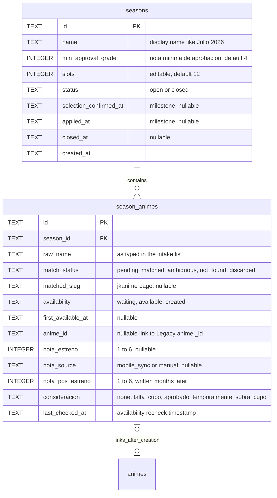
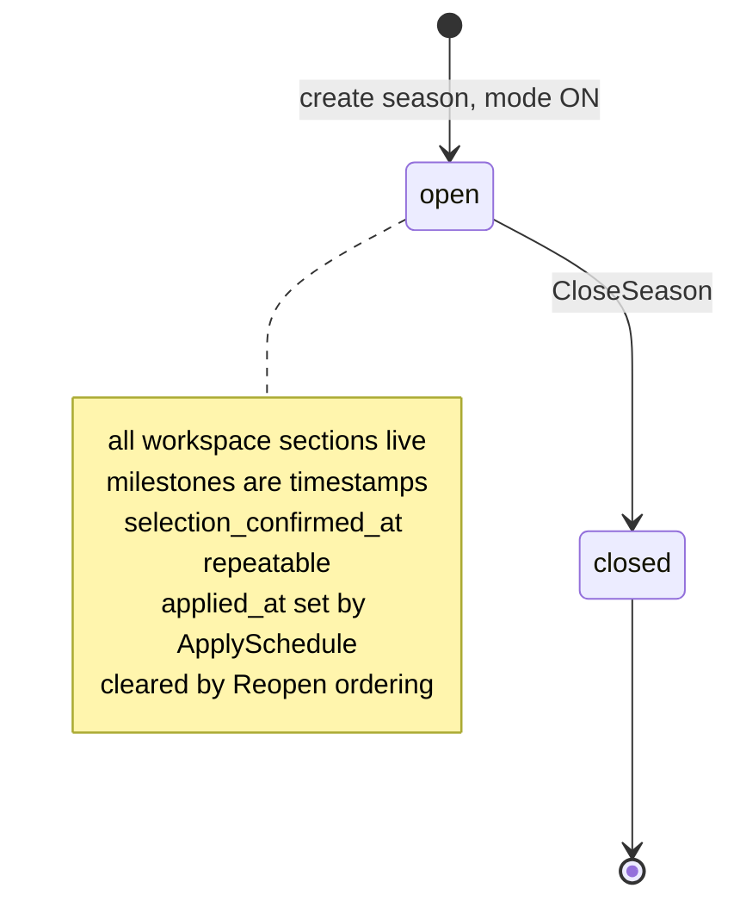
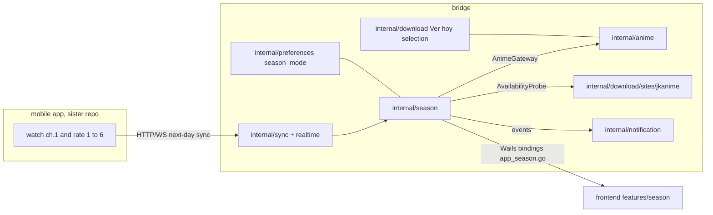
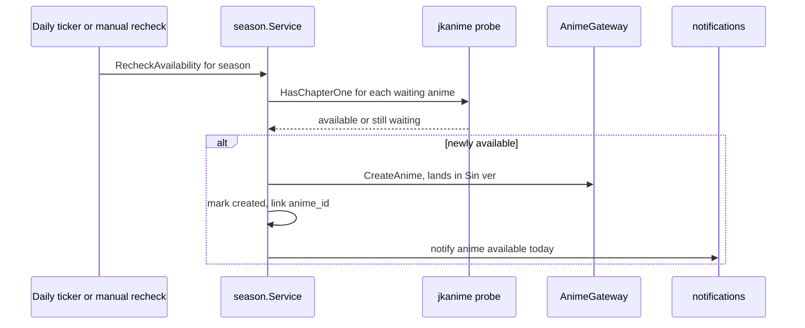

# Design — Season Selection Workflow (program umbrella, SDD-39)

Program-level architecture. Each child SDD refines its own slice against this
document; if a slice's design contradicts this umbrella, update the umbrella
explicitly (recorded drift), never silently.

## 1. Architecture

### 1.1 New bounded context: `internal/season`

Hexagonal, mirroring the existing contexts (`download`, `sync`, `anime`):

```
internal/season/
├── domain/          # Season aggregate, SeasonAnime record, phase FSM,
│                    # decision derivation (pure), consideración enum
├── service.go       # application service (use cases per phase)
├── ports.go         # Repository, NameMatcher, AvailabilityProbe, Clock,
│                    # AnimeGateway, Notifier
├── sqlite_store.go  # Repository adapter (schema-registry registered)
└── match/           # similarity matcher (pure, fixture-tested)
```

Adapters live at the edges: jkanime probe reuses `internal/download/sites`
(anti-corruption layer already in place); anime creation/day-order writes go
through a narrow `AnimeGateway` port implemented by `internal/anime`'s service
— season NEVER touches `animes.dat`/SQLite anime rows directly.

### 1.2 Data model (SQLite, via SDD-34 schema registry)



Key decision — **the Aprobado/Reprobado verdict is NEVER stored**. It is a pure
derivation (Excel-formula parity) computed in the domain at read time:

```go
// Decision replicates the 10-year Excel rule verbatim.
// minApprovalGrade is the Excel formula's ">=4" — UI: "Nota mínima de aprobación".
func Decision(nota, minApprovalGrade int, c Consideracion) Verdict {
    if nota >= minApprovalGrade && c != FaltaCupo { return Aprobado }
    if c == AprobadoTemporalmente || c == SobraCupo { return Aprobado }
    return Reprobado
}
```

Changing the minimum approval grade re-derives the whole table instantly,
exactly like Excel. Stored facts: nota, min_approval_grade, consideración.
Derived: verdict. (CQS — commands record facts, queries compute.)

Note: `nota_pos_estreno` is a **dormant column** in this program — the season
window (2 weeks) ends long before an anime's 3-month run, so post-season
grading is physically impossible inside the workflow (user decision). The
column keeps the registry shape Excel-parity; a future post-season review
feature adds capture. No service method, no UI here.

### 1.3 Lifecycle + milestones (workspace model — replaced the phase FSM)

The original phase FSM (intake→evaluating→…, guarded, backward-steppable) was
rejected at review, for the right reason: in an append-only soft-delete world
"going back a phase" is fiction — created animes can't be uncreated, grades
can't be ungiven. And the sections aren't sequential in practice: the daily
board is used every day; evaluation is mobile's sibling; selection doesn't
care about grading completeness until the deck is confirmed. Only APPLYING
the schedule and CLOSING the season fundamentally affect normal mode.



- **States**: `open → closed` only; one open season at a time (partial unique
  index); `closed` is terminal.
- **Milestones** (timestamps on `seasons`, set by repeatable actions):
  `selection_confirmed_at` (ConfirmSelection — a bidirectional reconciler),
  `applied_at` (ApplySchedule; while set, ordering renders read-only;
  "Reopen ordering" clears it), `closed_at`.
- **Warnings, not gates**: completeness checks (unresolved matches, ungraded
  animes) surface in confirmation dialogs and Overview progress cards; the
  user is the authority. One HARD rule only: `approved > slots` blocks
  ConfirmSelection (no wildcard animes beyond the deck; slots editable,
  default 12).
- The daily availability job runs while season mode is ON and a season is
  open — no phase gating.

### 1.4 Integration map



- **Rating ingestion**: sync delivers mobile grades → season service records
  `nota_estreno` with `nota_source=mobile_sync`. Bridge's manual editor sets
  `nota_source=manual`. Mobile wins on conflict only if the manual cell is
  empty (facts are append-cautious; conflicts surface as a notification).
- **Daily availability job**: a season-owned ticker (same pattern as the
  download scheduler seam, injected `Clock`), active only in `evaluating`.
  Idempotent; a manual "Re-check now" button triggers the same use case.
- **Creation**: probe says ch.1 exists → `AnimeGateway.Create` (normal anime
  creation: goes to "Sin ver", `primeravez` semantics preserved) and the
  season row links `anime_id`. From here the anime lives its NORMAL life;
  the season registry only observes.



### 1.5 Post-exploration reality check (verified 2026-07-05)

Code exploration confirmed the seams and surfaced three facts the slices
absorb (detail in `slices/`):

- **No anime-creation path exists in bridge today** (`POST /api/animes` is
  explicitly rejected, `router.go:153-156`). But the write seam is ready:
  `WriteService.PatchAnime` supports a legitimate create when the record
  doesn't exist, and the single-writer `UpdateWriter` queue appends directly
  to `animes.dat` with self-echo suppression + snapshot + changelog + the
  already-defined `anime_created` realtime type. SDD-43 builds `CreateAnime`
  as a thin explicit use case over this machinery.
- **jkanime search-by-name does not exist** — `sites.EpisodeSource` only
  operates on a known `pageURL` (the Legacy `pagina` field; nothing populates
  it automatically). SDD-42 adds a season-owned `NameSearcher` port with a new
  search adapter inside the existing `sites/jkanime` anti-corruption package.
- **Day/order application needs zero new persistence**: `AnimePatch.Dias`
  (whole-array replace, day+order together) is writable today through the
  standard OCC-gated seam — SDD-46's apply step is a diff + N patches.

Also verified reusable as-is: `schedule.Scheduler` (injected clock, run guard,
`TriggerNow`) for the daily job; `notification.Notifier` fan-out (one call →
HeroUI toast + Windows toast, zero frontend wiring); the preferences pattern
end-to-end (KV store → nil-safe facade → `*-source.ts` → Zustand store) as the
template for `internal/season`; the SDD-34 schema registry (`SchemaTables()` +
one append in `initializeBridgeDB`).

## 2. Design patterns (and why each earns its place)

| Pattern | Where | Why |
|---|---|---|
| Aggregate root | `Season` owns `season_animes` rows | one consistency boundary for phase guards & quota |
| Lifecycle + milestone timestamps | `domain/season.go` | weeks-long resumable process without fictional backward transitions; facts accumulate, milestones mark the two writes that matter (apply, close) |
| Pure derivation (CQS) | `Decision()` | Excel parity; minimum-grade edits recompute everything; no stored verdict to drift |
| Ports & adapters | `ports.go` | season testable with fakes; jkanime/anime/sync swappable |
| Strategy | `NameMatcher` / `AvailabilityProbe` | jkanime today, MAL enrichment later without domain change |
| Anti-corruption layer | `sites/jkanime` (existing) | scraping fragility stays quarantined |
| Domain events → observer | availability transitions | notifications/toasts without coupling season→UI |
| Facade (nil-safe bindings) | `app_season.go` | same convention as `app_preferences.go` |
| Repository | `sqlite_store.go` | schema-registry compliance, soft-delete invariant |
| Human-in-the-loop | match resolution UI | similarity is assistive, never authoritative |

Explicitly rejected: storing verdicts (drift risk), event sourcing (overkill —
the registry IS the audit), background workflow engine (a ticker + FSM covers it).

## 3. UI/UX design (bridge design system — autoreas-theme)

### 3.1 Navigation & information architecture

New feature `frontend/src/features/season/` (scaffolded via
`generate:feature`), route `/season`. The page is the **Season Workspace**:
all sections live side-by-side while the season is open (no wizard, no
stepper — sections aren't states). It always answers *"where am I and what
should I do today?"* — critical for a process spanning weeks of restarts.

- **Overview section** (landing): lifecycle chip · data-derived progress
  cards ("21/24 matched · 14 created · 11/14 graded · not applied"), each
  deep-linking to its section · season config (daily check time editable
  here; nota mínima + slots shown read-only — edited on the Selection board
  where they act) · milestone timeline.
- **Section tabs** (`Tabs`, free navigation): Intake & Matching · Daily
  Board · Evaluation · Selection · Ordering — populated by SDD-42…46.
- Grading itself ALSO lives outside the workspace: a rate action on the
  anime card in Chapters (SDD-44) — capture at the point of context, the
  workspace section is progress/audit.

### 3.2 Per-phase screens (HeroUI v3 mapping)

| Screen | Composition | Key components |
|---|---|---|
| Intake | paste textarea → parsed preview → import | `Input`/textarea, `Card`, `Button variant="primary"` |
| Match resolution | one row per raw name, confidence chip, candidate picker | `Table`, `Chip` (matched→`success`, ambiguous→`warning`, not found→`danger`), `Select`+`ListBox` for candidates, discard = `Button variant="tertiary"` danger-tinted on hover |
| Availability board | groups by actionability, most actionable first | `Card` sections; `Chip` status; `Button primary` "Re-check now"; last-check timestamp `Typography color="muted"` |
| Evaluation (rate-in-context) | rate button on the Chapters anime card → 1–6 modal (mirrors mobile's gesture); workspace section = progress/audit list with the SAME modal | `Dialog` + `ToggleButtonGroup` (radiogroup a11y); grade `Chip` on cards; "No grade" `warning` chips + source badges (mobile/manual) in the audit list; live via `season_changed` |
| Selection board | Excel replacement with live derivation (table justified vs alternatives in slice doc) | sticky decision-header `Card`: "Nota mínima de aprobación" stepper + slots stepper + quota meter chip; HeroUI `Table` (`table-fixed`, cover micro-thumbs); verdict `Chip` derived-styled, flips in place; consideración `Select` |
| Ordering board | left rail = APPROVED season animes awaiting placement only (user-refined); weekday animes appear in their previous position per day; NO per-day capacity limit (3/day is only the historical average) | `Card` columns with neutral count chips; React Aria dnd + guaranteed `⋯` menu fallback; draft overlay with origin chips ("Visto → Jueves 2"); `Button primary` "Apply schedule" → per-anime diff `Dialog` |
| Close | checklist + mode-off suggestion | `Alert status="success"`, `Button primary` "Turn season mode off" |

### 3.3 UX patterns applied (2026 practice, grounded)

- **Status chips with progression, not binary red/green** (evolves the user's
  notepad sketch): `Not found` → `Waiting ch.1 (day N)` → `Available today` →
  `Created · Sin ver` → `Graded (5)`. Grouped by actionability, actionable
  first. Timestamped last check = trust in automation.
- **Direct manipulation with live derivation** (selection board): editing the
  minimum grade or a consideración recomputes verdicts in-place — the Excel feel,
  preserved. No "recalculate" button.
- **Derived state is visually distinct from facts**: verdict chips render
  soft/derived styling; grades and consideraciones look editable.
- **Progressive commitment**: every phase transition is an explicit, guarded,
  reversible-one-step action with a confirmation dialog summarizing effects
  (especially `Apply schedule`, which writes `dia`+`orden` to real animes).
- **Accessibility for the dnd board**: React Aria dnd keeps keyboard support;
  fallback "move to day…" menu on each card guarantees non-pointer parity.
- **Color = role, never Legacy hue** (standing rule): success/warning/danger/
  accent tokens only; day badges reuse the existing chapters convention.
- **English UI copy; Spanish data literals** ("Sin ver", "Ver hoy", "Visto",
  "No me gusto") rendered as data, not translated.

### 3.4 Frontend architecture constraints (enforced, repo-standard)

Dumb `.tsx` + `use-*.ts` hooks (strict anatomy) + JSDoc'd pure helpers +
readonly props + colocated `__tests__/` (TDD-first) + 400/500 line policy.
Derivation logic (`Decision`, grouping, capacity) lives in `*.helpers.ts` as
pure functions — unit-tested before any component exists.

## 4. New harnesses & test infrastructure

| Harness | For | Slice |
|---|---|---|
| Fake `Clock`/ticker seam for the daily job | deterministic availability tests | SDD-43 |
| jkanime search + chapter-1 golden HTML fixtures | probe & matcher without network | SDD-42/43 |
| Similarity golden corpus from REAL past intake lists (Excel sheets) | matcher precision/recall regression | SDD-42 |
| Sync contract tests (rating ingestion payloads) | mobile↔bridge grade flow | SDD-44 |
| React Aria dnd interaction tests in jsdom (spike; virtual-press knowledge already in autoreas-theme) | ordering board | SDD-46 |
| Schema-registry migration tests for `seasons`/`season_animes` | persistence | SDD-41 |
| Nil-safe Wails binding tests (`app_season.go`) | bindings convention | SDD-41 |

All under strict TDD (`go test ./...`, `bun --cwd="frontend" run test`),
existing lefthook gate unchanged.

## 5. Cross-slice conventions

- Every slice updates the `autoreas-theme` skill when it establishes a new UI
  convention (living document mandate).
- Every new table/column goes through the SDD-34 persistence schema registry.
- Engram topic keys: `sdd/season-selection-program/*` (umbrella) and
  `sdd/{child-change}/*` (slices), hybrid mode.
- The umbrella is the contract: child SDDs cite the section they implement.
