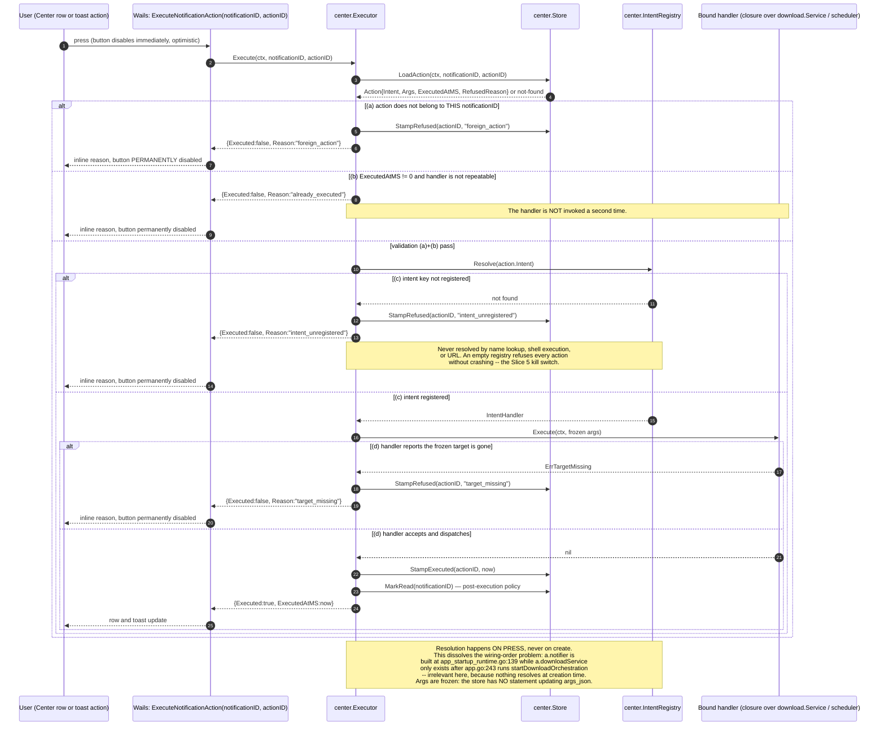
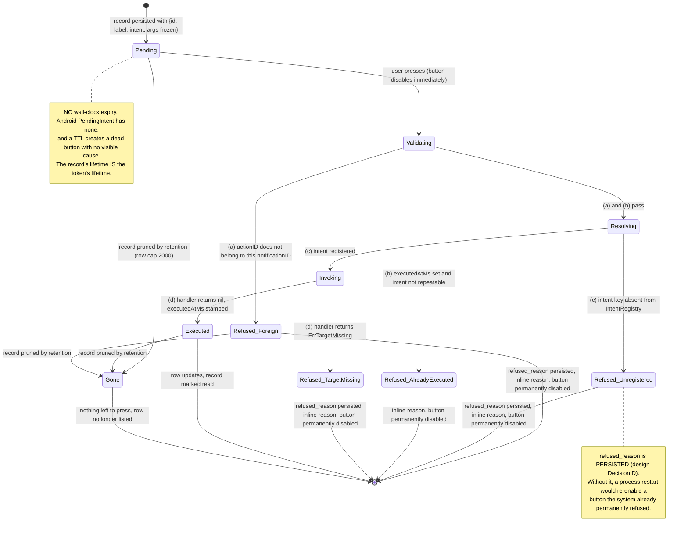

# Design: Notification Center (SDD-60)

Change: `2026-08-23-sdd-60-notification-center`
Inputs: `explore.md` (Engram `sdd/notification-center/explore`, #8598), `proposal.md` (#8600),
`specs/notification-center/spec.md`, `specs/notification-actions/spec.md`,
`specs/notifications/notifications.md`, `specs/desktop-navigation/spec.md` (#8601).
Design canvas (8 artboards — flow, lifecycle, toast projection, Center screen, block component,
PendingIntent model, component diagram, sequence diagrams):
https://claude.ai/code/artifact/f46742c0-28ac-4ecb-a2a3-f86dbca2de5f
Delivery: `delivery_strategy=auto-chain`, `review_budget_lines=800`, `strict_tdd: true`.

> **Deliberate override of the `sdd-design` 800-word size budget.** The user's standing instruction
> for this change is verbatim: *"diagramas, apuntes, artifact, todo debe ser guardado en los
> documentos con la mayor definición posible, nada de descripciones escuetas en texto plano."*
> `openspec/config.yaml` `rules.design` independently requires *"Include sequence diagrams for
> complex flows"* and *"Document architecture decisions with rationale."* Complete mermaid sources,
> complete DDL, and complete Go signatures win over the generic brevity default — the same override
> `proposal.md` recorded in its own banner.

---

## 1. Technical Approach

`center.Service` is a **decorator** over the already-shipped `*notification.Dispatcher`. It implements
the same `notification.Notifier` port (`internal/notification/notifier.go:37-51`), persists each
`Notification` into SQLite, and then **unconditionally** delegates. Nothing about the existing port,
its four adapter files, or any of the six producer call sites changes; only the concrete value behind
`a.notifier` does.

Three structural forces shape everything below, and each was proven against live code rather than
assumed:

1. **`center` may never import `internal/download`.** `internal/download` and `internal/anime`
   already import `internal/notification`, so `center → download` recreates
   `notification → download → notification`. Action handlers are therefore injected *inward* from the
   composition root, never imported outward.
2. **The schema descriptors may never live in `center`.** `center`'s own tests need a bootstrapped
   SQLite DB, i.e. `internal/sync`; `internal/sync` needs the descriptors. A leaf package
   `internal/notification/centerschema` importing only `internal/persistence` breaks that cycle —
   the identical fix documented at `internal/download/dbschema/schema.go:1-6`.
3. **The notifier exists before the download service does.** `a.notifier` is built at
   `app_startup_runtime.go:139`; `a.downloadService` is only assigned inside
   `startDownloadOrchestration`, called at `app.go:243`. Nothing an action needs can be resolved at
   notification-*creation* time — which is precisely why the PendingIntent model resolves **on press**
   and why action execution lives on a separate, later-constructed `center.Executor` rather than on
   the notifier decorator.

---

## 2. Component And Import Diagram

```mermaid
graph TD
    subgraph Producers["Existing producers — call sites UNCHANGED"]
        DL["internal/download<br/>service.go:377-398<br/>service_single_anime.go:36-55<br/>service_effects.go:74"]
        SA["app_season_availability.go:324-353"]
        ST["app_startup_runtime.go:87,95,223"]
        AN["internal/anime/write_service.go:56<br/>(Notifier field wired, no call site)"]
    end

    subgraph Port["internal/notification — port + fan-out (UNCHANGED, imports only internal/logger)"]
        PORT(["notification.Notifier<br/>notifier.go:50-51"])
        DISP["notification.Dispatcher<br/>dispatcher.go:20-53<br/>errors.Join, nil-adapter skip"]
        UI["UIToastAdapter<br/>emits Wails 'notification.push'"]
        WIN["DesktopToastAdapter<br/>//go:build windows, Title+Body only"]
        LOGF["log_forward.go"]
    end

    subgraph Center["internal/notification/center — NEW child package"]
        SVC["center.Service<br/>implements notification.Notifier<br/>persist THEN ALWAYS delegate"]
        WRAP(["Wrap(inner, store)<br/>pass-through when store==nil<br/>or inner==nil"])
        STORE["center.Store (SQLite)<br/>insert + prune + keyset reads<br/>+ read/archive lifecycle"]
        EXEC["center.Executor<br/>press-time validation<br/>closed 4-reason refusal set"]
        REG(["center.IntentRegistry<br/>interface DECLARED here"])
        SREG["center.StaticRegistry<br/>default map impl"]
    end

    subgraph Schema["internal/notification/centerschema — NEW leaf package"]
        SCH["SchemaTables() []persistence.TableSchema<br/>notification_records<br/>notification_record_actions"]
    end

    ROOT["Composition root<br/>app_notification_center.go (NEW)<br/>+ app_startup_runtime.go:139"]
    SYNCBOOT["internal/sync/sqlite_bootstrap.go:156-164<br/>tables = append(tables, centerschema.SchemaTables()...)"]
    PERS["internal/persistence<br/>EnsureTableSchema"]
    DS["download.Service.RunAnime<br/>service.go:231"]
    SCHED["schedule.ResolveMissedStartupDate<br/>via app_download.go:293-306"]

    subgraph FE["Frontend"]
        ROUTE["app/routes/NotificationsRoute.tsx"]
        PANEL["features/notifications/ui/NotificationCenterPanel"]
        TOASTS["features/notifications/ui/NotificationToasts<br/>app-owned ToastQueue&lt;AppToastPayload&gt;"]
        BADGE["features/navigation/NotificationsNavBadge"]
    end

    DL -->|Notify ctx, n| PORT
    SA -->|Notify ctx, n| PORT
    ST -->|Notify ctx, n| PORT
    AN -.->|wired, no call site yet| PORT

    PORT -.implemented by.-> DISP
    PORT -.implemented by.-> SVC

    ROOT -->|builds| WRAP
    WRAP -->|returns| SVC
    SVC -->|"(1) persist"| STORE
    SVC -->|"(2) ALWAYS delegate"| DISP
    DISP --> UI
    DISP --> WIN
    DISP --> LOGF

    STORE --> SCH
    SCH --> PERS
    SYNCBOOT --> SCH

    EXEC --> STORE
    EXEC --> REG
    SREG -.implements.-> REG
    ROOT -->|"registers download.run_anime,<br/>schedule.run_missed_now,<br/>schedule.ignore_missed"| SREG
    ROOT -->|constructs AFTER app.go:243| EXEC
    SREG -.->|bound handler closes over| DS
    SREG -.->|bound handler closes over| SCHED

    ROOT -->|Wails bindings| ROUTE
    ROUTE --> PANEL
    UI -->|notification.push| TOASTS
    ROOT --> BADGE

    DL -. "FORBIDDEN: center → download.<br/>Import cycle, empirically proven.<br/>Handlers are injected inward instead." .-> SVC
```



---

## 3. Architecture Decisions

Decisions inherited from `proposal.md` (D-1 package naming, D-2 both bugs in scope, D-3 retention
2000/50, D-4 no-clock PendingIntent) are **not reopened**. What follows specifies the mechanism and
records the decisions this phase actually owns.

### Decision A: Immutable presentation payload as JSON, mutable action state as a table

| Option | Tradeoff | Verdict |
|---|---|---|
| Everything in child tables (`_rows`, `_actions`) | Fully queryable, but SQLite `ON DELETE CASCADE` **would not fire** — `applyBridgePragmas` (`internal/sync/sqlite_bootstrap.go:246-268`) sets only `journal_mode=WAL` and `busy_timeout`; `foreign_keys` is OFF, so retention pruning would silently orphan every child row | Rejected as written |
| Everything as JSON on the record | One DELETE prunes cleanly, but stamping `executed_at_ms` on a single action becomes a read-modify-write of the whole blob — a race, and `foreign_action` validation would mean parsing JSON to answer "does this actionID belong to this record" | Rejected |
| **Split by mutability (chosen)** | `rows_json TEXT` on the record for the detail block (written once, never mutated, never queried per-row); `notification_record_actions` as a real table because actions are addressed by id and mutated on press | **Chosen** |

**Rationale.** The split follows the data's actual lifecycle, and it matches shipped precedent in both
directions: `download_runs.manual_links_json` and `runtime_events.metadata_json` are exactly this kind
of write-once nested payload, while every mutable per-entity state in this codebase lives in columns.
It also reduces the cascade problem to exactly one extra `DELETE` inside the prune transaction, which
the design states explicitly instead of relying on a foreign key that this database has switched off.

### Decision B: Action execution lives on `center.Executor`, not on the notifier decorator

**Choice.** `Wrap(inner, store)` builds only the persisting `Notifier`. A separate
`center.NewExecutor(store, registry)` owns press-time validation and is constructed at the composition
root **after** the subsystems whose intents it registers.

**Alternatives considered.** Hang the registry on `center.Service` and let the same object both
persist and execute.

**Rationale.** `a.notifier` is built at `app_startup_runtime.go:139`; `a.downloadService` does not
exist until `app.go:243`. A single object would need a late `SetRegistry` mutator — an initialization
order dependency invisible at the type level and trivially forgotten. Two objects with two
construction points make the ordering a compile-time fact rather than a convention. It also keeps
`Wrap`'s pass-through identity contract (spec: `Wrap(inner, nil) == inner`) uncomplicated by a
registry parameter that has no meaning at that point in startup.

### Decision C: Intents are registered conditionally on their subsystem being live

**Choice.** `app_notification_center.go` registers `download.run_anime` only when
`a.downloadService != nil`, and `schedule.run_missed_now` / `schedule.ignore_missed` only when
`a.downloadScheduler != nil`. Consequently `IntentHandler.Execute` may return **only** `nil` or an
error satisfying `errors.Is(err, center.ErrTargetMissing)`.

**Alternatives considered.** Register unconditionally and let the handler return "subsystem
unavailable" at press time.

**Rationale.** The `notification-actions` spec fixes a **closed** four-reason refusal set
(`intent_unregistered | target_missing | already_executed | foreign_action`) and requires that *"no
other value MUST ever be produced."* An unwired subsystem is a fifth failure mode that does not fit
that set — unless registration itself is conditional, in which case an unwired subsystem surfaces
naturally as `intent_unregistered`, which is already a designed, tested state and already doubles as
the Slice 5 kill switch. As a defence in depth, the `Executor` maps any unrecognised handler error to
`target_missing` with the message attached, so the closed set cannot leak even if a future handler
misbehaves; a test pins that mapping.

### Decision D: `refused_reason` is persisted, not derived at render time

**Choice.** `notification_record_actions.refused_reason TEXT` stores the refusal, stamped when the
`Executor` refuses.

**Rationale.** The spec requires that a refused action *"render its reason inline and MUST permanently
disable its button (it is never retryable by pressing again)."* **Permanently** cannot survive a
process restart if the refusal lives only in React state — a reload would re-enable a button the
system already answered. Persisting it is the only mechanism that makes "permanently" true, and it
costs one nullable column.

### Decision E: `AppNotification.persistedId` is split into `dedupeKey` and `recordId`

**Choice.** Rename the existing `persistedId` to `dedupeKey` (its actual current meaning) and add a
separate `recordId?: number` carrying the persisted Center record id.

**Rationale — verified, not assumed.** `persistedId` is used at `NotificationToasts.tsx:27` purely as
a ledger key for deduplication and `toast.close`. The only values ever passed to it today are the
**client-side literals** `MISSED_DECISION_TOAST_ID = 'missed-schedule-decision'` and
`MISSED_FAILURE_TOAST_ID = 'missed-schedule-failure'` (`notification-resolver.constants.ts:14,17`).
Bug A would start feeding a backend record identifier into that same field, giving one field two
incompatible meanings: a "View details" affordance would try to open `'missed-schedule-decision'` as
a Center record, and backend records would be deduped by a key that is no longer a dedupe key. Two
fields, two meanings, no overload.

### Decision F (D-2 resolved): the toast renders **every** action via an app-owned queue

**Choice.** Replace the module-level `toast.*` singleton inside the notifications module with an
app-owned `ToastQueue<AppToastPayload>` passed to the already-mounted `ToastProvider`
(`NotificationToasts.tsx:41`), and render toasts through the provider's children render function so
that `actions.map(...)` emits one `ToastActionButton` per action.

**Verified API facts** (read from the installed `@heroui/react` 3.2.4, not from documentation):

| Fact | Evidence |
|---|---|
| `ToastContentValue.actionProps?: ButtonProps` — **singular** | `dist/components/toast/toast-queue.d.ts:30` |
| `HeroUIToastOptions.actionProps?: ButtonProps` — **singular** | `toast-queue.d.ts:37` |
| The module singleton writes to `toastQueue: ToastQueue<ToastContentValue>` — payload type is fixed | `toast-queue.d.ts:47-55` |
| `ToastProvider<T extends object>` accepts `children?: ToastRegionPrimitiveProps<T>["children"]` (a render function) | `toast.d.ts:56-57` |
| `ToastProvider` accepts `queue?: ToastQueue<T>` | `toast.d.ts:65` |
| `ToastActionButton` is an exported plain component over `Button` | `toast.d.ts:51-54, 73` |
| `ToastQueue<T extends object>` with `add(content: T, options?): string` and `close(key: string)` | `toast-queue.d.ts:12-24` |

**Alternatives considered, and why each was rejected.**

| Alternative | Verdict |
|---|---|
| Put `actions[1..n]` inside `description` (it is `ReactNode`, not `string`) | Rejected. `ToastDescription` wraps react-aria-components `Text`, which is the `aria-describedby` target. Interactive buttons inside a described-by region are announced as flat text and focus-trapped awkwardly — a correctness regression traded for convenience. |
| A **"+N more" affordance opening the matching Center row** (the proposal's stated fallback) | **Rejected as structurally impossible for the case Bug B is about.** `use-missed-schedule-resolver.ts` pushes the two actions that are being dropped in production today — "Run now"/"Ignore" and "Open Downloads"/"Ignore this date". Those are live closures on toasts whose id is a hard-coded client literal; **no Center record exists to open**. A fallback that cannot cover the one production bug it exists to fix is not a fallback. |
| **App-owned queue + render function (chosen)** | The only mechanism in 3.2.4 that renders N buttons. Cost is bounded: `toast.*` has exactly two call sites in the notifications module — `renderAppNotificationToast` and `NotificationToasts.tsx:19`'s `toast.close`. |

**Bounded unknown, named rather than asserted.** HeroUI's `timeout: 0 === persistent` convention is a
property of its `toast()` wrapper. Going direct to `ToastQueue.add(content, options)` hands those
options to react-aria-components, whose own semantics are *omit `timeout` = persistent*. The design
therefore specifies the app-owned mapping — `persistent: true` → omit `timeout`; otherwise
`timeout: DEFAULT_TOAST_TIMEOUT_MS = 4000` — and Slice 4 opens with a **RED characterization test**
pinning both behaviours plus the four `severity → variant` mappings before the queue swap lands. This
is a spike inside Slice 4, not a Slice 4 blocker: the existing single-action path keeps working until
the characterization test is green.

### Decision G: archive closes a live toast through a Wails event, not a cross-feature import

**Choice.** Archiving emits `notification.archived` carrying the affected record ids;
`use-backend-event-resolver.ts` subscribes and calls the controller's `remove(...)`.

**Alternatives considered.** Have the Center panel call the toast controller directly.

**Rationale.** The `notifications` delta spec requires the toast module stay domain-agnostic and
introduce no feature-to-feature import, and CLAUDE.md forbids business logic in `frontend/src/app/**`.
Routing the signal back through the event bus the module *already* subscribes to satisfies both
without adding a shared mutable store.

### Decision H: `NotificationToasts.tsx` sheds its controller state into a hook

**Choice.** Move the `useRef` ledger and the `push`/`remove` callbacks out of
`NotificationToasts.tsx` into `use-app-toast-controller.ts`; the `.tsx` keeps only the provider and
its render function.

**Rationale.** CLAUDE.md frontend constraint #1: `.tsx` under `features/` is dumb UI only — no hooks,
no business logic. `NotificationToasts.tsx` currently holds `useRef` + two `useCallback`s, which is
pre-existing drift. Slice 4 rewrites this file anyway; leaving the drift in place while rewriting the
file around it would be a deliberate choice to ship it twice.

### Decision I: the producer port grows two optional fields — `internal/notification` is not untouched

**Found during `sdd-tasks`, not during design.** Slice 6 enriches the producers so the four
`"see run details"` bodies and the season comma-joined name list finally name the actual anime. But
`Notification` (verified live, `internal/notification/notifier.go:37-44`) has exactly six fields:

```go
type Notification struct {
	Title         string
	Body          string
	Level         Level
	Source        string
	CorrelationID string
	Timestamp     time.Time
}
```

There is **no way for a producer to attach detail rows or actions**. Slices 1–5 never hit this because
their tests construct `center.Record` / `center.Action` directly against the store and executor,
bypassing the producer path entirely. Slice 6 is the first code that travels the real path, and it
cannot.

**Choice.** Add two domain-agnostic in-package value types to `notifier.go` — `notification.DetailItem`
and `notification.ActionSpec` — plus two optional `Notification` fields carrying them. Producers
populate them; the decorator maps them onto `center.Record` rows and tokens; the existing adapters
ignore them.

**Alternatives considered, and why each was rejected.**

| Alternative | Verdict |
|---|---|
| Producers call a `center`-specific API instead of the port | Rejected. Breaks the "no producer call site changes" property that makes this whole change additive, and puts `center` types in `internal/download`'s import graph — the proven cycle. |
| `center` derives rows itself by reading the download store | Rejected outright. `center` importing `internal/download` is the exact `import cycle not allowed` this design exists to avoid. |
| Carry rows as a `map[string]any` blob on the existing struct | Rejected. Untyped, unvalidatable, and it moves the vocabulary problem into a stringly-typed bag — precisely what the closed block vocabulary was chosen to prevent. |
| **Two typed optional fields (chosen)** | Keeps the port domain-agnostic (`DetailItem`/`ActionSpec` name no feature, honouring `notifier.go:34-36`'s stated rule), adds **no new import** to `internal/notification`, and leaves every adapter and every existing producer call site compiling unchanged. |

**Consequences that must not be lost.**

1. The repeated claim that `internal/notification` is "unchanged" is **corrected**: its four adapter
   files are untouched, `notifier.go` is not. `proposal.md` §7's Affected Areas row now says so.
2. The spec requirement is still satisfied and was always the right one to write: it constrains
   `internal/notification` from gaining a **new import**, not from ever changing. It still imports
   only `internal/logger`.
3. **Frontend DTO obligation.** `frontend/src/shared/contracts/notification.types.ts` mirrors this
   struct 1:1 and its own JSDoc commits to that ("mirrors `internal/notification.Notification`").
   `ui_toast.go:39` emits the whole struct over `notification.push`, so the payload grows the moment
   the fields exist. The mirror must be updated in the same slice, with both new fields `readonly` and
   optional.
4. **No external announcement is required, and that was verified rather than assumed.**
   `notification.push` is a Wails runtime event consumed only by this frontend — the only references
   in the tree are `ui_toast.go:9`, `notification-source.constants.ts:4`,
   `use-backend-event-resolver.ts`, and the DTO itself. It is not REST or WebSocket surface, so
   `docs/openapi.yaml` and the mobile sync contract stay untouched, consistent with risk R-7.

**Slice 6 is last in the chain**, so if a later phase prefers a different resolution there is runway
to change it without disturbing slices 1–5.

---

## 4. Data Model — Complete DDL

`internal/notification/centerschema/schema.go`, mirroring `internal/observability/eventlog/schema.go`
in shape and `internal/download/dbschema/schema.go:1-6` in package rationale. Both tables are
**create-only**: no `ColumnAdds`, no `Migrate`, no version stamp — born at their current shape, exactly
like `runtime_events`.

```sql
CREATE TABLE IF NOT EXISTS notification_records (
    id             INTEGER PRIMARY KEY AUTOINCREMENT,
    created_at_ms  INTEGER NOT NULL,
    title          TEXT    NOT NULL,
    body           TEXT    NOT NULL,
    level          TEXT    NOT NULL,
    source         TEXT    NOT NULL,
    correlation_id TEXT,
    read_at_ms     INTEGER,
    archived_at_ms INTEGER,
    rows_json      TEXT
);

CREATE TABLE IF NOT EXISTS notification_record_actions (
    id              TEXT    PRIMARY KEY,
    notification_id INTEGER NOT NULL,
    row_ref         TEXT,
    ordinal         INTEGER NOT NULL,
    label           TEXT    NOT NULL,
    intent          TEXT    NOT NULL,
    args_json       TEXT    NOT NULL,
    executed_at_ms  INTEGER,
    refused_reason  TEXT
);

CREATE INDEX IF NOT EXISTS idx_notification_records_time
    ON notification_records(created_at_ms DESC, id DESC);

CREATE INDEX IF NOT EXISTS idx_notification_records_active
    ON notification_records(archived_at_ms, created_at_ms DESC, id DESC);

CREATE INDEX IF NOT EXISTS idx_notification_records_unread
    ON notification_records(created_at_ms DESC, id DESC)
    WHERE read_at_ms IS NULL;

CREATE INDEX IF NOT EXISTS idx_notification_record_actions_notification
    ON notification_record_actions(notification_id, ordinal);
```

**Column notes, each load-bearing:**

- `id INTEGER PRIMARY KEY AUTOINCREMENT` — matches `runtime_events` exactly. The keyset cursor and the
  whole prune template depend on a monotonic integer tiebreaker (`ORDER BY created_at_ms DESC, id DESC`).
- `created_at_ms` — `Notification.Timestamp.UnixMilli()`, **falling back to the store clock when the
  producer left `Timestamp` zero**. Not every producer sets it; a zero timestamp would sort every such
  record to the bottom forever and break keyset ordering.
- `read_at_ms` / `archived_at_ms` are nullable timestamps rather than booleans, so "when was this read"
  is answerable and `restore` is a single `SET archived_at_ms = NULL`.
- `rows_json` holds the detail block (Decision A). NULL for the six kinds that carry no block:
  `run_started`, `missed_schedule`, `device.paired`, `device.sync_health_warning`,
  `anime.operation_failed`, `system.notification_delivery_degraded`.
- `notification_record_actions.id TEXT` — an opaque token id, stable across the Center row, the toast
  carrier, and the round trip back through `ExecuteNotificationAction`.
- `args_json TEXT NOT NULL` — the frozen args. **The freeze is structural: the store exposes no
  statement that ever `UPDATE`s `args_json`.** A mutation test asserts that, because Go maps returned
  from a read are mutable by reference and "immutable" would otherwise be a claim rather than a fact.
- `refused_reason` — Decision D.

**Index justification, one line each** (three indexes on a 2000-row cap is deliberate, not reflexive):
`_time` serves the default newest-first scan; `_active` serves the active/archived split that every
default list query filters on; `_unread` is **partial** (`WHERE read_at_ms IS NULL`) so the nav badge's
`COUNT(*)` reads an index containing only unread rows.

**Retention prune** — inside the insert transaction, cadence copied verbatim from
`internal/observability/eventlog/store.go:50-74`. Two statements, actions first so the parent rows are
still selectable, because `PRAGMA foreign_keys` is OFF in this database (Decision A):

```sql
-- 1. orphan-proof: delete the doomed records' actions while those records still exist
DELETE FROM notification_record_actions
WHERE notification_id IN (
    SELECT id FROM notification_records
    ORDER BY created_at_ms DESC, id DESC
    LIMIT -1 OFFSET ?      -- ? = rowCap (2000)
);

-- 2. then the records themselves
DELETE FROM notification_records
WHERE id IN (
    SELECT id FROM notification_records
    ORDER BY created_at_ms DESC, id DESC
    LIMIT -1 OFFSET ?      -- ? = rowCap (2000)
);
```

Cadence: `successful++`; prune when `successful == 1` (first write of every process, unconditionally)
or `successful % pruneEvery == 0`, with `rowCap = 2000`, `pruneEvery = 50`.

---

## 5. Go Interfaces And Structs — Complete Signatures

### 5.1 `internal/notification/centerschema/schema.go`

```go
// Package centerschema declares the TableSchema descriptors for all
// notification-center-owned bridge tables. It is a separate leaf sub-package of
// internal/notification so that internal/sync can import it without a cycle:
// internal/notification/center's in-package test files need a bootstrapped SQLite
// database (i.e. internal/sync), which would create sync→center→sync if the schemas
// lived in package center. centerschema imports only persistence and has no
// dependency on sync, center, or the parent notification package, making the
// dependency direction acyclic. Mirrors internal/download/dbschema/schema.go:1-6.
package centerschema

import "autoreas-bridge/internal/persistence"

// SchemaTables returns the notification-center-owned bridge table descriptors:
// notification_records and notification_record_actions. Both are create-only.
func SchemaTables() []persistence.TableSchema
```

### 5.2 `internal/notification/center/types.go`

```go
package center

// Level mirrors notification.Level as a stored string.
type Level = string

// EntityRef is a row's reference to the entity it concerns. A row NEVER embeds
// image bytes; cover art resolves at render time via the existing GetAnimeCover
// binding (app_runtime.go:206).
type EntityRef struct {
    Type string `json:"type"` // "anime" | "episode" | "link"
    ID   string `json:"id"`
}

// DetailRow is one row of the single bounded row-list block: cover+name (which
// one), a status word (what happened), the specific detail (which episodes or
// hoster), and the ids of its per-row actions (what to do next).
type DetailRow struct {
    Ref           EntityRef `json:"ref"`
    Name          string    `json:"name"`
    Status        string    `json:"status"`
    Detail        string    `json:"detail"`
    ActionIDs     []string  `json:"actionIds,omitempty"`
    CollapsedCount int      `json:"collapsedCount,omitempty"` // >0 renders "N other anime finished without incident"
}

// RefusalReason is the CLOSED set of press-time refusals. No other value is ever
// produced (notification-actions spec, "A refusal is always one of exactly four reasons").
type RefusalReason string

const (
    RefusalNone               RefusalReason = ""
    RefusalIntentUnregistered RefusalReason = "intent_unregistered"
    RefusalTargetMissing      RefusalReason = "target_missing"
    RefusalAlreadyExecuted    RefusalReason = "already_executed"
    RefusalForeignAction      RefusalReason = "foreign_action"
)

// Action is a persisted PendingIntent token. Args are frozen at creation: the
// store exposes no statement that updates args_json.
type Action struct {
    ID             string
    NotificationID int64
    RowRef         string
    Ordinal        int
    Label          string
    Intent         string
    Args           map[string]string
    ExecutedAtMS   int64         // 0 = never executed
    RefusedReason  RefusalReason // "" = not refused
}

// Record is one persisted notification.
type Record struct {
    ID            int64
    CreatedAtMS   int64
    Title         string
    Body          string
    Level         Level
    Source        string
    CorrelationID string
    ReadAtMS      int64 // 0 = unread
    ArchivedAtMS  int64 // 0 = active
    Rows          []DetailRow
    Actions       []Action
}

// View selects the list's archive axis.
type View string

const (
    ViewActive   View = "active"
    ViewArchived View = "archived"
)

// ListQuery is the keyset-paginated read-model request.
type ListQuery struct {
    View       View
    UnreadOnly bool
    Search     string
    Sources    []string
    Levels     []Level
    Cursor     string // opaque; empty means "first page"
    Limit      int
}

// Page is one keyset page. NextCursor is empty when no further page exists.
type Page struct {
    Items      []Record
    NextCursor string
    Limit      int
}

// StoreConfig configures retention. Zero values fall back to
// defaultRowCap = 2000 and defaultPruneEvery = 50.
type StoreConfig struct {
    RowCap     int
    PruneEvery int
}
```

### 5.3 `internal/notification/center/ports.go`

```go
package center

// ErrTargetMissing is the ONLY error an IntentHandler may return besides nil.
// It maps to RefusalTargetMissing.
var ErrTargetMissing = errors.New("notification center: intent target missing")

// IntentHandler executes one registered operation against frozen args.
//
// Execute MUST return either nil or an error satisfying errors.Is(err,
// ErrTargetMissing). A handler that can fail for any other reason MUST NOT be
// registered: register it conditionally on its subsystem being live, so an
// unwired subsystem surfaces as intent_unregistered rather than an unmodelled
// fifth refusal reason (design Decision C). The Executor defensively maps any
// unrecognised error to RefusalTargetMissing so the closed set cannot leak.
type IntentHandler interface {
    Execute(ctx context.Context, args map[string]string) error
    // Repeatable reports whether a second press may re-invoke this handler.
    // Every intent registered today returns false (single-fire default, D-4.5).
    Repeatable() bool
}

// IntentRegistry resolves an intent key to its bound handler. Declared here and
// filled by the composition root, which is what keeps center from importing
// internal/download and recreating notification→download→notification.
type IntentRegistry interface {
    Resolve(intent string) (IntentHandler, bool)
}

// Logger is the narrow logging port center needs, satisfied by internal/logger.
type Logger interface {
    Warnf(domain string, format string, args ...any)
}
```

### 5.4 `internal/notification/center/intent_registry.go`

```go
package center

// StaticRegistry is the default IntentRegistry: an explicit map filled at the
// composition root. Shape precedent: download.StaticRegistry
// (internal/download/registry.go). An empty StaticRegistry is a valid, tested
// state in which every press refuses with intent_unregistered — it is the
// Slice 5 kill switch.
type StaticRegistry struct {
    handlers map[string]IntentHandler
}

func NewStaticRegistry() *StaticRegistry
func (r *StaticRegistry) Register(intent string, handler IntentHandler)
func (r *StaticRegistry) Resolve(intent string) (IntentHandler, bool)

// Keys returns the registered intent keys, sorted. Exists so the mandated test
// "download.retry_run is absent from the registry" can assert on live state
// rather than on a source grep.
func (r *StaticRegistry) Keys() []string

// SingleFireFunc adapts a plain function to a non-repeatable IntentHandler.
func SingleFireFunc(fn func(ctx context.Context, args map[string]string) error) IntentHandler
```

### 5.5 `internal/notification/center/service.go`

```go
package center

// Service decorates a notification.Notifier with durable persistence.
type Service struct {
    inner notification.Notifier
    store *Store
    log   Logger
    now   func() time.Time
}

// Wrap returns inner unchanged when there is nothing to persist into -- a nil
// inner notifier (so the existing a.notifier == nil guards at
// app_startup_runtime.go:74,222 and app_season_availability.go:325,343 keep
// firing) or a nil store (so tests wiring a bare, unopened &sql.DB{} keep
// observing the exact notifier they injected, and app_startup_test.go:136's
// identity assertion passes unmodified).
//
// Both early returns MUST return the bare value, never a typed nil *Service:
// a (*Service)(nil) returned as a notification.Notifier is NOT == nil, which
// would silently defeat every one of those guards.
func Wrap(inner notification.Notifier, store *Store) notification.Notifier

// Notify persists the record, then ALWAYS delegates to the wrapped Notifier --
// including when the persist write failed. An early return on persist failure is
// PROHIBITED: five of the six producer families discard Notify's error via "_ =",
// so skipping projection would silently downgrade a user-visible toast and
// Windows desktop notification to nothing, invisibly. The returned error carries
// the persist failure for observability only (service_effects.go:74 is the one
// producer that logs it).
func (s *Service) Notify(ctx context.Context, n notification.Notification) error
```

### 5.6 `internal/notification/center/sqlite_store.go`

```go
package center

const (
    defaultRowCap     = 2000
    defaultPruneEvery = 50
)

type Store struct {
    db         *sql.DB
    rowCap     int
    pruneEvery int
    successful int
}

func NewStore(db *sql.DB, config StoreConfig) *Store

// InsertRecord persists one record and its actions in a single transaction,
// pruning past the row cap inside that same transaction.
func (s *Store) InsertRecord(ctx context.Context, record Record) (id int64, err error)

// pruneOldestBeyondRetention deletes the oldest records past the row cap,
// unconditionally on the first successful write of every process and thereafter
// every pruneEvery writes. Deletes the doomed records' actions FIRST, because
// PRAGMA foreign_keys is OFF in this database (applyBridgePragmas sets only
// journal_mode and busy_timeout), so ON DELETE CASCADE would not fire.
func (s *Store) pruneOldestBeyondRetention(ctx context.Context, tx *sql.Tx) error

func (s *Store) List(ctx context.Context, query ListQuery) (Page, error)
func (s *Store) Record(ctx context.Context, id int64) (Record, bool, error)
func (s *Store) UnreadCount(ctx context.Context) (int, error)

// MarkRead stamps read_at_ms only on rows where it IS NULL, so marking the same
// record read twice cannot decrement the unread count twice.
func (s *Store) MarkRead(ctx context.Context, ids []int64, atMS int64) (affected int, err error)

// Archive stamps archived_at_ms and, in the same statement set, stamps read_at_ms
// on any of those rows still unread. Restore clears archived_at_ms and
// deliberately does NOT clear read_at_ms.
func (s *Store) Archive(ctx context.Context, ids []int64, atMS int64) (affected int, err error)
func (s *Store) Restore(ctx context.Context, ids []int64) (affected int, err error)

func (s *Store) LoadAction(ctx context.Context, notificationID int64, actionID string) (Action, bool, error)
func (s *Store) StampExecuted(ctx context.Context, actionID string, atMS int64) error
func (s *Store) StampRefused(ctx context.Context, actionID string, reason RefusalReason) error
```

**Cursor encoding** — mirrors `internal/observability/eventlog/reader.go:48-71` exactly:

```go
// recordCursor is the pagination cursor, keyed on (created_at_ms, id) -- the
// only stable tiebreaker, since two notifications can share a millisecond.
type recordCursor struct {
    CreatedAtMS int64 `json:"created_at_ms"`
    ID          int64 `json:"id"`
}

func encodeRecordCursor(cursor recordCursor) string          // base64.RawURLEncoding of JSON
func decodeRecordCursor(value string) (recordCursor, error)  // rejects ID == 0
```

Keyset predicate: `(created_at_ms < ?) OR (created_at_ms = ? AND id < ?)`.

### 5.7 `internal/notification/center/executor.go`

```go
package center

// ExecuteResult is the typed outcome of a pressed action.
type ExecuteResult struct {
    Executed     bool
    Reason       RefusalReason
    Message      string
    ExecutedAtMS int64
}

// Executor resolves and runs pressed action tokens. It is constructed at the
// composition root AFTER the subsystems whose intents it registers exist
// (a.downloadService is only assigned at app.go:243, long after a.notifier is
// built at app_startup_runtime.go:139), which is why this is a separate type
// from Service rather than a field on it.
type Executor struct {
    store    *Store
    registry IntentRegistry
    now      func() time.Time
}

func NewExecutor(store *Store, registry IntentRegistry) *Executor

// Execute validates and runs one pressed action, in this fixed order:
//  (a) does actionID belong to THIS notificationID?  -> foreign_action
//  (b) has it already executed (and is not repeatable)? -> already_executed
//  (c) is intent registered in the IntentRegistry?   -> intent_unregistered
//  (d) does the bound handler accept the frozen args? -> target_missing
// An unregistered key is refused outright: never resolved by name lookup, shell
// execution, or URL. A refusal is persisted via StampRefused so the button stays
// permanently disabled across a restart.
func (e *Executor) Execute(ctx context.Context, notificationID int64, actionID string) ExecuteResult
```

> Validation order note: the spec fixes (a) → registry → handler. `already_executed` is evaluated
> immediately after (a) because it is answerable from the row already loaded for (a) and must not
> depend on the registry still holding the key — an action that already ran must report
> `already_executed`, not `intent_unregistered`, if its subsystem later went away.

### 5.8 Composition root — `app_notification_center.go` (NEW)

```go
// notificationCenterIntents registers every intent whose target subsystem is
// live. Registration is conditional on purpose (design Decision C): an unwired
// subsystem surfaces as intent_unregistered rather than an unmodelled fifth
// refusal reason. download.retry_run is deliberately absent -- it does not exist
// (internal/download/service.go exposes only RunOnce:199 and RunAnime:231).
func (a *App) registerNotificationIntents() *center.StaticRegistry

func (a *App) ListNotifications(request contracts.NotificationListRequest) contracts.NotificationPage
func (a *App) GetNotification(id int64) contracts.NotificationDetailResult
func (a *App) GetUnreadNotificationCount() int
func (a *App) MarkNotificationsRead(ids []int64) contracts.NotificationMutationResult
func (a *App) ArchiveNotifications(ids []int64) contracts.NotificationMutationResult
func (a *App) RestoreNotifications(ids []int64) contracts.NotificationMutationResult
func (a *App) ExecuteNotificationAction(notificationID int64, actionID string) contracts.NotificationActionResult
```

Registered intent keys, and the concrete operations they close over:

| Intent key | Bound to | Registered when |
|---|---|---|
| `download.run_anime` | `a.downloadService.RunAnime` (`internal/download/service.go:231`) | `a.downloadService != nil` |
| `schedule.run_missed_now` | the same scheduler call behind `RunMissedScheduleNow` (`app_download.go:293-298`) | `a.downloadScheduler != nil` |
| `schedule.ignore_missed` | the same scheduler call behind `IgnoreMissedSchedule` (`app_download.go:301-306`) | `a.downloadScheduler != nil` |
| `download.retry_run` | — | **never** |

`RunMissedScheduleNow` / `IgnoreMissedSchedule` are refactored to call the **registered handler**, so
they become carriers of the same intent rather than a rival second path (`notification-actions` spec,
"Existing Wails Bindings Become Carriers Of Registered Intents").

### 5.9 Composition root — `app_startup_runtime.go:139`

```go
a.notifier = a.newNotifier(a.emitFn, a.sharedLogger)
if a.canUseBridgeDB(ctx) {
    a.notificationCenterStore = center.NewStore(a.bridgeDB, center.StoreConfig{})
    a.notifier = center.Wrap(a.notifier, a.notificationCenterStore)
}
```

`canUseBridgeDB` (`app_startup_runtime.go:57-67`) already `recover()`s from the panic that
`app_test_helpers_test.go:30`'s bare unopened `&sql.DB{}` raises, returning `false` — so `Wrap` is
never applied in those tests and `defaultNotifier`'s signature, `app.go:50`, `app_defaults.go:104`,
and the four `newNotifier` test overrides are all untouched.

---

## 6. Sequence Diagram — Raising A Notification (persist, then ALWAYS project)

```mermaid
sequenceDiagram
    autonumber
    participant F as Feature (download / season / startup)
    participant C as center.Service
    participant S as center.Store
    participant DB as SQLite (notification_records + _actions)
    participant D as notification.Dispatcher
    participant UI as UIToastAdapter
    participant WIN as DesktopToastAdapter (Windows)
    participant FE as Frontend toast controller

    F->>C: Notify(ctx, Notification{Title, Body, Level, Source, CorrelationID, Timestamp})
    C->>C: createdAtMS = Timestamp.UnixMilli(), or now() when Timestamp is zero
    C->>S: InsertRecord(ctx, Record{...})
    S->>DB: BEGIN
    S->>DB: INSERT INTO notification_records (...)
    S->>DB: INSERT INTO notification_record_actions (...) x N
    S->>S: successful++; prune when successful==1 or successful%50==0
    alt prune fires
        S->>DB: DELETE FROM notification_record_actions WHERE notification_id IN (oldest beyond 2000)
        S->>DB: DELETE FROM notification_records WHERE id IN (oldest beyond 2000)
    end
    alt persist succeeds
        S->>DB: COMMIT
        DB-->>S: ok
        S-->>C: recordID, nil
    else persist fails (unopened handle, disk error, constraint)
        S->>DB: ROLLBACK
        DB-->>S: error
        S-->>C: 0, error (kept for observability ONLY)
    end

    Note over C: ALWAYS project next, even on persist failure.<br/>app_season_availability.go:332,346 and<br/>app_startup_runtime.go:87,95,223 all discard Notify's<br/>error via "_ =", so an early return here would silently<br/>downgrade a user-visible toast and a Windows desktop<br/>toast to nothing -- invisible in logs. This is R-1,<br/>already caught once in review of this design.

    C->>D: Notify(ctx, n)
    D->>UI: Deliver(ctx, n)
    UI-->>FE: Wails event "notification.push" {Title, Body, Level, Source, CorrelationID, Timestamp, RecordID}
    D->>WIN: Deliver(ctx, n)
    D-->>C: errors.Join(adapter errors) or nil
    C-->>F: errors.Join(persistErr, dispatchErr) -- non-fatal by dispatcher.go:15-19's contract
    FE->>FE: push AppNotification{severity, title, description, source, correlationId, timestamp, recordId, actions}
```

---

## 7. Sequence Diagram — Pressing An Action, Potentially Days Later



---

## 8. State Diagram — The PendingIntent Token Lifecycle



---

## 9. Frontend Architecture

### 9.1 Complete module tree

Strict colocation per CLAUDE.md frontend constraint #3, **no `index.ts` barrel** (ADR-011) — every
import is by concrete path. Structural precedent followed verbatim:
`frontend/src/features/network/ui/TransactionPanel/` (panel + split sub-hooks + helpers/types/constants
+ `__tests__/`, with `TransactionTable`, `TransactionFilterBar`, `TransactionDetail` as siblings, the
last split into `…General/Request/Response.tsx` to stay under the 500-line ceiling).

```
frontend/src/
├── app/
│   ├── routes/
│   │   ├── NotificationsRoute.tsx                          NEW  (composition only)
│   │   └── __tests__/NotificationsRoute.test.tsx           NEW
│   └── AppLayout/AppLayout.tsx                             MOD  (badge render seam, line 77 pattern)
├── shared/
│   ├── contracts/
│   │   ├── notification-center.types.ts                    NEW  (mirrors contracts/notification_center.go)
│   │   └── app-notification.types.ts                       MOD  (Decision E: dedupeKey + recordId + source/correlationId/timestamp)
│   └── navigation/app-layout.constants.ts                  MOD  (SYSTEM: Activity, Notifications, Settings)
├── infrastructure/
│   └── notification-center-source/                         NEW
│       ├── notification-center-source.helpers.ts                (Wails binding adapter)
│       ├── notification-center-source.types.ts
│       └── __tests__/notification-center-source.helpers.test.ts
└── features/
    ├── navigation/
    │   └── NotificationsNavBadge/                          NEW  (mirrors SeasonNavBadge/)
    │       ├── NotificationsNavBadge.tsx
    │       ├── use-notifications-nav-badge.ts
    │       └── __tests__/NotificationsNavBadge.test.tsx
    └── notifications/ui/
        ├── NotificationToasts/                             MOD  (existing folder)
        │   ├── NotificationToasts.tsx                      MOD  (provider + render fn; sheds state per Decision H)
        │   ├── use-app-toast-controller.ts                 NEW  (the ledger + push/remove, Decision H)
        │   ├── app-toast-queue.ts                          NEW  (ToastQueue<AppToastPayload>, Decision F)
        │   ├── app-notification.helpers.tsx                MOD  (Bug B: maps ALL actions)
        │   ├── app-notification.types.ts                   MOD  (AppToastPayload)
        │   ├── notification-resolver.constants.ts          MOD  (+ SEVERITY_TO_VARIANT, DEFAULT_TOAST_TIMEOUT_MS)
        │   ├── use-backend-event-resolver.ts               MOD  (Bug A + notification.archived → remove, Decision G)
        │   ├── use-missed-schedule-resolver.ts             MOD  (persistedId → dedupeKey)
        │   └── __tests__/
        │       ├── NotificationToasts.test.tsx             MOD
        │       ├── app-notification.helpers.test.tsx       NEW  (Bug B deterministic guard)
        │       ├── app-toast-queue.test.ts                 NEW  (timeout + variant characterization)
        │       └── use-backend-event-resolver.test.ts      NEW  (Bug A deterministic guard)
        ├── NotificationCenterPanel/                        NEW  (master/detail composition)
        │   ├── NotificationCenterPanel.tsx
        │   ├── use-notification-center-panel.ts
        │   ├── use-notification-center-sync.ts                  (cursor paging + LoadMore)
        │   ├── use-notification-selection.ts                    (selectedKeys + bulk actions)
        │   ├── notification-center-panel.helpers.ts
        │   ├── notification-center-panel.types.ts
        │   ├── notification-center-panel.constants.ts
        │   └── __tests__/  (panel, each hook, helpers)
        ├── NotificationTable/                              NEW
        │   ├── NotificationTable.tsx
        │   ├── use-truncation-tooltip.ts                        (scrollWidth > clientWidth → isDisabled)
        │   ├── notification-table.helpers.ts
        │   ├── notification-table.types.ts
        │   ├── notification-table.constants.ts                  (row grid 40px minmax(0,1fr) 100px 84px)
        │   └── __tests__/  (table render, truncation hook, helpers)
        ├── NotificationFilterBar/                          NEW  (SearchField variant="secondary" in a Card)
        │   ├── NotificationFilterBar.tsx
        │   ├── use-notification-filters.ts                      (app-owned debounce; SearchField has none)
        │   ├── notification-filter-bar.types.ts
        │   └── __tests__/
        ├── NotificationSelectionBar/                       NEW  (visible only while rows are selected)
        │   ├── NotificationSelectionBar.tsx
        │   ├── notification-selection-bar.types.ts
        │   └── __tests__/
        ├── NotificationEmptyState/                         NEW  (the five states)
        │   ├── NotificationEmptyState.tsx
        │   ├── notification-empty-state.helpers.ts              (conditions → state id)
        │   ├── notification-empty-state.constants.ts            (the five copies + icons)
        │   ├── notification-empty-state.types.ts
        │   └── __tests__/
        └── NotificationDetail/                             NEW  (detail pane)
            ├── NotificationDetail.tsx
            ├── NotificationDetailHeader.tsx
            ├── NotificationDetailRows.tsx                       (the ONE bounded row-list block)
            ├── NotificationDetailRow.tsx                        (cover+name / status / detail / action)
            ├── use-notification-action.ts                       (press → ExecuteNotificationAction)
            ├── notification-detail.helpers.ts
            ├── notification-detail.types.ts
            └── __tests__/
```

Scaffold with `bun --cwd="frontend" run generate:feature notifications <ComponentName>` rather than
hand-rolling each folder (CLAUDE.md frontend constraint #10).

### 9.2 HeroUI component mapping per surface

| Surface | HeroUI components | Binding constraints that MUST be honoured |
|---|---|---|
| Master list | `Table.Root` / `Table.ScrollContainer` / `Table.Content` / `Table.Header` / `Table.Column` / `Table.Body` / `Table.Row` / `Table.Cell` | `.table-root` is `display:grid` with `minmax(0,1fr)`: requires `w-full table-fixed` + explicit per-column widths + `block truncate` on cells. **Never** `overflow-x-clip` — it clips the last column. `Table.ScrollContainer` is horizontal-only, so vertical scroll needs its own `max-h-* overflow-y-auto` wrapper holding the scroll ref. |
| Row grid | — | `40px minmax(0,1fr) 100px 84px` (selection, title, source, when) |
| Multi-select | `Table.Content selectionMode="multiple"` + `selectedKeys` / `onSelectionChange`, `Checkbox slot="selection"` | Selection count is announced by the library; do not hand-roll it |
| Pagination | `Table.LoadMore` / `Table.LoadMoreContent` with `isLoading`, `scrollOffset`, `onLoadMore` | Fires **once** per near-bottom; the hook must guard re-entry while a fetch is in flight |
| Sorting | `Table.Column allowsSorting` + `sortDescriptor` / `onSortChange` | `When` descending is the default |
| Empty states | `Table.Body renderEmptyState={() => ReactNode}` | Five distinguishable renderings, §9.3 |
| Truncated titles | `Tooltip` / `Tooltip.Trigger` (accepts any intrinsic element, default `"div"`) | `isDisabled` bound to **actual** truncation (`scrollWidth > clientWidth`), rendered unconditionally. Default 700ms delay **kept** so a tooltip does not flash while the pointer crosses rows. |
| Filter bar | `SearchField.Root/.Group/.Input/.SearchIcon/.ClearButton` `variant="secondary"`, `Select`, `Card` | `variant="secondary"` is flat/no-shadow, correct inside a Card. `SearchField` has **no** built-in debounce — it stays app-owned. |
| Selection bar | `Card` + `Button` + `Chip` | Rendered only while `selectedKeys.size > 0` |
| Detail rows | `Avatar` (cover), `Chip` (status word), `Typography`, `Button` (per-row action) | Cover resolves at render via `GetAnimeCover` (`app_runtime.go:206`), falling back to `CoverPlaceholderScene`. A row **never** stores image bytes. |
| Toasts | `ToastProvider` (with app-owned `queue`), `Toast`, `ToastIndicator`, `ToastContent`, `ToastTitle`, `ToastDescription`, `ToastActionButton` (×N), `ToastCloseButton` | Decision F. The provider is already mounted at `NotificationToasts.tsx:41`; `width` default 460, `gap` 8, `scaleFactor` 0.05. |
| Nav badge | `Chip` / `Badge` inside the rail item span | Mirrors the `SeasonNavBadge` seam at `AppLayout.tsx:77`; carries a **count**, not a binary |

Reuse `frontend/src/shared/ui/` primitives (`LabeledSelect`, `LabeledCheckbox`, …) rather than
hand-writing another label/control block (CLAUDE.md frontend constraint #13).

### 9.3 The five empty states

Canonical, from `docs/notification-center-proposal.md` §21.6. Selected by a pure helper in
`notification-empty-state.helpers.ts` from `(totalEverRecorded, view, unreadOnly, hasFilters, serviceAvailable)`:

| # | Condition | Rendering intent |
|---|---|---|
| 1 | No notification has ever been recorded | "Nothing has happened yet" — first-run, explanatory |
| 2 | Active view, records exist, current search/filter matches none | "No results for these filters" + clear-filters affordance |
| 3 | Archived view selected, nothing archived | "Nothing archived yet" |
| 4 | Unread filter applied, nothing unread | "All caught up" |
| 5 | The notification service is unavailable | Degraded state — distinct from every "empty" above |

State 5 is why the read model's page envelope carries an availability/degraded flag rather than
returning an empty page: an empty list and an unreachable store must not render identically.

### 9.4 Navigation

`APP_LAYOUT_NAV_GROUPS` (`frontend/src/shared/navigation/app-layout.constants.ts:39-42`) SYSTEM group
becomes `Activity, Notifications, Settings` — 10 items across 3 groups. SYSTEM already carries
`pinned: true`. Route `/#/notifications` (HashRouter, `src/main.tsx`) added to `App.tsx` inside the
existing `AppLayout` outlet.

**`ROUTE_MARKERS` in `frontend/scripts/render-smoke.mjs:46-48` MUST gain an entry** — currently it
holds only `'/#/downloads'`, and the loop at line 218 iterates `['/', '/#/downloads']`. Both the map
entry **and** the loop array need the new route; adding only the map entry is a silent no-op, and a
new route is not covered until it is in both (CLAUDE.md #18b — 1.2.0 shipped a blank WebView past a
fully green gate).

---

## 10. Wails Contract Surface

`internal/api/contracts/notification_center.go` (NEW), following the per-domain file convention already
in that package (`capture.go`, `editor.go`, `anime_changed_notice.go`). Frontend mirror at
`frontend/src/shared/contracts/notification-center.types.ts`, following `capture.types.ts`'s shape —
Go JSON tags are camelCase, every frontend property `readonly`.

```go
type NotificationListRequest struct {
    View       string   `json:"view"`       // "active" | "archived"
    UnreadOnly bool     `json:"unreadOnly"`
    Search     string   `json:"search"`
    Sources    []string `json:"sources"`
    Levels     []string `json:"levels"`
    Cursor     string   `json:"cursor"`
    Limit      int      `json:"limit"`
}

type NotificationRow struct {
    ID            int64  `json:"id"`
    CreatedAtMs   int64  `json:"createdAtMs"`
    Title         string `json:"title"`
    Body          string `json:"body"`
    Level         string `json:"level"`
    Source        string `json:"source"`
    CorrelationID string `json:"correlationId,omitempty"`
    ReadAtMs      int64  `json:"readAtMs,omitempty"`
    ArchivedAtMs  int64  `json:"archivedAtMs,omitempty"`
    ActionCount   int    `json:"actionCount"`
}

type NotificationPage struct {
    Items       []NotificationRow `json:"items"`
    NextCursor  string            `json:"nextCursor,omitempty"`
    AppliedLimit int              `json:"appliedLimit"`
    TotalEver   int               `json:"totalEver"`   // drives empty state 1 vs 2
    Degraded    bool              `json:"degraded"`    // drives empty state 5
}

type NotificationDetailRow struct {
    RefType        string   `json:"refType"`
    RefID          string   `json:"refId"`
    Name           string   `json:"name"`
    Status         string   `json:"status"`
    Detail         string   `json:"detail"`
    ActionIDs      []string `json:"actionIds,omitempty"`
    CollapsedCount int      `json:"collapsedCount,omitempty"`
}

type NotificationAction struct {
    ID            string `json:"id"`
    RowRef        string `json:"rowRef,omitempty"`
    Label         string `json:"label"`
    Intent        string `json:"intent"`
    ExecutedAtMs  int64  `json:"executedAtMs,omitempty"`
    RefusedReason string `json:"refusedReason,omitempty"`
}

type NotificationDetail struct {
    NotificationRow
    Rows    []NotificationDetailRow `json:"rows"`
    Actions []NotificationAction    `json:"actions"`
}

type NotificationDetailResult struct {
    Found    bool               `json:"found"`
    Item     NotificationDetail `json:"item"`
    Degraded bool               `json:"degraded"`
}

type NotificationMutationResult struct {
    Affected    int  `json:"affected"`
    UnreadCount int  `json:"unreadCount"`
    Degraded    bool `json:"degraded"`
}

type NotificationActionResult struct {
    Executed      bool   `json:"executed"`
    Reason        string `json:"reason,omitempty"` // closed set, or ""
    Message       string `json:"message,omitempty"`
    ExecutedAtMs  int64  `json:"executedAtMs,omitempty"`
}
```

**Frozen `args` are deliberately NOT in the wire contract.** The frontend presses a token by id; it
never sees, and therefore can never propose, the arguments. That is the `FLAG_IMMUTABLE` analogue
expressed at the wire boundary rather than only in the store.

**Wire-surface note (CLAUDE.md / `feedback_api_consumers_doc_updates`):** these are **Wails bindings
only** — desktop-local. No REST route, no WS message, no `docs/openapi.yaml` change, no mobile-sync
contract change. `sdd-verify` must confirm this as a **positive finding** (risk R-7), not treat its
absence as an omission.

The one wire-adjacent change is the existing `notification.push` payload gaining `RecordID`, plus a new
`notification.archived` event (Decision G). Both are Wails runtime events, also desktop-local.

---

## 11. File Changes

| File | Action | Description |
|---|---|---|
| `internal/notification/centerschema/schema.go` | Create | `SchemaTables()`; imports only `internal/persistence` |
| `internal/notification/center/types.go` | Create | `Record`, `DetailRow`, `EntityRef`, `Action`, `RefusalReason`, `ListQuery`, `Page`, `StoreConfig` |
| `internal/notification/center/ports.go` | Create | `IntentHandler`, `IntentRegistry`, `Logger`, `ErrTargetMissing` |
| `internal/notification/center/service.go` | Create | `Wrap`, `Service.Notify` (persist-then-ALWAYS-project) |
| `internal/notification/center/sqlite_store.go` | Create | Insert + in-transaction prune + keyset reads |
| `internal/notification/center/sqlite_store_lifecycle.go` | Create | `MarkRead` / `Archive` / `Restore` / `UnreadCount` / action stamps (split to stay under 500 effective lines) |
| `internal/notification/center/cursor.go` | Create | `recordCursor` encode/decode, mirroring `eventlog/reader.go:48-71` |
| `internal/notification/center/intent_registry.go` | Create | `StaticRegistry`, `SingleFireFunc` |
| `internal/notification/center/executor.go` | Create | Press-time validation, closed refusal set |
| `internal/notification/center/*_test.go` | Create | Colocated in-package tests |
| `internal/sync/sqlite_bootstrap.go` | Modify | One appended `centerschema.SchemaTables()` at the line 156-159 chain |
| `app_startup_runtime.go` | Modify | Three lines after 139, behind `canUseBridgeDB` |
| `app.go` | Modify | Two fields: `notificationCenterStore`, `notificationCenterExecutor` |
| `app_notification_center.go` | Create | Intent registrations + seven Wails bindings |
| `app_download.go` | Modify | `RunMissedScheduleNow` / `IgnoreMissedSchedule` route through the registered handler (Slice 5) |
| `internal/api/contracts/notification_center.go` | Create | The DTOs in §10 |
| `internal/download/service.go`, `service_single_anime.go`, `service_effects.go` | Modify (Slice 6) | Attach rows from `run.ManualLinks` / failed-episode lists instead of `"see run details"`; call-site signatures unchanged |
| `app_season_availability.go` | Modify (Slice 6) | Lines 342-353's comma-joined name list becomes rows |
| `frontend/src/App.tsx` | Modify | One `<Route path="/notifications" …>` in the existing outlet |
| `frontend/src/shared/navigation/app-layout.constants.ts` | Modify | Notifications between Activity and Settings in SYSTEM |
| `frontend/src/app/AppLayout/AppLayout.tsx` | Modify | Badge render seam mirroring line 77 |
| `frontend/scripts/render-smoke.mjs` | Modify | `ROUTE_MARKERS['/#/notifications']` **and** the route loop at line 218 |
| `frontend/src/shared/contracts/app-notification.types.ts` | Modify | Decision E field split + `source`/`correlationId`/`timestamp` |
| `frontend/src/shared/contracts/notification-center.types.ts` | Create | Frontend mirror of §10 |
| `frontend/src/infrastructure/notification-center-source/**` | Create | Binding adapter |
| `frontend/src/features/notifications/ui/NotificationToasts/**` | Modify | Bug A, Bug B, Decisions E/F/G/H |
| `frontend/src/features/notifications/ui/Notification{CenterPanel,Table,FilterBar,SelectionBar,EmptyState,Detail}/**` | Create | §9.1 |
| `frontend/src/features/navigation/NotificationsNavBadge/**` | Create | Mirrors `SeasonNavBadge/` |
| `frontend/src/app/routes/NotificationsRoute.tsx` | Create | Composition only |
| `openspec/specs/notifications/notifications.md` | Modify (Slice 6) | Drift reconciliation at lines 66, 77 |
| `openspec/specs/desktop-navigation/spec.md` | Modify (Slice 3) | Item count 9 → 10 + unread-badge requirement |
| `docs/notification-center-proposal.md` | Modify (Slice 6) | Superseded-sections banner over §7, §8, §16.3, §19.1, §37 |
| `docs/learning-log.md` | Append | Via `node scripts/log-lesson.mjs`, never by hand |

`tools/checkgofilesize/baseline.yaml` stays `files: []` — every new Go file above is sized to land
under 500 effective lines, which is why the store is split across three files.

---

## 12. Testing Strategy

`strict_tdd: true`. The cycle in this repo is **RED → GREEN → MUTATE → REFACTOR**. On Go, MUTATE means
running the wrapper `go run ./tools/mutationstaged` (scoped to staged lines, ~53s for a small change),
not hand-picking mutants. On the frontend, `lefthook.yml`'s `test:mutation:staged` runs Stryker over
staged added lines automatically. **Never assert against the production symbol being pinned — write
expected values as literals** (a mutation run already caught exactly that mistake in this repo).

| Slice | Layer | What to test | Approach |
|---|---|---|---|
| **1** | Unit (Go) | `Wrap(inner, nil)` returns `inner` **by identity**; `Wrap(nil, store)` returns a `== nil` interface (not a typed nil) | Table test with `reflect.ValueOf(...).Pointer()` / direct `== nil` comparison |
| 1 | Unit (Go) | **R-1 regression, written FIRST**: persist fails → the wrapped dispatcher is STILL invoked with the same `Notification` | Fake store returning an error + spy dispatcher; assert delivery, then assert the returned error carries the persist failure |
| 1 | Unit (Go) | An unopened `&sql.DB{}` degrades to dispatch-only, never a panic | Wire the `app_test_helpers_test.go:30` shape; assert no panic + dispatcher invoked |
| 1 | SQLite integration | Prune to exactly 2000 on cap crossing; prune on a process's FIRST write regardless of cadence; unread NOT pinned; archived NOT pinned; no age-based deletion | Real bootstrapped DB via `internal/sync`; a second `NewStore` over the same handle simulates the restart |
| 1 | SQLite integration | Pruning a record deletes its actions (no orphans) — the FK is OFF, so this is the only guard | Insert past cap with actions, assert `notification_record_actions` count |
| 1 | Import guard | `go list -deps ./internal/notification` unchanged; `centerschema` imports only `persistence`; `center` never imports `internal/download` | `go list -deps` assertions in a test |
| 1 | Composition root | The FULL existing suite green with **zero** edits to `app_startup_test.go`, `app_lifecycle_test.go`, `app_defaults.go`, `app.go` (D-1's verification obligation) | `go test ./...`; any unavoidable edit must be **named in the slice report**, not absorbed |
| 1 | MUTATE | The ordering mutant (early return on persist failure) must die | `go run ./tools/mutationstaged` |
| **2** | SQLite integration | Keyset page 2 never repeats or skips relative to `(created_at_ms, id)`; a cursor with `ID == 0` is rejected | Seed rows sharing a millisecond to exercise the tiebreaker |
| 2 | SQLite integration | `MarkRead` twice decrements unread exactly once; `Archive` marks-read-if-unread and leaves the active list; `Restore` clears archive and does **not** clear read | Assert `UnreadCount` deltas as literals |
| 2 | Wails contract | Each binding maps store values to contract DTOs; a nil store yields `Degraded: true`, never a panic | Binding tests against an `App` with and without a store |
| 2 | MUTATE | `go run ./tools/mutationstaged` over the staged read-model lines | |
| **3** | Frontend helper | Empty-state selection: all five conditions map to five distinct ids | Pure-helper table test |
| 3 | Frontend hook | `LoadMore` fires exactly once near the bottom and not again until the new bottom | `use-notification-center-sync` test with a fetch spy |
| 3 | Frontend component | Row DOM count is bounded by the loaded page, not the full collection | DOM-count test per `AnimeEditorWorkspace.windowing.test.tsx` (the reference) |
| 3 | Frontend component | Selection bar appears only while `selectedKeys.size > 0` | |
| 3 | Render smoke | `/#/notifications` painted, `#root` non-empty | `bun --cwd="frontend" run render:smoke` after adding **both** the `ROUTE_MARKERS` entry and the loop entry |
| 3 | Spec conformance | `APP_LAYOUT_NAV_GROUPS` totals 10 items; SYSTEM is `Activity, Notifications, Settings` | Constant test, expected values as **literals** |
| **4** | Frontend characterization (RED first) | `severity → variant` for all four severities; `persistent: true` → no timeout; `persistent: false` → 4000 | Pins the queue-swap spike **before** it lands (Decision F) |
| 4 | Frontend component | **Bug B guard**: a notification with two actions renders **two** reachable action controls; the test FAILS if `actions[1]`'s `label`/`onPress` becomes unreachable | The deterministic guard the `notifications` delta spec mandates |
| 4 | Frontend hook | **Bug A guard**: `source`, `correlationId`, `timestamp`, `recordId` all reach the pushed value; none silently dropped | `use-backend-event-resolver` test |
| 4 | Frontend hook | `notification.archived` for a live toast's record calls `remove` (Decision G) | |
| 4 | Frontend component | A detail row renders cover+name / status / detail / action; a `collapsedCount` row renders one summary line, not N rows; no row carries image bytes | |
| 4 | MUTATE | Stryker over staged frontend lines (automatic via `lefthook.yml`) | |
| **5** | Unit (Go) | **One test per refusal reason**: `foreign_action`, `already_executed` (handler NOT re-invoked), `intent_unregistered` (no handler invoked), `target_missing` | Spy handler asserting invocation counts |
| 5 | Unit (Go) | An empty registry refuses every press without panicking (the kill switch) | |
| 5 | Unit (Go) | `download.retry_run` absent from `StaticRegistry.Keys()` at runtime | Assert against live registry state, not a source grep |
| 5 | Unit (Go) | An unrecognised handler error still maps into the closed four-reason set | Defence-in-depth guard for Decision C |
| 5 | SQLite integration | `refused_reason` survives a restart, so the button stays disabled (Decision D) | New `Store` over the same DB |
| 5 | SQLite integration | No statement anywhere updates `args_json` — press-time args are byte-identical to creation-time args | Round-trip assertion |
| 5 | Unit (Go) | `RunMissedScheduleNow` and an equivalent token both reach the **same** handler | Shared spy |
| 5 | MUTATE | `go run ./tools/mutationstaged` — especially the validation-order branches | |
| **6** | Unit (Go) | Producer rows carry `{type,id}` refs naming actual anime/episodes, not prose; no emitted body relies on `"see run details"` as the only identification | Per-producer tests at the four sites + season availability |
| 6 | Unit (Go) | Uneventful anime collapse into one summary row; failed/manual ones each keep a row | |

**E2E**: `openspec/config.yaml` records `layers.e2e.available: false`. The render smoke
(`bun --cwd="frontend" run render:smoke`, ~4s) is the closest available substitute and is mandatory
for Slice 3.

**Gate budget**: `git commit` runs the full gate — ~90s for a Go+frontend slice. Give `git commit`
≥ 300 000 ms. Never `--no-verify`.

---

## 13. Threat Matrix

The standard matrix covers routing, shell commands, subprocesses, VCS/PR automation, executable-file
classification, and process integration. This change introduces **none** of those boundaries: it adds
no shell invocation, no subprocess, no git or PR automation, and no file-path classification.

| Boundary | Applicability | Reason |
|---|---|---|
| Documentation-like paths | **N/A** | No file is classified, read as executable, or executed. `rows_json` and `args_json` are data columns decoded into structs, never paths. |
| Git repository selection | **N/A** | No git command, no `-C`, no cwd authority anywhere in this change. |
| Commit state | **N/A** | No index or worktree operation. |
| Push state | **N/A** | No ref resolution or push. |
| PR commands | **N/A** | No PR automation. |

**Intent-resolution boundary — not a matrix row, but the one adversarial surface this design does
have.** The cases below are already fixed by `specs/notification-actions/spec.md`; they are restated
here so `sdd-tasks` carries them into RED tests unchanged, not because the matrix was expanded.

| Adversarial case | Expected behaviour | RED test (Slice 5) |
|---|---|---|
| Persisted `intent` key that was never registered | `intent_unregistered`. **Never** resolved by name lookup, shell execution, or URL fallback. | "unregistered intent is refused, no handler invoked" |
| `actionID` from record A pressed as belonging to record B | `foreign_action`, refused **before** any registry lookup or handler invocation | "foreign action refused pre-resolution" |
| Frozen `args` altered between creation and press | Structurally impossible — no statement updates `args_json`, and `args` never crosses the wire | "args byte-identical at press time" |
| Same action pressed twice | `already_executed`; handler invocation count stays at 1 | "second press does not re-invoke" |
| Handler's frozen target deleted after creation | `target_missing`; inline reason; button permanently disabled; no crash, no silent no-op | "deleted target refused, not no-op'd" |
| Handler returns an error outside the modelled set | Mapped into the closed four-reason set; never leaks a fifth value | "unrecognised handler error stays in the closed set" |

---

## 14. Migration And Rollout

**No data migration.** `persistence.EnsureTableSchema` is additive and idempotent; both tables are
create-only, born at their current shape (like `runtime_events`). No existing table, column, or wire
contract is altered.

**Rollout** is the six chained slices fixed in `proposal.md` §6, unchanged by this design:

| Slice | Design artefacts it lands | Kill switch / rollback |
|---|---|---|
| 1 Persistence spine | §4 DDL, §5.1-5.6, §5.9 | `git revert`; the table remains inert and unreferenced |
| 2 Read model + bindings | §5.6 reads, §10 contracts | `git revert`; no consumer exists yet by construction of the chain |
| 3 Master list UI | §9.1 (Panel/Table/FilterBar/SelectionBar/EmptyState), §9.2, §9.4 | `git revert`; nav returns to 9 items |
| 4 Detail pane + toast | §9.1 (Detail, Toasts), Decisions E/F/G/H | `git revert`; Bug A and Bug B return to their pre-existing broken state |
| 5 PendingIntent actions | §5.3, §5.4, §5.7, §5.8 | **No revert needed** — registering nothing makes every press refuse with `intent_unregistered`, a designed and tested state |
| 6 Producer enrichment + spec | §11 producer rows, drift reconciliation | `git revert`; producers return to their `"see run details"` wording, already-persisted rows keep their structure |

**Slice 3 is pre-declared splittable** (proposal R-6): 3a = route + Table + empty states;
3b = selection bar + bulk actions + search/filter. `sdd-tasks` must forecast this against the 800-line
budget explicitly.

---

## 15. Open Questions

- [ ] **HeroUI timeout semantics through an app-owned queue.** Whether `timeout: 0` means "persistent"
      when passed to `ToastQueue.add(content, options)` rather than through HeroUI's `toast()` wrapper,
      and whether react-aria-components' minimum-timeout warning fires at 4000ms. **Not a blocker** —
      Slice 4's characterization test resolves it empirically before the queue swap lands, and the
      existing single-action path keeps working until that test is green.
- [ ] **Detail-row status vocabulary.** The exact status words a row can carry (`downloaded`,
      `failed`, `not attempted`, `manual`, `available`, …) are producer-owned and land in Slice 6.
      Slice 4 renders whatever string arrives; nothing in the schema or the contract constrains the
      set, so a late addition costs nothing.
- [ ] **Nav badge refresh cadence.** The `desktop-navigation` delta requires the badge update "without
      requiring a full page reload." The Center's own mutations can push the new count directly, but a
      notification raised while the user sits on another route needs either a `notification.push`
      subscription in the badge hook or a poll. The subscription is the cheaper answer (the event
      already exists and the badge hook can count it locally); confirm during Slice 3.

---

## 16. Traceability

| Spec requirement | Design section |
|---|---|
| notification-center → decorator wraps dispatcher | §1, §2, §5.5 |
| notification-center → persist then ALWAYS project | §5.5, §6 |
| notification-center → `Wrap` pass-through | §5.5, §5.9 |
| notification-center → acyclic import graph | §1, §2, §5.1, §12 (import guard) |
| notification-center → 2000-row in-transaction prune | §4, §5.6 |
| notification-center → keyset cursor + unread/archive lifecycle | §4 indexes, §5.2, §5.6 |
| notification-center → exactly one bounded row-list block | §4 (`rows_json`), §5.2, §9.1, §9.2 |
| notification-center → multi-selectable keyset Table | §9.2 |
| notification-center → five empty conditions | §9.3, §10 (`TotalEver`, `Degraded`) |
| notification-center → tooltip only when actually truncated | §9.1 (`use-truncation-tooltip.ts`), §9.2 |
| notification-actions → late-bound token, never executable code | §4 (`args_json`), §5.2, §10 (args off the wire) |
| notification-actions → registry declared by center, filled by root | §5.3, §5.4, §5.8, Decision C |
| notification-actions → fixed validation order, closed refusal set | §5.7, §7, §8, §13 |
| notification-actions → single-fire via `executedAtMs` | §4, §5.2, §5.7 |
| notification-actions → `download.retry_run` not registrable | §5.8, §12 |
| notification-actions → existing bindings become carriers | §5.8, §11 (`app_download.go`) |
| notification-actions → lifetime is the record's lifetime | §4 prune, §8 |
| notifications → decorator failure never suppresses delegation | §5.5, §6 |
| notifications → toast never silently drops non-primary actions | Decision F, §9.2, §12 (Slice 4) |
| notifications → resolver preserves full fields + correlation id | Decision E, §9.1, §12 (Slice 4) |
| notifications → shared toast surface stays domain-agnostic | Decision G, Decision H |
| desktop-navigation → 10 items, SYSTEM membership | §9.4, §12 (Slice 3) |
| desktop-navigation → unread badge with count | §9.1, §9.2, §10 (`UnreadCount`), §15 |
