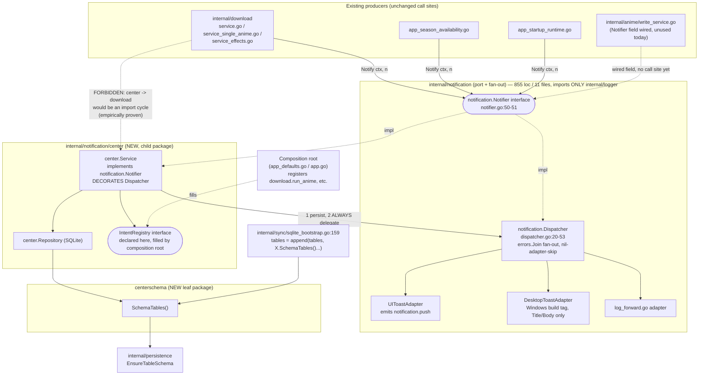
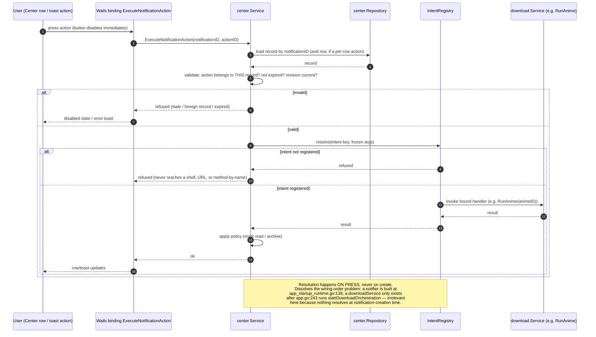

# Exploration — Notification Center (SDD-60)

Change: `2026-08-23-sdd-60-notification-center`
Design canvas (published): https://claude.ai/code/artifact/f46742c0-28ac-4ecb-a2a3-f86dbca2de5f
Source Engram observations consolidated here: #8583, #8584, #8585, #8586, #8587, #8588, #8589, #8590, #8592, #8593, #8594, #8595, #8596, #8597 (all 2026-08-23). This document is mirrored at Engram topic key `sdd/notification-center/explore` (observation #8598).
Spot-checked against live code by this phase on 2026-08-23; every citation below was re-verified, not copied blind.

## 1. Feature Summary

A durable, queryable Notification Center: every notable moment already raised through the existing `notification.Notifier` port gets persisted, is browsable in a new `/notifications` master-detail screen (HeroUI Table + detail pane), and can carry declarative, late-bound actions (Android-style `PendingIntent`) that survive process restart and resolve only when pressed.

## 2. Current State — Verified Against Live Code

### 2.1 Backend notification port (`internal/notification/`)

11 Go files / 855 lines (confirmed via `Glob`: `desktop_other.go`, `dispatcher.go`, `log_forward.go`, `ui_toast.go`, `desktop_windows.go`, `notifier.go`, plus 5 `_test.go` files). `go list -deps` shows it imports ONLY `internal/logger`.

- Port, `internal/notification/notifier.go:37-51`:

```go
type Notification struct {
	Title         string
	Body          string
	Level         Level
	Source        string
	CorrelationID string
	Timestamp     time.Time
}

type Notifier interface {
	Notify(ctx context.Context, n Notification) error
}
```

- Dispatcher, `internal/notification/dispatcher.go:20-53` — canonical `Notifier` impl, fans out with failure isolation:

```go
func (d *Dispatcher) Notify(ctx context.Context, n Notification) error {
	if d == nil || len(d.adapters) == 0 {
		return nil
	}
	var errs []error
	for _, adapter := range d.adapters {
		if adapter == nil {
			continue
		}
		if err := adapter.Deliver(ctx, n); err != nil {
			errs = append(errs, err)
		}
	}
	if len(errs) == 0 {
		return nil
	}
	return errors.Join(errs...)
}
```

  Nil dispatcher or zero adapters = safe no-op (lines 35-37). Nil adapter entries are skipped (lines 41-43).

- Adapters:
  - `ui_toast.go:9,39` — emits Wails event **`notification.push`** (the const `uiToastEventName`) with the full `Notification` struct as payload. Nil `emit` degrades to no-op.
  - `desktop_windows.go:44-60` (build-tag `windows`) — native WinRT COM toast via `git.sr.ht/~jackmordaunt/go-toast/v2`; only reads `n.Title` / `n.Body` — **Level, Source, CorrelationID, Timestamp never reach the OS toast.**
  - `log_forward.go` — forwards to the logger.

### 2.2 Producers (call sites), all confirmed

- `internal/download/service_effects.go:74` (`s.notify` helper) — shared by both run paths; on failure it **logs** `download.notification_failed` rather than discarding silently.
- `internal/download/service.go:377-398` (`setRunCompletionStatus`, fan-out run) — real bodies, quoted verbatim from the file:
  - line 385: `"MyJDownloader offline"` / `fmt.Sprintf("%d episode(s) need manual download -- see run details.", len(run.ManualLinks))`
  - line 388: `"Download run completed with errors"` / `"Some animes failed to download -- see run details."`
  - line 391: `"Download run failed"` / `"All animes failed to download -- see run details."`
  - line 395: `"Download run completed"` / `fmt.Sprintf("%d episode(s) downloaded.", run.EpisodesDownloaded)`
- `internal/download/service_single_anime.go:36-55` (single-anime run) — same four-way ladder, distinct wording:
  - lines 39-40: `"MyJDownloader offline"` / `"%d episode(s) need manual download -- see run details."`
  - lines 43-44: `"Download run completed with errors"` / `"Some episodes failed to download -- see run details."`
  - lines 47-48: `"Download run failed"` / `"The selected anime failed to download -- see run details."`
  - lines 52-53: `"Download run completed"` / `"%d episode(s) downloaded."`
  - **The literal string "see run details" appears FOUR times across these two files** — every one of these notifications knows exactly which episodes/hosters were involved (it has `run.ManualLinks`, the failed episode list) and refuses to say so. This is the concrete gap the "single detail block" design (§5.5) exists to close.
- `app_season_availability.go:323-353`:
  - `notifySeasonPastDownloadWindow` (lines 324-339): body is `fmt.Sprintf("%d anime sent to Ver hoy after today's download. Download them manually to watch today.", count)` (line 328) or, with a time, `"%d anime sent to Ver hoy after the %s auto-download. Download them manually to watch today."` (line 330). Title `"Past today's download window"` (line 333). Discarded via `_ = a.notifier.Notify(...)` at line 332.
  - `notifySeasonAvailable` (lines 342-353): title `"Available to create"` (line 347); body `fmt.Sprintf("%d anime now available — create them when you want: %s", len(names), strings.Join(names, ", "))` (line 348) — **N anime names comma-joined into one sentence, cannot truncate, cannot be individually acted on.** Discarded via `_ =` at line 346.
- `app_startup_runtime.go:87,95,223` — device/sync notifications, all `_ = a.notifier.Notify(...)`.
- `internal/anime/write_service.go:56` (`WriteServiceDeps.Notifier notification.Notifier`) — field exists, wired, **unused** by any call site today.

All five non-download producers discard the `Notify` error outright (`_ =`); only the download path logs it. This matters directly for the persist-semantics decision in §5.3.

### 2.3 No persistence layer exists yet

`grep -rn notification_records` across the whole tree returns **zero hits in code** (15 hits, all in `docs/notification-center-proposal.md` — an aspirational document, not shipped state). No `/notifications` route exists in `frontend/src/App.tsx`.

### 2.4 Frontend rendering surface — two real, still-present bugs

Surface lives at `frontend/src/features/notifications/ui/NotificationToasts/`, mounted from `frontend/src/app/AppLayout/AppLayout.tsx:3,46` via a re-export at `frontend/src/app/NotificationToasts.tsx:1`:

```ts
export { NotificationToasts } from '../features/notifications/ui/NotificationToasts/NotificationToasts';
```

- **Bug A** — `use-backend-event-resolver.ts:18-27`:

```ts
useEffect(() => {
  return source.subscribe((notification) => {
    pushRef.current({
      severity: LEVEL_TO_SEVERITY[notification.Level] ?? 'info',
      title: notification.Title,
      description: notification.Body || undefined,
      persistent: false,
    });
  });
}, [source]);
```

  `Source`, `CorrelationID`, `Timestamp` are dropped on the floor, and no `persistedId` is ever set — every backend event becomes a fresh ephemeral toast with no way to correlate it to a future persisted record or dedupe it.

- **Bug B** — `app-notification.helpers.tsx:10-22`:

```ts
export function renderAppNotificationToast(notification: AppNotification): string {
  const { severity, title, description, actions, persistent } = notification;
  const options: Omit<ToastOptions, 'variant'> = {};
  if (description) { options.description = description; }
  if (actions?.length) {
    options.actionProps = { children: actions[0].label, onPress: actions[0].onPress };
  }
  ...
```

  Only `actions[0]` is ever rendered. `use-missed-schedule-resolver.ts` pushes **two** actions in both of its effects today, so the toast layer is silently dropping a second action in production right now (independent of the Notification Center — this is a pre-existing bug, not something the Center introduces).

### 2.5 Wire/domain types already reusable for the "manual links" case

- `download.ManualLink` — `internal/download/store.go:76-86`:

```go
type ManualLink struct {
	Anime   string   `json:"anime"`
	Episode int      `json:"episode"`
	Links   []string `json:"links"`
}
```

- Mirrored 1:1 at `internal/api/contracts/services.go:244-248` (same three fields), and carried on `DownloadRunView.ManualLinks` per the doc comment at `store.go:76-81`.

### 2.6 Existing derived-state gap (still true, already partially UI-fixed)

`app_download_contracts.go:59`:

```go
EpisodesDownloading: max(0, run.EpisodesFound-run.EpisodesDownloaded-run.EpisodesFailed),
```

No first-class "not attempted" state — it is a derived subtraction. The UI half (`run-history-panel.helpers.ts:15` `pendingEpisodesLabel` → `'Not attempted'`, `RunProgressBar.tsx:27` → `#71717A` on a terminated run) was already fixed in an earlier change; the contract-level gap remains, unrelated to this change's scope but relevant background for anyone writing the run-detail row.

### 2.7 Existing Wails methods that overlap the future action model

- `app_download.go:293-298` — `RunMissedScheduleNow(localDate string) contracts.ScheduleMissedActionResult`
- `app_download.go:300-306` — `IgnoreMissedSchedule(localDate string) contracts.ScheduleMissedActionResult`

Both are shipped and already called by the existing missed-schedule toast. The download service itself exposes only `RunOnce` (`service.go:199`) and `RunAnime` (`service.go:231`) — **there is no `RetryRun`**: `grep -rn "Retry" internal/download/` returns zero non-test hits. An earlier iteration of this design invented `download.retry_run`; it does not exist and must not be registered.

### 2.8 Wiring-order fact that shapes the action model

- `a.notifier` is constructed at `app_startup_runtime.go:139`: `a.notifier = a.newNotifier(a.emitFn, a.sharedLogger)`.
- `a.downloadService` (field declared `app.go:95`) is not assigned until `startDownloadOrchestration` runs — confirmed at `app.go:243` (`a.startDownloadOrchestration(ctx)`), well after notifier construction.

A design that resolves an action's target at notification-*creation* time cannot reach the download service yet. This is the concrete reason the design resolves on *press*, not on *create* (§5.4).

### 2.9 Schema registry precedent (exact, reusable pattern)

`internal/sync/sqlite_bootstrap.go:156-164`:

```go
tables := append(schemaTables(), dbschema.SchemaTables()...)
tables = append(tables, activity.SchemaTables()...)
tables = append(tables, season.SchemaTables()...)
tables = append(tables, eventlog.SchemaTables()...)
for _, t := range tables {
	if err := persistence.EnsureTableSchema(db, t); err != nil {
		return err
	}
}
```

Cycle-breaking leaf-package precedent, `internal/download/dbschema/schema.go:1-6`:

```go
// Package dbschema declares the TableSchema descriptors for all download-owned bridge
// tables. It is a separate sub-package of internal/download so that internal/sync can
// import it without a cycle: the download package's in-package test files import sync,
// which would create sync→download→sync if the schemas lived in package download.
// dbschema imports only persistence and has no dependency on sync or the parent download
// package, making the dependency direction acyclic.
```

This is the exact template for a `centerschema` leaf package (§5.1) — same problem shape, same fix.

### 2.10 Package-shape convention (confirmed, not just described)

`internal/season/` — flat context package (`service.go`/`sqlite_store.go`/`schema.go`/`ports.go`/`service_*.go`, 19 files) **plus** two sub-packages, confirmed via `Glob`:

- `internal/season/domain/` — `ordering.go`, `decision.go`, `season.go`, `season_anime.go` (+ tests)
- `internal/season/match/` — `match.go` (+ test)

`internal/observability/eventlog/` — confirmed **entirely flat**, 12 non-test files (`filters.go`, `metadata.go`, `queue.go`, `reader.go`, `reader_correlation.go`, `reader_search.go`, `reader_summary.go`, `schema.go`, `sink.go`, `store.go`, `types.go`), zero sub-packages.

`Glob("internal/**/{app,sqlite,projection}")` returns **no matches anywhere in the tree** — a nested `domain/app/sqlite/projection/` shape (the original proposal's §37 layout) has zero precedent in this codebase.

`internal/tray/` (referenced in the PendingIntent design as an existing carrier) confirmed to exist: `manager.go`, `systray_manager.go`, `icon.go`, `systray_bindings_windows_cgo.go`, `mock_manager.go`.

## 3. Drift Register (code wins as runtime truth — CLAUDE.md #2)

### 3.1 `openspec/config.yaml:7` — stale, contradicted by the entire codebase

> "Current codebase: Wails starter scaffold; domain packages under `internal/` are not implemented yet."

Confirmed false by every section above. Engram #1227 (`sdd-init/autoreas-bridge`) already overrides this for SDD purposes; this exploration additionally confirms it live rather than only by prior citation.

### 3.2 `openspec/specs/notifications/notifications.md:64-77` vs. shipped location

The spec requires:

> "The frontend MUST render incoming `notification.push` events as toasts through a SHARED toast surface that lives in the app-shell (`frontend/src/app/**`), reusable by every feature, NOT inside any single feature folder." (line 66)
>
> "...it MUST reside in the app-shell/infrastructure layers, NOT inside `features/download` (or any other feature)..." (line 77)

Confirmed shipped reality: the real implementation (`NotificationToasts.tsx`, `use-backend-event-resolver.ts`, `use-missed-schedule-resolver.ts`, `app-notification.helpers.tsx`) lives at `frontend/src/features/notifications/ui/NotificationToasts/`, and `frontend/src/app/NotificationToasts.tsx` is a **one-line re-export**, not the implementation.

Already logged to `docs/learning-log.md` on 2026-08-23. **The delta spec produced by `sdd-spec` MUST reconcile this** — either by amending the requirement to describe the re-export pattern as the shared surface, or by relocating the implementation. This exploration does not decide which; that is a proposal/spec-phase call, but the drift must not be silently re-asserted.

### 3.3 `docs/notification-center-proposal.md` (1926 lines) — origin document, partially stale

- §5.1–5.3 (backend contract), §5.5 (frontend bugs), §5.6 (no table) — verified accurate, see §2 above.
- §24.4 (UI claim that terminated runs render unattempted episodes as "Downloading") — **stale**, already fixed (`run-history-panel.helpers.ts:15`, `RunProgressBar.tsx:27`). The contract-level gap (`app_download_contracts.go:59`) it originally complained about is still real, just no longer visible in the UI.
- §7 (component diagram), §8 (persist-first sequence), §16.3 (action execution), §19.1 (subscribe-first) — all **superseded** by the reviewed design in §5-6 below; regenerate `design.md`'s diagrams from this document, not from the proposal.
- §37 (implementation plan putting an action executor inside `internal/notification` that imports `internal/download`) — **would not compile**. Empirically proven: a probe file placed in `internal/notification` importing `internal/download` produces `import cycle not allowed`, because `internal/download` (via `service.go`, `service_effects.go`, `service_single_anime.go`) and `internal/anime` (`write_service.go`) already import `internal/notification`. `notification → download → notification`.

## 4. Design Evolution (recorded for full traceability — not just the final answer)

### 4.1 Detail-block vocabulary: 2 → 4 → 1

- **Start (2 blocks)**: `segments` (counts) + `reasons` (named blockers).
- **Expanded (4 blocks)**, driven by concrete evidence: added `links` (the `download.ManualLink` fallback for `jdownloader_offline`) and `entities` (because `app_season_availability.go:348`'s comma-joined name list cannot scale or be individually acted on).
- **Collapsed (1 block)**, driven by the user's critique of a segments-bar mockup annotated *"2 downloaded — CUALES? / 1 failed — CUALES?? / 9 not attempted — CUALES??"* ("*which ones?*") and the governing principle stated by the user: *"estas pocas UI deben ser pensadas desde el punto de vista cómo se van a utilizar"* ("these few UI pieces must be designed from the point of view of how they will actually be used") — echoing a YouTube-notification analogy (a bare "new video" notification without channel, title, thumbnail, and watch button is useless).
  - Final shape: **one block, one row, four parts always present** — cover+name (which one), a status word (what happened), the specific detail (which episodes/blocker), and a per-row action (what to do next).
  - `segments` → dropped; the count moved into the body sentence, where it already lived.
  - `reasons` → became the row's detail line.
  - `links` → became per-row actions (each hoster = a copy-link intent scoped to that row).
  - `entities` → became the row itself (an entity was always "a name with no cover, status, or action").
  - Rows are **bounded**: the uneventful ones collapse into a line like *"7 other anime finished without incident — show all in Downloads."* A notification that lists everything is a log, not a notification.
  - Six of the fifteen known kinds carry no block at all: `run_started`, `missed_schedule`, `device.paired`, `device.sync_health_warning`, `anime.operation_failed`, `system.notification_delivery_degraded`.

### 4.2 Action model: rejected allowlist → PendingIntent

The first design shape (command string looked up in a registry, unregistered = refused) was rejected by the user with: *"no veo un design pattern detrás, parece un botón arbitrario que se quema por cada evento"* ("I don't see a design pattern behind this, it looks like an arbitrary button burned in per event") — who then named the target precedent: Android notification actions.

Corrected model — **Command reified as an immutable, late-bound token** (Android's `PendingIntent`):

1. An **app-wide** operation registry, populated by each bounded context at startup — not owned by the notification package. Shape precedent already in the repo: `SiteRegistry`/`StaticRegistry` (`internal/download/registry.go`). There is no existing intent/deep-link registry today.
2. The persisted record stores a **token**, never executable code: `{id, label, intent (key), args (frozen at creation, immutable)}`.
3. Many carriers can hold the same token — a Center row, a toast action, an existing Wails method, `internal/tray` (already exists), a future deep link.
4. Resolution happens **on press**, not on create — which is what dissolves the wiring-order problem from §2.8, and is why `RunMissedScheduleNow`/`IgnoreMissedSchedule` (§2.7) become *another carrier* of the same registered intent instead of a rival second path to the same operation.
5. `download.retry_run` is explicitly rejected as a registered intent — it does not exist (§2.7). The button that used to say "Retry run" is relabeled "Run this anime again" → resolves to `download.run_anime`.

### 4.3 Master list: Card rows vs. HeroUI Table → Table (user's explicit choice)

Both were built as side-by-side artboards for direct comparison, never as a silent replacement. User compared both and chose the Table.

**Verified HeroUI v3 API** (installed `@heroui/react` 3.2.4, checked against `node_modules/@heroui/react/dist/components/table/table.d.ts` + official docs):

- `Table.LoadMore` / `Table.LoadMoreContent` — a sentinel row firing `onLoadMore` when scrolled into view (`isLoading`, `scrollOffset` props) — infinite scroll/keyset-cursor pagination built in.
- `Table.Content selectionMode="none"|"single"|"multiple"` with `selectedKeys`/`onSelectionChange`, `Checkbox slot="selection"` for select-all + per-row — the bulk-action requirement (multi-select, keyboard nav, announced selection count) comes from the library, not hand-rolled.
- `renderEmptyState={() => ReactNode}` on `Table.Body` — covers the 5 distinct empty states the Center needs.
- Sorting via `allowsSorting` on `Column` + `sortDescriptor`/`onSortChange`.
- Also available: expandable rows, column resizing, virtualization, TanStack Table integration, and a documented "Custom Cells" pattern (Avatar/Chip/Button inside cells) — rich row content is supported, not a hack.

**ADR-012 tension resolved, not violated**: ADR-012 rejected `ListBox + Virtualizer`, not `Table`. `useProgressiveListWindow` slices a fully-loaded *client* array; the Center's list is *backend keyset-paginated*, so `Table.LoadMore → fetch next cursor page` is the correct fit and the ADR's hook does not apply here.

**Accepted cost** (user chose this knowingly after seeing both options): a fixed `Source` (100px) + `When` (84px) column pair takes ~184px away from the title column, so titles truncate sooner than in the card layout, and the master pane reads more like a data grid than a list of notices. Row grid: `40px minmax(0,1fr) 100px 84px`.

**Known Table implementation gotchas** (already documented in the `autoreas-theme` skill, reconfirmed against installed 3.2.4):

- `.table-root` is `display:grid` with `minmax(0,1fr)` — a hard width boundary; requires `w-full table-fixed` + explicit per-column widths + `block truncate` on cells.
- **Never** `overflow-x-clip` — it clips the last column.
- `Table.ScrollContainer` is **horizontal-only**; vertical scrolling needs a separate `max-h-* overflow-y-auto` wrapper holding the scroll ref.

`SearchField` (compound: `.Root`/`.Group`/`.Input`/`.SearchIcon`/`.ClearButton`) has no built-in debounce (stays app-owned), and its `variant="secondary"` (flat, no shadow, "suitable for use in surfaces") is the correct variant here because the filter bar sits inside a Card.

### 4.4 Truncation: Tooltip adopted, its limit stated honestly

User's call: *"como esto no es android, el texto truncado se puede solucionar con un tooltip"* ("since this isn't Android, truncated text can be solved with a tooltip") — correct, and it retires most of the Table layout's accepted truncation cost.

Verified API (HeroUI 3.2.4): `Tooltip.Trigger` is typed to accept any intrinsic element (default `"div"`), and the library's own docs show a plain `<div>` as a valid trigger with `aria-label` — so a truncated `<span>` works. Default `delay` is 700ms (kept, not zeroed, so a tooltip doesn't flash while the pointer crosses rows). Implementation rule: bind `isDisabled` to "is this element **actually** truncated" (`scrollWidth > clientWidth`), rendering the Tooltip unconditionally rather than conditionally mounting it — a tooltip repeating already-visible text is noise.

**Honest limit, stated on the canvas rather than glossed over**: a tooltip reveals one title on demand; it does not help someone scanning six rows at once. The detail pane remains the real answer to "which one is this" — the tooltip only reduces the Table layout's truncation cost, it does not erase it.

## 5. Reviewed Target Design (carry forward intact into `design.md`)

### 5.1 Package structure

New package `internal/notification/center/` — a **child** of the existing port package. Child→parent import is legal in Go and the parent (`internal/notification`) gains no new dependency. Layout matches the flat + optional-subpackage convention confirmed in §2.10 (`internal/season/` precedent): flat files (`service.go`, `sqlite_store.go`, `ports.go`, `intent_registry.go`, ...), no nested `domain/app/sqlite/projection/` (zero precedent for that shape, §2.10).

A leaf package `internal/notification/centerschema/` (or a top-level equivalent — naming is a design-phase call) importing **only** `internal/persistence`, mirroring the exact cycle-breaking precedent at `internal/download/dbschema/schema.go:1-6` (§2.9). `internal/sync/sqlite_bootstrap.go` appends `centerschema.SchemaTables()` to its existing `tables := append(...)` chain (lines 156-159 pattern), identical to how `eventlog.SchemaTables()` is appended today.

### 5.2 `center.Service` decorates the existing `Dispatcher`

`center.Service` implements `notification.Notifier` (same port, §2.1) and **wraps** the existing `*notification.Dispatcher` rather than replacing it. No changes to `dispatcher.go`, `ui_toast.go`, `desktop_windows.go`, or `log_forward.go`. No producer call site changes — every `a.notifier.Notify(...)` call in `service_effects.go`, `app_season_availability.go`, `app_startup_runtime.go` keeps working unmodified; only the concrete value behind `a.notifier` changes.

The composition-root cost is **small, not free** — an earlier draft's "zero-cost one-liner" claim was reviewed and refuted:

- `app_startup_test.go:136` asserts `app.notifier != fake` — an identity assertion any wrapper necessarily changes.
- `defaultNotifier` (`app_defaults.go:38`) is a bare function with no `*App` receiver and no DB parameter; its signature is re-spelled at the seam (`app.go:50`), the default (`app_defaults.go:104`), the call (`app_startup_runtime.go:139`) and 4 test overrides (`app_startup_test.go:128`, `app_lifecycle_test.go:267`, `:311`, `:341`).
- Nil-notifier guards exist at `app_startup_runtime.go:74,222` and `app_season_availability.go:325,343`; a wrapper is never nil, so `TestAppStartupPairingTokenConsumedCallbackIsSafeWithNilNotifier` (`app_lifecycle_test.go:328-343`) needs the decorator to return the inner notifier unwrapped when it is nil.

Carry this cost into `design.md`'s task breakdown rather than re-promising zero changes.

### 5.3 Persist-then-ALWAYS-project semantics (not persist-then-project-on-success)

`Notify` must persist the record, then **unconditionally** delegate to the wrapped `Dispatcher` — even when the persist write failed. Rationale, directly tied to §2.2's finding that every producer except the download path discards `Notify`'s error via `_ =`: an early return on persist failure would silently downgrade a user-visible toast/desktop notification to nothing, which contradicts the Dispatcher's own documented contract at `dispatcher.go:15-19` ("callers are expected to treat a Notify failure as non-fatal to their own feature logic") — persistence failing is not the caller's feature failing, and must not suppress the human-visible signal that already works today. The joined persist+dispatch error exists purely for observability (the one producer that already logs it, `service_effects.go`, keeps getting a real error to log).

This also has to survive the test seam noted in review: `app_test_helpers_test.go:30` wires a bare, unopened `&sql.DB{}` for some startup tests, which panics (nil-deref) on `Exec` rather than erroring gracefully — a persist-first design must go through the same defenses the repo already uses elsewhere (`canUseBridgeDB`, confirmed present at `app_startup_runtime.go:57-67`; `recover()` guards confirmed present in `app_runtime_services.go` around the `canUseBridgeDB` call site), not assume every DB handle is safely queryable.

### 5.4 PendingIntent action model (§4.2, carried forward as-is)

- App-owned `IntentRegistry` interface declared by `internal/notification/center`; concrete handlers registered from the composition root (e.g. `app_defaults.go` or a dedicated wiring file) so the center package never imports `internal/download` (avoiding the exact cycle proven in §3.3).
- Record/row actions store `{label, intent, args}`; `args` frozen at creation (Android `FLAG_IMMUTABLE` analog) — a holder can fire, never rewrite.
- Resolution on press dissolves the ordering problem from §2.8.
- `RunMissedScheduleNow`/`IgnoreMissedSchedule` (§2.7) become carriers of the same registered intent rather than a competing path — do not create a second route to the same operation.
- `download.run_anime` is the only real download intent available today; `download.retry_run` must not be registered (§2.7, §4.2).

### 5.5 Detail block: single row-list component (§4.1, final shape)

One block type, one row shape, always four parts: cover+name / status word / specific detail / per-row action. Rows carry `{type,id}` references (never a stored image — cover resolves at render via the existing `getAnimeCover` binding, already per-session cached by the Today screen, falling back to `CoverPlaceholderScene`). Rows are bounded; uneventful ones collapse into a "N other anime finished without incident" line.

### 5.6 HeroUI Table master list (§4.3, final shape)

`Table.Content selectionMode="multiple"` + `selectedKeys`/`onSelectionChange`; `Table.LoadMore` → keyset cursor pagination; `renderEmptyState` for the 5 empty states; sortable columns (`When` sorted descending by default). Row grid `40px minmax(0,1fr) 100px 84px`. A selection bar ("N selected · Mark read · Archive · Clear") appears above the header only while rows are selected. `SearchField variant="secondary"` inside the filter Card.

**Gotchas that now apply and must be respected in implementation** (§4.3): `w-full table-fixed` + explicit column widths + `block truncate`; never `overflow-x-clip`; `Table.ScrollContainer` is horizontal-only, vertical scroll needs its own wrapper.

### 5.7 Tooltip for truncated titles (§4.4)

`Tooltip` bound to actual truncation (`scrollWidth > clientWidth`) via `isDisabled`, default 700ms delay kept, honest limitation documented (does not help scanning multiple rows at once — the detail pane is the real disambiguator).

## 6. Diagrams (full mermaid source — not prose about diagrams)

### 6.1 Component diagram — packages and import direction



### 6.2 Sequence — raising a notification (persist-then-always-project)

```mermaid
sequenceDiagram
    autonumber
    participant F as Feature (download / season / startup)
    participant C as center.Service
    participant R as center.Repository
    participant DB as SQLite (new notification_records table)
    participant D as notification.Dispatcher
    participant UI as UIToastAdapter
    participant WIN as DesktopToastAdapter (Windows)

    F->>C: Notify(ctx, Notification{Title, Body, Level, Source, CorrelationID, Timestamp})
    C->>R: Persist(record)
    R->>DB: INSERT INTO notification_records (...)
    alt persist succeeds
        DB-->>R: ok
        R-->>C: ok
    else persist fails (nil/unopened DB handle, disk error, ...)
        DB-->>R: error
        R-->>C: error (kept for observability only)
    end
    Note over C: ALWAYS project next, even on persist failure.<br/>Every non-download producer discards Notify's error<br/>via "_ =" (app_season_availability.go, app_startup_runtime.go);<br/>an early return here would silently downgrade a<br/>user-visible toast/desktop-toast to nothing.
    C->>D: Notify(ctx, n)
    D->>UI: Deliver(ctx, n)
    D->>WIN: Deliver(ctx, n)
    D-->>C: errors.Join(adapter errors) or nil
    C-->>F: joined persist+dispatch error (non-fatal by existing Dispatcher contract)
```

### 6.3 Sequence — pressing an action, potentially days later



## 7. Affected Areas

- `internal/notification/` — unchanged (decorated, not modified). Composition-root call site that constructs `a.notifier` changes to build the new decorator (exact file: `app_startup_runtime.go:139` or `app_defaults.go`, design-phase call).
- **NEW** `internal/notification/center/` — service, SQLite store/repository, IntentRegistry interface, action validation/expiry policy.
- **NEW** `internal/notification/centerschema/` (or equivalent leaf package name) — `SchemaTables()` for the persisted record table(s).
- `internal/sync/sqlite_bootstrap.go` — one appended `centerschema.SchemaTables()` call in the existing chain (§2.9/§5.1).
- Composition root (`app_defaults.go` and/or a new wiring file) — registers `download.run_anime` (and any other real, existing operation) into the `IntentRegistry`; must not introduce `internal/notification` → `internal/download` as a compile-time import.
- `app.go` / a new `app_notification_center.go` — new Wails bindings (list/paginate, mark-read, archive, `ExecuteNotificationAction`).
- Frontend: new `frontend/src/features/notifications` additions (or a new feature folder, design-phase call) — HeroUI Table master list, detail pane with the single row-list block, Tooltip-based truncation, new `/notifications` route + nav entry with unread badge.
- Existing frontend bugs (§2.4) are pre-existing and not caused by this change, but the Center's persisted-record path is the natural place to also fix Bug A (carry `Source`/`CorrelationID`/`Timestamp`/`persistedId` through) since the Center needs a stable ID to correlate toast↔record anyway. Bug B (single-action toast) is unrelated to persistence and can be fixed independently; flag both to the proposal phase as candidate in-scope fixes, not silently bundled.
- `openspec/specs/notifications/notifications.md:66,77` — needs reconciliation per drift §3.2.
- `docs/notification-center-proposal.md` — superseded sections (§7, §8, §16.3, §19.1, §37) should not be used as an implementation source once `design.md` exists.

## 8. Approaches Considered

| Approach | Pros | Cons | Effort |
|---|---|---|---|
| **A. Decorator over existing Dispatcher (chosen)** — `center.Service` wraps `Dispatcher`, zero producer/adapter changes | No changes to 4 existing adapter files or any producer call site; reuses the exact schema-registry precedent already proven twice (`eventlog`, `download/dbschema`); child-package import direction is legal and adds no dependency to the parent | Still touches ~5 test-double call sites at the composition root (§5.2); persist-then-project ordering must be right the first time (§5.3) or user-visible notifications silently regress | Medium |
| **B. Replace `Notifier` with a new persisted-first interface, migrate all producers** | Conceptually "cleaner" single source of truth | Touches every producer call site (5+ files) for no functional gain over A; higher review-workload cost for zero additional capability; abandons the working, tested Dispatcher/adapter code for no reason | High |
| **C. Original proposal's §37 layout (action executor inside `internal/notification`, nested `domain/app/sqlite/projection/`)** | Matches the original document | **Does not compile** — proven import cycle (§3.3); nested layout has zero precedent in this codebase (§2.10) | N/A — rejected outright |

## 9. Recommendation

Approach A (decorator over the existing `Dispatcher`, child package `internal/notification/center`, leaf `centerschema` package, PendingIntent action model, single row-list detail block, HeroUI Table master list) — already independently reviewed, refuted-and-corrected once (persist semantics, the `app_defaults.go` "zero-cost" claim, the nested-package claim, the `RetryRun` claim), and then further refined three more times against direct user feedback (block vocabulary, action pattern, master-list choice). This exploration found no new blocker in a fresh spot-check against live code; every cited `file:line` above was re-read and matches. Proceed to `sdd-propose`.

## 10. Risks

- **Composition-root test-double churn** (§5.2): 4+ existing test files assert on `a.notifier` identity/shape; the decorator change is small but not literally zero-diff. Must be scoped explicitly in `tasks.md`, not glossed over.
- **Persist-then-always-project ordering bug is easy to reintroduce**: an "obvious" early return on a persist error is the single most likely regression path (§5.3) and was already caught once in review of this very design. Needs an explicit test asserting dispatch still happens when persistence fails.
- **Nil/unopened DB handle in tests** (`app_test_helpers_test.go:30`): persist-first code must go through `canUseBridgeDB`/`recover()` guards already established elsewhere, or it will panic existing startup test suites.
- **Spec drift** (§3.2): delta spec must explicitly address the `frontend/src/app/**` requirement vs. the shipped re-export pattern, or ship a second, larger drift.
- **`docs/notification-center-proposal.md` staleness**: anyone reading it without this exploration/the design canvas risks re-implementing the rejected §37 plan (import cycle) or the discarded 4-block vocabulary.
- **HeroUI Table truncation cost is accepted, not eliminated** (§4.3/§4.4) — user chose this knowingly; do not "fix" it later by reverting to Card rows without another explicit decision.
- **Frontend bugs A and B (§2.4) are adjacent, not identical, scope** — decide explicitly in the proposal whether they're in-scope fixes bundled with the Center (natural, since Bug A needs the same `persistedId` plumbing the Center requires anyway) or deferred; do not silently fix or silently ignore either.

## 11. Open Questions (for `sdd-propose`/`sdd-design` to resolve, not decided here)

1. Exact package/file name for the schema leaf (`centerschema` vs. a differently-named top-level package) and exact composition-root file for the new `a.notifier` wiring.
2. Whether Bug A and Bug B (§2.4) are fixed as part of this change or deferred to a follow-up.
3. Exact retention/pruning policy for persisted notification records (unbounded growth risk, not addressed in any of the 15 source observations).
4. Exact revision/expiry semantics for a `PendingIntent` token (§5.4) — how long is "current," and what happens to an action whose target entity was deleted after the notification was created.

## Ready for Proposal

**Yes.** Scope, target architecture, and every load-bearing file:line claim have been independently verified against live code in this phase. `sdd-propose` can proceed directly from §5-§9 above without further exploration.
