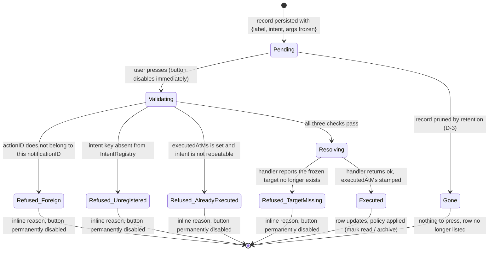
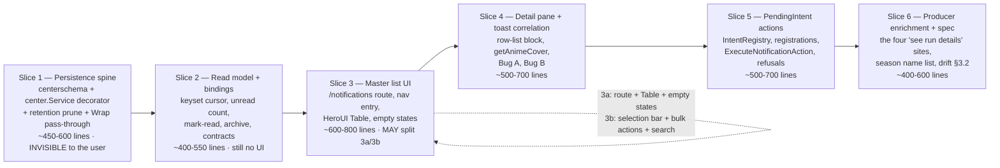

# Proposal: Notification Center (SDD-60)

Change: `2026-08-23-sdd-60-notification-center`
Exploration input: `openspec/changes/2026-08-23-sdd-60-notification-center/explore.md` (Engram `sdd/notification-center/explore`, observation #8598)
Design canvas (8 artboards — flow, lifecycle, toast, Center screen, block component, PendingIntent model, component diagram, sequence diagrams): https://claude.ai/code/artifact/f46742c0-28ac-4ecb-a2a3-f86dbca2de5f
Delivery: `delivery_strategy=auto-chain`, `review_budget_lines=800`, `strict_tdd: true`.

> **Deliberate override of the `sdd-propose` 450-word size budget.** The user's standing instruction for this change is verbatim: *"diagramas, apuntes, artifact, todo debe ser guardado en los documentos con la mayor definición posible, nada de descripciones escuetas en texto plano."* Full-definition artifacts (quoted strings, `file:line` evidence inline, complete diagram sources) win over the generic brevity default. `openspec/config.yaml` `rules.proposal` additionally requires a rollback plan and identified affected modules — both are present below.

---

## 1. Intent

### 1.1 The problem, stated in the product's own words

Every notable moment in Bridge is already raised through `notification.Notifier` — and then thrown away. A toast shows for a few seconds, a Windows toast shows `Title`/`Body` only (`internal/notification/desktop_windows.go:54-60` reads *only* `n.Title` and `n.Body`; `Level`, `Source`, `CorrelationID`, `Timestamp` never reach the OS), and after that the event is unrecoverable. There is no `notification_records` table anywhere in the tree — `grep -rn notification_records` returns zero hits in code.

Worse, the notifications that *do* fire refuse to say what happened. The literal string `"see run details"` appears **four times** across two files:

- `internal/download/service.go:385` — `"MyJDownloader offline"` / `fmt.Sprintf("%d episode(s) need manual download -- see run details.", len(run.ManualLinks))`
- `internal/download/service.go:388` — `"Download run completed with errors"` / `"Some animes failed to download -- see run details."`
- `internal/download/service.go:391` — `"Download run failed"` / `"All animes failed to download -- see run details."`
- `internal/download/service_single_anime.go:43-48` — the same ladder with distinct wording, ending in `"The selected anime failed to download -- see run details."`

Each of those call sites is holding `run.ManualLinks` (`internal/download/store.go:76-86`: `{anime, episode, links}`) and the failed-episode list at the moment it composes the sentence. It knows exactly which episodes and which hosters are involved, and says "see run details" instead.

The same shape appears in season availability, `app_season_availability.go:348`:

```go
fmt.Sprintf("%d anime now available — create them when you want: %s", len(names), strings.Join(names, ", "))
```

N anime names comma-joined into one sentence: it cannot truncate gracefully, cannot show a cover, and no individual anime in that list can be acted on.

The user's governing critique of the first mockup — a segments bar reading "2 downloaded / 1 failed / 9 not attempted" — was written on the artboard as **"CUALES? / CUALES?? / CUALES??"** (*"which ones?"*), with the principle: *"estas pocas UI deben ser pensadas desde el punto de vista cómo se van a utilizar"* — these few UI pieces must be designed from the point of view of how they will actually be used. The analogy given was a YouTube notification: "new video" without channel, title, thumbnail, and a watch button is useless.

### 1.2 Why now

Five of the six producer families discard `Notify`'s error outright via `_ =` (`app_season_availability.go:332,346`, `app_startup_runtime.go:87,95,223`); only the download path logs it (`internal/download/service_effects.go:74` logs `download.notification_failed`). That means today there is **no** surface on which a user or a maintainer can answer "what did Bridge tell me last Tuesday, and did it work?" The Center is that surface, and it is also the durable home for actions that must survive a process restart.

### 1.3 What success looks like

A user opens `/notifications`, sees every notable moment Bridge raised, sorted newest-first, filterable and searchable, with unread state. Opening one shows **which anime**, **what happened to it**, **the specific detail** (which episodes, which hoster links), and **what to do about it** — and the "what to do" button still works days later, after a restart, because it is a late-bound token, not a live closure.

---

## 2. Scope

### 2.1 In Scope

| # | Deliverable | Evidence anchor |
|---|---|---|
| S-1 | New child package `internal/notification/center/` — flat layout, implements `notification.Notifier`, **decorates** `*notification.Dispatcher` | explore §5.1-5.2; `internal/season/` flat+subpackage precedent (§2.10) |
| S-2 | New leaf schema package `internal/notification/centerschema/` exposing `SchemaTables()`, importing **only** `internal/persistence` | mirrors `internal/download/dbschema/schema.go:1-6` verbatim in intent |
| S-3 | `notification_records` (+ action/row child tables) registered in the existing chain at `internal/sync/sqlite_bootstrap.go:156-164` | same line as `eventlog.SchemaTables()` today |
| S-4 | Persist-then-**ALWAYS**-project `Notify` semantics, with a regression test that dispatch still happens when the persist write fails | explore §5.3; `internal/notification/dispatcher.go:15-19` contract |
| S-5 | Count-based retention prune inside the insert transaction (decision D-3 below) | `internal/observability/eventlog/store.go:50-74` |
| S-6 | Keyset-cursor read model: list/paginate, unread count, mark-read, archive | HeroUI `Table.LoadMore` needs a cursor, not an offset |
| S-7 | New Wails bindings in a new root file `app_notification_center.go` | naming matches `app_season_availability.go`, `app_download.go` |
| S-8 | `/notifications` route + rail nav entry + unread badge | `frontend/src/App.tsx:17-41`; `SeasonNavBadge` precedent at `AppLayout.tsx:77` |
| S-9 | HeroUI Table master list — `selectionMode="multiple"`, `Table.LoadMore`, `renderEmptyState`, sortable `When` desc, row grid `40px minmax(0,1fr) 100px 84px` | explore §4.3/§5.6, `@heroui/react` 3.2.4 verified |
| S-10 | Detail pane with the **single** row-list block: `cover + name / status word / specific detail / per-row action` | explore §4.1/§5.5 |
| S-11 | `Tooltip` bound to *actual* truncation via `isDisabled` (`scrollWidth > clientWidth`), 700ms default delay kept | explore §4.4/§5.7 |
| S-12 | PendingIntent action model: `IntentRegistry` declared in `center`, filled by the composition root; frozen args; on-press resolution | explore §4.2/§5.4 |
| S-13 | **Bug A fixed** — `use-backend-event-resolver.ts:18-27` carries `Source`/`CorrelationID`/`Timestamp`/`persistedId` (decision D-2) | explore §2.4 |
| S-14 | **Bug B fixed** — `app-notification.helpers.tsx:17-22` stops silently dropping `actions[1..n]` (decision D-2) | explore §2.4 |
| S-15 | Producer enrichment: the four `"see run details"` sites and `app_season_availability.go:348` emit real rows instead of prose | §1.1 above |
| S-16 | Spec drift reconciliation at `openspec/specs/notifications/notifications.md:66,77` | explore §3.2 |

### 2.2 Out of Scope (explicit, with reasons)

| Deferred item | Why |
|---|---|
| `download.retry_run` as an intent | **It does not exist.** `internal/download/service.go` exposes only `RunOnce` (line 199) and `RunAnime` (line 231); `grep -rn "Retry" internal/download/` returns zero non-test hits. The button that used to read "Retry run" becomes "Run this anime again" → `download.run_anime`. |
| Wiring `internal/anime/write_service.go:56`'s `Notifier` field to a real call site | The field is wired and unused today. Giving anime writes a notification is a separate product decision, not a Center prerequisite. |
| A first-class `EpisodesNotAttempted` contract field | `app_download_contracts.go:59` derives it: `max(0, run.EpisodesFound-run.EpisodesDownloaded-run.EpisodesFailed)`. The UI half was already fixed (`run-history-panel.helpers.ts:15` → `'Not attempted'`, `RunProgressBar.tsx:27` → `#71717A`). The contract gap is real, adjacent, and belongs to the download capability. |
| Pushing Center records to the mobile app | This change adds **zero** REST/WS surface. Only Wails bindings, which are desktop-local. `docs/openapi.yaml` is untouched (see risk R-7). |
| Windows toast enrichment (`Level`/`Source` reaching the OS toast) | `desktop_windows.go` is deliberately untouched — the decorator pattern's whole point is that no adapter file changes. |
| Reverting the Table to Card rows | The user chose the Table after a side-by-side artboard comparison, knowingly accepting the truncation cost. Not reopenable without another explicit decision. |
| Migrating existing `docs/notification-center-proposal.md` §37 layout | Rejected: proven import cycle (`notification → download → notification`), and `Glob("internal/**/{app,sqlite,projection}")` matches nothing in this tree. |

---

## 3. The Four Open Questions — Decided

Exploration §11 deliberately left these to this phase. Each is decided here, with rationale and evidence.

### D-1 — Package naming and the composition-root file

**Decision.**

1. Schema leaf package: **`internal/notification/centerschema/`**, file `schema.go`, exporting `SchemaTables() []persistence.TableSchema`. It imports **only** `internal/persistence`.
2. Service package: **`internal/notification/center/`**, flat (`service.go`, `sqlite_store.go`, `ports.go`, `intent_registry.go`, `types.go`, …). No nested `domain/app/sqlite/projection/`.
3. Composition root: a **new root file `app_notification_center.go`** holds the intent registrations and the Wails bindings. The decorator is applied at **`app_startup_runtime.go:139`**, immediately after the existing line:

```go
a.notifier = a.newNotifier(a.emitFn, a.sharedLogger)
```

**Rationale for `centerschema` as a separate leaf.** Identical problem shape to `internal/download/dbschema`, whose package comment (`schema.go:1-6`) states the rule exactly: *"It is a separate sub-package of internal/download so that internal/sync can import it without a cycle: the download package's in-package test files import sync, which would create sync→download→sync."* `center`'s in-package tests will need a bootstrapped SQLite DB, i.e. `internal/sync` — the same cycle. Keeping the schema in a leaf keeps `sync → centerschema → persistence` acyclic. It is a sibling of `center` under the `notification` parent, which matches the two-subpackage precedent at `internal/season/domain/` + `internal/season/match/`.

**Rationale for wrapping at the call site rather than re-spelling `defaultNotifier`.** The explore phase flagged (§5.2) that `defaultNotifier` (`app_defaults.go:38`) has no `*App` receiver and no DB parameter, and that its signature is re-spelled at the seam (`app.go:50`), the default (`app_defaults.go:104`), the call (`app_startup_runtime.go:139`) and **four** test overrides (`app_startup_test.go:128`, `app_lifecycle_test.go:267`, `:311`, `:341`). Changing that signature costs six edits and breaks the identity assertion verified live in this phase at `app_startup_test.go:121-138`:

```go
func TestAppStartupNewNotifierOverrideSeamInjectsFakeNotifier(t *testing.T) {
	fake := &stubAppNotifier{}
	...
	app.newNotifier = func(...) notification.Notifier { ...; return fake }
	app.startup(context.Background())
	if app.notifier != fake {
		t.Fatal("expected startup to wire the newNotifier override's returned fake into app.notifier")
	}
```

**Therefore the decorator MUST have a pass-through constructor:**

```go
// Wrap returns inner unchanged when there is nothing to persist into --
// a nil inner notifier (so the existing a.notifier == nil guards keep
// firing) or an unavailable bridge DB (so tests wiring a bare, unopened
// &sql.DB{} keep observing the exact notifier they injected).
func Wrap(inner notification.Notifier, store *Store) notification.Notifier
```

`Wrap(inner, nil) == inner` and `Wrap(nil, store) == nil`. The call site becomes:

```go
a.notifier = a.newNotifier(a.emitFn, a.sharedLogger)
if a.canUseBridgeDB(ctx) {
    a.notifier = center.Wrap(a.notifier, a.notificationCenterStore)
}
```

`canUseBridgeDB` (`app_startup_runtime.go:57-67`) already `recover()`s from the panic that `app_test_helpers_test.go:30`'s bare unopened `&sql.DB{}` raises, returning `false`. Consequences, each individually load-bearing:

- `app_startup_test.go:136`'s identity assertion **passes unmodified** — the test app has no usable bridge DB, so `Wrap` is never applied.
- The four `newNotifier` test overrides **stay untouched**.
- `defaultNotifier`'s signature **does not change**, so `app.go:50` and `app_defaults.go:104` are untouched.
- The nil-notifier guards at `app_startup_runtime.go:74,222` and `app_season_availability.go:325,343` keep working, and `TestAppStartupPairingTokenConsumedCallbackIsSafeWithNilNotifier` (`app_lifecycle_test.go:328-343`) stays green.

This converts the explore's "small but not free" composition-root cost into a genuinely additive change. **Verification obligation:** Slice 1 MUST prove this empirically — the full existing suite green with zero edits to `app_startup_test.go`, `app_lifecycle_test.go`, `app_defaults.go`, and `app.go`. If any test app *does* hold a usable bridge DB, that test is the one and only edit allowed, and it must be named in the slice's report rather than absorbed silently.

### D-2 — Frontend Bug A and Bug B: both **IN SCOPE**

**Bug A — IN SCOPE (Slice 4).** `use-backend-event-resolver.ts:18-27` currently drops three fields and sets no id:

```ts
pushRef.current({
  severity: LEVEL_TO_SEVERITY[notification.Level] ?? 'info',
  title: notification.Title,
  description: notification.Body || undefined,
  persistent: false,
});
```

The Center needs a stable `persistedId` on the toast anyway — that is the only way "View details" on a toast can open the matching Center row, and the only way a toast can be deduped against a record. Fixing Bug A *is* building that plumbing. Deferring it would mean building the plumbing twice.

**Bug B — IN SCOPE, deliberately bounded (Slice 4).** `app-notification.helpers.tsx:17-22`, verified verbatim in this phase:

```tsx
if (actions?.length) {
  options.actionProps = {
    children: actions[0].label,
    onPress: actions[0].onPress,
  };
}
```

`use-missed-schedule-resolver.ts` pushes **two** actions in both of its effects, so a second action is being dropped in production today. The Center makes this materially worse: its detail rows carry per-row PendingIntent tokens, and the toast is the *second carrier* of the same tokens. A carrier that silently discards half of them is not acceptable.

The bound: `ToastOptions` is derived structurally from the library (`app-notification.types.ts:4` — `NonNullable<Parameters<typeof toast.success>[1]>`), and `actionProps` is singular. So the **contract** decided here is behavioural, not a specific widget:

- `AppNotification.actions` is ordered; `actions[0]` is the primary and renders as `actionProps`.
- Actions `[1..n]` **MUST NOT be silently discarded.** Design confirms whether HeroUI 3.2.4's toast accepts custom content able to carry a second button; if it does, both render. If it does not, the fallback is a deterministic, tested "+N more" affordance that opens the matching Center row.
- Either way, `renderAppNotificationToast` gains a test that **fails** when a second action disappears. That test is the deterministic guard; the rendering mechanism is the design phase's call.

### D-3 — Retention: count-based row cap, pruned in-transaction, no time expiry

**Decision.** `notification_records` is bounded by a **row cap of 2 000**, pruned **inside the insert transaction**, on the **first write of every process** and thereafter every **50** successful writes. Read/unread and archived state have **no** effect on pruning.

**Rationale — three existing precedents in this repo, all count-based, none time-based:**

| Store | Cap | Cadence | Where |
|---|---|---|---|
| `eventlog` | `defaultRowCap = 20000` | `defaultPruneEvery = 200` | `internal/observability/eventlog/types.go:17-18` |
| `requestcapture` | `defaultRetentionLimit = 5000` | `defaultPruneEvery = 100` | `internal/observability/requestcapture/types.go:6-7` |
| `download_runs` | `config.RunRetentionLimit` | every `FinalizeRun` | `internal/download/sqlite_store.go:11`, `sqlite_store_runs.go:123,134-142` |

The `eventlog` prune is the exact template, including a rationale that applies *verbatim* to this desktop app (`store.go:50-59`):

```go
// pruneOldestBeyondRetention deletes the oldest event rows past the
// configured row cap, called every pruneEvery successful write so pruning
// cost scales with event traffic instead of wall-clock time.
//
// The write counter is per-process and starts at zero, so cadence alone
// would never prune in a session that persists fewer than pruneEvery events
// -- the common case for a desktop app with short sessions, which would let
// the table grow past its cap across restarts and stay there. The first
// write of every process therefore prunes unconditionally, which bounds the
// table at startup regardless of how short the preceding sessions were.
func (s *SQLiteStore) pruneOldestBeyondRetention(ctx context.Context, tx *sql.Tx) error {
	s.successful++
	if s.successful > 1 && s.successful%s.pruneEvery != 0 {
		return nil
	}
	_, err := tx.ExecContext(ctx, `
		DELETE FROM runtime_events
		WHERE id IN (
			SELECT id FROM runtime_events
			ORDER BY occurred_at_ms DESC, id DESC
			LIMIT -1 OFFSET ?
		)
	`, s.rowCap)
	return err
}
```

**Why 2 000 and not 20 000:** `runtime_events` is machine telemetry read by a filtered log viewer. Notification records are human-scannable history; a Bridge user raises on the order of tens per day (download runs, season availability, device sync). 2 000 rows is on the order of a year or more of history, and keeps the keyset-paginated Table honest. `pruneEvery = 50` scales cost to traffic at a rate proportional to the smaller cap.

**Why unread rows are NOT pinned:** an "never prune unread" rule reintroduces unbounded growth through the single most likely user behaviour (never opening the Center). The row cap is the only bound, and it is visible — the row is simply gone. This is stated explicitly so no downstream phase assumes unread records are protected.

**Why no time-based expiry:** all three existing precedents are count-based, and a `DELETE WHERE older_than_90_days` policy has a strictly worse failure mode for this app — a quiet month would empty the Center, which is exactly when a user most wants to look back.

### D-4 — PendingIntent revision/expiry: no clock, record-scoped lifetime, typed refusal

**Decision, five rules:**

1. **A token never expires by wall clock.** Android's `PendingIntent` does not, and a TTL creates a dead button with no user-visible cause.
2. **The record's lifetime IS the token's lifetime.** When retention (D-3) prunes the record, its tokens die with it. That is the only time-like bound, and it is visible: the row is gone.
3. **Validation happens on press, in this order** — settled during Slice 5, and the middle two are deliberately the other way round from the first draft: (a) does this `actionID` belong to *this* `notificationID`, else `foreign_action`; (b) **has it already fired**, else `already_executed`; (c) is the intent key registered in the `IntentRegistry` — an unregistered key is **refused**, never resolved by name, shell, or URL; (d) the bound handler validates its own frozen args against live state, else `target_missing`.

   Record-local state is checked before environment state on purpose. An action that ran, on a build where its subsystem is no longer wired, is an action that **happened** — answering `intent_unregistered` there would be a true statement about the process and a false one about the notification the person is looking at. `TestExecuteAlreadyExecutedOutranksIntentUnregistered` pins the precedence, because every other test covers one reason at a time and none of them would notice a reorder.
4. **A deleted target entity produces a first-class refusal, not an error and not a silent no-op.** `ExecuteNotificationAction` returns a typed result carrying a **closed** reason set: `intent_unregistered`, `target_missing`, `already_executed`, `foreign_action`. The row renders the refusal inline and disables the button permanently. The args are frozen (Android `FLAG_IMMUTABLE` analog) precisely so the token cannot be rewritten to point at a live entity — the honest answer to "the anime you wanted to run again was deleted" is to say so.
5. **Single-fire by default replaces a revision counter.** Each action stores `executedAtMs`; a second press returns `already_executed`. Every real intent available today is state-changing — `download.run_anime` (`internal/download/service.go:231`), `schedule.run_missed_now` and `schedule.ignore_missed` (carried today by `app_download.go:293-298` / `:300-306`, returning `contracts.ScheduleMissedActionResult`) — and a second press is at best a duplicate run. Design MAY mark specific intents repeatable; the default is single-fire. There is **no** revision number, because frozen args + registry membership + handler validation already cover every case a revision was invented for.



---

## 4. Capabilities

> Contract between this proposal and `sdd-spec`. Names researched against `openspec/specs/` (42 spec files, listed 2026-08-23).

### New Capabilities

- `notification-center`: durable persistence of every notification raised through the `notification.Notifier` port; persist-then-always-project ordering; count-based retention (D-3); keyset-paginated read model; read/archive lifecycle; the `/notifications` master-detail screen (HeroUI Table master list + detail pane + the single row-list block).
- `notification-actions`: the PendingIntent token model — `IntentRegistry` ownership and registration direction, frozen args, on-press resolution, the closed refusal-reason set, single-fire default (D-4), and the multi-carrier rule (a Center row, a toast action, and the existing `RunMissedScheduleNow`/`IgnoreMissedSchedule` bindings are carriers of the *same* registered intent, never rival paths to the same operation).

### Modified Capabilities

- `notifications` (`openspec/specs/notifications/notifications.md`): four requirement-level changes.
  1. **Drift reconciliation, mandatory** — `Requirement: Frontend Renders notification.push Via a Shared Toast Surface` (line 64) currently demands the surface *"lives in the app-shell (`frontend/src/app/**`)... NOT inside any single feature folder"* (line 66) and *"it MUST reside in the app-shell/infrastructure layers, NOT inside `features/download` (or any other feature)"* (line 77). Shipped reality: the implementation lives at `frontend/src/features/notifications/ui/NotificationToasts/` and `frontend/src/app/NotificationToasts.tsx` is a one-line re-export. Per CLAUDE.md #2 the code wins; the delta spec MUST amend the requirement to describe the re-export as the shared surface (or relocate the implementation) — it MUST NOT silently re-assert the contradicted text. Already logged to `docs/learning-log.md` on 2026-08-23.
  2. A persisting decorator now sits in front of the `Dispatcher`, and a **persist failure MUST NOT suppress projection** (D-3 rationale / explore §5.3).
  3. The toast carrier MUST NOT silently drop non-primary actions (D-2, Bug B).
  4. The `notification.push` payload MUST reach the frontend resolver with `Source`, `CorrelationID`, `Timestamp` and a `persistedId` intact (D-2, Bug A).
- `desktop-navigation` (`openspec/specs/desktop-navigation/spec.md`): `Requirement: Grouped Rail Nav Items` → `Scenario: Item count` (line 20) changes when the Notifications entry joins `APP_LAYOUT_NAV_GROUPS`; a new unread-count badge scenario mirrors `Requirement: Season Nav Badge` (line 54) and its `SeasonNavBadge` render seam at `AppLayout.tsx:77`.

### Explicitly NOT modified

- `sqlite-bootstrap` (`openspec/specs/sqlite-bootstrap/spec.md`): its five requirements cover the UAC-safe path, the pure-Go CGO-free connection, WAL/busy-timeout pragmas, `anime_snapshots`, and SDD-03 reusability. Registering another table through the existing `tables := append(...)` chain changes none of them — exactly as `eventlog`, `activity`, and `season` did not amend it either.
- `openapi` / `mobile-sync-contract`: this change adds no REST or WS surface. See risk R-7.

---

## 5. Approach

Approach **A** from the exploration's table (§8): **`center.Service` decorates the existing `*notification.Dispatcher`.** Rejected alternatives, restated so they are not silently re-proposed later:

| Approach | Verdict |
|---|---|
| **A. Decorator over the existing Dispatcher** | **Chosen.** Zero changes to the four adapter files (`dispatcher.go`, `ui_toast.go`, `desktop_windows.go`, `log_forward.go`); zero producer call-site changes — every `a.notifier.Notify(...)` keeps working, only the concrete value behind `a.notifier` changes. Reuses the schema-registry pattern already proven twice (`eventlog`, `download/dbschema`). Child→parent import is legal and the parent gains no dependency (`internal/notification` still imports only `internal/logger`). |
| **B. Replace `Notifier` with a persisted-first interface, migrate all producers** | Rejected. Touches 5+ producer files for zero functional gain over A, and abandons working, tested Dispatcher/adapter code. |
| **C. `docs/notification-center-proposal.md` §37 layout** | Rejected outright. **Does not compile** — an action executor inside `internal/notification` importing `internal/download` is a proven import cycle (`notification → download → notification`, because `service.go`, `service_effects.go`, `service_single_anime.go`, and `internal/anime/write_service.go` all already import `internal/notification`). The nested `domain/app/sqlite/projection/` shape has zero precedent: `Glob("internal/**/{app,sqlite,projection}")` matches nothing in this tree. |

The full component diagram and both sequence diagrams (raise-a-notification, press-an-action) are carried verbatim in `explore.md` §6.1-6.3 and MUST be regenerated into `design.md` from **that** document, not from `docs/notification-center-proposal.md` (whose §7, §8, §16.3, §19.1, §37 are superseded).

---

## 6. Chained-PR Slice Plan

The review budget is **800 changed lines** and this change spans a new Go package, a leaf schema package, a SQLite table, a bootstrap edit, composition-root rewiring, new Wails bindings, and an entire frontend feature. It exceeds 800 lines by a wide margin. Delivery is therefore **six chained slices**, each independently mergeable, each leaving the app working, each with its own verification and rollback.



| Slice | Contents | Leaves the app working because | Verification |
|---|---|---|---|
| **1. Persistence spine** | `internal/notification/centerschema/schema.go`; `internal/notification/center/` (`service.go`, `sqlite_store.go`, `ports.go`, `types.go`); `Wrap` pass-through (D-1); retention prune (D-3); one appended `centerschema.SchemaTables()` at `internal/sync/sqlite_bootstrap.go:159`; wrap applied at `app_startup_runtime.go:139` behind `canUseBridgeDB`. | Nothing user-visible changes. Records simply start accumulating. | The **mandatory** regression test: dispatch still happens when the persist write fails. Plus: the full existing suite green with **zero** edits to `app_startup_test.go`, `app_lifecycle_test.go`, `app_defaults.go`, `app.go` (D-1's verification obligation). Plus `go run ./tools/mutationstaged` on the staged lines. |
| **2. Read model + bindings** | Keyset-cursor list query, unread count, mark-read, archive; `app_notification_center.go` bindings; contracts in `internal/api/contracts`. | Bindings exist and are callable; no route consumes them yet. | Go store tests over a real bootstrapped DB; binding tests. |
| **3. Master list UI** | `/notifications` route in `frontend/src/App.tsx`; nav entry in `APP_LAYOUT_NAV_GROUPS`; unread badge (mirroring `SeasonNavBadge`); HeroUI Table (`selectionMode="multiple"`, `Table.LoadMore` → cursor, `renderEmptyState`, `When` sorted desc); `w-full table-fixed` + explicit widths + `block truncate`; **never** `overflow-x-clip`; separate `max-h-*/overflow-y-auto` wrapper because `Table.ScrollContainer` is horizontal-only; `Tooltip` bound to actual truncation. | The screen lists records; rows are not yet expandable and carry no actions. | `ROUTE_MARKERS` entry added for `frontend-render-smoke` — a new route is **NOT** covered until it is (CLAUDE.md #18b); route is `/#/notifications` (`HashRouter`). DOM-count windowing test per `AnimeEditorWorkspace.windowing.test.tsx`. `desktop-navigation` item-count scenario updated. |
| **4. Detail pane + toast correlation** | Detail pane; the single row-list block (`cover + name / status / detail / action`) with `{type,id}` row refs resolved at render via the existing `getAnimeCover`, falling back to `CoverPlaceholderScene`; bounded rows with the "N other anime finished without incident" collapse line; **Bug A**; **Bug B**. | Rows render their four parts; the action button is present but every intent still refuses with `intent_unregistered` (a designed, tested state — see D-4 and R-5). | Test that a second toast action does not disappear (D-2). Test that `persistedId` reaches the toast. |
| **5. PendingIntent actions** | `IntentRegistry` interface in `center`; registrations from `app_notification_center.go` for `download.run_anime`, `schedule.run_missed_now`, `schedule.ignore_missed`; `ExecuteNotificationAction` with the typed closed-reason result; single-fire `executedAtMs`; `RunMissedScheduleNow`/`IgnoreMissedSchedule` become carriers of the same registered intents. | Actions become live. | A test per refusal reason (`intent_unregistered`, `target_missing`, `already_executed`, `foreign_action`). A test asserting `download.retry_run` is **not** registrable. |
| **6. Producer enrichment + spec reconciliation** | The four `"see run details"` sites emit rows naming the actual episodes/hosters from `run.ManualLinks`; `app_season_availability.go:348`'s comma-joined name list becomes rows; delta spec for the `notifications.md:66,77` drift; `docs/learning-log.md` entry via `node scripts/log-lesson.mjs`. | The Center's rows finally answer *"CUALES?"*. | Producer tests asserting rows carry `{type,id}` refs, not prose. |

**Chain shape** (per `sdd-phase-common.md` §E): PR #1 targets the feature/tracker branch; each later child PR targets the immediately previous slice's branch. If a child diff shows a previous slice's changes, retarget/rebase until clean.

---

## 7. Affected Areas

| Area | Impact | Description |
|---|---|---|
| `internal/notification/` | **Adapters unchanged; `notifier.go` gains two optional fields in Slice 6** | `dispatcher.go`, `ui_toast.go`, `desktop_windows.go`, `log_forward.go` are untouched — that is the decorator pattern's whole point. `notifier.go` is **not** untouched: Slice 6 adds two domain-agnostic in-package value types (`DetailItem`, `ActionSpec`) and two optional `Notification` fields carrying them, because a producer currently has no way to attach detail rows or actions (`Notification` has exactly six fields, `notifier.go:37-44`). Verified: `internal/notification` still gains **no new import** — it continues to import only `internal/logger`, which is what the spec requirement actually protects. See `design.md` Decision I for the full rationale, the rejected alternatives, and the frontend DTO obligation this creates. |
| `internal/notification/center/` | **New** | Flat package: `service.go` (decorator + persist-then-always-project), `sqlite_store.go` (insert + keyset reads + retention prune), `ports.go`, `intent_registry.go`, `types.go`, colocated `_test.go`. |
| `internal/notification/centerschema/` | **New** | `schema.go` → `SchemaTables()`. Imports **only** `internal/persistence` (D-1). |
| `internal/sync/sqlite_bootstrap.go` | **Modified** | One appended `centerschema.SchemaTables()` in the existing chain at lines 156-159, identical in shape to `eventlog.SchemaTables()`. |
| `app_startup_runtime.go` | **Modified** | Two added lines after line 139, guarded by the existing `canUseBridgeDB` (lines 57-67). Nil guards at lines 74 and 222 unaffected. |
| `app_notification_center.go` | **New** | Wails bindings (list/paginate, unread count, mark-read, archive, `ExecuteNotificationAction`) + intent registrations. Must not introduce `internal/notification` → `internal/download` as a compile-time import. |
| `internal/api/contracts/` | **Modified** | New view/result types for the Center list, record detail, and the typed action result. No REST/WS route added. |
| `internal/download/service.go`, `service_single_anime.go`, `service_effects.go` | **Modified (Slice 6 only)** | Attach rows built from `run.ManualLinks` / failed-episode lists instead of `"see run details"`. Call-site *signatures* unchanged. |
| `app_season_availability.go` | **Modified (Slice 6 only)** | Lines 342-353's comma-joined name list becomes rows. |
| `frontend/src/App.tsx` | **Modified** | One `<Route path="/notifications" ...>` inside the existing `AppLayout` outlet (lines 18-40). |
| `frontend/src/shared/navigation/app-layout.constants.ts` | **Modified** | New `NavItem` in `APP_LAYOUT_NAV_GROUPS`. |
| `frontend/src/app/AppLayout/AppLayout.tsx` | **Modified** | Unread-badge render seam, mirroring line 77's `{to === '/season' ? <SeasonNavBadge /> : null}`. |
| `frontend/src/features/notifications/**` | **New + Modified** | New `NotificationCenter` module (strict colocation: `.tsx`, `use-*.ts`, `*.helpers.ts`, `*.types.ts`, `*.constants.ts`, `__tests__/`, **no `index.ts` barrel** per ADR-011). Modified: `use-backend-event-resolver.ts` (Bug A), `app-notification.helpers.tsx` (Bug B). |
| `frontend/src/shared/contracts/app-notification.types.ts` | **Modified** | `persistedId`, `source`, `correlationId`, `timestamp`; ordered `actions` contract. All props `readonly`. |
| `openspec/specs/notifications/notifications.md` | **Modified** | Drift at lines 66 and 77 reconciled (§4). |
| `openspec/specs/desktop-navigation/spec.md` | **Modified** | `Scenario: Item count` (line 20) + new unread-badge scenario. |
| `docs/notification-center-proposal.md` | **Superseded** | §7, §8, §16.3, §19.1, §37 must not be used as an implementation source once `design.md` exists. |
| `docs/learning-log.md` | **Appended** | Via `node scripts/log-lesson.mjs`, never by hand (CLAUDE.md #17). |

---

## 8. Risks

| # | Risk | Likelihood | Impact | Mitigation |
|---|---|---|---|---|
| R-1 | An "obvious" early `return` on persist failure silently downgrades every non-download producer's user-visible notification to nothing. Five of six producer families discard `Notify`'s error via `_ =`, so the regression would be **invisible in logs**. Already caught once during review of this very design. | **High** | **High** | Slice 1 ships a named regression test asserting dispatch still happens when the persist write fails, *before* the persist code exists (strict TDD). `go run ./tools/mutationstaged` must kill the mutant that flips the ordering. |
| R-2 | Composition-root churn breaks the four `newNotifier` test overrides and the identity assertion at `app_startup_test.go:136`. | Medium | Medium | D-1's `Wrap` pass-through makes the change additive: zero test edits expected, and the slice report must name any edit that turns out to be unavoidable. |
| R-3 | `app_test_helpers_test.go:30` wires a bare, unopened `&sql.DB{}` that **panics** (nil-deref) on `Exec` rather than erroring. Persist-first code that assumes a queryable handle panics existing startup suites. | Medium | High | All persist paths go through `canUseBridgeDB` (`app_startup_runtime.go:57-67`, which already `recover()`s) and the `recover()` guards established in `app_runtime_services.go` — never a raw `Exec` on `a.bridgeDB`. |
| R-4 | Unbounded `notification_records` growth. | Medium | Medium | D-3: in-transaction row cap, first-write-of-process prune, mirroring `eventlog/store.go:60-74`. A test asserting the cap holds across a simulated process restart. |
| R-5 | A registered intent resolving to a deleted entity, or a stale token, crashes or silently no-ops. | Medium | Medium | D-4: closed refusal set, first-class inline refusal, permanent button disable. An empty `IntentRegistry` is itself a designed, tested state — it doubles as the Slice 5 kill switch. |
| R-6 | Slice 3 overruns the 800-line budget (a full HeroUI Table + selection bar + search + 5 empty states + tests). | **High** | Low | Pre-declared 3a/3b split: 3a = route + Table + empty states; 3b = selection bar + bulk actions + search/filter. `sdd-tasks` MUST forecast this explicitly. |
| R-7 | A wire-adjacent change slips into mobile-visible surface without a doc announcement (CLAUDE.md / `feedback_api_consumers_doc_updates`). | Low | Medium | This change adds **only** Wails bindings, which are desktop-local. `sdd-verify` must confirm `docs/openapi.yaml` and the mobile sync contract are untouched, and record that as a positive finding rather than an omission. |
| R-8 | Anyone reading `docs/notification-center-proposal.md` (1 926 lines) without this proposal re-implements the rejected §37 plan (import cycle) or the discarded 4-block vocabulary. | Medium | Medium | §5 above names the rejection and its proof. Slice 6 adds a superseded-sections banner to that document. |
| R-9 | The HeroUI Table's accepted truncation cost gets "fixed" later by silently reverting to Card rows. | Low | Medium | The Table was the user's explicit choice after a side-by-side artboard comparison. Recorded in §2.2 as not reopenable without another explicit decision. |
| R-10 | A new `/notifications` route ships blank in the built app — a Wails binary logs a complete, healthy Go startup with an empty WebView (1.2.0 shipped exactly that). | Medium | High | `ROUTE_MARKERS` entry in Slice 3 (CLAUDE.md #18b); `bun --cwd="frontend" run render:smoke` before claiming the build works. |
| R-11 | Frontend files exceed the 500-line hard fail (Table + detail pane + block component are all large). | Medium | Low | Strict colocation splits by construction (`.tsx` / `use-*.ts` / `*.helpers.ts` / `*.types.ts` / `*.constants.ts`); ESLint `max-lines` and `dharness/max-file-lines` are the deterministic gate. Compose `shared/ui` primitives rather than hand-writing label/input blocks. |

---

## 9. Rollback Plan

**Per-slice, because each slice is independently mergeable:**

- **Slice 1** — `git revert` the slice commit. The `notification_records` table remains in SQLite but becomes **inert**: `persistence.EnsureTableSchema` is additive and idempotent, and an unreferenced table costs nothing. There is **no data migration to undo** — no existing table is altered, no column is dropped, no row is rewritten. `a.notifier` reverts to the bare `Dispatcher`, and because no producer call site was ever touched, nothing else moves.
- **Slice 2** — revert; the bindings disappear. No schema change, no consumer (Slice 3 is not merged yet by construction of the chain).
- **Slice 3** — revert; the route and nav entry disappear. `APP_LAYOUT_NAV_GROUPS` returns to its previous item count, restoring the `desktop-navigation` item-count scenario.
- **Slice 4** — revert; the detail pane disappears. Bug A and Bug B revert with it (back to their pre-existing broken state, not to a new one).
- **Slice 5 — no revert needed.** The kill switch is the registry itself: registering nothing makes every action refuse with `intent_unregistered`, which is a designed, tested state (D-4, R-5). Actions can be disabled in one composition-root line without touching the store, the UI, or the schema.
- **Slice 6** — revert; producers return to their `"see run details"` wording. Rows already persisted keep their structure; the Center renders them unchanged.

**Whole-change rollback:** revert the six slice commits in reverse order. The only durable residue is the inert `notification_records` table and its accumulated rows, which are harmless and can be dropped later by an explicit, separately-reviewed migration if ever desired. **No existing table, column, or wire contract is modified by this change**, which is what makes the rollback cheap.

---

## 10. Dependencies

- `@heroui/react` **3.2.4** — already installed. `Table.LoadMore`/`Table.LoadMoreContent`, `selectionMode="multiple"`, `renderEmptyState`, `allowsSorting`/`sortDescriptor`, `Tooltip.Trigger`, `SearchField variant="secondary"` all verified present against `node_modules/@heroui/react/dist/components/table/table.d.ts`. **No new dependency.**
- `internal/persistence.EnsureTableSchema` — already the registration mechanism for `dbschema`, `activity`, `season`, `eventlog`.
- The existing `getAnimeCover` binding — already per-session cached by the Today screen. No new cover pipeline.
- No new Go module, no new npm package. `package.json` is not edited by hand in any case (see `feedback_package_management`).

---

## 11. Success Criteria

- [ ] Every notification raised through `notification.Notifier` is persisted, and **the toast and Windows desktop notification still fire even when the persist write fails** — proven by a named regression test, with the ordering mutant killed by `go run ./tools/mutationstaged`.
- [ ] `notification_records` is bounded at 2 000 rows across process restarts, proven by a test that simulates a short session (fewer writes than `pruneEvery`) followed by a restart.
- [ ] `/notifications` renders the master list newest-first, paginates by keyset cursor through `Table.LoadMore`, supports multi-select with a selection bar, and renders a distinct empty state for each of the 5 empty conditions.
- [ ] `/#/notifications` is present in `ROUTE_MARKERS` and `bun --cwd="frontend" run render:smoke` passes with a non-empty `#root`.
- [ ] Opening a record shows rows that answer **"which one, what happened, which episodes/links, what to do"** — no row says "see run details".
- [ ] An action pressed days later, after a process restart, either executes or refuses with one of exactly four reasons rendered inline; a second press returns `already_executed`.
- [ ] `download.retry_run` is not registrable, proven by a test.
- [ ] Bug A: a backend `notification.push` event reaches the toast with `Source`, `CorrelationID`, `Timestamp` and a `persistedId`.
- [ ] Bug B: a notification carrying two actions does not silently lose one, proven by a test that fails if it does.
- [ ] `openspec/specs/notifications/notifications.md` no longer asserts a requirement the shipped code contradicts.
- [ ] `internal/notification` still imports only `internal/logger` — `go list -deps` confirms the parent package gained no dependency.
- [ ] `docs/openapi.yaml` and the mobile sync contract are untouched, confirmed and reported positively by `sdd-verify`.
- [ ] Every slice commit passes the full pre-commit gate (~90s for a Go+frontend change; give `git commit` ≥ 300 000 ms).

---

## 12. Proposal Question Round

`execution_mode=auto` and CLAUDE.md project note #1 require this workflow to run without pausing for user confirmation, so the four decisions above were made from evidence rather than asked. These are the product-level assumptions a user might want to correct — flagged here rather than buried:

1. **Retention cap of 2 000 records with no unread pinning (D-3).** Assumption: a user who never opens the Center should not be able to grow the table without bound, and losing the oldest notification is acceptable because the underlying facts (download runs, season state) live in their own durable stores. Correction path: raise the cap, or pin unread rows and accept unbounded growth.
2. **Single-fire actions by default (D-4.5).** Assumption: pressing "Run this anime again" twice from an old notification is a mistake to prevent, not a feature. Correction path: mark specific intents repeatable.
3. **No wall-clock expiry (D-4.1).** Assumption: an action from three months ago that still resolves cleanly should still work. Correction path: add a per-intent TTL — but then a dead button needs a user-visible reason.
4. **Bug B in scope but bounded (D-2).** Assumption: the toast should carry at most a primary action plus a deterministic path to the rest, and the Center is the durable home for the full action set. Correction path: require both buttons on the toast unconditionally, which makes the HeroUI custom-content spike a Slice 4 blocker rather than a fallback.
5. **Producer enrichment lands last (Slice 6).** Assumption: shipping the Center with today's wording and enriching afterwards is safer than blocking the whole feature on rewriting six producer call sites. Correction path: move enrichment earlier and accept a longer time to first merge.

A second question round can be run at any time by re-invoking `sdd-propose` with answers; the four decisions are recorded as decisions, not as guesses, so a correction is a spec-level amendment rather than a re-exploration.
