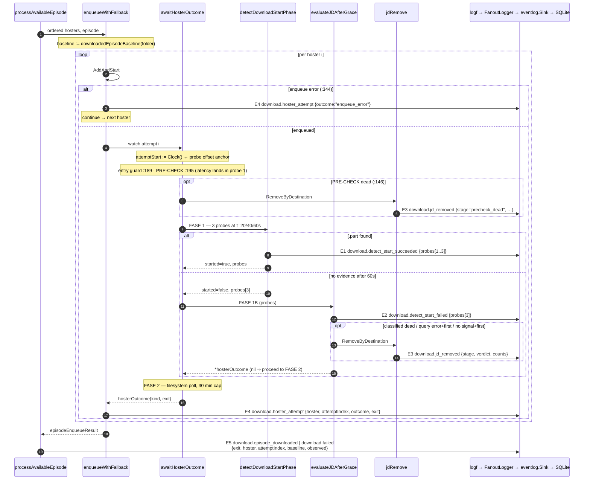

# Design — SDD-61 Download Attempt Observability

Change: `2026-08-29-sdd-61-download-attempt-observability`
Inputs: `proposal.md`, `explore.md`, SDD-20 `observability-v2/design.md` (additive `Fields`/`Logf`, `omitempty` — not contradicted here).
Delivery: two sequential commits on `main`, one work unit each. Slice 1 = items 1, 1b, 2, 4. Slice 2 = item 3.

> **Deliberate override of the `sdd-design` 800-word budget**, on the same basis the proposal used. The orchestrator's deliverable list mandates four artifacts that do not compress: a sequence diagram, the closed `exit` enum named exhaustively, the worst-case metadata calculation, and the slice boundary. Everything else is tables.

---

## 1. Technical Approach

One rule governs the whole change: **a fact reaches forensics only through `s.logf`**. `s.publish` feeds the in-memory bus (Wails + WS) and never reaches SQLite, so `internal/events/event.go` is untouched by construction, not by discipline.

Five emissions, all `logf`, all inside `internal/download`. Three are new events, two widen existing maps. No verdict, branch, counter or outcome changes value.

The only two shape changes are **narrowing** ones — each removes a way to be wrong:

- `detectDownloadStartPhase` returns `(bool, []probe)` instead of `(bool, *hosterOutcome)`. Its second value is discarded today (`service_hoster_watch.go:200`); it becomes the evidence the change exists to capture.
- `evaluateJDAfterGrace` returns `*hosterOutcome` (nil = proceed) instead of `(bool, hosterOutcome)`. This **deletes** the `hosterOutcome{}` sentinel at `:261` rather than documenting it.

---

## 2. Architecture Decisions

| # | Decision | Choice | Alternatives rejected | Rationale |
|---|---|---|---|---|
| D1 | `exit` representation | **Defined string type** `type exitReason string`, zero value `""` = unset | `iota` int + `String()`; a bare `string` field | The package uses `iota` for control-flow enums (`hosterVerdict`, `hosterOutcomeKind`) and plain strings for values that reach metadata (`FailureKind*`). `exit` is the latter. Decisive: with `iota`, the **zero value is a real exit** — the exact sentinel hazard of correction 3. With a string type the zero value is "never stamped" and is assertable. A named type still blocks assigning an arbitrary string at the stamp site. |
| D2 | Sentinel at `evaluateJDAfterGrace:261` | Return `*hosterOutcome`; the proceed path returns **`nil`** | Return `hosterOutcome{}` and document "do not stamp"; add a `stamped bool` | Structural, not documentary: on the proceed path **no struct exists**, so there is no `exit` field to stamp wrongly. It also mirrors the nil-pointer idiom `detectDownloadStartPhase` uses today, and collapses the awkward `(proceed, outcome)` pair. Zero test cost — verified: **no test calls `evaluateJDAfterGrace` directly.** |
| D3 | Splitting `:221` | Two sequential `if`s, **deadline checked first** | One `if` with a computed reason; check `ctx` first | `\|\|` evaluates left-first today, so deadline-first preserves the label when both are true. Same truth table, same `kind` — provably zero behavior change. |
| D4 | Enum + `probe` home | New file `internal/download/service_hoster_watch_exit.go` | Append to `service_hoster_watch.go` (282 raw) | Keeps the primary production file clear of the ceiling across **both** slices, and gives the closed enum one reviewable home. Matches the package's existing per-concern file split. |
| D5 | Probe offset origin | `attemptStart := s.deps.Clock()` as the **first statement of `awaitHosterOutcome`**, passed down; `elapsedMs = clock().Sub(attemptStart).Milliseconds()` | (a) anchor at detect-phase start; (b) thread the enqueue instant from `enqueueWithFallback`; (c) `time.Now()` | (a) is **information-free**: detect-relative offsets are always exactly 20000/40000/60000, so the array degenerates into three booleans plus decoration and fails the change's own "does it enable a decision" test. (b) changes `awaitHosterOutcome`'s signature → 8 edits in the frozen test file. (c) is untestable. Anchoring at attempt start costs **zero** signature change there (`attemptStart` is a local; `Clock()` is already called at `:209`), keeps the 20 s schedule readable as the *spacing between* entries, and makes the *first* offset expose pre-check latency. See §2.2. |
| D9 | Recorder placement | New `fieldsRecorder` in the new test file, embedding `logger.Logger` so the four no-op methods vanish | Widen `renameEventRecorder` in place | Widening forces renaming `renameEventRecorder` at every call site in `service_rename_test.go` — a file outside this change's blast radius — for the same net line count, and re-verification of the rename tests. Embedding removes the only real duplication (interface boilerplate). Rule of three: extract when a third recorder appears. |
| D10 | `animeRunOutcome` guard | Distinct named type (compile-time) **plus** a reflect test asserting no *forensic-named* field exists (run-time) | A doc comment; pinning the exact field count/list | A doc comment is not deterministic, and pinning the exact field set would break when SDD-60 legitimately adds a notification field. Pinning the **forbidden vocabulary** fails precisely on the hazard and stays quiet for legitimate growth. See §9. |
| D6 | `jd_removed` payload | **Counts and booleans only**; `links`/`packages` are `len(...)`, never the arrays | Serialize truncated `Links`/`PackageSignals`; cap array length | The 4 KB bound is all-or-nothing: one oversized array replaces the *entire* map with `{"_truncated":...}`, destroying the `probes` array beside it. A count is 1–3 digits and cannot overflow; a capped array still grows with the cap. `DestinationStatus` carries no names/files/URLs/`SaveTo`, so counts lose nothing that exists at that layer. |
| D7 | `observed` isolation (R7) | Computed **only** inside the terminal `return` that builds `episodeEnqueueResult` | Compute once at loop top and reuse | A value that does not exist before the return cannot be branched on. Pinned by the D1-replay test in §6. |
| D8 | Result plumbing | `enqueueWithFallback` returns `episodeEnqueueResult`, unpacked into a `logf` map **inside `processAvailableEpisode` and discarded** | Widen `animeRunOutcome`; thread a pointer accumulator | `animeRunOutcome` is aliased by `animeProgressDelta` (`service.go:228`), so widening it leaks forensics into the live progress fan-out and collides with SDD-60's `service_notification_rows.go`. An accumulator adds a second control-flow channel. |

### 2.1 The one production change — declared, not buried

`detectDownloadStartPhase` **does not call `s.deps.Clock()` today**. This design makes it call it, for the first time, to stamp `probe.elapsedMs`. That is a production change inside a change branded "instrumentation only", so it is declared here rather than left for `sdd-verify` to discover.

**Justification:** a timestamp the test cannot distinguish is not observability. Under the fixed clock this package's tests default to, a probe array records `elapsedMs` = 0, 0, 0 — a field that is present, well-formed, and worthless. The alternative is no timeline at all, which is the gap the change exists to close.

**Blast radius is provably nil:** the call is read-only, its result is written only into the returned `[]probe`, and no branch, guard, loop condition or return value reads it. `PollSleep` still governs the schedule. The MUTATE step pins this: reverting `s.deps.Clock()` to a constant must produce a mutant that `ditto staged` kills.

### 2.2 Probe offsets are anchored at ATTEMPT start — and why that is not a detail

`attemptStart := s.deps.Clock()` is captured as the **first statement of `awaitHosterOutcome`** and passed into `detectDownloadStartPhase`. What separates that line from the real enqueue instant is `s.jdMu.Unlock()` and one `if err != nil` — microseconds. It is enqueue-equivalent for every decision this field serves, so this is **literal spec compliance**, not a deviation.

Cost: `awaitHosterOutcome`'s signature is **unchanged** (`attemptStart` is a local, and it already calls `Clock()` at `:209`), so its 8 call sites in the frozen test file are untouched. `detectDownloadStartPhase` gains one parameter, with exactly **one production call site** (`:200`) plus its four tests.

**The rejected alternative — anchoring at detect-phase start — is information-free.** Its offsets are *always* 20000/40000/60000, because the 20 s schedule is the only thing between the anchor and each probe. A field whose value is constant enables no decision and fails this change's own acceptance criterion; the array would collapse into three booleans plus decoration.

Anchored at attempt start, one array stays readable in **two** dimensions:

| Read | What it shows |
|---|---|
| The **first** offset | Latency between "bridge handed JD the links" and "the probe schedule actually ran" — the one piece of variable bridge-side timing in the whole sequence. |
| The **spacing between consecutive** offsets | Schedule adherence: still 20 s apart. |

That variability is not hypothetical. In the incident, Mushoku's attempt began ≈23:25:03 and JD did not begin transferring until ≈23:25:45. That 42 s is exactly what turns a marginal catch into a miss, and detect-relative offsets erase it by construction.

**Naming: `elapsedMs`, not `elapsedMs`.** The value is an offset; `elapsedMs` would read as an epoch beside the row's own `occurred_at_ms`. **Divergence to record:** the spec text names this key `elapsedMs` in two places (its requirement body and its scenario). `sdd-tasks` and `sdd-verify` MUST treat `elapsedMs` as the contract; the spec's key name is superseded by this ruling.

---

## 3. The `exit` enum — closed, 17 values

**Independently enumerated from source; matches the spec's table value-for-value at 17.** (The brief's original 16 counted `:221` once while separately mandating its split.) Values are `exitReason` string constants. `exitUnset` (`""`) is never emitted — and does real work, see #17.

**Naming: adopted from the spec's indicative table verbatim.** Design owns naming, but three of my own drafts were worse and I dropped them: `grace_jd_unavailable_*` collided confusingly with the pipeline's `jd_unavailable` (spec's `grace_client_absent_*` does not), and `cancelled_during_watch` was vaguer than `cancelled_during_poll`, which pairs with `fs_poll_deadline`. Gratuitous divergence would cost `sdd-tasks` a translation table for nothing.

**Attempt-level — stamped on `hosterOutcome` (slice 2)**

| # | Site | Value | `kind` | Side effect |
|---|---|---|---|---|
| 1 | `:186` | `counter_unavailable` | timeout | none |
| 2 | `:191` | `disk_ahead_at_entry` | success | flatten only — **no rename** |
| 3 | `:196` | `precheck_dead` | dead | `jdRemove` (via `:146`) |
| 4 | `:213` | `fs_poll_confirmed` | success | `completeDownloadedEpisode` — rename + flatten |
| 5 | `:221a` | `fs_poll_deadline` | timeout | none |
| 6 | `:221b` | `cancelled_during_poll` | timeout | none |
| 7 | `:238` | `grace_client_absent_first` | dead | none |
| 8 | `:240` | `grace_client_absent_fallback` | timeout | none — **mirror of 7** |
| 9 | `:249` | `grace_query_error_first` | dead | `jdRemove` (`:248`) |
| 10 | `:251` | `grace_query_error_fallback` | timeout | none — **mirror of 9** |
| 11 | `:256` | `grace_classified_dead` | dead | `jdRemove` (`:255`) |
| 12 | `:266` | `grace_no_signal_first` | dead | `jdRemove` (`:265`) |
| 13 | `:268` | `grace_no_signal_fallback` | timeout | none — **mirror of 12** |

The three mirrors (8, 10, 13) are exactly what `hosterOutcomeKind` cannot express: identical `kind`, different cause, opposite fixes.

**Pipeline-level — resolved in `enqueueWithFallback` (slice 2)**

`enqueueWithFallback` tracks `lastExit exitReason`, initialised to `exitUnset`:

| # | Site | Value | Model |
|---|---|---|---|
| 14 | `:344`/`:348` | `enqueue_error` | **Always an ATTEMPT exit** (so it always emits its own `hoster_attempt` row — §5). It `continue`s, so it becomes the EPISODE exit only by surviving as `lastExit` when the loop ends — i.e. only on the last attempted hoster. |
| 15 | `:324` | `jd_unavailable` | pre-attempt return; no attempt ever ran |
| 16 | `:335` | `cancelled_before_attempt` | pre-attempt return, mid-loop |
| 17 | `:366` | `no_hosters` **iff `lastExit == exitUnset`**, otherwise `lastExit` | One `return` statement serves both the empty-`ordered` fall-through and the exhausted chain. `exitUnset` is the discriminator: it can only survive when **no attempt ever ran**. |

#17 is the load-bearing detail. `:366` is shared by "the link extractor produced nothing" and "every hoster failed", and today both report the same pre-initialised `FailureKindHosterDown`. Reading `lastExit == exitUnset` separates them **without a new branch on any behavior-carrying value**, and satisfies the spec's rule that an exhausted chain reports the last attempt's terminal value rather than a synthetic `exhausted`. No 18th value.

**Slice split of the enum.** Slice 1 declares `exitReason` plus **only values 3, 9, 11, 12** — the four `jdRemove` sites, used as `jd_removed.stage`. Slice 2 adds the other 13. Reason: `unused` (U1000) is enabled in `.golangci.yml`, so shipping 13 unused unexported constants risks a gate failure for no benefit. Every constant is used in the commit that introduces it. The enum is reviewable as a closed set here, in this table.

---

## 4. Sequence diagram — one hoster attempt



| Emission | Event | Level | Site | Slice |
|---|---|---|---|---|
| E1 | `download.detect_start_succeeded` | info | `service_hoster_watch.go:118` (new) | 1 |
| E2 | `download.detect_start_failed` | warn | `:232` (widened) | 1 |
| E3 | `download.jd_removed` | warn | `jdRemove:273` (new) | 1 |
| E4 | `download.hoster_attempt` | info | `service_pipeline.go:348`, `:351-364` (new) | 1 (+`exit` in 2) |
| E5 | `download.episode_downloaded` / `download.failed` | info / error | `service_pipeline.go:192`, `:183` (widened) | 2 |

`DetectStartPhaseDisabled=true` (test seam) still returns early at `:105` and emits nothing — byte-identical to today.

---

## 5. Data flow and the `hoster_attempt` invariant

```
awaitHosterOutcome ──hosterOutcome{kind,exit}──> enqueueWithFallback ──tracks lastExit──┐
                                                                                        │
                                        episodeEnqueueResult (distinct named type) ──────┘
                                                    │
                                                    ▼
                                    processAvailableEpisode ──logf(map)──> eventlog ──> SQLite
                                                    │
                                                    └── DIES HERE (local scope)
                                                            ╳
                        animeRunOutcome ══ animeProgressDelta   (SAME TYPE — alias, service.go:228)
                                 │                    │
                                 ▼                    ▼
                     notification rows          LIVE progress fan-out ──> Wails / WS / UI
                     (SDD-60 territory)
```

**Why the `╳` needs a deterministic guard, not a comment.** `animeProgressDelta` is a type **alias** (`=`), so the two names denote one type with 24 non-test references. A forensic field hung on the outcome lands in **user-facing live progress payloads**, and nothing in either name warns of it. At apply time, hanging `exit` on `outcome` is the path of *least* resistance, because the result struct is already threaded to the emit site. Two guards, in §8 (compile-time) and §9 (run-time).

**Invariant discovered during design, not in the brief:** "exactly one `hoster_attempt` per attempt" is violated by the enqueue-error path, which `continue`s at `:348` **without reaching the switch**. Item 4 must therefore emit at **two** places, not three branches of one. Named here so `sdd-tasks` does not inherit explore.md's false "zero plumbing" claim.

`outcome` vocabulary (slice 1): `"success"`, `"dead"`, `"timeout"`, `"enqueue_error"`.

---

## 6. Metadata payload budget (R2)

Bound: `maxMetadataBytes = 4 * 1024` (`eventlog/types.go:22`), applied to the marshalled JSON, **all-or-nothing** (`metadata.go:33`). Typical and worst-case (40-char hoster, 4-digit episode, 3-digit counts):

| Event | Representative payload | Typical | Worst | % of 4096 |
|---|---|---|---|---|
| `detect_start_failed` | `{"attemptIndex":1,"episode":12,"failureKind":"hoster_down","hoster":"Mediafire","probes":[{"elapsedMs":23000,"found":false},{"elapsedMs":43000,"found":false},{"elapsedMs":63000,"found":false}]}` | 193 B | ~240 B | **5.9 %** |
| `jd_removed` | `{"anyFinished":true,"anyRunning":false,"attemptIndex":1,"crawlOffline":2,"crawlOnline":0,"episode":12,"hoster":"Mediafire","links":7,"matched":true,"packages":3,"stage":"grace_classified_dead","statusKnown":true,"verdict":"dead"}` | 236 B | ~300 B | **7.3 %** |
| `episode_downloaded` | `{"attemptIndex":1,"baseline":11,"episode":12,"exit":"fs_poll_confirmed","hoster":"Mediafire","observed":12}` | 108 B | ~150 B | **3.7 %** |
| `hoster_attempt` | `{"attemptIndex":0,"episode":12,"exit":"grace_classified_dead","hoster":"Mediafire","outcome":"dead"}` | 101 B | ~145 B | **3.5 %** |

Worst case across every new map: **~300 B, a 13× margin.** The margin is structural, not incidental: `probes` is bounded at **3 by construction** (`for i := range 3`), and `links`/`packages` are `len()` counts. **The bound is reachable only by introducing an unbounded array; D6 forbids one.** No key collides with the redaction list (`authorization/token/cookie/password/secret/api_key/bearer`).

---

## 7. File changes

| File | Action | Slice | Description |
|---|---|---|---|
| `internal/download/service_hoster_watch_exit.go` | **Create** | 1 → 2 | `type exitReason string` + 4 removal-stage values (slice 1); `type probe struct{elapsedMs int64; found bool}`. Slice 2 adds the other 13 values. |
| `internal/download/service_hoster_watch.go` | Modify | 1 → 2 | S1: `attemptStart` capture at the top of `awaitHosterOutcome` (local — **signature unchanged**), `attemptStart` param + probe offsets via `s.deps.Clock()` in `detectDownloadStartPhase`, `(bool, []probe)` return, E1, probes param on `evaluateJDAfterGrace`, `*hosterOutcome` return (sentinel deleted), E2 widened, `jdRemove` status param + E3. S2: `exit` on `hosterOutcome`, 13 stamps, `:221` split. 282 raw today → ~375 (S1) → ~425 (S2); effective materially lower. |
| `internal/download/service_pipeline.go` | Modify | 1 → 2 | S1: E4 at the switch **and** the enqueue-error `continue`. S2: `episodeEnqueueResult` return, `:181` unpack, E5 widened. 395 raw today. |
| `internal/download/service_hoster_watch_observability_test.go` | **Create** | 1 → 2 | All new tests + `fieldsRecorder`. **No new service builder** — reuses `newWatchTestService` (§9). |
| `internal/download/service_hoster_watch_test.go` | Modify | 1 | Four `detectDownloadStartPhase` tests repaired in place for the new return type — **call-site types only, zero assertion edits**. Nothing appended (422 effective, frozen). |
| `internal/download/service_rename_test.go` | **Untouched** | — | `renameEventRecorder` is NOT widened — see D9. |
| `internal/download/service_cancel_test.go`, `service_fallback_test.go` | Modify | **2** | Repaired for `enqueueWithFallback`'s struct return (R4). |
| `internal/download/service.go`, `service_notification_rows.go` | **Untouched** | — | Zero-line diff. Pinned by a success criterion. |
| `internal/events/event.go`, `internal/observability/eventlog/**`, `service_effects.go` | **Untouched** | — | `logf` already accepts `map[string]any`; metadata reaches the MCP with zero MCP change. |
| `docs/learning-log.md` | Append | 2 | Via `node scripts/log-lesson.mjs`, never by hand. |

`tools/checkgofilesize/baseline.yaml` stays `files: []`.

---

## 8. Interfaces / contracts

```go
// service_hoster_watch_exit.go
type exitReason string

const exitUnset exitReason = "" // never emitted; a stamped outcome always overwrites it

// probe is one FASE 1 filesystem check.
//
// elapsedMs is measured from attemptStart -- the top of awaitHosterOutcome, which is
// enqueue-equivalent -- NOT from the start of the detect phase. Detect-relative offsets
// would be the constant 20000/40000/60000 and would carry no information; anchored at
// attempt start, the FIRST offset exposes pre-check latency while the SPACING between
// consecutive entries still shows the 20s schedule. It is an offset, never an epoch.
type probe struct {
	elapsedMs int64
	found     bool
}
```

```go
// Signature changes (slice 1). awaitHosterOutcome's own signature is UNCHANGED --
// attemptStart is a local captured as its first statement, so its 8 test call sites
// in the frozen service_hoster_watch_test.go are untouched.
func (s *Service) detectDownloadStartPhase(ctx context.Context, runID, animeID, folder string, episode int, attemptStart time.Time) (bool, []probe)
func (s *Service) evaluateJDAfterGrace(..., isFirstHoster bool, probes []probe) *hosterOutcome // nil ⇒ proceed to FASE 2
func (s *Service) jdRemove(ctx context.Context, runID string, anime contracts.MobileAnime, hoster, folder string, stage exitReason, status *jdownloader.DestinationStatus)
```

```go
// Slice 2
type hosterOutcome struct {
	kind hosterOutcomeKind
	exit exitReason
}

// episodeEnqueueResult is a DISTINCT named type with no relationship to animeRunOutcome:
// assigning one to the other is a COMPILE ERROR. That is the structural half of the
// no-widening rule. It is consumed inside processAvailableEpisode to build one logf map
// and dies in that local scope.
type episodeEnqueueResult struct {
	succeeded    bool
	failureKind  string
	hoster       string
	attemptIndex int
	exit         exitReason
	baseline     int
	observed     int // RECORDED, NEVER ACTED ON (R7). Computed only in the terminal return.
}
```

The compile-time guard blocks the *wrong assignment*. It does not block someone adding an `exit string` field directly to `animeRunOutcome` — that is what the §9 reflect guard is for. Both are needed; neither is sufficient alone.

`status *jdownloader.DestinationStatus` is nil-able: site `:248` has no status by construction → `statusKnown:false`.

---

## 9. Testing strategy

**The vacuous-pass trap is real, and it is NOT where explore.md put it.** `newWatchTestService` (`service_hoster_watch_test.go:167-168`) **already advances the clock**: `deps.PollSleep = func(d){ *now = now.Add(d) }`. The seam is built. The actual hazard is that the four existing `detectDownloadStartPhase` tests build from `baseDeps` **directly** — fixed clock, no-op `PollSleep`. A probe-timestamp test written in the style of its immediate neighbours records `elapsedMs` = 0, 0, 0 and passes vacuously.

**Exactly one new helper — no duplicate builder.** `newWatchTestService` lives in the frozen file, but Go test files in a package share symbols, so the new file calls it directly. It does not expose `DetectStartPhaseDisabled` / `HasPartFiles`, but it returns `*Service` and **the repo already steers it post-construction**: `service_hoster_watch_test.go:506` does `s.deps.DetectStartPhaseDisabled = false` on exactly such a service. That established pattern is the whole answer:

```go
s := newWatchTestService(t, jd, counter, &now)   // advancing clock, already built
s.deps.DetectStartPhaseDisabled = false          // established pattern, :506
s.deps.HasPartFiles = func(string) bool { ... }  // NewService defaults this (service.go:179)
s.deps.Logger = rec                              // capture
```

| New helper | Why the existing one is insufficient |
|---|---|
| `fieldsRecorder` — implements **`logger.Logger`** (not `EntrySink`), installed as `deps.Logger`, retaining full `logger.Fields` incl. `Metadata` and `Level` | `renameEventRecorder` (`service_rename_test.go:70`) receives the full `Fields` and **discards everything but `EventType`**; every assertion here is about `Metadata`. Embedding `logger.Logger` supplies `Debugf/Infof/Warnf/Errorf`, so the only duplication — interface boilerplate — disappears. See D9 for why `renameEventRecorder` is not widened in place. |

| Layer | What to test | Approach |
|---|---|---|
| Unit | Probe offsets are real elapsed time, not a fixed clock | Zero-latency pre-check → assert `[]int64{20000, 40000, 60000}` as **literals**, never `int64(config.X)`. Three distinct values cannot pass under a fixed clock. |
| Unit | **Offsets are anchored at ATTEMPT start, not detect start** | **This is a distinct test and it is not optional.** The row above passes identically under BOTH anchors, so on its own it lets the "anchor at detect-phase start" mutant survive. Supply a JD fake whose `PackageStatusByDestination` advances the shared `now` by 3 s, then assert the literals `[]int64{23000, 43000, 63000}`. Only attempt-start anchoring produces those; detect-start anchoring yields 20000/40000/60000. This is also the only test that proves the field carries the pre-check latency the design claims it carries. |
| Unit | E1 persists on the success path | Probe 2 finds `.part` → exactly one `detect_start_succeeded`, `probes` length 2, last `found:true`. |
| Unit | E3 on **every** removal, incl. a successful one | `fieldsRecorder` asserts one `jd_removed` per `RemoveByDestination`, with `stage` matching the site and `statusKnown:false` for `:248`. |
| Unit | E4 invariant | N hosters → exactly N `hoster_attempt` rows, **including** an enqueue-error hoster and the winning one. |
| Unit | Metadata stays under the bound | Marshal each new map, assert `len < 4096` against the **literal** 4096 (never `maxMetadataBytes`, which is another package's unexported symbol and the very constant being pinned). |
| Unit (S2) | `:221` split | Deadline-exceeded → `fs_poll_deadline`; cancelled context → `cancelled_during_watch`; both → `fs_poll_deadline`. |
| Unit (S2) | No emitted `exit` is `exitUnset` | Every `hoster_attempt`/`episode_downloaded`/`failed` row asserts `exit != ""`. Also pins that `:261`'s proceed path persists no `exit` at all. |
| Unit (S2) | `no_hosters` ≠ exhausted chain | Empty `ordered` → `no_hosters`; a chain where every hoster failed → the **last attempt's** exit. Same `return` statement, different recorded value. |
| Unit (S2) | **R7 differential — `observed` is never a control input** | Table-driven **pair** differing ONLY in the counter's terminal value: assert identical `kind`, identical `failureKind`, identical run counters, and that **only `observed` differs** between the two persisted maps. This is the spec's scenario verbatim and it fails the moment anyone branches on `observed`. |
| Unit (S2) | R7 replay — `run-dl1532pqkk3g` | JD classifies dead in FASE 1B **while the disk count has already advanced past baseline**. Assert the episode still reports **failed**, `jdRemove` still fires, and `download.failed` carries `observed > baseline`. Records the defect without correcting it. |
| Unit (S2) | **`animeRunOutcome` deterministic guard** | Reflect over `animeRunOutcome`'s fields; fail if any is named in the forbidden forensic set `{exit, hoster, attemptIndex, baseline, observed, winningHoster}`, with a message naming the alias hazard. Also assert `reflect.TypeOf(animeRunOutcome{}) == reflect.TypeOf(animeProgressDelta{})`, so converting the alias into a defined type — which would silently void the guard's second half — fails loudly. Pins the **forbidden vocabulary**, not the field list, so SDD-60 adding a notification field stays green. |
| Integration | No wire/bus drift | `internal/events/event.go`, `docs/openapi.yaml`, mobile sync contract show a zero-line diff. `service.go` / `service_notification_rows.go` likewise. |

**MUTATE (mandatory, after green).** `ditto staged` (installed at `~/go/bin/ditto`) on both commits. Three mutants must die:

| Slice | Mutant | Killed by |
|---|---|---|
| 1 | `s.deps.Clock()` reverted to a constant | the probe-offset test (0,0,0 ≠ 20000,40000,60000) |
| 1 | **anchor moved from `attemptStart` to detect-phase start** | ONLY the 3 s-pre-check test above — the plain offset test survives this mutant |
| 2 | the `:221` split collapsed back into one `if` | the deadline-vs-cancellation pair |

Never assert against the production symbol being pinned — expected values as literals.

### 9.1 "Changes no behavior" — three cheap guards, not a bespoke harness

The spec states this as a full-run differential ("any download run replayed before and after"). An honest replay harness would cost more than the change it guards and would itself need verifying. **Agreed with the orchestrator's steer**, with one added precision:

| Guard | What it actually proves |
|---|---|
| (a) The R7 differential pair above | The one field that could plausibly become a control input demonstrably is not one. This is the only *new* behavioral risk the change introduces. |
| (b) The existing download suite green with **zero assertion edits** | Every pre-existing verdict, classification and counter assertion still holds. Slice 1 edits four call sites in `service_hoster_watch_test.go` and slice 2 edits call sites in `service_cancel_test.go`/`service_fallback_test.go` — **all type-only signature repairs**. The reviewable guard is deterministic: no `t.Fatalf` line and no expected-value literal changes in any pre-existing test. `sdd-verify` checks this against the diff, not by trusting a claim. |
| (c) `ditto staged` | A surviving mutant on a changed line is a behavior the suite does not pin. |

Together these cover the risk; a replay harness would add cost without covering anything (a)+(b)+(c) leaves open. Flagged rather than silently downgrading the spec's wording.

---

## 10. Slice boundary

| | Slice 1 — instrumentation without signatures | Slice 2 — the `exit` discriminator |
|---|---|---|
| Items | 1, 1b, 2, 4 | 3 |
| Events | E1, E2, E3, E4 | E5 + `exit` added to E4 |
| Enum | `exitReason` + 4 removal stages | +13 values, `:221` split |
| Signatures | `detectDownloadStartPhase`, `evaluateJDAfterGrace`, `jdRemove` — **all internal to `service_hoster_watch.go`** | `enqueueWithFallback` — **crosses into `service_cancel_test.go` / `service_fallback_test.go`** |
| Forecast | ~340 lines (315 + ~25 enum) | ~205 lines |

Slice 1 is independently shippable and green: it touches no cross-file signature, and every test it repairs lives in `service_hoster_watch_test.go`. All of R4's breakage is quarantined in slice 2 — that is what makes the fault line clean rather than arbitrary.

**A second, independent reason slice 1 is the safer unit:** the `animeRunOutcome` widening pressure exists *only* in slice 2, because slice 2 is what introduces `episodeEnqueueResult` and threads it to the emit site. Slice 1 never touches the outcome, so both §8's compile-time guard and §9's reflect guard are slice-2 concerns. A slice-1 reviewer does not have to hold that hazard in their head at all.

**R8 stands and MUST be honoured in slice 1's report.** After slice 1, every destructive `jdRemove` is recorded and the probe timeline exists — but "was Mediafire's success **observed or inferred**" is still unanswerable, because that is `exit`. Slice 1's verify report must say so plainly and must not read as "the observability gap is closed".

---

## 11. Threat Matrix

**N/A** — no routing, shell, subprocess, VCS/PR automation, executable-file classification, or process-integration boundary. The change adds `logf` calls and narrows three internal signatures inside one Go package. `RemoveByDestination` is called at exactly the sites that call it today, with unchanged arguments.

---

## 12. Migration / rollout

No migration. No schema change (`runtime_events`/`metadata_json` unchanged; new keys are simply absent from older rows and `EventRecord` unmarshals a partial map). No REST route, WS message or bus field. Rollback is `git revert` per commit; items 1, 1b, 2 and 4 are each a self-contained `logf` and revert individually.

Retention (R5): ~2 extra rows per hoster attempt per episode, est. 15–30 per run against the shared 20 000-row cap. `sdd-verify` measures actual rows for one run rather than trusting the estimate.

---

## 13. Open questions

- [ ] **None blocking.** Corrections recorded and applied: the enum is **17** values, not 16, and now matches the spec's names verbatim (§3); item 4 needs **two** emit sites, not one (§5); the R6 trap is in `baseDeps`, not in `newWatchTestService`, which already advances correctly, so **no duplicate builder is designed** (§9); the recorder implements `logger.Logger`, not `EntrySink` (§9).
- [ ] **Probe anchor resolved** (§2.2) — offsets anchor at `attemptStart` (top of `awaitHosterOutcome`), which is enqueue-equivalent and therefore literal spec compliance, at zero signature cost. The earlier detect-relative proposal was withdrawn: its offsets are constant and carry no information.
- [ ] **One naming divergence to propagate, not blocking:** the key is **`elapsedMs`**; the spec text still says `elapsedMs` in two places. `sdd-tasks` and `sdd-verify` take `elapsedMs` as the contract. Worth a spec touch-up at archive time so the artifacts do not disagree.
