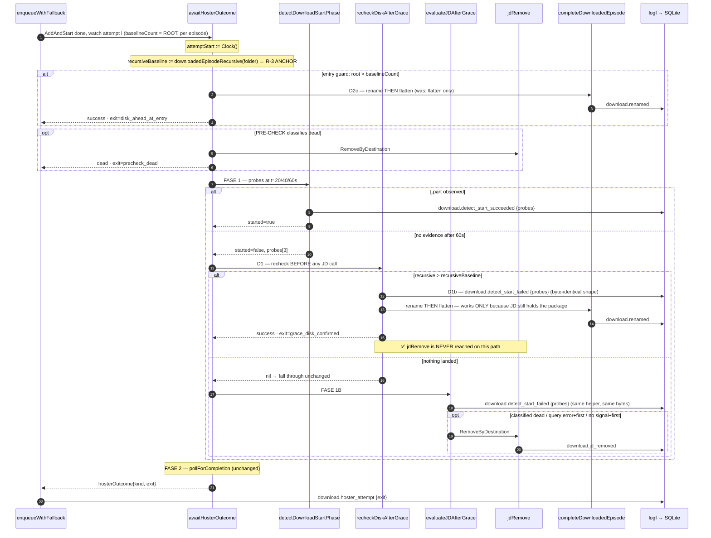

# Design — SDD-62 Download Hoster Verdict Fix

Change: `2026-08-29-sdd-62-download-hoster-verdict-fix`
Inputs: `proposal.md`, `explore.md`, the delta specs at `specs/download/observability.md` (3 MODIFIED +
1 ADDED) and `specs/download/orchestration.md` (3 ADDED), and archived SDD-61 `design.md` (its D1–D8 are the
house style for this area and are not contradicted here).
Scope: **D1 + D1b + D2c**, one work unit, `single-pr`, ~410 forecast lines against 400.

> **Deliberate override of the `sdd-design` 800-word budget**, on the SDD-61 precedent. The orchestrator
> mandates four artifacts that do not compress: the sequence diagram, the argued R-3 decision, the D1b
> event decision, and the named mutants. Everything else is tables.

---

## 1. Technical approach

One rule governs the change: **success truth is read from the filesystem, and a verdict may only be
declared over a reading taken on the SAME basis as the baseline it is compared against.**

`awaitHosterOutcome` gains one guard between "the detect phase saw no transfer" and "therefore ask JD
whether to kill it". The guard is a disk re-read. It runs BEFORE `evaluateJDAfterGrace` — which is
load-bearing, because `RenameEpisodeByDestination` picks the newest finished link under the
destination, so the rename works only while JD still holds the package, and `evaluateJDAfterGrace`
contains two `jdRemove` sites.

Three code deliverables, all inside `internal/download`:

- **D1** — `recheckDiskAfterGrace` + an 18th `exitReason`.
- **D1b** — the re-check persists the probe timeline it short-circuits past.
- **D2c** — the entry-guard success calls `completeDownloadedEpisode` instead of `flattenDownloadFolder`.

No signature of `awaitHosterOutcome` changes; no `animeRunOutcome` field is added; `evaluateJDAfterGrace`
keeps its 8-parameter signature.

---

## 2. THE decision: R-3, the comparison basis

### 2.1 The invariant, and why the exploration's proposal violates it

| Reader | Formula | Basis |
|---|---|---|
| `downloadedEpisodeBaseline(folder)` | `max(HighestEpisodeAtRoot, CountAtRoot)` | **root** |
| `downloadedEpisodeRecursive(folder)` | `max(HighestEpisodeRecursive, CountRecursive)` | **recursive**, always ≥ root |

`baselineCount` is captured at **root** (`service_pipeline.go:387`). Comparing a recursive reading against
it means residue that was already on disk before the attempt started counts as new work. The exploration's
justification for doing it anyway — *"`prepareAnimeDownload` flattens before the run, so pre-run residue is
already in the root baseline"* — is **false, and I verified both halves**:

1. **`Flatten` is ONE level deep by construction.** `flattenOneSubdir` skips nested directories
   (`filesystem/flatten.go:99`, and its doc comment says so). A video at `folder/JD-pkg/sub/x.mp4`
   survives every flatten this system will ever perform, and `CountRecursive` counts it forever. Under
   recursive-vs-root that residue produces `recursive > rootBaseline` on the **first attempt of every
   episode, permanently** — a false success on every episode of that anime, forever.
2. **The two flushes are on different clocks.** `prepareAnimeDownload` flattens once per anime per RUN
   (`service_pipeline.go:74`); `baselineCount` is captured per EPISODE (`:387`). Junk left in a level-1
   subfolder by a failed episode earlier in the same catch-up loop is invisible to the next episode's root
   baseline and visible to a recursive read.

That is a permanently skipped episode — the failure `episodeNumberFromName`'s own comment calls "silent and
permanent" — and it is strictly worse than the defect being fixed. **Rejected.**

### 2.2 Decision

**Capture an ATTEMPT-SCOPED recursive baseline as a local at the top of `awaitHosterOutcome`, and compare
recursive-to-recursive.**

```go
recursiveBaseline := s.downloadedEpisodeRecursive(folder)   // captured before the entry guard
...
if s.downloadedEpisodeRecursive(folder) > recursiveBaseline { /* success */ }
```

Both sides use the recursive basis, and the baseline is captured on that basis. Residue present when the
attempt began cancels out exactly.

| Option | Verdict |
|---|---|
| (a) root-to-root | **Rejected.** Same basis, so it is sound, but it cannot see a file JD left in a package subfolder — which is the entire case D1 exists to catch. It degenerates into the entry guard evaluated 60 s later. |
| (b) flatten first, then root-to-root | **Rejected, and it is the worst option.** Flattening stale residue MOVES it to root, so it both fakes this success and permanently corrupts the ROOT baseline every later episode reads. It converts a recoverable read error into a written one. |
| (c) recursive-to-recursive, baseline captured at ATTEMPT start | **Chosen.** |
| (d) recursive vs. the episode root baseline (exploration's proposal) | **Rejected** — §2.1. |

### 2.3 Why the attempt scope is the right window, not merely a safe one

The capture point makes the two success guards partition cleanly, with no overlap and no gap:

| Guard | Basis | Baseline scope | Question it answers | Exit |
|---|---|---|---|---|
| Entry guard | root | episode (`baselineCount`) | "was the disk already ahead before this attempt began?" | `disk_ahead_at_entry` |
| Post-grace re-check | recursive | **attempt** (`recursiveBaseline`) | "did anything land anywhere under the folder DURING this attempt?" | `grace_disk_confirmed` |

`AddAndStart` runs immediately before `awaitHosterOutcome` (`enqueueWithFallback`), so attempt start is
enqueue-equivalent — the same equivalence SDD-61's D5 established for `attemptStart`. The window therefore
covers exactly this hoster's transfer window, including the pre-check round trip (measured at 3 s in the
SDD-61 tests and ~42 s in the incident).

**Proof the defect is still caught.** The defect is a transfer that starts and finishes inside a blind gap.
The file lands at some `T > attemptStart`, so `recursive(T) > recursive(attemptStart)`. Caught. ✓

**Proof no false success survives.** For a false success, `downloadedEpisodeRecursive` must rise during the
attempt without a video landing. `CountRecursive` cannot rise without a new video file. `HighestEpisodeRecursive`
can rise on a rename of an existing file — but Bridge renames only after declaring success, and the file was
already counted by `CountRecursive` in the baseline `max`. The residual is a JD-side post-processing rename of a
pre-existing unparseable file into a parseable higher number. It requires a JD feature this integration does not
use, and it is strictly narrower than the pre-existing exposure on the `fs_poll_confirmed` path, which runs the
same `max` against the same counter. **Recorded, not mitigated.**

**Pre-existing hazard NOT widened.** `pollForCompletion:245` already fires a `Flatten` on
`downloadedEpisodeRecursive(folder) > baselineCount` — the exact recursive-vs-root comparison rejected above —
so residue already causes a spurious flatten today, and flatten-inflated root counts are a pre-existing cursor
hazard. D1's flatten fires on the strictly narrower recursive-vs-recursive condition, so it fires **less** often
than the one already shipped. Out of scope; stated so nobody attributes it to this change.

---

## 3. D1b: which event carries the probe timeline

**Decision: REUSE `download.detect_start_failed`, emitted BYTE-IDENTICALLY on both paths.**

The delta spec's ADDED requirement *"The Post-Grace Disk Re-Check Records Its Own Evidence"* binds this as a
MUST: *"The carrier MUST be the SAME `download.detect_start_failed` event type the JD evaluation uses, at the
same level and **with the same metadata shape**"*, and its scenario *"The probe carrier keeps the shape it has
on the failed-detect path"* requires event type, level and metadata shape to be identical. A new event type
would also have violated the shipped probe requirement, whose failed-detect scenario names
`download.detect_start_failed` explicitly.

"Exactly one entry per attempt" holds by control flow, not discipline: `detect_start_succeeded` cannot fire
(`started == false`) and `evaluateJDAfterGrace` never runs on this path.

**An earlier draft of this design added a `diskConfirmed` discriminator and omitted `failureKind` on the
confirmed path. Both are WITHDRAWN — the spec bound identical shape, and the reasoning behind the withdrawal
is better than the reasoning behind the addition:**

| Withdrawn | Why the spec is right |
|---|---|
| `diskConfirmed` metadata key | The spec names the reader path instead, in the same scenario: *"the per-attempt ledger entry for that attempt MUST record a success `outcome`"*. `download.hoster_attempt` already carries `exit: grace_disk_confirmed` in its message text (reachable by `Text LIKE`, SDD-61 R-3), joined on `run_id` + `entity_id` + `hoster`, which is unique because each hoster appears once in the resolved priority order. The D3 query is reachable without a second discriminator. |
| Omitting `failureKind` on the confirmed path | The entry records the DETECT PHASE's outcome, not the attempt's — and `evaluateJDAfterGrace` already emits it today on attempts that go on to SUCCEED via `exitFSPollConfirmed`, because its `hasPositiveJDSignal` branch returns `nil` and the caller proceeds to FASE 2. It was never a failure marker, so there is nothing to correct. The spec closes the loop: *"A reader determines the attempt's outcome from those, never from the detect phase's record."* |

Implementation: extract `logDetectStartFailed(runID, anime, hoster, probes)` and call it from
`recheckDiskAfterGrace` and from `evaluateJDAfterGrace`'s first statement. One call site's worth of code, one
key set, one message text — identity is then structural rather than a thing tests must police.

---

## 4. Sequence — one hoster attempt, showing the re-check against `jdRemove`



The `✅` note is the whole change: today that arrow reaches `jdRemove` over a finished package.

---

## 5. Interfaces / contracts

```go
// service_hoster_watch.go — awaitHosterOutcome, unchanged signature.
recursiveBaseline := s.downloadedEpisodeRecursive(folder)

started, probes := s.detectDownloadStartPhase(ctx, runID, anime.ID, folder, episode, attemptStart)
if !started {
    if outcome := s.recheckDiskAfterGrace(ctx, runID, anime, hoster, folder, recursiveBaseline, episode, probes); outcome != nil {
        return *outcome
    }
    if outcome := s.evaluateJDAfterGrace(ctx, runID, anime, hoster, folder, episode, isFirstHoster, probes); outcome != nil {
        return *outcome
    }
}
```

```go
// recheckDiskAfterGrace re-reads the filesystem after the detect phase saw no transfer, BEFORE any
// verdict is asked of JD. JD status is failure truth; the filesystem is the only success truth.
//
// recursiveBaseline is read at the TOP of this attempt and on the SAME recursive basis as the reading
// it is compared against. It is deliberately NOT baselineCount: that value is a ROOT count, and a
// recursive reading against a root baseline lets residue in a package subfolder -- which Flatten never
// reaches past one level -- declare a success that never happened, permanently skipping a real episode.
//
// It MUST run before evaluateJDAfterGrace: RenameEpisodeByDestination resolves the newest finished link
// under the destination, so the rename works only while JD still holds the package that function removes.
func (s *Service) recheckDiskAfterGrace(ctx context.Context, runID string, anime contracts.MobileAnime,
    hoster, folder string, recursiveBaseline, episode int, probes []probe) *hosterOutcome
```

```go
// service_hoster_watch_exit.go — 18th value, consumed by its only return site in the same commit.
// exitGraceDiskConfirmed is a success the detect phase MISSED: no .part evidence appeared during the
// 60s grace, but the filesystem had advanced past this attempt's own recursive baseline by the time the
// grace ended. It renames and flattens, and it is the only success exit that fires with JD still holding
// the package.
exitGraceDiskConfirmed exitReason = "grace_disk_confirmed"
```

Two comment de-stalings in the same file, both mandatory:

- The type comment `The enum is CLOSED at 17 values … thirteen attempt-level terminal points` → **18** / **fourteen**.
- `exitUnset`'s `…needs no synthetic "exhausted" eighteenth value` → drop the ordinal entirely
  (*"needs no synthetic 'exhausted' value of its own"*), so it cannot go stale on the next added exit.

---

## 6. File changes

| File | Action | Description |
|---|---|---|
| `internal/download/service_hoster_watch.go` | Modify | `recursiveBaseline` local; `recheckDiskAfterGrace`; one call in `awaitHosterOutcome`; entry guard → `completeDownloadedEpisode` (D2c); `logDetectStartFailed` extracted and called from both sites. |
| `internal/download/service_hoster_watch_exit.go` | Modify | 18th value + doc comment; two comment de-stalings. |
| `internal/download/service_hoster_watch_recheck_test.go` | **Create** | All new D1/D1b tests. |
| `internal/download/service_hoster_watch_exit_test.go` (222 lines) | **Modify — MANDATORY** | `:180-182` asserts `0` renames on the entry-guard success. **D2c makes that test RED.** See §8 correction C2. |
| `internal/download/service_pipeline_exit_test.go` (405 lines) | **Modify — MANDATORY** | `deadOverAdvancedDiskEpisode:310` advances only `atRoot`, a state production cannot produce. Making it faithful turns two SDD-61 tests from dead-verdict to disk-confirmed success. See §8 correction **C5** — this is the largest unforecast item in the change. |
| `internal/download/service_hoster_watch_observability_test.go` (289 lines) | **Untouched** | `recorder.only(t, "download.detect_start_failed")` still holds and the entry is byte-identical; its fixtures use `recursive == baseline`, so the re-check never fires. Byte-identical D1b emission is what keeps this file out of the diff. |
| `internal/download/service_pipeline.go`, `service.go`, `service_notification_rows.go` | **Untouched** | `enqueueWithFallback` already records any exit; `animeRunOutcome` not widened. |
| `openspec/specs/download/observability.md`, `orchestration.md` | Modify | Via delta specs at archive time (S1, S2, S3). **F1 needs no spec change** — §3. |
| `docs/learning-log.md` | Append | `node scripts/log-lesson.mjs`, never by hand. |

Frozen (append nothing): `service_hoster_watch_test.go` (523 raw), `service_pipeline_exit_test.go` (405),
`service_run_status_test.go` (469), `app_download_test.go` (~497 effective). `baseline.yaml` stays `files: []`.

---

## 7. Testing strategy

`gocognit` limit is 15. `awaitHosterOutcome` gains one `if` nested one level (+2) landing near 10;
`recheckDiskAfterGrace` is ~2. Per-case assertions go into `t.Helper()` functions so table-driven tests stay
under the limit — SDD-61 was bounced there once.

**Seam (R-2).** Every test uses `newProbeWatchService` (`service_hoster_watch_observability_test.go:81`):
`newWatchTestService` + `DetectStartPhaseDisabled=false` + injectable `HasPartFiles`, on an advancing clock
(`PollSleep` moves the shared `now`). A fixed clock makes the guard's own tests pass vacuously. The `hasPart`
callback is the side channel for "a file lands during the grace": return `false` while mutating
`counter.recursive[folder]` on probe 3.

**Counter fidelity rule (new, and it is a correctness rule, not a style one).** `svcFakeCounter` lets a test set
`atRoot > recursive`. Production cannot: `CountRecursive` walks the root it counts, so
`downloadedEpisodeRecursive >= downloadedEpisodeBaseline` ALWAYS holds. **Every fixture that advances a count
MUST advance `recursive` by at least as much as `atRoot`.** A fixture that breaks the invariant can make a test
pass while pinning a state the system cannot reach — which is exactly what C5 found.

| # | Test | Asserts |
|---|---|---|
| T1 | Landing inside a package subfolder — advance **`recursive` only** | success, `exit == "grace_disk_confirmed"` (**literal**), and no removal recorded. Advancing only `recursive` is what makes this test kill the root-basis mutant; it is also the spec scenario *"A file that landed inside a package subfolder produces a success"* verbatim. |
| T2 | Nothing lands | falls through unchanged: `dead` + `grace_no_signal_first` on the first hoster, removal fired |
| T3 | **R-3 residue guard** | `recursive` starts ABOVE `atRoot`/`baselineCount` (residue) and never moves → MUST NOT succeed, and the attempt MUST continue to its existing post-grace evaluation. Spec scenario *"Pre-existing subfolder residue does not produce a success"*. This one test is the whole R-3 defence and is not optional. |
| T4 | Fallback position | a fallback hoster confirming on disk returns success, not timeout |
| T5 | D1b timeline | exactly ONE `download.detect_start_failed`, 3 probes, all `found:false` |
| T6 | **D1b shape identity** | the confirmed-path entry and the fall-through entry agree on event type, level and key set — assert the two maps have equal keys, in the spirit of `assertSameExceptObserved`. This is the spec's *"metadata shape MUST be identical"* made deterministic. |
| T7 | D1 renames | `download.renamed` persisted on the confirmed path (`RenameEpisodes` true, per `successExit`'s pattern) |
| T8 | **D2c** | entry-guard success persists `download.renamed` — the inverted assertion at `service_hoster_watch_exit_test.go:180` |
| T9 | Probe offsets still advance | strictly increasing `elapsedMs` on the confirmed path (proves the advancing clock is live) |
| T10 | **C5 rewrite** | with a faithful fake, the run-dl1532pqkk3g replay terminates in SUCCESS with `grace_disk_confirmed`, **zero removals**, and the re-scoped observed-count pair reaches the SAME terminal point differing only in `observed`. |

### Mutants that must die (`ditto staged`)

The suite is green today and gives ZERO protection (proposal R-1, correct for D1). These are the pins:

| # | Mutant | Killed by |
|---|---|---|
| M1 | `recheckDiskAfterGrace` always returns `nil` / the call is deleted | T1 |
| M2 | `>` → `>=` | T2 |
| M3 | **`recursiveBaseline` → `baselineCount`** (the R-3 mutant) | **T3 only** — T1, T2 and T4 all survive it |
| M4 | the re-check moved to AFTER `evaluateJDAfterGrace` | T1's removal assertion |
| M5 | `completeDownloadedEpisode` → `flattenDownloadFolder` on the re-check path | T7 |
| M6 | `completeDownloadedEpisode` → `flattenDownloadFolder` at the entry guard | T8 |
| M7 | the D1b emission deleted from the re-check path | T5 |
| M8 | `recursiveBaseline` captured AFTER the detect phase instead of at the top | T1 (baseline would equal the post-grace reading, so it never fires) |
| M9 | `exitGraceDiskConfirmed` → `exitFSPollConfirmed` | T1's literal string |
| M10 | `downloadedEpisodeRecursive` → `downloadedEpisodeBaseline` on BOTH sides (root-to-root) | **T1 only** — it advances `recursive` alone, so a root basis sees nothing. T3 survives this mutant, and so does every other test. T1 and T3 are therefore not redundant: each kills a basis mutant the other misses. |

Expected values are literals; never assert against the production constant being pinned.

---

## 8. Corrections to the brief (both verified against source)

**C1 — the proposal's R-3 justification is false.** §12.2 assumes `prepareAnimeDownload`'s flatten folds
pre-run residue into the root baseline. `Flatten` is one level deep (`filesystem/flatten.go:99`) and runs once
per anime per run while `baselineCount` is per episode (`service_pipeline.go:74` vs `:387`). §2.1 records this;
the design chooses (c), not the exploration's (d).

**C2 — "No existing test asserts the defect" is TRUE for D1 and FALSE for D2c.**
`service_hoster_watch_exit_test.go:180-182` (`TestAnObservedSuccessIsDistinguishableFromOneAlreadyOnDisk`,
subtest "already on disk when the attempt began") asserts **0 renames** on the entry-guard success, with the
message *"expected an entry-guard success to skip completion handling entirely"*. **D2c turns that test RED.**
The assertion must be inverted in place to expect exactly 1 rename, as S3's spec MODIFY requires. Declared here
so `sdd-apply` does not read it as a regression and `sdd-verify` does not read the edit as a red flag: it is the
one legitimate assertion edit in this change, and every other pre-existing assertion must remain untouched.

**C3 — the brief's `recheckDiskAfterGrace` parameter list is superseded.** It passes `baselineCount`; the design
passes `recursiveBaseline`. That substitution IS the R-3 answer.

**C4 — the brief's frozen-file list omits two files that are not frozen.**
`service_hoster_watch_observability_test.go` is 289 lines and `service_hoster_watch_exit_test.go` is 222 — both
have headroom, and `newProbeWatchService` lives in the first one. New tests still get their own file for
cohesion, but C2's edit must land in the second.

**C5 — a THIRD existing test is falsified, and it fails silently in the dangerous direction.**
`deadOverAdvancedDiskEpisode` (`service_pipeline_exit_test.go:303`) is SDD-61's `run-dl1532pqkk3g` replay. Its
fake advances `counter.atRoot[folder]` during the post-grace JD query and **leaves `counter.recursive[folder]`
at 4** (`:310-314`). That state — root 5, recursive 4 — is unreachable in production, because `CountRecursive`
walks the very root `CountAtRoot` reads.

Consequence: under this design the re-check reads `recursive` and sees `4 > 4 == false`, so
**`TestADeadVerdictOverAnAdvancedDiskCountIsRecordedAndNotCorrected` and
`TestTwoAttemptsDifferingOnlyInTheObservedCountBehaveIdentically` both stay GREEN — while asserting, by name and
by comment, the behaviour the delta spec has just declared false.** They would keep passing with
`recheckDiskAfterGrace` deleted. A green suite here is not evidence; it is the fixture's unfaithfulness
masquerading as one.

Required, and it is the largest unforecast item in the change:

1. `advance` must move `recursive` alongside `atRoot`, restoring `recursive >= root`.
2. `TestADeadVerdictOverAnAdvancedDiskCountIsRecordedAndNotCorrected` is renamed and rewritten to the MODIFIED
   scenario *"A dead verdict over an advanced disk count is corrected, and both counts recorded"*: success,
   `exit == "grace_disk_confirmed"`, **`jd.removals() == 0`**, `baseline`/`observed` still recorded.
3. `TestTwoAttemptsDifferingOnlyInTheObservedCountBehaveIdentically` moves from the episode-level failure entry
   to the episode-level success entry. It stays non-vacuous under the re-scoped scenario *"two attempts that
   reach the SAME terminal point"*: both now terminate at `grace_disk_confirmed` with `observed` 5 and 9, so
   `assertSameRunCounters` + `assertSameExceptObserved` still prove nothing branched on the recorded field.
4. `episodeLevelFailure` gains a success-side twin, or is generalised. `assertEpisodeForensics` and
   `assertSameExceptObserved` are reusable unchanged.

Estimate ~60 changed lines beyond the proposal's forecast, in a file at 405 of 500. Roughly line-neutral, since
the rewrite replaces rather than appends — but `go run ./tools/checkgofilesize` must be re-checked at apply time.

---

## 9. Threat matrix

**N/A** — no routing, shell, subprocess, VCS/PR automation, executable-file classification, or process-integration
boundary. The change adds one filesystem read, one `logf`, and moves an existing rename call. `RemoveByDestination`
is called at strictly fewer sites than today, never at more, and with unchanged arguments.

---

## 10. Migration / rollout

No migration. No schema, REST, WS or bus-event change: `grace_disk_confirmed` is a new string in an existing
`metadata_json` map, and `EventRecord` unmarshals a partial map. Rollback is `git revert` of the change commit
(proposal §9); D2c reverts alone, D1 and D1b revert together.

---

## 11. Open questions

- [ ] **None blocking.**
- [ ] **Residual gap, deliberately out of scope:** the PRE-CHECK `jdRemove` (`jdPreCheckIsDead`) still fires
  before any recursive read, so a file already sitting in a package subfolder when the attempt begins is
  destroyed with no re-check. The delta spec's *"The fresh reading precedes the package removal"* scenario is
  scoped to the attempt whose **post-grace** evaluation would remove the package, so this is outside its GIVEN.
  The window is seconds wide and the file cannot belong to this attempt. Recording it because the D1+D1b+D2c
  boundary excludes it, not because it is harmless.
- [ ] **No code change is needed for *"A completion-handling failure does not fail the episode"***.
  `renameDownloadedEpisode` and `flattenDownloadFolder` are already best-effort and already Warn-log
  `download.rename_failed` / `download.flatten_failed`. Stated so `sdd-tasks` does not invent work for a
  scenario the code already satisfies — but D1 and D2c both add rename calls on paths that had none, so
  `download.rename_failed` volume is expected to rise (proposal §9 lists it as an investigate-first signal,
  not a revert trigger).
- [ ] **Design owns the counting basis; the spec deliberately does not name it.** *"The Post-Grace Success
  Comparison Uses One Counting Basis"* mandates one basis, a baseline captured on it, and a basis wide enough
  to see package subfolders. §2 chooses recursive with an attempt-scoped baseline and satisfies both of its
  scenarios. If anyone later narrows the basis to root, T1 goes red — that is the intended failure.
