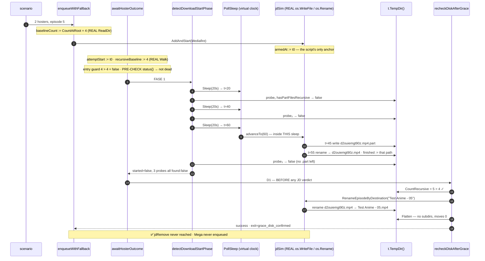

# Design — SDD-63 Download Core Integration Tests

Change: `2026-08-29-sdd-63-download-core-integration-tests`
Inputs: `explore.md` (authoritative, incl. corrections C4/C5), `proposal.md`, archived SDD-62 `design.md`
(shipped `31ef4d5` — every assertion targets POST-fix behaviour) and SDD-61 `design.md` (house style).
Scope: **test-only, one work unit, `single-pr`.** Production Go diff MUST be zero lines.
**No spec delta** — ruled by the orchestrator; `sdd-spec` is skipped for this change.

> **Deliberate override of the `sdd-design` 800-word budget**, on the SDD-61/62 precedent. Seven
> artifacts were mandated and do not compress: the `jdSim` contract, the exact `baseDeps` override
> set, the S1 sequence diagram, five per-scenario assertion lists, the file split, the runtime
> budget and the mutants. Everything that can be a table is one.

---

## 1. Technical approach

One rule governs the harness: **the virtual clock IS the scheduler, and it also drives real file
operations.** The suite is single-goroutine, so "JD writes the file between probe 2 and probe 3" is
lexical ordering inside one `PollSleep` call, not a timing window. Nothing races, so nothing needs a
mutex, a channel, or an `Eventually`.

```go
deps.Clock     = func() time.Time { return *now }
deps.PollSleep = func(d time.Duration) { *now = now.Add(d); sim.advanceTo(*now) }
```

Every scenario drives the core through **`enqueueWithFallback`** (S5 through
`downloadAvailableEpisodes`, which reaches it). Driving one level above `awaitHosterOutcome` costs
two lines of `[]hosterLink` and buys, for free and in every scenario: the per-attempt ledger
(`download.hoster_attempt` with `attemptIndex` and `exit`), `episodeEnqueueResult.baseline` /
`observed` read from real bytes, which hosters were enqueued, and one single anchor rule —
**t=0 is the first `AddAndStart`**, exactly the anchor SDD-61's D5 established for `attemptStart`.

Real `filesystem.NewEpisodeCounter()`, real `filesystem.NewFlattener()`, real
`hasPartFilesRecursive`, real `t.TempDir()`. The only fake left is JD itself, which is what a
JDownloader integration cannot have.

---

## 2. Architecture decisions

| # | Decision | Choice | Rejected | Rationale |
|---|---|---|---|---|
| D1 | Layout | **Two new files in package `download`** | New package; one file | The battery needs `baseDeps`, `ServiceDeps`, `enqueueWithFallback`, `downloadAvailableEpisodes`, `hosterLink`, `animeDownloadPreparation`, `svcFakeJDClient`, `fieldsRecorder` — all unexported. A separate package would export internals purely to test them. §7 explains why two files, not one. |
| D2 | JD stand-in | **`jdSim` embedding `*svcFakeJDClient`**, overriding only the four methods the core calls | A fresh client implementing all 7 | Embedding supplies `Connect`/`ListDevices`/`EnsureOnline`/`Disconnect` for free and keeps the diff to the behaviour that matters. Names are prefixed `jdSim*`/`sim*`, never `svcFake*` (proposal §8 collision risk). |
| D3 | Script anchor | **Armed ONCE, on the first `AddAndStart`**; later enqueues do not re-arm | Re-arm per attempt | The script is one absolute timeline for the whole EPISODE SEQUENCE, not per attempt. S5 needs episode 6's actions scheduled at t≈105 s, past episode 5's whole attempt — re-arming would replay episode 5's actions. |
| D4 | `RemoveByDestination` | `removals++`, `finished = ""`, **files untouched** | Delete files | Verified against `jdownloader/status.go`: it removes LinkGrabber and Downloader package records and makes no `os.` call. This is exactly why the incident's attempt 1 still found the episode at root. |
| D5 | `RenameEpisodeByDestination` | Renames **`sim.finished` and nothing else**, in place; returns an error when `finished` is `""` or its path no longer exists | Re-scan the folder for the newest video | `rename.go` resolves the newest FINISHED LINK under the destination and returns `ErrNoRenamableLink` when JD holds no such link, and its doc states JD "can only rename a file whose path it still knows". A re-scanning fake would silently succeed after a flatten and make the rename-before-flatten rule untestable — that rule is S5's whole subject. |
| D6 | `HasPartFiles` | **Left unset** | Inject a callback | `NewService` defaults it to `hasPartFilesRecursive` (`service.go:179-181`) and `detectDownloadStartPhase:119-122` falls back too. `newProbeWatchService` overwrites it, which is why that builder is unusable here. |
| D7 | Runaway guard | `sim.maxEnqueues`; exceeding it calls the scenario's `cancel()` | Rely on `go test`'s 10-min panic | `downloadAvailableEpisodes` loops `for current < LatestEpisode` and re-reads the cursor from disk. A mutant that stops the cursor advancing produces an **infinite loop**, not a failure. `ctx.Err()` is checked at the loop top (`service_pipeline.go:130`), so cancelling turns a hang into a normal assertion failure. |
| D8 | Isolation | Each scenario owns its `jdSim`, `t.TempDir()`, `now` and recorder; `t.Parallel()` at the top level only, no shared-state subtests | Table-driven over a shared sim | Shared mutable sim state is the one realistic route to flakiness here, and a flaky battery gets disabled. |

---

## 3. The `jdSim` contract

```go
// jdAction is one scripted JD side effect, fired when the virtual clock first reaches
// armedAt+at. Offsets are absolute from the FIRST AddAndStart, so one script spans an
// entire episode sequence.
type jdAction struct {
	at time.Duration
	do func(*jdSim)
}

// jdSim is a JDownloader stand-in that performs REAL file operations on a REAL folder,
// scheduled against the virtual clock the suite advances through PollSleep. It is the only
// fake left in this battery -- the counter, the flattener and the .part sensor are the
// production adapters.
type jdSim struct {
	*svcFakeJDClient // Connect/ListDevices/EnsureOnline/Disconnect, unchanged

	t      *testing.T
	folder string
	cancel context.CancelFunc // D7 runaway guard

	armed   bool
	armedAt time.Time
	script  []jdAction
	cursor  int

	status      jdownloader.DestinationStatus // what the two JD queries answer
	finished    string                        // absolute path JD believes it holds; "" = nothing
	enqueued    []string                      // one hoster per AddAndStart, in order
	removals    int
	maxEnqueues int
}

// advanceTo fires every scheduled action whose instant the clock has reached. Single-goroutine
// by construction: it runs INSIDE PollSleep, so an action lands lexically between the probe
// that preceded the sleep and the probe that follows it.
func (sim *jdSim) advanceTo(now time.Time)

// Overridden: AddAndStart (records the hoster, arms once, enforces maxEnqueues),
// PackageStatusByDestination (returns sim.status), RemoveByDestination (D4),
// RenameEpisodeByDestination (D5).

// landsPartAt writes relDir/name+".mp4.part" under folder (relDir "" means the root).
// The name MUST exceed five characters: service_hoster_watch.go:96 slices the last five
// bytes, so a file named exactly ".part" is invisible to the production sensor.
func landsPartAt(at time.Duration, relDir, name string) jdAction

// finishesPartAt renames that .part to name+".mp4" in place and records it as the path JD
// now holds. ".part" is not in config.VideoFileExtensions, so nothing counts as an episode
// until this fires -- which is what makes the closing window observable.
func finishesPartAt(at time.Duration, relDir, name string) jdAction

// jdReportsDead flips the status both JD queries answer to CrawlOfflineCount=1.
func jdReportsDead(at time.Duration) jdAction
```

Fixture names are the real opaque JDownloader/Vidhide shapes `d2ouiemgt90z` and `9gm31meptrvq`.
Both parse to episode **0** under `episodeNumberFromName` (every digit run is glued to a letter), so
`HighestEpisode*` contributes nothing and only `Count*` moves — verified, and it is what makes the
`max(highest, count)` arithmetic in §5 exact.

---

## 4. The exact `baseDeps` override set

`baseDeps(t)` is the base; **eight** overrides, of which five are non-obvious (C5).

| Dep | `baseDeps` today | Override | Why it is mandatory |
|---|---|---|---|
| `JD` | `&svcFakeJDClient{}` | `sim` | |
| `Counter` | `svcFakeCounter` (`:57`) | `filesystem.NewEpisodeCounter()` | The fake is the decoy: `t.TempDir()` beside it is only a path string. |
| `Flattener` | `svcFakeFlattener` (`:64`) | `filesystem.NewFlattener()` | Installed **independently** of `setSvcFakeCounter`; replacing the counter alone leaves a fake flattener. |
| `Clock` | **FIXED** closure over `fixedNow` (`:56`, `:69`) | `func() time.Time { return *now }` | Otherwise every `probe.elapsedMs` reads 0 and the guard's own tests pass vacuously. |
| `PollSleep` | **NO-OP** (`:71`) | `func(d){ *now = now.Add(d); sim.advanceTo(*now) }` | This IS the scheduler. Without it the simulator never advances and nothing ever lands. |
| `DetectStartPhaseDisabled` | **`true`** (`:72`) | `false` | The single structural reason ~70 full-run invocations never reach FASE 1. |
| `RenameEpisodes` | unset → `NewService` defaults to **false** (`service.go:176-178`) | `func(context.Context) bool { return true }` | Without it every rename assertion is vacuous. |
| `Logger` | `NewFanoutLogger()` | `&fieldsRecorder{}` (SDD-61, `service_hoster_watch_observability_test.go:28`) | Ledger and event assertions. |
| `HasPartFiles` | unset | **LEFT UNSET** (D6) | Setting it would remove the production sensor — S2's entire subject. |

**Neither `newWatchTestService` nor `newProbeWatchService` may be used**: both call
`setSvcFakeCounter`, which replaces `Counter` **and** `Flattener`, and the second also overwrites
`HasPartFiles`. The builder is new: `newCoreIntegrationService(t, sim, now) (*Service, *fieldsRecorder)`.

---

## 5. S1 — the incident replay, action by action

Fixture: root seeded with `Test Anime - 01.mp4` … `- 04.mp4` → `baselineCount` = 4, `recursiveBaseline` = 4.
Hosters: `["Mediafire", "Mega"]`. Script: `landsPartAt(45s, "", "d2ouiemgt90z")`,
`finishesPartAt(55s, "", "d2ouiemgt90z")`.



Both offsets fall inside the **single** sleep carrying t 40→60, lexically between probe₂'s
`pf(folder)` and probe₃'s. Nothing can observe the intermediate state.

**Under the RED mutation (§8) this becomes the recorded incident, assertion for assertion**:
`evaluateJDAfterGrace` reads `status{}` → not dead, no positive signal, first hoster → `jdRemove`
(removal 1, `finished` cleared, **files stay**) → dead / `grace_no_signal_first` → Mega enqueued →
its entry guard reads root 5 > 4 → success `disk_ahead_at_entry` at `attemptIndex 1`, whose D2c
rename now fails (`finished == ""`, D5) and logs `download.rename_failed`, leaving the file named
`d2ouiemgt90z.mp4`. That is `run-dl1532pqkk3g`, including why the file kept its hoster name.

---

## 6. The five scenarios

| # | Fixture · script | Path | Assertions (expected values as LITERALS) |
|---|---|---|---|
| **S1** | 4 root episodes · `.part` 45 s, done 55 s, at **root** · 2 hosters | entry guard → FASE 1 (3 misses) → **re-check** | `succeeded`; `attemptIndex == 0`; `exit == "grace_disk_confirmed"`; `sim.removals == 0`; `sim.enqueued == ["Mediafire"]`; exactly ONE `download.hoster_attempt`, `outcome:"success"`; `Test Anime - 05.mp4` at root; `d2ouiemgt90z.mp4` gone; `result.observed == 5` |
| **S2** | empty root · `.part` 25 s, done 90 s, in `pkg-01/` · 1 hoster | FASE 1 probe₂ **sees it** → FASE 2 → real `Flatten` → root | exactly ONE `download.detect_start_succeeded`, `probes` length **2**, last `found:true` (**the first in-run `true` from the production sensor, ever**); `exit == "fs_poll_confirmed"`; the video is **at root** and `folder/pkg-01` is **gone**; `sim.removals == 0`; `result.observed == 1` |
| **S3** | empty root throughout · `jdReportsDead(30s)` · 1 hoster | pre-check not dead → FASE 1 (3 misses) → re-check **declines** → FASE 1B | `!succeeded`; `exit == "grace_classified_dead"`; `sim.removals == 1`; root **still empty**; no `download.renamed` |
| **S4** | `folder/pkg/sub/leftover.mp4` pre-existing, root empty · **real `flattenDownloadFolder` first** · nothing lands · 1 hoster | pre-run flatten → attempt → re-check **declines** → FASE 1B | `folder/pkg/sub/leftover.mp4` **still at that exact path** after the real Flatten (**one-level depth pinned**); zero videos at root; `!succeeded`; `exit == "grace_no_signal_first"`; `sim.removals == 1` |
| **S5** | 4 root episodes · ep 5 in `pkg-05/` (`.part` 45 s, done 55 s) then ep 6 at root (`.part` 105 s, done 115 s) · `LatestEpisode: 6` | `downloadAvailableEpisodes` → two attempts, both re-check | `episodesDownloaded == 2`, `first == 5`, `last == 6`; **`Test Anime - 05.mp4` at root** (rename ran in the subfolder BEFORE Flatten moved it — the order rule, pinned by real bytes); `Test Anime - 06.mp4` at root; `folder/pkg-05` gone; `sim.enqueued` length 2; no `download.rename_failed` |

S4's pre-run `s.flattenDownloadFolder(...)` is the same call `prepareAnimeDownload:74` makes. It is
what turns "residue survives" into a claim about production and not about a test that never
flattened: `flattenDirectoryEntry` reads `pkg`, finds only a directory, `flattenOneSubdir` skips it,
and `removeEmptyFlattenedDirectory` finds `pkg` non-empty. Nothing moves. That is SDD-62 §2.1's
premise, executed.

---

## 7. File changes

| File | Action | Content |
|---|---|---|
| `internal/download/service_download_core_sim_test.go` | **Create** (~190) | `jdAction`, `jdSim` + 4 overrides + `advanceTo`, 3 action constructors, `newCoreIntegrationService`, `seedRootEpisodes`, the `assert*` helpers |
| `internal/download/service_download_core_integration_test.go` | **Create** (~270) | S1–S5 and their per-scenario `t.Helper()` assertions |
| `internal/download/**` (production) | **Untouched** | Zero-line diff is the strongest success criterion here |
| `docs/learning-log.md` | Append | `node scripts/log-lesson.mjs`, never by hand |
| `openspec/specs/download/*` | **Untouched** | No delta — proposal §4 |

**The split is the DEFAULT, not a contingency, and my estimate is higher than the proposal's.**
The proposal forecast 130–160 harness lines; at this repo's Go comment density it is ~190, and the
total lands at **~460**, not 370–400. The calibration point is SDD-62's
`service_hoster_watch_recheck_test.go`: 233 lines for 10 tests **reusing an existing harness**.
A single 460-line file would trip `checkgofilesize`'s 400 **warning** and sit 40 lines from the 500
hard fail — a bad place for the next person to add a sixth scenario.

**What decides it at apply**: `go run ./tools/checkgofilesize` after the harness and after each
scenario. Collapse to one file ONLY if the harness lands under 150 effective lines and the total
under 380. `baseline.yaml` stays `files: []` either way.

Frozen, append nothing: `service_hoster_watch_test.go` (523), `service_run_status_test.go` (469),
`app_download_test.go` (~497), `service_pipeline_exit_test.go` (424).
`service_hoster_watch_observability_test.go` (289) is **read** for `fieldsRecorder` and not edited.

**Review budget**: ~460 authored lines against 400. **400-line budget risk: High.** The orchestrator
has ruled that all five scenarios stay and that the only lever is file organisation, so the
resolution is `size:exception` under `single-pr` — `sdd-tasks` owns the guard line. Do NOT chain
PRs: a half-landed battery is the disabled-battery failure mode this change exists to avoid.

---

## 8. Testing strategy

`gocognit` limit is 15 and the gate's `golangci-lint` is stricter than a bare run (it bounced SDD-61
once). Every per-case assertion block goes into a `t.Helper()` function; `advanceTo` is one loop
(~3). No test gates on `testing.Short()` — `lefthook.yml:128` runs without `-short`, so it would buy
nothing and would remove the battery from the exact `ditto` step it serves.

### The RED step — there is no red commit, and that is expected

The battery lands AFTER the fix it covers, so no failing-first commit exists. `tasks.md` MUST record
this verbatim so `sdd-verify` does not read the absence as a skipped step. The RED step is
`ditto staged` **plus one named hand-mutation**: delete these three lines from
`internal/download/service_hoster_watch.go:228-230`

```go
if outcome := s.recheckDiskAfterGrace(ctx, runID, anime, hoster, folder, recursiveBaseline, episode, probes); outcome != nil {
    return *outcome
}
```

S1 must go red on **five independent assertions** (`attemptIndex`, `exit`, `removals`, `enqueued`,
the filename) and S5 on both episodes. Prove the edit applied — `sd` is NOT installed here, use
`perl -0pi -e` and `git diff --quiet -- <file> && echo "!! DID NOT APPLY"` — then restore.

### Mutants that must die

| # | Mutant | Killed by | Survives |
|---|---|---|---|
| IM1 | the `recheckDiskAfterGrace` call deleted | **S1**, S5 | S2, S3, S4 |
| IM2 | `>` → `>=` at `service_hoster_watch.go:288` | **S3** (0 ≥ 0 fires on an empty folder), **S4** (1 ≥ 1) | S1, S2, S5 |
| IM3 | `recursiveBaseline` → `baselineCount` at `:288` — the R-3 mutant | **S4 only** (residue 1 > root 0 ⇒ false success) | S1, S2, S3, S5 |
| IM4 | `recursiveBaseline` captured AFTER the detect phase | **S1**, S5 | S2, S3, S4 |
| IM5 | rename/flatten swapped inside `completeDownloadedEpisode` | **S5 only** (the file keeps `d2ouiemgt90z.mp4`) | S1 — a ROOT landing means Flatten moves nothing, so the rename still finds it |
| IM6 | `completeDownloadedEpisode` → `flattenDownloadFolder` on the re-check path | **S1**, S5 | S2, S3, S4 |
| IM7 | the `Flatten` call in `pollForCompletion:253-255` deleted | **S2 only** (never reaches root ⇒ 30-min virtual timeout) | all others |
| IM8 | `hasPartFilesRecursive`'s `len(d.Name()) > 5` / `.part` slice broken | **S2 only** (the sensor never fires in-run) | all others |

S1, S2, S4 and S5 each kill a mutant no other kills. **S3 is the only scenario that kills IM2 on an
empty folder** — without it the guard is proven to *fire*, never to be *conditional*, which is the
whole distance between the fix and turning every failure into a success. Never assert against the
production symbol being pinned; expected values are literals.

### Runtime budget

| Scenario | Real FS operations |
|---|---|
| S1 / S3 / S4 | 3 `WalkDir` probes + ~8 counter reads + ≤2 writes each |
| S2 | 2 probes + **11** poll iterations × (2 `ReadDir` + 2 `Walk`) + one real Flatten |
| S5 | 6 probes + 2 renames + 1 Flatten + ~16 counter reads |

Roughly **150 filesystem operations on tiny directories, no real sleeping**. Sub-second expected;
**2 s is the kill threshold** (proposal §9). Measure at verify with
`go test ./internal/download -run 'TestDownloadCore' -count=1` and record the number — an unmeasured
budget is not a budget. Mutant runs stay bounded too: IM7's 30-minute poll is 360 virtual iterations,
not 30 minutes.

---

## 9. Corrections and findings

**F1 — S5's justification in `explore.md` and `proposal.md` is wrong; the scenario is right.** Both
say *"without the rename `highest`=0 and `count`=1, the cursor reads 1 and the run re-downloads ep 5
forever."* Verified false: `downloadedEpisodeBaseline` is `max(highest, count)`, and with four
pre-existing episodes an un-renamed ep 5 gives `count` = 5, so the cursor advances anyway. The
number-mixing (`count`=1 beside `onDiskEpisode`=4) is where the claim breaks.

**Two true justifications replace it, and both are stronger:**
1. **Rename-before-flatten has ZERO real-file coverage** (explore's own C1 table row). S5 lands ep 5
   in a package subfolder, so the rename must happen while JD still holds that path. Asserting the
   literal `Test Anime - 05.mp4` at root is the only test anywhere that pins the order rule
   `completeDownloadedEpisode`'s doc comment declares — today that rule rests on the comment alone.
2. **`CountAtRoot` is non-recursive.** If Flatten does not move the file to the root, the cursor
   never advances and the loop re-attempts ep 5 forever (D7's guard exists for exactly that mutant).
   S5 derives the ep-6 cursor from bytes; every fake-counter test writes it into a map.

**F2 — `pollForCompletion` flattens BEFORE completing, so `fs_poll_confirmed`'s rename runs after
Bridge moved the file.** `service_hoster_watch.go:248-255`: the root check fires first, the flatten
second, and the success on the NEXT iteration calls `completeDownloadedEpisode`. For a root landing
`recursive == root`, so no flatten precedes and the rename is safe. For a **subfolder** landing —
S2's shape — Flatten moves the file, then the rename asks JD about a path Bridge has already
emptied: the exact hazard `rename.go` and `completeDownloadedEpisode` were both written to avoid, on
a path SDD-62 did not touch.

**Recorded, not fixed, and deliberately not asserted.** Whether JD's real link-rename survives that
move is not verifiable from this repo, and an assertion on it would only be pinning D5's model of
JD — circular. S2 therefore asserts the production-verifiable half (Flatten really moved the file to
root before completion ran) and stays silent on the rename outcome. Worth its own change; flagged
here so nobody attributes it to SDD-63.

**F3 — the changed-line forecast is low.** §7: ~460, not 370–400.

**Not in scope, recorded:** a file named exactly `.part` is invisible to `hasPartFilesRecursive`
(`:96` requires `len(name) > 5`) and nothing says so. Explore ruled it a one-line unit case beside
the five existing ones — but `service_hoster_watch_test.go` is frozen at 523, so it has no home
today. Deferred, not forgotten.

---

## 10. Threat matrix

**N/A** — no routing, shell, subprocess, VCS/PR automation, executable-file classification or
process-integration boundary. The change adds test files only.

One safety property is worth stating because the harness writes real files: **every path the sim
constructs is `filepath.Join(sim.folder, ...)` where `sim.folder` is a `t.TempDir()`**, which Go
removes at test end. No action constructor takes an absolute path and none escapes the fixture root.
A harness bug that wrote into the repository would be the one genuinely damaging failure mode here,
and the single-root rule is what forecloses it.

---

## 11. Migration / rollout

No migration. Test-only: no production code, schema, REST route, WS message, bus event or wire
contract. Rollback is `git revert` of the single commit. Quarantine is a separate, evidence-gated
decision (proposal §9): a flake needs non-deterministic failure across ≥2 runs on unchanged code,
and runtime needs a measured > 2 s.

---

## 12. Open questions

- [ ] **None blocking.**
- [ ] **If S4 fails, SDD-62 needs revisiting, not S4.** S4 pins the premise SDD-62's R-3 decision was
  made on: *"Flatten is one level deep, so residue survives forever."* A failure means either
  `flattenOneSubdir`'s one-level scope changed or `recursiveBaseline` no longer isolates residue —
  and under either, the ADDED requirement *"The Post-Grace Success Comparison Uses One Counting
  Basis"* and its scenario *"Pre-existing subfolder residue does not produce a success"* are
  falsified. Correct response: STOP and open a change against SDD-62's decision. **Never** weaken
  S4's assertion, fold the residue into the baseline, or quarantine the scenario. It is explicitly
  not a quarantine trigger.
- [ ] **F2 is a real finding awaiting a decision**, not a defect of this change. It needs its own
  proposal; deciding it here would put a production diff in a change whose strongest success
  criterion is a zero-line production diff.
- [ ] **The `Renamer` drift stands** (explore C1, Engram #8808): `service.go:74` declares it, nothing
  reads it, and the service renames through `JD.RenameEpisodeByDestination`. Deleting it versus
  wiring it is a behaviour decision — out of scope here, and the battery uses the JD seam, which is
  the one production actually calls.
