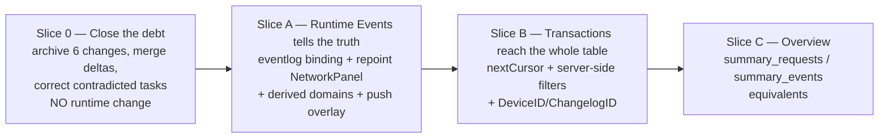

# Proposal: Activity ↔ MCP Observability Parity (SDD-65)

Change: `2026-08-30-sdd-65-activity-observability-parity`
Exploration input: `openspec/changes/2026-08-30-sdd-65-activity-observability-parity/explore.md` (Engram `sdd/activity-mcp-parity/explore`, observation #8887)
Measurement input: Engram `sdd/2026-08-30-sdd-65-activity-observability-parity/measurements` (observation #8891) — **live-database figures that falsified three of this proposal's original assumptions. See §14.**
Delivery: `delivery_strategy=auto-chain`, `review_budget_lines=400`, `strict_tdd: true`, `artifact_store=hybrid`, `pace=auto`.
Shape: **four slices (0, A, B, C), no schema change.** Parity claimed on **6 of the MCP's 7 tools** — `get_correlation_timeline` is deliberately out (§6.3). Slice 0 closes **seven** unarchived changes (§3); three further unarchived changes stay out of scope as recorded debt (§3.1).

> **Deliberate override of the `sdd-propose` 450-word size budget.** `openspec/config.yaml` `rules.proposal` requires a rollback plan and identified affected modules; the orchestrator additionally requires an explicit drift record, a slice plan against a 400-line budget, and a constraints section that answers the user's "remove the constraints" ask with evidence. Those cannot be stated honestly in 450 words. Every claim below carries a `file:line` anchor so the later phases do not re-derive it.

---

## 1. Intent

### 1.1 The defect, in one sentence

**The two Activity tabs read two different stores, and one of them reads the wrong one.**

| Tab | Reads | Same data the MCP reads? |
|---|---|---|
| Transactions | `request_captures` via `App.ListCaptureTransactions` (`app_captures.go:12`) | **Yes** — same table as `search_requests`. Source parity, no capability parity. |
| Runtime Events | `App.GetRecentLogs()` (`app_runtime.go:109`) → in-process ring buffer, 500 entries (`internal/logger/mem.go:25`), truncated to 200 by `MAX_LOG_ENTRIES` (`network-store.constants.ts:4`) | **No** — the MCP's `search_events`/`summary_events`/`get_correlation_timeline` read the SQLite `runtime_events` table (20,000-row cap, `internal/observability/eventlog/types.go:17`). |

**No Wails binding reads `runtime_events` at all.** Verified by enumerating every `func (a *App) <Exported>` across `app_*.go`: `eventlog` appears only as a field (`app.go`), in sink/queue construction (`app_defaults.go`), and at bind time (`app_runtime_services.go`). There is no read method.

The consequence is concrete and user-visible: an agent asks the MCP "what happened during last night's sync" and gets an answer from a durable 20,000-row table that survives restarts. A human asks the same question in the desktop UI and gets a 200-entry buffer that was emptied the last time Bridge was closed. **The human has strictly less access to the app's own telemetry than the agent does.**

### 1.2 Why now

`docs/mcp-event-visibility-report.md` already named this exact root cause — *"Two stores, not one"*. Its drop-window recommendations shipped in SDD-64 and the report is marked HISTORICAL, but the two-store split was never closed and is still the runtime truth. The diagnosis exists, has been verified twice, and has been sitting unresolved. Meanwhile **seven** changes that built this area are applied-but-unarchived, so there is currently **no live spec for the Activity section or the request MCP at all**, and five already-shipped requirements — including the sanitization default-deny and retention policy rules — exist only inside unmerged change folders (§3).

### 1.3 What success looks like

Every question the MCP lets an agent answer, a human can answer in the Activity UI:

- filter persisted runtime events by domain / level / event type / correlation id / entity id / text / time window, across restarts;
- page through the whole `request_captures` table instead of the newest 25 rows;
- see aggregates — which routes are failing and how often, what this bridge is actually doing by domain and level;
- follow one correlation id across **runtime events**, durably and across restarts (the merged request+event timeline is out — the join does not exist in the data, §6.3).

---

## 2. Scope

### 2.1 In Scope

| # | Deliverable | Slice | Evidence anchor |
|---|---|---|---|
| S-0 | Archive the **seven** applied-but-unarchived changes in the Activity + request-MCP closure; merge their spec content into `openspec/specs/` with the `mobile-catch-request-mcp` seed first; correct the `tasks.md` entries the code contradicts | 0 | §3 |
| S-1 | New Wails read binding over `eventlog.Reader` — persisted event search (cursor-paged) + an availability signal | A | `eventlog/reader_search.go`, `internal/mcp/requestcapture/event_tools.go` |
| S-2 | Repoint `NetworkPanel` off `GetRecentLogs`/memLogger onto the new binding; the single frontend consumer is `observability-log-source.helpers.ts:42` | A | §1.1 |
| S-3 | **Derive the Runtime Events domain filter list from the data.** `NETWORK_DOMAIN_FILTER_OPTIONS` hardcodes **6** domains (+ an `all` sentinel); the live database has **9**. `download` — the **3rd busiest domain, 463 rows, 10.2% of all events** — cannot be filtered for at all, and neither can `device` or `schedule`. Cheapest real win in the change. | A | `network-panel.constants.ts:19-27`; measured §14/H4 |
| S-4 | Live `EventsOn` push becomes an **overlay** on the persisted page, not a replacement feed | A | `use-network-panel.ts:69-113` |
| S-5 | Transactions consume `nextCursor` — the store already supports `'append'` and nothing calls it | B | `transaction-store.helpers.ts:17-23`; `use-transaction-panel-sync.ts:39` passes `cursor = null` unconditionally |
| S-6 | Push statusClass → exact `status`, `anime_id`, `error_code` and the `start_ms`/`end_ms` window server-side | B | `CaptureQuery.HTTPStatus *int` already exists and is never sent |
| S-7 | Add `DeviceID` + `ChangelogID` to `contracts.CaptureQuery`, its `app_captures.go` mapper, and the regenerated Wails bindings | B | `internal/api/contracts/capture.go:14-25` lacks both, though `obs.SearchFilters` has them |
| S-8 | Overview surface: `summary_requests` (route/status/outcome + ≤5 error samples) and `summary_events` (ByDomain/ByLevel/ByEventType + samples + `Available`) equivalents | C | `internal/mcp/requestcapture/server.go:19-68` |
| S-9 | The existing Trace tab (siblings sharing `correlationId`, `network-panel.helpers.ts:181-196`) becomes **durable** for free as a consequence of S-1/S-2 — it starts correlating across restarts on real download-run ids instead of over a 200-entry buffer | A | measured §14/H3 |

> **S-10 (additive `correlation_id` column on `request_captures`) and the merged request+event Timeline were CUT after measurement.** They would have produced a 100% NULL column. See §6.3 and §14/H3.

### 2.2 Out of Scope (non-goals, with reasons)

| Deferred item | Why |
|---|---|
| `resolve_request_context` as a UI command palette | `Reader.Resolve` is MCP-package-local (`internal/mcp/requestcapture/reader.go:184`) and would have to move into `internal/observability/requestcapture` to be reachable in-process. Its value collapses once Slice B lands real server-side filters — fuzzy resolution exists to compensate for *not having* filters. |
| Raising the 400/500 effective-line ceiling | Not blocking (§5). The answer is colocated splits, which this tree already does. |
| Removing the "no `useEffect` in `.tsx` under `features/`" convention | Nothing to remove — it is not machine-enforced and nothing in this change needs an effect in a `.tsx` (§5). |
| A resizable master/detail split pane | HeroUI 3.2.4 ships no Splitter primitive; a hand-built divider is unrelated cost with no parity value. |
| Column configuration / saved filters | No persistence surface exists for them. |
| Enabling `PersistDebug` by default | **Measured moot.** There is exactly **one** production debug emit site in the tree (`internal/events/instrumented_bus.go:27`, domain `bus`) and `bus` is 4 of 4,530 rows (0.09%). Enabling the switch would surface almost nothing (§14/H2). |
| The merged request+event correlation Timeline, and the `correlation_id` column it needed | **Cut after measurement (§6.3).** The two stores are keyed on different things, so the column would be 100% NULL. SDD-65 reaches parity on **6 of the MCP's 7 tools** and says so plainly rather than shipping an empty panel. |
| Any REST or WS surface change | Slices A–C add only Wails bindings, which are desktop-local. `docs/openapi.yaml` stays untouched — verified as a positive finding, not an omission (R-7). Slice 0's document merge into `mobile-sync-contract` / `rest-api-write-sync` is debt closure of already-shipped behaviour, not a contract change (§4). |
| Re-ticking the seven changes' contradicted tasks without correction | Explicitly forbidden. See §3. |
| Archiving `dlinter-fallow-quality-remediation`, `fix-schedule-missed-selected-day`, `season-selection-desktop-actions` | Unrelated capability graphs; they stay open debt and are recorded as such in §3.1. |

---

## 3. Drift — closed as Slice 0, before anything else

**CLAUDE.md rule 2: the code wins as runtime truth, and the drift must be recorded before proposing fixes.**

**Seven** changes are applied in code and **none is archived**. Merge order is chronological, and `mobile-catch-request-mcp` MUST go first — it is the **seed**, not a delta:

| # | Change | Task state | Pending spec content |
|---|---|---|---|
| **1** | **`mobile-catch-request-mcp`** (commit `c7ee906`) | applied | **`mobile-request-mcp` — a FULL spec, not a delta** (`## Purpose` + 5 requirements: Local Stdio Sidecar Surface, Query-Only SQLite Reader, Search Pagination and Result Shape, Context Resolution and Retrieval, Malformed Historical Rows Degrade Safely). Plus **ADDED** requirements to `observability` (**3**), `mobile-sync-contract` (1), `rest-api-write-sync` (1) |
| 2 | `mobile-request-mcp-debugging-improvements` (same commit `c7ee906`) | 27/27 `[x]` | `mobile-request-mcp`, `observability` |
| 3 | `activity-devtools-network-view` | 30/30 `[x]` | `activity-network-transactions`, `observability` |
| 4 | `activity-transaction-inspect-ui` | 29/30 (6.1 = orchestrator verification) | `activity-network-transactions`, `shared-ui-code-block` |
| 5 | `capture-middleware-realtime` | 32/33 (11.1 = orchestrator verification) | `activity-network-transactions`, `observability` |
| 6 | `capture-nomenclature-rename` | 36/37 (8.1 = orchestrator verification) | `mobile-request-mcp`, `observability` |
| 7 | `mcp-runtime-events-read` | 64/64 `[x]` | `mobile-request-mcp`, `observability` |

The three unchecked tasks are each the final *"run the full gate"* verification step, not missing implementation.

**Why the seventh change is a hard prerequisite, not an optional extra.** `mobile-catch-request-mcp/specs/mobile-request-mcp/spec.md` **seeds** the capability that changes 2, 6 and 7 then MODIFY. Merging the other six without it would apply modifications to a capability that was never created. Worse, it ADDs requirements that the later changes also modify and that are **absent from the live specs** — verified 2026-08-30, `grep` across `openspec/specs/` returns **zero** matches for all five:

- `observability`: `Captured Mobile Requests Are Auxiliary Observability Records`, `Sanitization and Privacy Are Default-Deny`, `Retention and Degradation Are Owned by Observability Policy` — **three, not two**.
- `mobile-sync-contract`: `WebSocket Reconcile Capture Preserves Protocol Compatibility`.
- `rest-api-write-sync`: `Authenticated REST Writes Capture Sanitized Mobile Requests`.

**Merging six would silently drop baseline requirements, including the two that govern sanitization and retention policy** — i.e. the privacy default-deny rule would vanish from the live spec while the code still enforces it.

**Consequence:** `openspec/specs/` contains **no** `activity-network-transactions/`, **no** `mobile-request-mcp/`, and **no** `shared-ui-code-block/`. There is no live spec for the Activity section or the request MCP. SDD-65 has nothing to write deltas *against*.

**Worse — a `[x]` task is contradicted by the code.** `activity-devtools-network-view` tasks 4.3/4.4/4.5 claim `EventsRoute.tsx`, an `/events` route, and an "Events" nav entry. `git log`: added by `e47e38e`, deleted by `e92c236` as a *"dead route"* during the Typography migration. Today `/events` is `<Navigate to="/activity/runtime-events">` (`App.tsx:37`) and the nav has one Activity entry (`app-layout.constants.ts:41`). Task 4.6 also says to leave `NetworkRoute.tsx` untouched; that file no longer exists.

**Slice 0 therefore corrects those task entries to describe what shipped and archives with the correction visible.** It MUST NOT silently re-tick them. Same treatment for `activity-transaction-inspect-ui` tasks 2.3/3.3/3.5 (the `CodeBlock` barrel superseded by ADR-011; `CAPTURE_REDACTION_MARKER` / `TRANSACTION_RESPONSE_REDACTED_NOTICE` replaced by 65536-byte truncation notices, leaving an orphaned JSDoc block at `transaction-panel.constants.ts:17-20`).

**Do not use `mobile-request-mcp-debugging-improvements` or `capture-middleware-realtime` as a spec baseline** — every path in the former was renamed by `capture-nomenclature-rename`, and `internal/api/handlers/capture_response.go` was deleted. The merge order MUST be chronological so the later renames win.

### 3.1 Remaining SDD debt after Slice 0 — explicitly OUT of scope

Three further changes are applied-but-unarchived and are **not** prerequisites for SDD-65: they seed and modify no capability this change touches. Recorded here so the next change starts from a known ledger instead of rediscovering them:

| Change | Why it stays out of Slice 0 |
|---|---|
| `dlinter-fallow-quality-remediation` | Frontend quality tooling; touches no Activity or request-MCP capability. |
| `fix-schedule-missed-selected-day` | Schedule domain; unrelated capability graph. |
| `season-selection-desktop-actions` | Season domain; unrelated capability graph. |

Slice 0 closes **seven** changes because those seven form the closure of the Activity + request-MCP capability graph. Archiving these three as well would inflate a debt-closing slice with unrelated document churn and blur what Slice 0 is verifying. **They remain open debt, and this proposal declines to hide that.**

---

## 4. Capabilities

> Contract with `sdd-spec`. Names researched against `openspec/specs/` (27 capabilities, listed 2026-08-30) and against the seven changes' pending `specs/` folders.

### Baseline created by Slice 0 (merged from existing deltas — **NOT authored by SDD-65**)

- `activity-network-transactions` — merged from `activity-devtools-network-view`, `activity-transaction-inspect-ui`, `capture-middleware-realtime`, chronologically.
- `mobile-request-mcp` — **seeded** by `mobile-catch-request-mcp`'s full spec, then modified by `mobile-request-mcp-debugging-improvements`, `capture-nomenclature-rename`, `mcp-runtime-events-read`, chronologically.
- `shared-ui-code-block` — merged from `activity-transaction-inspect-ui`, then reconciled against ADR-011 (the `index.ts` barrel it specifies no longer exists).

`sdd-spec` MUST NOT re-author these three. It writes deltas against them only after Slice 0 has merged them.

**Slice 0 also adds requirements to two capabilities SDD-65's own code does not touch** — `mobile-sync-contract` and `rest-api-write-sync` — because `mobile-catch-request-mcp` ADDs one requirement to each (§3). This is a **document-merge of already-shipped behaviour, not a behaviour change**, and the distinction is load-bearing for R-7: Slice 0 writes to `openspec/specs/mobile-sync-contract/spec.md`, while Slices A–C add no REST or WS surface whatsoever. `sdd-verify` MUST check those two facts separately and not treat the Slice 0 document write as a wire-contract change.

### New Capabilities

- `activity-runtime-events`: the Runtime Events tab reads **persisted** `runtime_events` through a Wails binding — cursor pagination, server-side domain/level/event-type/correlation-id/entity-id/text/time-window filters, a data-derived domain list, an events-availability signal with a degraded banner, and live push as an overlay on the persisted page rather than a rival feed.
- `activity-observability-overview`: the aggregate surfaces — request counts grouped by route/status/outcome with ≤5 latest error samples, and event counts by domain/level/event-type with samples and an `Available` flag. **No merged request+event timeline** (§6.3).

### Modified Capabilities

- `activity-network-transactions` (after Slice 0): cursor pagination becomes a requirement instead of a stored-and-ignored field; `Requirement: Transaction List Filtering` moves status-class, anime-id, error-code and the time window from client-side-over-the-loaded-page to server-side; the query contract grows `DeviceID` and `ChangelogID`.
- `observability` (`openspec/specs/observability/spec.md`): two requirement-level changes.
  1. **`Requirement: Dashboard Feed Stays Live` (line 67)** currently mandates *"it MUST render the recent buffered entries returned by the backend"* (line 74) with *"existing entries MUST remain ordered and visible within retention limits"* (line 80). Slice A changes exactly that read path. The delta MUST amend the requirement to the persisted-page-plus-live-overlay model — it MUST NOT silently re-assert text the shipped code contradicts.
  2. **`Requirement: Wails Exposes Recent Logs` (line 52) is retained, not deleted.** `GetRecentLogs()` keeps its contract and its tests (`app_startup_test.go:243,252`, `app_runtime_events_persistence_test.go:59`); it simply stops being the Activity read path. Deleting it would be an unrequested removal.
  3. **No `correlation_id` column requirement.** C2 is cut (§6.3), so `observability` gains no schema requirement from SDD-65.
- `mobile-request-mcp` (after Slice 0): **no behavioural change.** The MCP tool surface is the *reference*, not the subject. Listed only so `sdd-spec` knows it is read, not rewritten.

### Explicitly NOT modified

- `sqlite-bootstrap`: Slice C adds a column through the existing additive `EnsureTableSchema` path, exactly as `eventlog`, `activity`, and `season` did. None of its five requirements move.
- `openapi`: zero REST/WS surface added (R-7).
- `mobile-sync-contract` / `rest-api-write-sync`: **not modified by SDD-65's code.** They receive one already-shipped requirement each from Slice 0's document merge (see above) — that is debt closure, not a contract change.
- `frontend`, `desktop-navigation`: no new route, no new nav entry — Activity already exists and both surfaces land as tabs inside it.

---

## 5. Constraints we are **NOT** removing, and why

The user's framing was to remove the constraints blocking this work. The honest, evidence-backed answer is that **almost none of them are blocking**, and removing them would cost real safety for no gain. Stated plainly rather than quietly assumed:

| Constraint | Verdict | Evidence |
|---|---|---|
| CLAUDE.md #1 "no `useEffect` in `.tsx` under `features/`" | **NON-ISSUE. Nothing to remove.** | It is not machine-enforced: `frontend/eslint.config.js:71,80` enables only `max-lines` and `no-restricted-imports`; the dlinter preset carrying `no-view-effects` was removed 2026-08-11. `frontend/doctor.config.json` enables six dharness rules, none of them an effect rule. And streaming already lives in hooks — `use-network-panel.ts:69-113` and `use-transaction-panel-sync.ts:34-92`. There is no `.tsx` effect in this area to relax. |
| 400-warn / 500-hard-fail effective lines | **COST, not a blocker. Keep.** | The largest file in `features/network` is `network-panel.helpers.ts` at 321 lines; `transaction-panel.helpers.ts` is 277; everything else is under 140. The precedent is already in this tree: `useTransactionPanel` was split into `-sync` / `-store-bindings` / `-filter-callbacks` on 2026-08-14 for exactly this reason. The splits are planned in `sdd-tasks`, not improvised during apply. |
| ADR-011 no barrels | **NON-ISSUE.** | Concrete-path imports throughout; nothing here needs a barrel. |
| CLAUDE.md #13 code in English | **NON-ISSUE.** | Wire fields are already English (`requestId`, `capturedAtMs`, `httpStatus`). |
| HeroUI v3 grid capability | **NON-ISSUE — better than assumed.** | `@heroui/react@^3.2.4` already ships `Table.LoadMore`, `Table.LoadMoreContent`, `Table.ColumnResizer`, `Table.ResizableContainer`, `Table.SortableColumnHeader` — all present, all unused today, and all used by this change. It also ships `Virtualizer`/`TableLayout`/`ListLayout`, which this change **deliberately does not use** (§6.1). Only two things would be hand-built, and both are out of scope: a split-pane divider, and a vertical scroller (`Table.ScrollContainer` is horizontal-only). |
| **ADR-012 progressive list rendering** | **NOT REMOVED, and nothing about it needs amending. ADR-012 already answers this.** | ADR-012:46-49 documents **two branches**. Static lists (count changes only from filtering, searching, or a one-shot fetch) use `useProgressiveListWindow` wholesale — its render-phase reset is *desired* there, because a new search must start at the top. **Live** lists (count changes because events push items into a store) keep their own reconciliation and reuse **only** `isNearListBottom`. Both Activity tabs are live, so they take the live branch — and ADR-012:51-55 already names the reference implementation for it. |

**No constraint in the frontend architecture list is removed by SDD-65.** Progressive scroll loading stays exactly as designed; Activity uses the live branch ADR-012 already defines. The only thing this change adds is *where the next batch comes from* (§6.1) — which is a design detail inside the existing branch, not a new architectural decision.

**The scroll model is not being replaced.** Rows are appended and never unmounted, so the honest growing scrollbar is retained on **every** Activity rail. No windowing, no virtualizer, no full-height padded track.

---

## 6. Approach

Approach **1** from the exploration (§Approaches): bind the MCP's read capabilities as in-process Wails read methods and rebuild Activity on them. Approach 2 (events-only) is a strict subset and becomes Slice A. Approach 3 (frontend-only polish) is **rejected**: it cannot fix a tab that reads the wrong store.

### 6.1 Rendering — the live branch of ADR-012, extended to a server-paged source

**No virtualization, and no ADR amendment. ADR-012 already decides the rendering model**, and Activity simply belongs to its second branch. SDD-65 *extends that existing branch to a server-paged source* — the renderer stays exactly what ADR-012 chose (appended, never-unmounted rows, growing scrollbar); only the origin of a batch changes.

Both Activity tabs are **live** (`EventsOn` pushes runtime events; `capture.transaction` pushes captures), so per ADR-012:46-49 they must NOT use `useProgressiveListWindow` — its render-phase reset would snap the user back to the first batch every time an event lands. They keep their own reconciliation and reuse only `isNearListBottom` from `shared/helpers/progressive-list.helpers.ts` for the scroll trigger. ADR-012:51-55 already names the in-repo reference: **`reconcileVisibleRunCount`** (`run-history-panel.helpers.ts:132`, fed by `subscribeRunEvents`), whose three invariants Activity inherits verbatim — keep the window stable across refreshes, keep the selected item rendered, and keep a fully-revealed list fully revealed.

**The genuinely open question is narrow, and it is the one thing `sdd-design` must settle:** Run history reconciles over an in-session memory buffer, but Activity reads tables that outlive the process. So "load more on scroll-near-bottom" cannot pull the next batch from a local buffer — it must fetch the next **cursor page** from the backend. *Same UX gesture, same renderer, batch source moved from memory to SQLite.*

**The decision, in one line:** `Table.LoadMore` / `Table.LoadMoreContent` over a cursor-paged server query, with **rows appended and never unmounted**. `Table.ColumnResizer`, `Table.SortableColumnHeader` and `Table.ResizableContainer` stay as the grid primitives — they are orthogonal to the scroll model. **No `Virtualizer`, no `ListLayout`, no windowing.**

### 6.1.1 Why no virtualizer — honesty, not cost

The cost argument is the weaker half and must not be the stated reason. **ADR-012 rejected windowing on honesty**, and `use-progressive-list-window.ts:7-12` says so in its own JSDoc, verbatim:

> *"Rows are never unmounted, so the scrollbar starts short and grows — which reads honestly, unlike windowing's full-height padded track (see autoreas-theme changelog 1.0.11)."*

ADR-012:79-84 says the same thing about the rejected `ListBox` + `Virtualizer`/`ListLayout` option: *"the padded full-height scrollbar reads as 'all 842 are loaded', which is the perception problem we set out to fix."*

A virtualizer restores exactly that padded track — the precise UX this repo deliberately chose against. "HeroUI ships it for free" is an installation cost, not a behavioural one. **Free to install is not free in behaviour.**

And there is nothing to virtualize. This is now **measured against the live `bridge.db`**, not inferred from a doc (§14/H1):

| Store | Rows after one month | Cap | Fill | Busiest single day |
|---|---|---|---|---|
| `runtime_events` | 4,530 (2026-07-30 → 08-30) | 20,000 | **22.7%** | 538 |
| `request_captures` | 1,317 (2026-07-25 → 08-30) | 5,000 | **26.3%** | 145 |

So ADR-012:96's *"revisit if a collection reaches five figures"* **has not fired** — a month of real use reached 22.7% of one cap — and ADR-012's rejection of windowing is **unchanged by this proposal**.

### 6.1.2 What `sdd-design` must record — an ADR-012 addendum, not an amendment

`sdd-design` writes a **short addendum to ADR-012** covering exactly one narrow case:

> a live list whose batches arrive from a **cursor-paged server query** rather than a client-side buffer.

The addendum MUST state, explicitly, that ADR-012's rejection of windowing is unchanged and that its five-figures trigger has not fired. It amends nothing and supersedes nothing; it documents a case ADR-012 did not have when it was written, because until now every progressive rail sliced a collection that was already fully in memory.

It MUST also record why this is **not** a contradiction of ADR-012:89-91's rejected "Backend pagination" alternative. That rejection reads *"the collections are small enough to fetch in one call... paginating the wire would add round-trips to solve a rendering issue"* — true for the Editor's 857 in-memory animes. Activity's source is **already** keyset-cursor-paged by construction (`ListCaptureTransactions` returns a `nextCursor` today; `eventlog`'s reader is cursor-paged), and "fetch it in one call" is not available for a 20,000-row table. Activity is not adding wire pagination to fix rendering; it is *consuming a cursor the backend already emits*. Without that note, someone later reads ADR-012:89 as forbidding Slice A and B.

### 6.2 Live push becomes an overlay

Today `EventsOn` pushes into a 200-entry store that *is* the feed. After Slice A the persisted cursor page is the feed and the push is an overlay on top of it. This is the part most likely to be got wrong: a naive implementation replaces the page on every event and the user loses their scroll position and their filter — the exact silent regression ADR-012:57-58 warns about (*"it type-checks, it looks right, and no existing test necessarily catches it"*). `sdd-design` MUST specify the reconciliation against `reconcileVisibleRunCount`'s three invariants, and the panel's hook comment MUST classify the list as live, per ADR-012:102-103.

### 6.3 The correlation Timeline is **cut** — the join does not exist

The proposal originally ranked C2 highest-risk and justified an additive scalar `correlation_id` column on `request_captures`. Measurement kills it (§14/H3). **The two stores are not sparsely joined — they are keyed on different things:**

| Side | Key it actually carries | Coverage |
|---|---|---|
| `runtime_events.correlation_id` | a **download run id** (`run-dkcfh5xu5lok`, `run-dkda3pjvdwbk`) | 463 / 4,530 rows (10.2%), 52 distinct, and **all 463 are `domain=download`** |
| `request_captures.correlation_json` | `{"changelog_ids":[…],"operation_refs":[{anime_id,operation,outcome}]}` — **no correlation id and no run id anywhere in the shape** | 82.5% are an empty `{"operation_refs":[]}`; only 230 / 1,317 (17.5%) carry any refs |

**There is nothing to populate the new column from.** The migration would ship a 100% NULL column. `event_tools.go:87-108`'s "matches approximately never" comment *understates* this: it reads as sparsity, and it is a structural key mismatch. The measured fallback join is no better — `entity_id` ↔ `anime_id` overlaps on only **21 distinct entities** (1,028 events carry `entity_id`, 246 captures carry `anime_id`).

**Decision: option (a) — cut C2 from SDD-65 and record the measurement.** Rejected alternatives:

- **(b) Redefine the timeline around `changelog_ids` + `anime_id`** — the only shared vocabulary with real coverage. Rejected: it correlates *anime operations*, not *HTTP requests to runtime events*. It is a different feature wearing tool 7's name, and shipping it as "parity" would be a false claim in the one place this change is explicitly about honesty.
- **(c) Make the emitters write a shared key first, then build the timeline.** The only honest path to real parity on tool 7 — and correctly a **separate change**, not a slice. SDD-65 is a read-side parity change; (c) is a write-pipeline change with its own risk surface.

**Two consequences, both stated rather than buried:**

1. **SDD-65 reaches parity on 6 of the MCP's 7 tools.** `get_correlation_timeline` is out. That is the honest number and §12 asserts it.
2. **Nothing working is lost, and the working half is gained anyway.** Tool 7's *request* side does not function today in the MCP either — for the same measured reason. Its *event* side does work (events sharing a download-run id), and the Trace tab already implements exactly that (`network-panel.helpers.ts:181-196`, siblings sharing `correlationId`, time-ordered). Slice A repoints it at the persisted store, so it becomes durable and restart-surviving **for free**. Cutting C2 forgoes a panel that would have been empty, not a capability.

---

## 7. Slice Plan (400-line review budget, `auto-chain`)

> **Slice C2 (Timeline + `correlation_id` column) was cut after measurement** — see §6.3. SDD-65 now has **no schema change at all**.

| Slice | Contents | Leaves the app working because | Budget risk |
|---|---|---|---|
| **0 — Close the debt** | `git mv` the **seven** change folders into `openspec/changes/archive/`; merge chronologically into `openspec/specs/` with **`mobile-catch-request-mcp` FIRST** (it seeds `mobile-request-mcp` and carries baseline `observability` / `mobile-sync-contract` / `rest-api-write-sync` requirements the other six modify); then `activity-network-transactions`, `shared-ui-code-block` and the remaining `observability` deltas; correct the contradicted `tasks.md` entries in place with the drift named. | Zero runtime change. Documents only. | **Medium→High.** Seven folders, five touched capabilities. The authored text is the merged spec content plus task corrections; the archive move is a **rename** (`git mv`, so the diff registers renames, not adds+deletes). Now more likely to need the pre-declared **0a** (moves) / **0b** (spec merge + corrections) split. |
| **A — Runtime Events tells the truth** | `App.SearchRuntimeEvents(contracts.EventQuery) contracts.EventPage` + an availability binding over `eventlog.Reader`; new contract types; repoint `observability-log-source.helpers.ts:42`; **derive domains from data (unblocks `download`, 10.2% of events, currently unfilterable)**; push-as-overlay; colocated hook split planned up front. The Trace tab becomes durable as a side effect (§6.3). | The tab keeps working and starts showing durable, restart-surviving events. `GetRecentLogs()` and its tests are untouched. | **High.** Go contracts + binding + generated bindings + a rewritten read path + tests. Pre-declare an A1 (Go binding + contracts + tests) / A2 (frontend repoint + derived domains + overlay) split. |
| **B — Transactions reach the whole table** | Consume `nextCursor` through `Table.LoadMore`; move statusClass/anime_id/error_code/time-window server-side; `DeviceID` + `ChangelogID` on `contracts.CaptureQuery` + `app_captures.go` mapper + regenerated bindings. | No new screen; the existing table simply reaches past row 25 and filters correctly beyond the loaded page. | **Medium.** The store already supports `'append'`; the Go change is two additive fields. |
| **C — Overview** | Summary bindings + an Overview surface inside the existing Activity tabs. Three GROUP BY queries for events, one for requests, ≤5 samples each, `Available` flag honoured. | Additive surface; A and B unaffected. Final slice. | **Medium.** |
| ~~**C2 — Timeline**~~ | **CUT (§6.3).** The `correlation_id` column would be 100% NULL: `runtime_events.correlation_id` is a download-run id, `request_captures.correlation_json` carries no run or correlation id at all. | — | — |

`sdd-tasks` MUST emit, verbatim: `Decision needed before apply: No` (auto-chain is cached), `Chained PRs recommended: Yes`, `400-line budget risk: High`. Chain shape per `sdd-phase-common.md` §E: PR #1 targets the tracker branch; each later slice targets the previous slice's branch.

---

## 8. Affected Areas

| Area | Impact | Description |
|---|---|---|
| `openspec/changes/{seven}/` → `openspec/changes/archive/` | **Moved (Slice 0)** | `git mv`, with contradicted `tasks.md` entries corrected before the move. `mobile-catch-request-mcp` merges first (§3). |
| `openspec/specs/mobile-sync-contract/spec.md`, `openspec/specs/rest-api-write-sync/spec.md` | **Modified (Slice 0 document merge only)** | One already-shipped ADDED requirement each, from `mobile-catch-request-mcp`. **No code change, no wire change** — see R-7. |
| `openspec/specs/activity-network-transactions/`, `mobile-request-mcp/`, `shared-ui-code-block/` | **New (Slice 0, merged not authored)** | Chronological merge of the pending deltas. |
| `openspec/specs/observability/spec.md` | **Modified** | `Dashboard Feed Stays Live` (line 67) amended; `Wails Exposes Recent Logs` (line 52) retained. No `correlation_id` requirement — C2 is cut (§6.3). |
| `internal/observability/eventlog/` | **Read-only consumer added** | `Reader` is already the MCP's read seam. Slice A adds an in-process caller, not a new query engine. |
| `internal/api/contracts/` | **Modified** | New `EventQuery`/`EventPage` view types (Slice A); `CaptureQuery` grows `DeviceID` + `ChangelogID` (Slice B); summary result types (Slice C). No timeline types — C2 cut. |
| `app_runtime_events.go` *(new root file)* | **New** | Wails bindings over `eventlog.Reader`. Naming matches `app_captures.go` / `app_runtime.go`. |
| `app_runtime.go` | **Unchanged** | `GetRecentLogs()` (line 109) stays exactly as it is. |
| `app_captures.go` | **Modified (Slice B)** | Mapper widened for the two new filter fields. |
| `internal/observability/requestcapture/` | **UNCHANGED** | C2 cut (§6.3), so SDD-65 makes **no schema change and touches no capture write path**. |
| `frontend/wailsjs/go/main/App.*` | **Regenerated** | Generated bindings; never hand-edited. |
| `frontend/src/infrastructure/observability-log-source/observability-log-source.helpers.ts` | **Modified (Slice A)** | Line 42's `GetRecentLogs()` call is the **single** frontend consumer — the whole repoint is one seam. |
| `frontend/src/features/network/**` | **Modified** | `NetworkPanel` read path, `network-panel.constants.ts:19-27` derived domains, `use-network-panel.ts` overlay reconciliation, planned colocated splits (`network-panel.helpers.ts` is at 321 of 400). |
| `frontend/src/features/.../TransactionPanel/**` | **Modified (Slice B)** | `use-transaction-panel-sync.ts:39` cursor consumption, `toBackendCaptureFilters` widened, `Table.LoadMore` affordance. |
| `docs/mcp-event-visibility-report.md` | **Appended** | Its "Two stores, not one" section gets a closing note pointing at this change. |
| `docs/adr/012-progressive-list-rendering.md` | **Short addendum only — no amendment, nothing superseded** | Activity uses the live branch ADR-012 already defines (§6.1). The addendum covers one narrow case: a live list whose batches arrive from a cursor-paged server query rather than a client buffer. It states explicitly that the rejection of windowing is unchanged and the five-figures trigger has not fired (§6.1.2). Authored by `sdd-design`. |
| `docs/learning-log.md` | **Appended** | Via `node scripts/log-lesson.mjs`, never by hand (CLAUDE.md #17). |
| `docs/openapi.yaml` | **Untouched — verified positively** | R-7. |

---

## 9. Risks

| # | Risk | Likelihood | Impact | Mitigation |
|---|---|---|---|---|
| R-1 | ~~The Runtime Events tab silently shows FEWER rows after Slice A.~~ **DEMOTED by measurement (§14/H2).** The concern was that `runtime_events` excludes `debug` while the ring buffer carries it. Measured: the persisted level split is info 4,457 (98.4%), warn 70 (1.5%), error 3 (0.1%), **debug 0** — because there is exactly **one** production debug emit site in the whole tree (`internal/events/instrumented_bus.go:27`, domain `bus`), and `bus` is 4 of 4,530 rows (0.09%). The `Debugf`/`LevelDebug` plumbing and the sink drop at `eventlog/sink.go:144` exist; almost nothing calls them. | **Low** | **Low** | A one-line UI note that debug events are not persisted. **Do not** enable `PersistDebug` and **do not** build a debug lane — both were deliberation over data that is not emitted. |
| R-2 | ~~`get_correlation_timeline`'s request side matches "approximately never".~~ **RESOLVED BY CUTTING THE SLICE (§6.3, §14/H3).** The measurement showed a structural key mismatch, not sparsity: `runtime_events.correlation_id` is a download-run id (all 463 rows `domain=download`), while `request_captures.correlation_json` carries no correlation or run id in its shape at all. | — | — | C2 and its `correlation_id` column are **cut**. The risk cannot materialise because the slice does not exist. SDD-65 claims parity on 6 of 7 tools and says so in §12. |
| R-3 | ~~The C2 schema change is the only migration in SDD-65.~~ **ELIMINATED.** | — | — | With C2 cut, **SDD-65 contains no schema change, no migration, and no capture-write-path edit.** This materially lowers the whole change's risk profile. |
| R-4 | The push-as-overlay reconciliation resets the visible window on every event — ADR-012:57-58's *"silent regression: it type-checks, it looks right, and no existing test necessarily catches it"*, reintroduced by hand. | Medium | High | Follow `reconcileVisibleRunCount` (`run-history-panel.helpers.ts:132`) and its three invariants (§6.1). Two deterministic guards, both required by `sdd-tasks`: the **DOM-count test per rail** ADR-012:70-75 mandates (reference: `AnimeEditorWorkspace.windowing.test.tsx` — render more items than one batch, assert rendered rows equal the batch size), **plus** a live-specific test proving an incoming event does not reset the scroll window. There is deliberately no lint rule (ADR-012:62-68); the tests are the whole enforcement. |
| R-5 | Slice 0's archive move blows the 400-line budget through counted renames. | Medium | Low | `git mv` so the diff registers renames; pre-declared 0a/0b split if the counter disagrees. |
| R-6 | `network-panel.helpers.ts` (321) and `transaction-panel.helpers.ts` (277) cross the 400 warn line during A/B. | **High** | Low | Splits planned in `sdd-tasks`, not improvised in apply. `useTransactionPanel`'s 2026-08-14 split is the template. ESLint `max-lines` + `dharness/max-file-lines` are the deterministic gate at 500. |
| R-7 | A wire-adjacent change slips into mobile-visible surface without a doc announcement (`feedback_api_consumers_doc_updates`). **Compounded by Slice 0:** its document merge writes to `mobile-sync-contract` and `rest-api-write-sync`, which could be misread as a wire change — or, worse, could mask a real one. | Low | Medium | Slices A–C add only Wails bindings — desktop-local. `sdd-verify` MUST check **two separate facts**: (1) `docs/openapi.yaml` is untouched by every slice; (2) Slice 0's writes to those two spec files contain **only** the already-shipped requirements from `mobile-catch-request-mcp`, verbatim, with nothing authored. Both recorded as positive findings. |
| R-8 | **Merging without the `mobile-catch-request-mcp` seed silently drops baseline requirements** — including `Sanitization and Privacy Are Default-Deny` and `Retention and Degradation Are Owned by Observability Policy`, which are absent from the live spec while the code still enforces them. Or the seven merge out of order, resurrecting `mobilecapture` naming and `capture_response.go`. | **High** (it was missed on the first pass) | **High** | §3 fixes the order as chronological with the seed first, names all five requirements at risk, and names both rename traps. Slice 0's verification MUST assert those five requirement headings exist in `openspec/specs/` after the merge. |
| R-9 | Activity ships blank in the built binary — a Wails binary logs a complete healthy Go startup with an empty WebView (1.2.0 shipped exactly that). | Low | High | `/#/activity` and `/#/activity/runtime-events` must be in `ROUTE_MARKERS`; `bun --cwd="frontend" run render:smoke` before claiming any slice's build works (CLAUDE.md #18b). |

---

## 10. Rollback Plan

**Per slice, because each is independently mergeable:**

- **Slice 0** — `git revert` restores the seven folders to `openspec/changes/` and removes the three merged spec folders plus the merged requirements in `observability`, `mobile-sync-contract` and `rest-api-write-sync`. Zero runtime impact; the app does not read `openspec/`. The only loss is the corrected drift record, which is re-derivable from §3.
- **Slice A** — revert. `observability-log-source.helpers.ts` returns to `GetRecentLogs()`, which was never removed and whose tests never changed, so the ring-buffer feed comes back intact. The new `app_runtime_events.go` bindings disappear unused. **No schema change to undo.**
- **Slice B** — revert. `use-transaction-panel-sync.ts` returns to `cursor = null` and the newest-25 behaviour; `contracts.CaptureQuery` loses two additive fields. The `'append'` support in `transaction-store.helpers.ts` returns to being dormant, exactly as it is today. **No schema change to undo.**
- **Slice C** — revert; the Overview surface disappears. Additive bindings only.

**Whole-change rollback:** revert the slices in reverse order. **With C2 cut there is no durable residue at all** — no inert column, no migration to leave behind. The only persistent artefacts are the archived/merged openspec documents. **No existing table, column, binding, or wire contract is removed or altered by this change, and no new one is added to the schema** — that is what makes the rollback cheap, and it is now a measured property rather than a design intention.

---

## 11. Dependencies

- `@heroui/react` **3.2.4** — already installed. `Table.LoadMore`, `Table.LoadMoreContent` and `Table.SortableColumnHeader` verified present and currently unused; those are the primitives this change uses. `Virtualizer`/`ListLayout` are also present but **deliberately not used** (§6.1). **No new dependency.**
- `internal/observability/eventlog.Reader` — already the MCP's read seam; Slice A adds an in-process caller.
- ~~`internal/persistence.EnsureTableSchema`~~ — **no longer a dependency.** C2 is cut, so SDD-65 registers no schema.
- Slice 0 is a **hard prerequisite** for `sdd-spec`: without the merged baseline there is no `activity-network-transactions` capability to write a delta against.
- No new Go module, no new npm package. `package.json` is never hand-edited (`feedback_package_management`).

---

## 12. Success Criteria

- [ ] The Runtime Events tab renders events that **survive a Bridge restart**, proven by a test that persists, restarts, and reads.
- [ ] The Runtime Events domain filter list is derived from the data, not from a seven-value constant.
- [ ] Each Activity rail ships the DOM-count render-batch test ADR-012:75 requires (the repo names these `*.windowing.test.tsx`; `AnimeEditorWorkspace.windowing.test.tsx` is the reference — assert rendered rows equal the batch size, **not** that rows are unmounted), and a pushed live event does **not** reset the visible window, filter, or scroll position — separate deterministic test.
- [ ] Each Activity panel's hook comment classifies its list as **live**, per ADR-012:102-103.
- [ ] The Transactions table reaches past row 25 through `nextCursor`, and status / anime id / error code / time window filter **server-side**, correct beyond the loaded page.
- [ ] `contracts.CaptureQuery` carries `DeviceID` and `ChangelogID`, and the regenerated bindings expose them.
- [ ] For every one of the 7 MCP tools, a named UI affordance answers the same question — recorded as an explicit parity checklist in `sdd-verify`.
- [ ] The Runtime Events domain filter offers **all 9 domains present in the data**, and `download` (10.2% of events) is filterable — proven by a test that derives the list from a fixture containing a domain absent from the old hardcoded 6.
- [ ] The Trace tab correlates events **across restarts** on a real download-run id, replacing the 200-entry buffer scope.
- [ ] **Parity is claimed on 6 of the MCP's 7 tools, not 7.** `get_correlation_timeline` is explicitly out (§6.3), and `sdd-verify` records that as a stated scope decision, not a miss.
- [ ] SDD-65 ships **no schema change** — `sdd-verify` confirms no migration and no capture-write-path edit.
- [ ] `GetRecentLogs()` still exists, still passes `app_startup_test.go:243,252` and `app_runtime_events_persistence_test.go:59` unmodified.
- [ ] `openspec/specs/` contains `activity-network-transactions`, `mobile-request-mcp` and `shared-ui-code-block`, and the **seven** changes are archived with their contradicted tasks corrected, not re-ticked.
- [ ] The five requirements seeded by `mobile-catch-request-mcp` are present in `openspec/specs/` after the merge — three in `observability` (including `Sanitization and Privacy Are Default-Deny` and `Retention and Degradation Are Owned by Observability Policy`), one in `mobile-sync-contract`, one in `rest-api-write-sync`. A `grep` for each heading returns a hit; today it returns zero.
- [ ] The three unrelated unarchived changes (§3.1) are **still** unarchived and recorded as open debt — Slice 0 did not quietly absorb them.
- [ ] `docs/openapi.yaml` and the mobile sync contract are untouched — confirmed and reported positively.
- [ ] `/#/activity` and `/#/activity/runtime-events` are in `ROUTE_MARKERS` and `render:smoke` passes with a non-empty `#root`.
- [ ] Every slice commit passes the full pre-commit gate (~90s Go+frontend; give `git commit` ≥ 300000 ms), and every staged Go change runs `ditto staged --exclude-prefix frontend/ --threshold 0.80 --test-command "go test -count=1 -json ./<owning-package>/"` as the MUTATE step.

---

## 13. Proposal Question Round

`pace=auto` and CLAUDE.md project note #1 require this workflow to run without pausing, so the decisions below were made from evidence rather than asked. These are the **product-level** assumptions a user might want to correct — surfaced here rather than buried. Answering any of them is a spec-level amendment, not a re-exploration.

> **Q-1, Q-2 and Q-3 were originally answered from documentation prose and a code comment.** All three have since been **settled by measurement against the live `bridge.db`** (§14). They are no longer open questions, and they are kept here with their original wording struck so nobody re-opens a question the data already closed.

**~~Q-1~~ — Debug events. SETTLED (§14/H2), not a product question.**
~~Assumption: the tab should show persisted events, accepting that `debug` is excluded; correction paths (a) enable `PersistDebug`, (b) a debug-only live lane, (c) accept the loss silently.~~
Measured: **debug 0 rows**, one production emit site, `bus` at 0.09% of events. All three correction paths were deliberation over data that is not emitted. A one-line UI note is the whole answer.

**~~Q-2~~ — Is the Timeline worth a schema change? SETTLED (§14/H3): the question was malformed.**
~~Assumption: yes, a timeline whose request side matches "approximately never" is a broken panel.~~
It was never a cost/benefit question. The column has **nothing to populate it from** — the stores are keyed on different things. C2 is cut (§6.3).

**~~Q-3~~ — Backfill for the `correlation_id` column. MOOT.**
There is no column to backfill.

**Q-4 — `resolve_request_context` (fuzzy "I half-remember a request") deferred.**
Assumption: real server-side filters (Slice B) make fuzzy resolution largely redundant for a human with a filter bar, and it costs a package move (`Reader.Resolve` out of `internal/mcp/requestcapture`). Correction path: promote it to a Slice D command palette.

**Q-5 — Overview as a tab inside Activity, not a new route.**
Assumption: Activity already exists with one nav entry; parity is about capability, not navigation. Correction path: a dedicated `/activity/overview` route, which then needs a `ROUTE_MARKERS` entry and a `desktop-navigation` spec delta.

**Q-6 — Parity on 6 of 7 tools is the accepted outcome. NEW.**
Assumption: shipping honest parity on six tools beats shipping a seventh panel that renders empty. Correction path: take option (c) from §6.3 — make the emitters write a shared key — as a **separate** change, then build the timeline on real data.

---

## 14. Measurements

> **Why this section exists.** The first draft of this proposal called documentation prose and a source comment "evidence" and made five product decisions on them. **Three collapsed on first contact with the database.** These figures are recorded here so no later phase re-derives them from prose. Full record: Engram `sdd/2026-08-30-sdd-65-activity-observability-parity/measurements` (observation #8891).

**Method.** `%AppData%/Autoreas/data/bridge.db` (15 MB) copied to a scratchpad and queried read-only with `sqlite3`. Sample: `runtime_events` 4,530 rows spanning 2026-07-30 → 08-30; `request_captures` 1,317 rows spanning 2026-07-25 → 08-30.

| # | Hypothesis (as the draft asserted it) | Measured | Verdict | Effect on the proposal |
|---|---|---|---|---|
| **H1** | "tens to low hundreds of rows per day", so no virtualization (cited from `docs/mcp-event-visibility-report.md`) | Busiest day: 538 events / 145 captures. Fill after one month: 4,530/20,000 (**22.7%**) and 1,317/5,000 (**26.3%**) | **CONFIRMED** | §6.1 keeps its conclusion but now cites the measurement instead of the doc. ADR-012's five-figure trigger has **not** fired. |
| **H2** | Repointing loses `debug` events — ranked **High/High**, "the highest-impact product question" | Level split: info 4,457 (98.4%), warn 70 (1.5%), error 3 (0.1%), **debug 0**. Exactly **one** production debug emit site (`internal/events/instrumented_bus.go:27`, domain `bus`); `bus` = 4/4,530 rows (0.09%). The `Debugf`/`LevelDebug` plumbing and the `eventlog/sink.go:144` drop exist, but almost nothing calls them | **FALSIFIED** | R-1 demoted **High/High → Low/Low**. Q-1 closed. `PersistDebug` and the debug-lane idea dropped. |
| **H3** | The Timeline needs an additive scalar `correlation_id` on `request_captures`; the join is sparse (`event_tools.go:87-108`, "matches approximately never") | `runtime_events.correlation_id` is a **download-run id** (`run-dkcfh5xu5lok`), 463/4,530 rows (10.2%), 52 distinct, **all `domain=download`**. `request_captures.correlation_json` is `{"changelog_ids":[…],"operation_refs":[…]}` with **no run or correlation id in the shape**; 82.5% empty, 230/1,317 (17.5%) carry refs. Fallback join `entity_id`↔`anime_id`: 1,028 events, 246 captures, **only 21 distinct entities overlap** | **FALSIFIED** | Not sparsity — a **structural key mismatch**. The column would be **100% NULL**. C2 cut (§6.3); R-2 and R-3 eliminated; SDD-65 now has no schema change. |
| **H4** | The hardcoded domain list is merely stale | `NETWORK_DOMAIN_FILTER_OPTIONS` has **6** domains (+ `all`); the data has **9**: websocket 1693, sync 1262, **download 463**, api 368, system 368, anime 367, bus 4, device 3, schedule 2. Missing: **`download` (10.2%, 3rd busiest)**, `device`, `schedule` | **FALSIFIED — a real, previously unnamed defect** | S-3 promoted from a sub-item to a named measured defect. A user cannot filter for download events at all. |
| **H5** | Cutting the Timeline forfeits a working capability | Tool 7's **request** side does not function in the MCP either, for the same reason. Its **event** side works, and the Trace tab already implements it (`network-panel.helpers.ts:181-196`, siblings sharing `correlationId`) | **FALSIFIED** | Slice A makes the Trace tab durable **for free**. Cutting C2 forgoes an empty panel, not a capability. |

**Lesson for the later phases:** a configuration fact (`PersistDebug` defaults off) describes a **switch**, not an **impact**. Impact needs a count. This lesson belongs in `docs/learning-log.md` via `node scripts/log-lesson.mjs` when Slice A lands.
