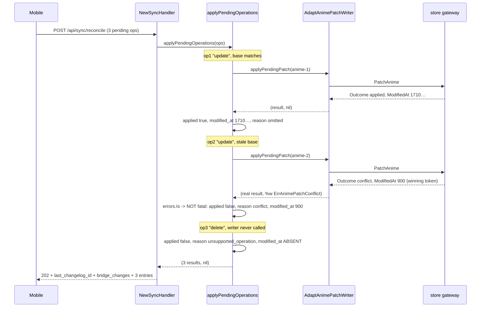

# Design: SDD-66 — OCC token echo on applied operations

## Technical Approach

Two optional fields on `contracts.AppliedOperation` (`modified_at`, `reason`), populated inside
`applyPendingOperations` (`internal/api/handlers/sync_handler.go:159-180`). A conflict is
recognised there with `errors.Is(err, ErrAnimePatchConflict)` and recorded as a per-operation
outcome instead of aborting the batch. `AdaptAnimePatchWriter` (`common.go:98-113`) and
`anime_handler.go` are untouched, so the single-anime PATCH seam is unchanged **by construction**,
not by assertion.

`errors.Is` is the discriminator rather than `result.Outcome` because the adapter returns a **zero**
`AnimePatchResult` on a writer error (`common.go:102`) and the **real** result on the conflict
branch (`common.go:107-108`). Only on the conflict branch is `result.ModifiedAt` trustworthy.

## Architecture Decisions

### Decision: `ModifiedAt *int64` with `json:"modified_at,omitempty"`

**Choice**: pointer, not a plain `int64`.
**Alternatives**: plain `int64` + `omitempty`; `int64` + a companion `HasModifiedAt bool`; always emit 0.
**Rationale**: `omitempty` treats `0` as empty. `0` is a **legitimate live token** here, twice
documented as such: `mobile.go:14-17`, and `anime_handler.go:152-156`, whose comment on decoding
`base` says "including 0, which is a legitimate (pre-migration) token value". The mobile team
measured 135 of 143 catalogue rows at `modified_at: 0`. A plain `int64` would therefore silently
drop the token for the majority of rows — exactly the bug this change exists to remove. A pointer
makes absence mean "never computed" and `0` mean "the token is zero". The paired-bool alternative
gives one fact two representations; always-emitting-0 makes the skipped branch lie.

### Decision: `reason` is a named `AppliedOperationReason`, a plain string type — not a pointer

**Choice**: named string type + `const` block; `omitempty` on the `""` zero value.
**Alternatives**: bare `string` with literals at the two producing sites; `*AppliedOperationReason`
for symmetry with `ModifiedAt`.
**Rationale**: this is the **established pattern in this package, twice over** —
`contracts.AnimePatchOutcome` (`services.go:29-37`) and `handlers.SeasonRatingOutcome`
(`common.go:118-131`) are both named enum types, and `AnimePatchResult.ConflictID`
(`services.go:46`) is already a plain `string` with `json:"conflictId,omitempty"`. Adopting it is
following the repo, not adding a type. No pointer is needed because the asymmetry with `ModifiedAt`
is real, not accidental: `0` is a valid token, but `""` is never a valid reason, so `omitempty` on
the zero value is unambiguous. The named type gives the `const` block a single home for the
extensibility contract below and makes a typo a compile error; it marshals byte-identically to
`string`, so the wire is unaffected. Cost: six lines.

### Decision: do not expose `ConflictID` per operation

**Choice**: the conflict entry carries `reason` + `modified_at` only.
**Rationale**: (1) `modified_at` alone fully determines the client's recovery — re-base and retry;
(2) `/api/conflicts` and `/api/conflicts/{id}/resolve` sit behind the *same* device-Bearer seam as
everything else (`router.go:104-105`; both `handleConflicts` at `:362` and `handleConflictByID` at
`:383` call `h.authenticate`), so handing mobile the ID silently invites it into a
manual/desktop-scoped subsystem with no design decision behind that expansion; (3) the ID is stale
by the time mobile could act — after a retry on the fresh base the write either succeeds or produces
a brand-new conflict with a brand-new ID. Cheap to add later, expensive to remove.

### Decision: only a conflict becomes non-fatal

**Choice**: `errors.Is(err, ErrAnimePatchConflict)` is the sole non-fatal error; every other non-nil
error keeps `return results, err`.
**Alternatives**: treat all writer errors as per-operation outcomes.
**Rationale**: `invalidPendingOperationError` (400), `pendingPatchUnavailableError` (503) and the
adapter's `default` "unexpected anime patch outcome" branch are genuine failures the client must see
as failures. Downgrading them to `applied: false` would hide infrastructure faults behind a 202.

### Decision: a conflict is recorded as `"conflict"` in capture correlations

**Choice**: derive `requestcapture.OperationRef.Outcome` from `reason`
(`applied` / `conflict` / `skipped`) in `operationRefsFromAppliedOperations`
(`sync_handler.go:183-193`).
**Alternatives**: leave the `Applied` bool mapping, so a conflict records `"skipped"`.
**Rationale**: today a conflict never reaches that function (the batch aborts first). After this
change it does, and the existing mapping would file it as `"skipped"` — a **new** falsehood
introduced by this change in the operator's own Activity view, conflating a permanent skip with a
recoverable conflict. Verified safe: no Go test asserts that string in `internal/api`, and the
frontend renders `ref.outcome` verbatim
(`frontend/src/features/network/ui/TransactionPanel/transaction-panel.helpers.ts:289-292`) with no
switch, so a new value needs no frontend change.

### Decision: a base-less operation after a conflict on the same anime is not applied

**Choice**: track the `anime_id`s that conflicted within this batch; a later operation for
a conflicted id whose decoded `patch.Base` is `nil` is recorded as
`applied: false, reason: conflict` with the same winning token, and the writer is not called.
A later operation for that id that DOES carry a base is evaluated normally.

**Why this exists**: making a conflict non-fatal **removes an accidental protection**. Today
`applyPendingOperations` does `return results, err` on a conflict, so every later operation in
the batch never executes — and `recordConflict` does not persist the desired value, so the
foreign write survives. After this change the batch continues. Since omitting `base` is the
deliberate OCC bypass (`anime_handler.go:153-156`), a batch could then have its first operation
for a record correctly rejected and a later base-less operation for the *same* record silently
overwrite the value that rejection just protected. The guard fires, the response says
"conflict", and the write lands behind it. That is strictly worse than having no OCC: without
it the client loses the foreign change and knows; with it the client loses the foreign change
while being told it was protected.

**Alternatives**: (a) document the hazard and leave it to clients — rejected, this repo's
doctrine is deterministic guards before documentation, and a note protects only the clients who
read it while the guard protects all of them; (b) skip *every* later operation for a conflicted
id — rejected as too coarse: an operation carrying its own matching base is a legitimate,
client-justified write and must not be refused; (c) apply operations grouped per anime
atomically — rejected, it would import a client batching concern into the bridge's
transactional boundary, and the batch is deliberately not all-or-nothing.

**Cost**: no new wire vocabulary — it reuses `reason: "conflict"`, so a client's recovery path
is unchanged (re-base on the echoed token and retry). Roughly 15 production lines plus tests.

This is defence in depth alongside, not instead of, the consumer sending at most one operation
per `anime_id` per batch. The client rule prevents generating the case; this rule prevents the
case destroying data if some client generates it anyway.

**Accepted imprecision, and why it is not fixed with a new value**: a blocked base-less
operation reports `reason: "conflict"` although it did not conflict on its own merits — it was
blocked by an earlier one. A client with a bounded retry counter would charge it an attempt it
did not earn, and with repeated batches could exhaust the budget of an operation that would
have succeeded on its own. Adding a distinct value (e.g. `blocked_by_conflict`) would fix the
accounting but would break the property that makes this guard free for consumers: no new client
handling. A client that has not been updated would meet an unrecognised value, and the contract
obliges it to surface rather than discard — turning a silent-data-loss fix into a visible
regression for every existing client. The imprecision is therefore accepted and **documented in
`docs/openapi.yaml` instead**: the note must state that a blocked operation did not fail on its
own merits, so a client does not count it as its own failure. Revisit only if a consumer
reports real retry-budget exhaustion.

### Decision: `conflicts []any` keeps emitting `[]`

**Choice**: unchanged in code; marked deprecated and superseded by the per-operation `reason` +
`modified_at` in `docs/openapi.yaml`.
**Rationale**: populating it would give one fact two differently-shaped representations, which is how
a client ends up handling one and ignoring the other. Removing it is a **breaking wire change**
regardless of whether anyone reads it: `docs/openapi.yaml:487` lists `conflicts` in
`required: [status, last_changelog_id, applied_operations, bridge_changes, conflicts]`. Documenting a
deprecation is not a wire change; removal is, and it needs its own confirmed-not-read check with the
consumer. Filed as a follow-up.

## Data Flow



### Per-outcome wire shape

| Case | `applied` | `modified_at` | `reason` |
|---|---|---|---|
| `Applied` outcome | `true` | present — `persist`'s new strictly-increasing token (`max(now_ms, base+1)`, ≥ 1) | omitted |
| `NoOp` outcome | `true` | present — `record.ModifiedAt` verbatim, **MAY be 0** | omitted |
| unsupported operation (`isPendingPatchOperation` false) | `false` | **omitted** — no writer call, nothing to report | `unsupported_operation` |
| conflict | `false` | present — `recordConflict`'s `current.ModifiedAt`, the winning token, **MAY be 0** | `conflict` |

No branch may assume a non-zero token: only `Applied` guarantees ≥ 1. "No reason" on an applied
operation is **omission**, never a `"none"`/`"ok"` member — a client then checks one thing (is the
field present) instead of two (present AND equal to X).

## Extensibility Contract

A future third cause of `applied: false` requires **all four** of:

1. a new named Go constant on `AppliedOperationReason` — no magic strings;
2. a new explicit branch at one of the exactly two producing sites — there is deliberately **no
   catch-all fallthrough** to silently reuse an existing reason;
3. an `enum: [...]` update in `docs/openapi.yaml`;
4. a dated "API consumer impact" entry, per the repo convention at `docs/openapi.yaml:168-197`.

Until all four exist, nothing can emit an unrecognised reason. The wire contract states that a client
receiving an unrecognised `reason` MUST surface it, never discard it: guessing "permanent" on a
recoverable cause silently deletes a user's edit.

## Loop Shape After the Change

Shape only — the tasks phase owns the final code.

```go
// conflicted tracks anime ids already rejected in THIS batch, with their winning token.
conflicted := map[string]int64{}

if !isPendingPatchOperation(operation.Operation) {
    // Applied: false, Reason: …ReasonUnsupportedOperation, ModifiedAt: nil
    continue
}
// decode + nil-writer guards unchanged: still `return nil, …`

// Guard: a base-less operation for an id already conflicted in this batch would
// bypass OCC and overwrite the value the earlier rejection protected.
if token, wasConflicted := conflicted[operation.AnimeID]; wasConflicted && patch.Base == nil {
    // Applied: false, ModifiedAt: &token, Reason: …ReasonConflict — writer NOT called
    continue
}

result, err := applyPendingPatch(ctx, operation.AnimeID, patch)
switch {
case err == nil:
    // Applied: true, ModifiedAt: &result.ModifiedAt, Reason: "" (omitted)
case errors.Is(err, ErrAnimePatchConflict):
    conflicted[operation.AnimeID] = result.ModifiedAt
    // Applied: false, ModifiedAt: &result.ModifiedAt, Reason: …ReasonConflict
default:
    return results, err // unchanged abort for genuine failures
}
```

Note the guard checks `patch.Base == nil`, so an operation that carries its own base still
reaches the writer and is judged on its own merits — including succeeding when its base matches
the new current token.

Three notes the implementation must honour:

1. The **applied/no_op branch also populates `ModifiedAt`**. Echoing the token only on conflict
   would leave mobile unable to arm OCC at all, defeating the change.
2. `&result.ModifiedAt` is safe: `result` is declared inside the loop body, so each iteration has its
   own variable and its own address. No `int64Ptr` helper is required in this package.
3. The dead `result.Outcome != contracts.AnimePatchOutcomeConflict` comparison at line 177
   disappears; a conflict no longer arrives with `err == nil`.

## File Changes

| File | Action | Description |
|---|---|---|
| `internal/api/contracts/contracts.go:284-289` | Modify | Two optional fields + `AppliedOperationReason` type and constants |
| `internal/api/handlers/sync_handler.go:159-193` | Modify | Non-fatal conflict branch; populate both fields; reason-derived capture outcome |
| `internal/api/handlers/sync_handler_occ_token_test.go` | Create | New RED tests (`sync_handler_test.go` is at 402 raw lines vs a 400 warning) |
| `internal/api/handlers/sync_handler_test.go:248-300, 359-402` | Modify | Add assertions to two existing tests (see below) |
| `docs/openapi.yaml:367-387` | Modify | Both fields, `reason` enum, corrected `applied:false` prose, `conflicts` deprecation |
| `internal/api/handlers/common.go`, `anime_handler.go`, `websocket_handler.go` | Unchanged | Deliberate |

## Interfaces / Contracts

```go
// AppliedOperationReason is the closed vocabulary explaining `applied: false`.
// A new value MUST be announced in docs/openapi.yaml and MUST NOT be folded
// into an existing one; clients classify permanent vs recoverable from it.
type AppliedOperationReason string

const (
    AppliedOperationReasonUnsupportedOperation AppliedOperationReason = "unsupported_operation"
    AppliedOperationReasonConflict             AppliedOperationReason = "conflict"
)

type AppliedOperation struct {
    AnimeID    string                 `json:"anime_id"`
    Operation  string                 `json:"operation"`
    Applied    bool                   `json:"applied"`
    ModifiedAt *int64                 `json:"modified_at,omitempty"`
    Reason     AppliedOperationReason `json:"reason,omitempty"`
}
```

## Testing Strategy

Strict TDD, RED first. New cases live in `internal/api/handlers/sync_handler_occ_token_test.go`.

| Layer | Scenario | Approach |
|---|---|---|
| Integration (`httptest`) | applied → `modified_at` present and equal to the stub token, `reason` absent | Raw-JSON assertion |
| Integration | **no_op with `ModifiedAt: 0`** → body contains `"modified_at":0`, key present | Raw-JSON — the pointer regression test |
| Integration | conflict → **202**, `applied:false`, `reason:"conflict"`, `modified_at` = winning token | Raw-JSON + status |
| Integration | skipped → `modified_at` key **absent** (not `null`, not `0`), `reason:"unsupported_operation"` | Raw-JSON key-presence |
| Integration | mixed batch (applied, conflict, skipped) → 202, three entries in submission order, `last_changelog_id` and `bridge_changes` intact, capture outcome stays `accepted` | `enrichedReconcileRequest` helper (`sync_handler_test.go:242`) |
| Integration | non-conflict writer error → still 500 `"apply pending operation failed"` | Existing abort path, new guard test |
| Unchanged pins | `common_outcome_test.go:19-63`, `:69-100`, `anime_handler_helpers_test.go:70-84` | Re-run **byte-identical** |

**JSON-level assertions are mandatory for the presence/absence axis.** Decoding the body back into
`ReconcileResponse` round-trips through the *same struct tags* it was encoded with, so it cannot
detect a wrong-but-symmetric tag — most importantly, dropping `,omitempty` emits
`"modified_at":null`, which decodes straight back to `nil` and passes a `ModifiedAt == nil`
assertion while the wire carries a key mobile must now handle. Decode into
`[]map[string]json.RawMessage` (or `map[string]any`) and assert key presence explicitly. Struct-level
assertions remain fine for the *value* axis.

**Existing tests to update** (they currently under-assert):

- `TestSyncHandlerAppliesPendingUpdateOperationsBeforeReturning` (`:248-300`) — its stub already
  returns `ModifiedAt: 1000` at `:263`, and `:296-299` checks only `AnimeID`/`Operation`/`Applied`.
  Add `modified_at == 1000` and `reason` absent.
- `TestSyncHandlerIgnoresNonUpdatePendingOperations` (`:359-402`) — the skipped branch. Add
  `reason == "unsupported_operation"` and `modified_at` key absent.

**MUTATE step** (RED → GREEN → **MUTATE** → REFACTOR), naming the owning package is not optional:

```bash
ditto staged --exclude-prefix frontend/ --threshold 0.80 \
  --test-command "go test -count=1 -json ./internal/api/handlers/"
```

Gates: `go test ./...`, `go vet ./...`, `go run ./tools/checkgofilesize` at exit 0.

## WebSocket Path

**No code change.** WS reconcile is fire-and-forget with no ack frame
(`websocket_handler.go:20-24`); `applyReconcileMessage` (`:173-192`) feeds `AppliedOperation` only
into `requestcapture.Correlations`. Because both transports share `applyPendingOperations`, WS
inherits the non-fatal conflict behaviour and the richer capture outcome for free, and no outbound
frame changes. Consequence to communicate: **HTTP POST is the only OCC-capable transport.**

## Threat Matrix

N/A — no routing, shell, subprocess, VCS/PR automation, executable-file classification, or
process-integration boundary. This is an additive JSON field plus an in-process error branch.

## Delivery

**One coherent change — do not slice.** The conflict-batch-abort fix is a hard prerequisite for both
requirements: today a conflict never reaches the `AppliedOperation` append at all, because
`applyPendingOperations` returns first and the request 500s. So neither `modified_at`-on-conflict nor
`reason: "conflict"` is *reachable*, let alone testable, without it. Splitting would ship an
untestable intermediate state.

Independent line estimate ~245-255: `contracts.go` ~25, `sync_handler.go` ~30, `docs/openapi.yaml`
~60, new `sync_handler_occ_token_test.go` ~130-140, plus ~10 for the capture-outcome decision. Under
the 400 guard. This is an estimate for tasks to verify against the real diff, not a commitment.

## Migration / Rollout

No data migration. Additive and non-breaking: `docs/openapi.yaml:369` keeps
`required: [anime_id, operation, applied]`. The change is **observable but inert on arrival** —
mobile does not send `base`, so `command.Base` is nil, the OCC comparison short-circuits
(`gateway.go:153`, `:180`), and no conflict can be produced through the mobile path; only the
applied/no_op token echo is live at first. Rollback is a single-commit `git revert`, valid until
mobile ships `base`. **Never revert the two halves separately** — the token echo without the
conflict fix ships exactly the trap this change removes.

## Open Questions

None blocking.
