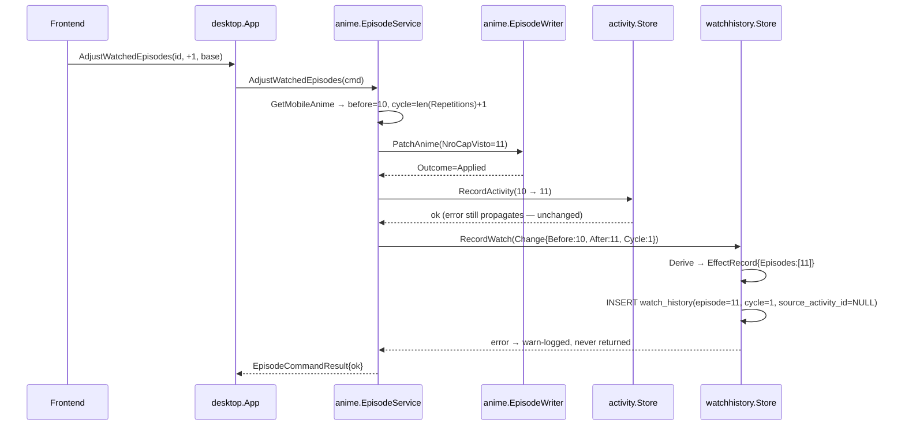
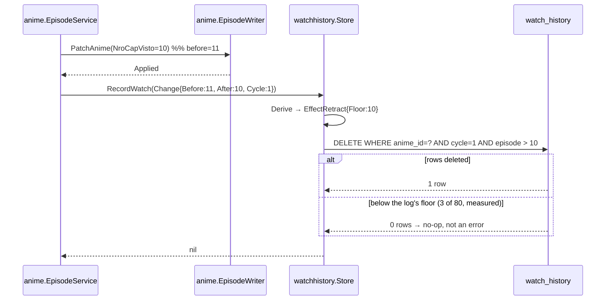
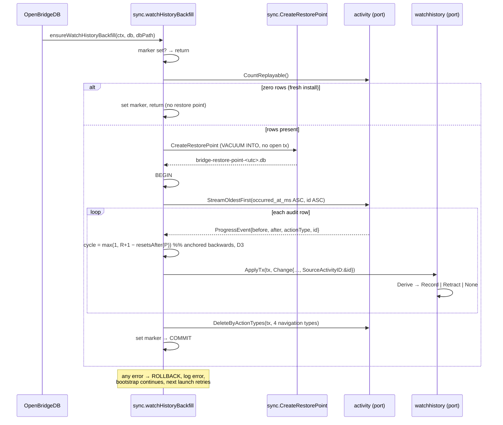

# Design: Real Watch History (SDD-69)

## Technical Approach

A new bounded context, `internal/watchhistory`, owns one permanent table and one **pure derivation
function**. Every producer — the desktop `EpisodeService`, the mobile `activityAnimeWriteService`, and
the one-shot backfill — calls that same function with the same `Change` struct, so a replay cannot
disagree with live recording by construction rather than by review.

The function maps a progress diff to one of three effects: record the integer episodes in the
half-open interval `(before, after]`, retract everything above the new floor, or do nothing. Storage
is a plain append/delete table with a `(watched_at_ms DESC, id DESC)` index, which makes global paging
a keyset scan (proposal: materialising is required, not an optimisation).

Two existing patterns are reused verbatim: the sdd-34 schema registry (`SchemaTables()` +
`persistence.EnsureTableSchema`) and the sdd-56 marker-guarded one-shot migration
(`internal/sync/vocabulary_migration_tables.go`).

---

## Architecture Decisions

### D1 — Package placement and the table-ownership boundary

**Choice.** `internal/watchhistory/` owns `watch_history` — DDL, every SQL statement, the derivation,
and the read models. `tools/checkarchitecture` gains a second owned table (`watch_history` →
`internal/watchhistory/`) alongside the existing `activity_log` rule. The backfill **driver** lives in
`internal/sync/watch_history_backfill.go`, mirroring `vocabulary_migration_tables.go`, because
`internal/sync` owns `schema_migration_markers` and `CreateRestorePoint`.

| Option | Tradeoff | Decision |
|---|---|---|
| Backfill SQL inside `internal/sync` | Needs `activity_log` in its text → would require widening `isActivityBoundaryFile` | Rejected |
| Backfill reads through exported `internal/activity` ports; writes through `internal/watchhistory` ports | One extra port pair; each table's SQL stays in its owner | **Selected** |
| New table inside `internal/activity` | Collapses the three lifetimes the change exists to separate | Rejected |

**Rationale.** `checkarchitecture/main.go:39` is a raw `strings.Contains` over `.go/.ts/.tsx` **source
text, comments included**. Widening the allowlist satisfies the scan; routing through ports satisfies
the rule the scan encodes. Two consequences that will otherwise cost an apply cycle:

- No file outside `internal/activity/` may contain the literal `activity_log`, *including in a
  comment*. Backfill prose says "the audit log"; the new column is `source_activity_id` (the substring
  `activity` alone does not trip the check).
- Symmetrically, once the `watch_history` rule lands, no file outside `internal/watchhistory/` may
  write that literal. `internal/sync/watch_history_backfill.go` is a file *name*; the checker reads
  content only, and the driver's identifiers are camelCase (`ensureWatchHistoryBackfill`).

Verified against `.golangci.yml`: `domain-purity` scopes to `internal/anime/domain/**`, not
`internal/anime/**`, so `internal/anime` may import `internal/watchhistory` for the `Change` type
exactly as it already imports `internal/activity` for `ActionEpisodeAdjusted`
(`episode_service.go:9`). One `Change` struct, no duplicate DTO.

### D2 — The derivation function

```go
package watchhistory

// Change is one applied anime patch, as watch history needs to see it.
type Change struct {
    AnimeID          string
    AnimeName        string
    Source           string  // activity.SourceDesktop | SourceMobile | SourceLegacy | SourceSystem
    OccurredAtMS     int64
    BeforeEpisodes   float64
    AfterEpisodes    float64
    // Cycle is the 1-based rewatch cycle. The two producers compute it DIFFERENTLY and
    // must both be implemented from D3: live = len(MobileAnime.Repetitions)+1; the replay
    // anchors BACKWARDS, cycle(P) = max(1, R+1-resetsStrictlyAfter(P)). Counting forwards
    // from 1 during the replay is the silent-drift bug D3 documents: measured, it would
    // mis-assign 59 of the 61 repeated animes.
    Cycle            int64
    CycleReset       bool    // the patch carried RepeatAt
    SourceActivityID *int64  // diagnostic provenance; nil for a live write
}

type EffectKind uint8

const (
    EffectNone EffectKind = iota // zero delta, half-step with no whole episode, reset, guard trip
    EffectRecord                 // insert Episodes, ascending
    EffectRetract                // delete this anime+cycle's rows above Floor
)

type Effect struct {
    Kind     EffectKind
    Episodes []int64
    Floor    float64
}

// Derive is pure: no clock, no context, no database. It is the single point of
// agreement between the live write paths and the backfill.
func Derive(change Change) Effect
```

Semantics, in evaluation order:

| # | Guard | Result |
|---|---|---|
| 1 | `CycleReset` is true | `EffectNone` |
| 2 | `BeforeEpisodes` or `AfterEpisodes` is NaN/Inf, or `AfterEpisodes < 0` | `EffectNone` |
| 3 | `AfterEpisodes == BeforeEpisodes` | `EffectNone` (measured: 10 rows, explore §3.4) |
| 4 | `AfterEpisodes < BeforeEpisodes` | `EffectRetract{Floor: AfterEpisodes}` |
| 5 | episode count `> maxEpisodesPerChange` | `EffectNone` |
| 6 | otherwise | `EffectRecord{Episodes: e ∈ ℤ, floor(Before) < e ≤ After}` |

The interval rule is the whole design. It needs no special case for a jump and no special case for a
half-step:

- `11 → 12` → `[12]`. At the measured maximum forward step of +1.0 (explore §3.4) this always emits
  exactly one row.
- `11 → 11.5` → `[]`. Half of episode 12 is not an episode watched.
- `10.5 → 11` → `[11]`. `floor(10.5)+1 = 11`.
- `11 → 10.5` → retract above `10.5`, deleting episode 11. Half of an episode is not a watched
  episode, so un-watching half of 11 un-records it.
- An oscillation `11 → 10.5 → 11` leaves the same episode recorded, but **it is a delete followed by a
  fresh insert, not an internal no-op**. The final set of `(anime_id, cycle, episode)` is identical;
  the row's `id` and `watched_at_ms` are not, so episode 11 now carries the time it was last completed
  and moves to that position in the timeline. That is the honest reading (the last time you finished
  episode 11 *was* the re-reach), and it is the consequence of keeping the D2a invariant exact. The
  alternative — retracting above `ceil(after)` so the row survives untouched — would leave episode 11
  recorded as watched while progress says 10.5, which breaks the invariant outright.

**Worked example — the real Dr. Stone sequence** (`xuVLJInv8S1CA8nO`, all 13 progress rows in the log,
`action_type IN ('episode_adjusted','chapter_adjusted')` so telemetry's `before == after` rows do not
pollute the trace):

| # | Change | Effect | Rows after |
|---|---|---|---|
| 1-6 | `11 → 10.5 → 11` ×3 | retract 11, record `[11]`, ×3 | `{11}`, carrying row 6's timestamp |
| 7-11 | `11 → 12 → 11 → 12 → 11 → 12` | record `[12]`, retract, record, retract, record | `{11, 12}` |
| 12 | `12 → 11.5` | retract above 11.5 → deletes 12 | `{11}` |
| 13 | `11.5 → 12` | records `(11, 12] = [12]` | `{11, 12}` |

The sequence ends at **12**, not at 10.5, and the snapshot now reads `episodesWatched = 13` (it advanced
once more after the log window). Final recorded set `{11, 12}` against progress 12 — the invariant holds
exactly. **Thirteen log rows collapse to one net new history row, episode 12**, which is the clearest
measured statement of why the model earns its place: the rejected one-entry-per-log-row alternative
would have written thirteen.

`maxEpisodesPerChange` is a safety ceiling, not a measurement: its only job is to stop a corrupt float
from enumerating an unbounded slice. Any value above real episode counts works; the design fixes it at
**5000** and requires a test pinning that an over-bound change is a no-op, not a 5000-row insert.

### D2a — The multi-episode jump: enumerate, and say it is a claim

A jump arrives through exactly one door, and the door is verified:

- **Desktop cannot jump.** `episode_service.go:199` gates every adjustment on
  `isAllowedEpisodeDelta`, which is four equality comparisons against `±1` and `±0.5`
  (`episode_service.go:304-306`). A multi-episode step is structurally impossible from the desktop UI,
  not merely unobserved.
- **Mobile can.** `AnimePatch.NroCapVisto` is an absolute `*float64` (`contracts/services.go:15`)
  assigned without delta validation in `anime_handler.go:234`. It also explains two measured buckets
  the desktop clamp cannot produce: the eleven `−2.0` steps and the ten `0.0` steps (explore §3.4).

**Choice: enumerate.** `2 → 5` records episodes 3, 4 and 5, three rows sharing one timestamp;
`10.5 → 13` records the integers 11, 12, 13 (never 11.5 or 12.5 — see below).

| Option | Tradeoff | Decision |
|---|---|---|
| Enumerate `(floor(before), after]` | Several rows share one observed timestamp | **Selected** |
| Record only the landing episode | History and progress drift apart permanently; episodes 3 and 4 never appear anywhere | Rejected |

**Rationale — the deciding argument is an invariant, not a preference.** Enumeration keeps the
projection and its authority in agreement: after any sequence of changes, the rows for
`(anime, cycle)` are exactly the integers in `(firstObservedFloor, NroCapVisto]`. That is checkable as
a property test, and it is the same invariant that makes the retraction rule correct. Landing-only
breaks it immediately and permanently — record `5` after `2 → 5`, then roll back to 4, and the history
shows nothing for 3, 4 or 5 while progress says 4. A projection allowed to drift from its authority is
a defect generator, and the drift is unrepairable because the intervening episodes were never written.

**What the shared timestamp does and does not claim.** It asserts *when the change was observed*, not
three separate watch instants. The team lead is right that a mobile absolute write is a state sync
rather than a user pressing "+1" three times, and it may be a conflict resolution landing on a value.
The design records that ambiguity rather than resolving it: the timestamp is the sync's, the episodes
are the log's, and the surface groups them into one day like any other burst.

The counter-argument deserves stating, because it nearly wins: ADR-022 rejects the day digest for
holding one timestamp across several episodes, and enumeration shares a timestamp across several rows.
The difference is what survives. The digest **erases** the individual episodes, so the question "what
did I watch" becomes unanswerable; enumeration keeps every episode addressable, retractable and
countable, and only its time is approximate — and approximate to the same instant the system itself
observed the change.

**Fractional values never become rows.** `NroCapVisto = 10.5` means episodes 1-10 complete and episode
11 half-watched. Episode numbers are integers, so "newly reached episode" means the integers in the
interval: `10.5 → 13` yields 11, 12, 13. A forward half-step (`11 → 11.5`) yields nothing, which is
what stops one episode from being recorded twice on the way to being finished.

Live and replay cannot diverge here, because both call `Derive` and neither path sees a delta the other
cannot — the backfill replays rows produced by both doors.

**Retraction below the log's floor is a no-op, not an error.** Measured: 3 of 80 rollbacks matched
nothing (explore §4.1). `DELETE … WHERE episode > ?` affecting zero rows returns `nil`.

**`SetAnimeDays` stays silent twice over.** `episode_service_schedule_state.go:89` never calls a
recorder, and even if it did, a `dias[]` rewrite leaves `NroCapVisto` unchanged → guard 3 → no row.

### D3 — A repeat must not erase history (divergence from the explore replay)

`RepeatAnime` writes `After{Estado: 0, NroCapVisto: 0, Activo: 1}`
(`episode_service_repeat_restore.go:95-99`), and the mobile path hard-codes the same reset whenever
`patch.RepeatAt != nil` (`app_activity_write.go:60-62`). Fed naively into guard 4, **a repeat of an
anime at episode 39 retracts to floor 0 and deletes that anime's entire history.**

The explore's replay did not cover this: it filtered its input by `action_type` and excluded
`anime_repeated`, so it never had to choose, and its row count and "zero double inserts" result do not
carry over (the proposal now records both flaws). The code is the runtime truth (AGENTS.md →
Delegation and Verification Guardrails), and the code says this is a data-loss path. Two guards close
it:

1. `CycleReset → EffectNone` (guard 1). A repeat records nothing and deletes nothing.
2. `watch_history.cycle`, with retraction scoped to `WHERE anime_id = ? AND cycle = ? AND episode > ?`,
   so a rollback inside cycle 2 cannot reach cycle 1's rows.

Both live paths already load the anime before patching, so `Cycle = len(current.Repetitions) + 1` is
free (`contracts.MobileAnime.Repetitions`, `contracts.go:54`).

**Cycle alignment rule for the replay — anchor backwards from the snapshot, never forwards from the
log.** Measured against the live database: 61 animes carry repetitions (68 in total), `activity_log`
holds exactly **2** `anime_repeated` rows, and **59 of those 61 have more snapshot repetitions than
logged resets**. Almost every reset predates the log. A replay that started at cycle 1 and counted
upwards would therefore assign, for 59 of 61 repeated animes, a cycle the live path will never
produce — and because retraction is scoped to `(anime_id, cycle)`, the first rollback after the
backfill would match nothing and silently fail to retract. Progress would move, history would not, and
they would never reconverge. Nothing errors; the data just goes quietly wrong.

With `R = len(Repetitions)` and `K` = resets in the log for that anime, the cycle at any replay
position `P` is defined backwards:

```
cycle(P) = max(1, R + 1 − resetsStrictlyAfter(P))
```

Equivalently, forwards: seed at `R + 1 − K` and increment on each reset. Both land the final segment on
`R + 1`, which is exactly what the live path computes, so the first live write after the backfill
targets the same cycle the replayed rows carry. Checked against the two real cases — Date a Live II
(`R = 1`, `K = 1`, anime `bVEnGIR6LIyNuocV`): pre-reset segment `1`, post-reset `2`, live `2`. A
typical repeated anime (`R = 3`, `K = 0`): every replayed row `4`, live `4`.

**`K ≤ R` is an assumption, and it is stated rather than relied on.** It holds because the log is a
suffix of an anime's life, so every reset it witnessed is also counted in the snapshot. `K > R` would
mean the snapshot lost repetition history the log still remembers.

**Decided behaviour for `K > R`: clamp per row, not the seed, and report it.** The clamp belongs inside
`cycle(P)` above — an earlier draft clamped the *seed* to 1 and then incremented, which for `K > R`
lands the final segment on `1 + K` instead of `R + 1` and reintroduces exactly the live/replay
mismatch the rule exists to prevent. Clamping per row keeps the sequence monotonic and keeps the final
segment on `R + 1` unconditionally, which is the only property that must hold. Its cost is that the
unreconstructable early cycles collapse into cycle 1, where the same episode from two pre-log cycles
can collide on the natural key and the second insert no-ops — surfaced by the `ON CONFLICT` counter
rather than hidden. The backfill logs the anime, `R` and `K` at `warn`. This is a decided behaviour
with a required test, not an accident of arithmetic.

**Consequence for the surface.** Because the backfill can only anchor the last `K + 1` cycles, every
episode it replays for an anime with `R > K` lands in a cycle with no earlier siblings in the table —
a cycle numbered 4 with nothing numbered 1-3. That is correct and honest (history cannot precede the
log), and the per-anime Detail view MUST NOT imply those cycles are empty rather than unrecorded.

Consequence to record, not to hide: the post-fix replay row count is **higher than the explore's 201**,
by however many rows the two observed repeats erased. That number is not measured here; `sdd-apply`
re-runs the fixture replay and records it.

### D4 — Transaction boundary: the watch-history write follows the patch and never fails the user

**Choice.** Order per applied patch: `PatchAnime` commits → `RecordActivity` (unchanged, error still
propagates) → `RecordWatch`. A `RecordWatch` failure is logged at `warn` under `domain="watch-history"`
and the user's action still reports success.

| Option | Tradeoff | Decision |
|---|---|---|
| Join the patch's transaction | Needs a `*sql.Tx` threaded through `contracts.AnimePatcher` — an interface the mobile path reaches through with no tx handle. Cross-context contract change | Rejected |
| Follow the patch, error propagates (today's telemetry coupling) | A secondary log failure denies a primary fact that already committed; the user retries and either double-increments or hits OCC | Rejected |
| Follow the patch, error degrades | One history row can be lost; it stays derivable from the audit log | **Selected** |

**Rationale.** The team lead's objection is right that a watch is user-visible, unlike telemetry — so
the answer is not "it's only telemetry", it is **recoverability**. `anime_snapshots.NroCapVisto` is the
authority; `watch_history` is a projection of an append-only log that recorded the same patch one step
earlier. Hence the ordering: activity first, watch history second, so the evidence a lost row is
derived from is already durable when the derived write is attempted. The documented repair (drop the
table, clear the marker, relaunch) reconstructs it.

Reintroducing the propagating coupling would also re-create, at the *more* frequent call site (379
progress events vs 277 telemetry rows over the same 69 days), exactly the defect this change removes
from the telemetry path. And with `db.SetMaxOpenConns(1)` (`sqlite_bootstrap.go:141`) the two writes
are serialised on one connection anyway — "immediately after, same connection" is as close to atomic
as this database gets without threading a transaction through a cross-service port.

### D5 — Keyset pagination, and where the timezone boundary sits

**Cursor**: opaque `"<watched_at_ms>:<id>"`, matching `eventlog.EventSearchPage`'s `NextCursor`
convention so a client fluent in one page shape is fluent in the other.

```sql
SELECT id, anime_id, anime_name, episode, cycle, watched_at_ms, source
FROM watch_history
WHERE :cursor_ms IS NULL
   OR watched_at_ms < :cursor_ms
   OR (watched_at_ms = :cursor_ms AND id < :cursor_id)
ORDER BY watched_at_ms DESC, id DESC
LIMIT :limit
```

It rides `idx_watch_history_watched_at (watched_at_ms DESC, id DESC)` — the same shape as
`idx_activity_log_occurred_at` and `idx_runtime_events_time`. The per-anime read rides
`idx_watch_history_anime (anime_id, watched_at_ms DESC, id DESC)`, mirroring `idx_activity_log_anime`.
`id DESC` is the tiebreaker that makes the cursor total: explore §3.6 measured seven events inside
three seconds, so equal timestamps are ordinary, not hypothetical.

**Day grouping is computed on the client, not in Go.** `watched_at_ms` is epoch UTC; a day heading is
a **local** day (the measurements used UTC−3). The frontend derives the day key from the epoch millis
in a pure tested helper.

| Option | Tradeoff | Decision |
|---|---|---|
| Go emits `day_key` per row | Moves timezone authority into a process the MCP sidecar also reads; tempts a day-keyed cursor, which breaks the moment one day exceeds the page size | Rejected |
| Extra per-day count query | A round trip, and still needs local-day maths server-side | Rejected |
| Client groups the accumulated rows | Only the trailing group can be partial | **Selected** |

Rows arrive in strict descending time order, so **every group except the trailing one is provably
complete and its count is final**; the trailing group's count is a count of what has loaded and settles
the moment a row from an older day arrives. A heading therefore never states a number contradicted by
what is on screen. That is the honest reading of a cursor-paged log, and it keeps the contract "one
timestamp drives every derived field via tested helpers" — the one `anime-history` discipline SDD-69
carries forward.

### D5a — Backend paging *and* progressive rendering: one mechanism, not two

ADR-012 does cover this case, in its **addendum of 2026-08-30 (SDD-65)**: "live lists whose batches
come from a cursor-paged server query". Activity's Runtime Events and Transactions rails hit it first.
Its ruling is explicit — such a rail takes the **live** branch, does NOT use
`useProgressiveListWindow`, keeps its own reconciliation, and reuses only `isNearListBottom`; "only the
ORIGIN of a batch changes: memory becomes SQLite". `NetworkTable.tsx` is the reference implementation.

`/history` is cursor-paged but nothing pushes into it, so it is not "live" in the event-stream sense.
It takes the live branch anyway, for the addendum's own reason rather than its label: appending a
fetched page changes `itemCount`, and `useProgressiveListWindow` resets `renderLimit` in the render
phase on exactly that (`use-progressive-list-window.ts:31-34`), so it would snap the user back to the
first batch on every fetch. Checked, not assumed.

**The server page IS the batch.** Scroll-near-bottom fetches the next keyset page; rows accumulate and
are never unmounted; the scrollbar starts short and grows. `PAGE_SIZE` is the initial-batch constant,
so the spec's DOM-count scenario reads directly: after the first load the DOM row count equals
`PAGE_SIZE`, and one near-bottom event grows it by one more page.

| Option | Tradeoff | Decision |
|---|---|---|
| Server page = batch; `onScroll` + `isNearListBottom` | One mechanism; the unfetched tail is not in memory at all | **Selected** |
| Large server batch + client-side window over it | Two stacked mechanisms, and the outer one still changes `itemCount` when the batch grows — so it still cannot use the shared hook. Buys nothing | Rejected |
| `Table.LoadMore` / `Table.LoadMoreContent` | **Forbidden by ADR-012's 2026-08-31 correction.** It is React Aria's `useLoadMoreSentinel`: its layout effect rebuilds the IntersectionObserver on every collection change, so a rail that appends what it fetched re-triggers itself and pages to exhaustion with no user input. An in-flight guard does not help. It shipped that bug twice (Transactions, latent in Notifications) | Rejected |

Wire `onScroll` on the element that actually scrolls — the wrapping `overflow-y-auto` div, never
`Table.ScrollContainer`, which is horizontal-only. The deterministic guard stays a DOM-count test per
rail, following `AnimeEditorWorkspace.windowing.test.tsx`; ADR-012 states there is deliberately no lint
rule, because "this list can get long" is not statically decidable.

This corrects the proposal's `useProgressiveListWindow` line, and it is not a new precedent: it is the
path SDD-65 already took for the same shape.

### D6 — Backfill: failure, idempotency, and restore-point ordering

Driver order inside `OpenBridgeDB`, **after** `initializeBridgeDB` returns — the innermost scope
holding both the `*sql.DB` and the file path `CreateRestorePoint` needs:

1. Marker present → return. (`schema_migration_markers`, `marker = 'watch_history_backfill'`, reusing
   the existing `vocabulary_migrated_at` epoch column; the table is keyed by `marker`, the column name
   is a pre-existing misnomer and generalising it is separate housekeeping.)
2. Zero replayable rows → set the marker and return, **without** a restore point. A fresh install must
   not litter a 20 KB `bridge-restore-point-*.db` beside an empty database.
3. `CreateRestorePoint` — outside any transaction. `VACUUM INTO` requires it (`restore_point.go:26-29`)
   and refuses an existing destination, so a collision is an error, never a silent overwrite.
4. `BEGIN` → replay oldest-first (`occurred_at_ms ASC, id ASC`) → purge the four navigation action
   types → set the marker → `COMMIT`.

**A backfill failure does not fail bootstrap.** It rolls back, logs at `error`, and the app starts with
an empty history; no marker was set, so the next launch retries. This deliberately diverges from
`ensureVocabularyMigration`, whose failure *must* abort bootstrap because it gates decoding correctness
of the primary data. `watch_history` is a secondary projection; refusing to open the database over it
would be disproportionate.

**Idempotency has two independent layers, and the marker is the load-bearing one.** The marker skips a
second run outright; `UNIQUE (anime_id, cycle, episode)` makes a re-run converge on top of it, and
covers the one case the marker cannot — a replay landing on rows that already exist, where it no-ops
instead of duplicating. Under the documented repair (drop the table, clear the marker, relaunch) the
replay starts from an empty table, so the index is not what makes the backfill safe; it is present for
live writes regardless, which makes the second layer free rather than a cost incurred here.

The measured replay reported zero double inserts, but that result is an artifact and must not be cited
as support: the only two repeated animes had no pre-repeat episodes inside the log's window, so no
episode number was ever reached twice within the sample (explore §4.1, Flaw 2). The index carries the
property on its own rather than confirming a measured one.

**The purge cannot damage replayability**, and this is checkable rather than asserted: the 277
navigation rows have `before == after` (explore §3.2), which is guard 3 — they map to `EffectNone`.
Deleting rows that contribute nothing to the derivation cannot change any replay outcome.

The documented repair path is drop the table + clear the marker + relaunch, i.e. replay the whole log.
Replaying *part* of the log over live rows is not supported: a historical retraction would target rows
written after it.

### D7 — Telemetry relocation, and the 371 dead rows

The four navigation actions stop calling `activity.Store` and emit through the shared logger
(`logger.Logf(domain, level, Fields, format, args...)`), which fans out to the bound `eventlog.Sink`
→ `Queue` → `runtime_events`. Column mapping:

| `runtime_events` column | Value |
|---|---|
| `domain` | `"anime"` — the NetworkPanel derives its filter options from the data (`observability` spec 67-76), so no spec change |
| `level` | `"info"` |
| `event_type` | `"anime.folder_opened"` / `"anime.page_opened"` / `"anime.folder_copied"` / `"anime.page_copied"` — the dotted `<domain>.<event>` form every producer in the tree already uses (`websocket.register`, `sync.changelog`, `download.run-finished`, `notification.forwarded`, `eventlog.prebind_overflow`, and `anime.write` at `internal/anime/writer.go:202`). Deliberately **not** the old underscore `action_type` literals: those were `activity_log` labels, and the NetworkPanel's event-type filter groups on this convention |
| `entity_id` | the anime id |
| `correlation_id` | the existing `anime.desktop-action:<id>:<ms>`, verbatim, so correlation timelines still stitch |
| `message` | an English sentence carrying the anime name |
| `metadata_json` | `{"animeName": …, "source": "desktop"}`, bounded to 4 KB by `boundMetadataJSON` |
| `duration_ms` | unset → NULL via `nullableDuration` |

Two behaviour changes to record: `newEntry` stamps `time.Now()`, so the persisted `occurred_at_ms` may
differ by microseconds from the `OccurredAtMs` echoed in `EpisodeCommandResult` (a diagnostic row, so
this is immaterial); and `Logf` returns nothing, so `runAnimeDesktopAction`'s
"recording failed → error result" branch disappears — which is the coupling removal explore §5 calls
out. `a.sharedLogger` is nil-guarded like every other lazily wired `App` collaborator.

**The `anime` domain is free — confirmed by query, not assumed.** All 371 pre-existing
`domain="anime"` rows carry one message shape, `"publishing anime.changed for tracer-bullet-anime"`,
371 of 371, with empty `correlation_id`, empty `entity_id` and a null `event_type`; none is newer than
2026-08-30. That is exactly the residue `internal/tracerbullet/runner.go:10-19` documents — the runner
derived its domain by splitting its own sentence on `": "`, which the `tracerDomain` constant fixed,
which is why the rows stop. **No migration, no purge, no domain rename.**

They are left alone: they are inert, they rotate out of the ~136-day window unaided at the measured
142.7 rows/day against the 20,000 cap, and an external process (the MCP sidecar) reads this table —
deleting rows there is a side effect nobody asked for.

**A non-null `event_type` is what separates a real anime-domain event from the residue**, and that is a
cheap checkable property rather than a convention: every new navigation row carries both an
`event_type` and a populated `entity_id` (the anime id), and no residue row carries either. Any reader
filtering on `event_type` never sees them at all.

### D8 — `activity_log` retention cap

`internal/activity/store.go` gains `pruneOldestBeyondRetention`, copying eventlog's cadence including
the unconditional prune on the first write of each process (`eventlog/store.go:50-74`) — the reason
given there holds here verbatim: a desktop app's short sessions would otherwise never reach the
cadence. `RecordActivity`'s bare `Exec` becomes `BEGIN/INSERT/prune/COMMIT`.

Cap: **5,000 rows**, `pruneEvery = 200`. Derivation from measured figures: 9.7 rows/day total, minus
277/69.2 = 4.0 rows/day of relocated telemetry, leaves 5.7 rows/day → 5000/5.7 ≈ **877 days ≈ 2.4
years** of audit trail. 5,000 also matches syncdiag's existing cap. `NewStore(provider)` keeps its
signature (defaults); `NewStoreWithRetention(provider, StoreRetention{RowCap, PruneEvery})` is added
for tests and explicit wiring, so no call site breaks.

### D9 — Frontend module shape

Strict colocation, **no barrel** (ADR-011); every import is a concrete path.

```
frontend/src/shared/watch-history/          ← consumed by two features from birth (CLAUDE.md FE #12b)
  watch-history.types.ts                       readonly props/entities
  watch-history.helpers.ts                     toLocalDayKey, groupEntriesByDay, formatDayHeading, formatRowTime
  __tests__/
frontend/src/features/history/ui/HistoryTimeline/
  HistoryTimeline.tsx                          dumb: HeroUI + Tailwind, no Wails, no useEffect
  use-history-timeline.ts                       cursor + accumulated pages + near-bottom fetch
  history-timeline.constants.ts / .types.ts
  __tests__/
frontend/src/features/anime-detail/ui/AnimeWatchHistory/   ← beside AnimeRepetitionTimeline
```

The helpers live in `shared/` because a timestamp → local-day projection carries no feature semantics
and both surfaces need it on day one; the alternative is a feature→feature import, which is the exact
shape the `.dharness/fallow.jsonc` boundary layers exist to catch.

**Three mandatory states, exclusive** (CLAUDE.md FE #14). First page unresolved → skeleton rows
*replacing* the content, gated on the request (`isLoading ? null : groups.map(…)`), with
`role="status"`, `aria-live="polite"` and `aria-labelledby` pointing at an `sr-only` span. First page
resolved-empty → `shared/ui/AirisEmptyState`, carrying the "history begins 2026-07-05" sentence.
Failure → the surface's error `Alert`. Appending a later page is a fourth, *additive* affordance (a
trailing status region), never a return to the skeleton. Every loading test asserts the negative: no
real rows while loading.

This is why the Wails page binding carries a status, unlike `GetAnimeHistory`, which swallows errors
and returns `[]` — a contract under which the empty state lies about a failure.

---

## Data Flow

### Forward episode step (desktop)



### Rollback (retraction)



### One-shot backfill



---

## Interfaces / Contracts

```sql
CREATE TABLE IF NOT EXISTS watch_history (
    id                 INTEGER PRIMARY KEY AUTOINCREMENT,
    anime_id           TEXT    NOT NULL,
    anime_name         TEXT    NOT NULL,
    episode            INTEGER NOT NULL,   -- integer by construction; a half-step never creates a row
    cycle              INTEGER NOT NULL,   -- 1-based rewatch cycle (D3)
    watched_at_ms      INTEGER NOT NULL,
    source             TEXT    NOT NULL,
    source_activity_id INTEGER             -- diagnostic provenance; NULL for live writes
);
CREATE INDEX  IF NOT EXISTS idx_watch_history_watched_at ON watch_history(watched_at_ms DESC, id DESC);
CREATE INDEX  IF NOT EXISTS idx_watch_history_anime      ON watch_history(anime_id, watched_at_ms DESC, id DESC);
CREATE UNIQUE INDEX IF NOT EXISTS idx_watch_history_episode ON watch_history(anime_id, cycle, episode);
```

**The natural key is `(anime_id, cycle, episode)`.** An earlier draft keyed uniqueness on
`(source_activity_id, episode)` with NULL-distinct semantics; that was worse in both directions and is
withdrawn. It left live rows — the ones users generate — with no constraint at all while guarding only
replayed ones, and on the repair path it would happily insert a replayed duplicate of an existing live
row, because the provenance column differs. The natural key covers both row kinds, and it makes D2a's
contiguity invariant structural instead of merely tested.

Nothing legitimate collides with it. A rewatch is a new cycle, so cycle 2's episode 1 sits beside cycle
1's. Re-reaching an episode inside one cycle is only possible *through* a retraction that already
deleted it (`5 → 4 → 5`). A duplicated mobile op arrives as a zero delta and records nothing. And the
app has no way to express "I watched episode 11 twice" other than a repeat cycle, since progress is a
single number — so the browser analogy's "three visits each keep their own row" is satisfied across
cycles, which is the only axis on which this data model can distinguish them.

`source_activity_id` stays as a column: provenance on a permanent table is free at write time and
unrecoverable later, same reasoning as `source`. It is diagnostic only, and carries no index.

Inserts use `ON CONFLICT(anime_id, cycle, episode) DO NOTHING`. On the replay path that is the
convergence property. On a live write a conflict is unreachable by the argument above, so it would mean
a retraction silently failed to run: the store counts conflicts and logs them at `warn` rather than
swallowing them, because a `DO NOTHING` that never surfaces is how that defect would hide.

`anime_name` is denormalised, as `activity_log` already does: the read path stays a pure index scan
with no join and no `snapshot_json` decode, and the name at watch time is the honest label for a
historical event. `source` is recorded because it is free at write time and unrecoverable later.

```go
// internal/watchhistory
func (s *Store) ApplyTx(ctx context.Context, tx *sql.Tx, change Change) error // primitive
func (s *Store) Apply(ctx context.Context, change Change) error               // own transaction
func (s *Store) Page(ctx context.Context, q PageQuery) (Page, error)
func (s *Store) AnimePage(ctx context.Context, animeID string, q PageQuery) (Page, error)
func SchemaTables() []persistence.TableSchema

type PageQuery struct { Limit int; Cursor string }  // Limit 0 → default, clamped to a max
type Page  struct { Items []Entry; NextCursor string }
type Entry struct { ID int64; AnimeID, AnimeName string; Episode, Cycle int64; WatchedAtMS int64; Source string }

// internal/anime — port, mirroring ActivityRecorder
type WatchRecorder interface { RecordWatch(ctx context.Context, change watchhistory.Change) error }

// internal/activity — replay + purge ports (SQL stays here)
type Snapshot struct { Estado int; NroCapVisto float64; Activo int } // exact stored JSON key shape
func (s *Store) CountReplayable(ctx context.Context) (int64, error)
func (s *Store) StreamOldestFirst(ctx context.Context, fn func(ProgressEvent) error) error
func (s *Store) DeleteByActionTypes(ctx context.Context, tx *sql.Tx, actions ...string) (int64, error)
```

`anime.ActivityAnimeSnapshot` has **no JSON tags**, so `before_json`/`after_json` are stored under the
Go field names `Estado` / `NroCapVisto` / `Activo`. The replay decoder must match those keys exactly
and must not English-ify them: this is the retained storage-format surface CLAUDE.md #13 exempts.

```go
// internal/desktop — Wails bindings
func (a *App) GetWatchHistoryPage(cursor string) contracts.WatchHistoryPage
func (a *App) GetAnimeWatchHistoryPage(animeID string, cursor string) contracts.WatchHistoryPage
// contracts.WatchHistoryPage{ Items []WatchHistoryEntry; NextCursor, Status, Message string }
```

`contracts.AnimeHistoryItem`, `QueryService.ListAnimeHistory`, `AnimeQueryService.ListAnimeHistory`
(`services.go:105`) and `App.GetAnimeHistory` are removed together.

---

## File Changes

| File | Action | Description |
|---|---|---|
| `internal/watchhistory/schema.go` | Create | DDL + `SchemaTables()` |
| `internal/watchhistory/derive.go` | Create | `Change`, `Effect`, `Derive` — pure |
| `internal/watchhistory/store.go` | Create | `ApplyTx`/`Apply`, keyset `Page`, `AnimePage` |
| `internal/sync/sqlite_bootstrap.go` | Modify | Register the table; call the backfill from `OpenBridgeDB` |
| `internal/sync/watch_history_backfill.go` | Create | Marker-guarded driver, restore point, replay, purge |
| `internal/activity/store.go` | Modify | Retention cap; replay/purge ports; drop 4 navigation constants |
| `internal/anime/episode_service.go` | Modify | `WatchRecorder` port + wiring; drop 4 navigation constants |
| `internal/anime/service.go` | Modify | Remove `ListAnimeHistory` |
| `internal/api/contracts/contracts.go`, `services.go` | Modify | `AnimeHistoryItem` → `WatchHistoryPage`/`WatchHistoryEntry` |
| `internal/desktop/app.go` | Modify | `watchRecorderAdapter`; wire the recorder into both write paths |
| `internal/desktop/app_activity_write.go` | Modify | Mobile path records watch history |
| `internal/desktop/app_desktop_actions.go` | Modify | Telemetry → shared logger → `runtime_events` |
| `internal/desktop/app_runtime.go` | Modify | Remove `GetAnimeHistory`; add the two page bindings |
| `tools/checkarchitecture/main.go` | Modify | Second owned table: `watch_history` → `internal/watchhistory/` |
| `frontend/src/shared/watch-history/**` | Create | Types + day-grouping/formatting helpers + tests |
| `frontend/src/features/history/ui/HistoryTimeline/**` | Create | Day-grouped, cursor-paged episode list |
| `frontend/src/features/history/ui/HistoryTable/**` | Delete | 1,858 measured lines (899 prod / 959 test) |
| `frontend/src/features/anime-detail/ui/AnimeWatchHistory/**` | Create | Per-anime section beside `AnimeRepetitionTimeline` |
| `frontend/src/infrastructure/bridge-runtime-source/**`, `shared/contracts/anime.types.ts` | Modify | Adapter + types |
| `docs/adr/022-watch-history-model.md` | Create | ADR-022 |

---

## Testing Strategy

| Layer | What | How |
|---|---|---|
| Unit | `Derive` — every row of the D2 table, plus the jump cases (`2 → 5` → `[3,4,5]`, `10.5 → 13` → `[11,12,13]`, `11 → 11.5` → `[]`) | Table-driven, one row per guard; expected values as literals, never the production constant |
| Property | After any sequence of changes, the rows for `(anime, cycle)` are exactly the integers in `(firstObservedFloor, progress]` | The invariant D2a is decided on; catches any future rule that lets the projection drift from `NroCapVisto` |
| Unit | Cursor encode/decode, clamping, equal-timestamp tiebreak | Table-driven |
| Unit | Day grouping, local-day boundary, heading/time formatting | Vitest, fixed timestamps, explicit timezone |
| Integration | `ApplyTx` against real SQLite: insert, retract, cross-cycle isolation, unmatched retraction, oscillation round-trip (same episode set, new row identity), `ON CONFLICT` no-op counted rather than swallowed | `persistence.EnsureTableSchema` + in-memory SQLite, as `eventlog/store_test.go` does |
| Integration | Backfill: idempotent replay, marker, purge, rollback-on-error, fresh-install no-restore-point | Fixtures built from the real `activity_log` row shape (including untagged snapshot keys) |
| Integration | **Cycle alignment** (D3): `R=3, K=0` → every replayed row lands on cycle 4 and a following live write agrees; `R=1, K=1` → pre-reset 1, post-reset 2; `K > R` → per-row clamp, final segment still `R+1`, warn logged | The 59-of-61 case is the default one, so it is the first fixture, not an edge case |
| Integration | `activity_log` prune cadence, including the first-write unconditional prune | Small `RowCap` via `NewStoreWithRetention` |
| Component | Three exclusive states; `role="status"` + `aria-labelledby` | RTL, asserting the negative while loading |
| Component | DOM-count windowing guard: after the first load the row count equals `PAGE_SIZE`; one near-bottom event grows it by one page | Per ADR-012 Enforcement, following `AnimeEditorWorkspace.windowing.test.tsx`. Mandatory — "every panel adopting this pattern MUST ship that test" |
| Component | Day grouping across a page boundary: a complete group's count is final, the trailing group's settles | Two fixture pages splitting one local day |

### MUTATE — the guards whose mutants must die

`Derive` is guard-dense, so per CLAUDE.md #16 the MUTATE step is mandatory and scoped:

```
ditto staged --exclude-prefix frontend/ --threshold 0.80 \
  --test-command "go test -count=1 -json ./internal/watchhistory/"
```

| Mutant | Killed by |
|---|---|
| `after > before` → `>=` / `after < before` → `<=` | zero-delta case asserting `EffectNone` |
| loop start `floor(before)+1` → `floor(before)` | `10.5 → 11` asserting exactly `[11]`, not `[10,11]` |
| loop condition `e <= after` → `e < after` | `11 → 12` asserting `[12]`, not `[]` |
| retraction `episode > floor` → `episode >= floor` | **integer** rollback `12 → 11` asserting 11 survives (a fractional floor kills nothing here) |
| cycle predicate dropped from the DELETE | cycle-2 rollback asserting cycle-1 rows survive |
| `CycleReset` guard negated/removed | repeat case asserting zero inserts **and** zero deletions |
| zero-affected-rows → error | retraction below the floor asserting `nil` |
| non-finite / over-bound guard removed | NaN and over-bound cases asserting `EffectNone` and a zero row count |
| `Outcome != Applied` guard negated | conflict-outcome case asserting zero rows written |

Never assert against the production symbol being pinned (`maxEpisodesPerChange`); write the expected
value as a literal.

---

## Threat Matrix

N/A for routing, shell, subprocess, VCS/PR automation and executable-file classification: the change
adds no launcher, no command, and no new process. `ValidatePageURL` / `ValidateLocalFolder` stay
exactly where they are in `app_desktop_actions.go` — only the destination of the *record* moves.

One process-integration row is applicable and already mitigated by existing code: navigation telemetry
now lands in `runtime_events`, which a separate MCP sidecar process parses
(`internal/mcp/requestcapture/reader.go`). User-controlled anime names enter `metadata_json`, which is
bounded and redacted by the existing `boundMetadataJSON` path (4 KB cap, marker object on overflow).
No new RED test is owed beyond asserting the metadata goes through that path.

---

## Migration / Rollout

One-shot, marker-guarded, restore-point-preceded (D6). Slices 1, 2 and 4-8 revert with `git revert`; a
registry-created table left behind by an older build is inert. Slice 3 is the only non-trivially
reversible unit, and its undo is the restore point plus a full drop-and-replay.

---

## ADR-022 rationale (source for the ADR)

**Selected — one row per episode watched, with its own timestamp; a rollback DELETES the row.** The
browser-history analogy settles it: a browser logs *you visited this page, at this time*, not *the URL
bar changed from A to B*, and a mistaken visit is deleted rather than annotated. Verified against a
real browser history: three visits to the same video one second apart each keep their own row, and
repetition surfaces as a count beside the row, never as a collapse of the timeline. Exercised against
379 real progress events, which established the insert/delete shape and found 3 retractions below the
log's floor. That replay's row count and its zero-double-inserts result are **not** evidence: it
filtered its input by `action_type` and so never saw a cycle reset (explore §4.1). D3 carries the
correction.

**Rejected — one entry per log row.** Measured: 28 rows to record 2 episodes on the worst day
(Tengen Toppa Gurren Lagann, 28 raw rows / 13 rollbacks / +2 net) — a 14-to-1 noise ratio, the same
category error as the telemetry this change is removing. Dr. Stone (`xuVLJInv8S1CA8nO`) is the
per-anime version and the worked example in D2: **13 log rows collapse to one net new history row**,
episode 12, with the selected model writing 1 where this alternative writes 13.

**Rejected — fold each day into a digest** ("watched episodes 37-39", one entry). Fixes the noise by
destroying what a history is for: it holds one timestamp for several episodes, so it cannot answer
"what was the last thing I watched before bed".

**A multi-episode jump enumerates, and the timestamp is a claim.** Desktop is hard-clamped to `±1`/
`±0.5` (`episode_service.go:304-306`), so a jump can only arrive through an absolute mobile patch. The
history records every episode in the interval at the timestamp the change was observed, because a
projection that drifts from its authority cannot be repaired (D2a).

**The `anime` domain only looked occupied.** 371 rows made it appear taken; querying them showed one
literal message, no `event_type`, nothing newer than 2026-08-30 — residue from a defect that was
already fixed. A concrete instance of AGENTS.md → Boundary Truths: a constraint attributed to existing
data is a hypothesis until queried.

**The three-lifetimes rule.** `watch_history` permanent, `activity_log` capped (D8), `runtime_events`
rotating ~140 days. The asymmetry is the point: *you watched episode 9* is kept forever; *a folder was
opened* is kept until the question it answers goes stale. Storage is not the constraint —
`activity_log` measured 415 B/row → 1.4 MB/year against a 22.2 MB database, and `watch_history` rows
are narrower across two indexes instead of four.

---

## Spec reconciliation required

The design must not silently diverge from the specs. Three items need the spec amended; one is
confirmed as already agreeing.

| Spec | Requirement | Status |
|---|---|---|
| `watch-history` | **An Episode Is Never Recorded Twice** — `UNIQUE (anime_id, episode)` | **One column short.** The requirement's property is right and the design now upholds it for every row, live and replayed, via the natural key `UNIQUE (anime_id, cycle, episode)`. Only `cycle` is missing: without it a rewatch cannot record episode 1 a second time. Suggested restatement: *"`watch_history` MUST enforce a unique index on (`anime_id`, `cycle`, `episode`): within one watch cycle the same episode MUST NOT be recorded twice; a new cycle records its own"* |
| `watch-history` | **Episode Values Support Fractional Steps** — "the episode column MUST store a real (fractional) number" | **Conflict in the column-type sentence only; the scenario's outcome holds.** The derivation never emits a fractional episode: a forward half-step (`11 → 11.5`) records nothing, which is what stops episode 12 being recorded twice on the way to being finished. The column is `INTEGER` and the Go type is `int64` end-to-end. **Behavioural detail the scenario should state**: `11 → 10.5 → 11` is not a no-op internally — the retraction deletes the episode-11 row and the re-reach inserts a new one, so the final *set* of `(anime_id, cycle, episode)` is identical while the row's `id` and `watched_at_ms` are not. Suggested restatement: *"the recorder MUST accept fractional episode values as input and MUST record only whole episodes; an oscillation MUST leave the same set of recorded episodes, though a re-reached episode is recorded afresh with the time it was re-reached"* |
| `anime-history` | **Episode Timeline Is Grouped By Day** — "each day heading showing that day's episode count" | **Wording note.** Exact for every complete group; the trailing group's count is a count of loaded rows and settles when a row from an older day arrives (D5). Its scenario passes as written. Suggested addition: *"a day still being paged in MAY show a partial count until its rows are fully loaded"* |
| `watch-history` | **A Forward Step Inserts One Row Per Newly Reached Episode** | **Agrees.** D2a enumerates `(floor(before), after]`, which is exactly "one row per newly reached episode". Gap 1 produced no divergence here |

Also in the proposal, for consistency: the Approach section still says `/history` "takes
`useProgressiveListWindow` under ADR-012". Per D5a and ADR-012's SDD-65 addendum it must not; the rail
takes the live branch and reuses only `isNearListBottom`.

## Open Questions

- [ ] **A restored backup cannot rebuild history.** Verified in code, not spec prose:
      `internal/desktop/app_backup.go:58-63` exports exactly `anime_snapshots`, `seasons`,
      `season_animes`, `keyboard_keymap`. Neither `activity_log` nor `schema_migration_markers` travels
      in a bundle, so on a restored machine the backfill replays an empty log, sets the marker, and the
      history is gone with no source to re-derive from. The proposal already defers `watch_history`
      from bundles; this makes the consequence concrete for that follow-up.
- [ ] `maxEpisodesPerChange = 5000` is a chosen safety ceiling, not a measurement. Any value above real
      episode counts is equivalent; it is recorded so nobody mistakes it for evidence.
- [ ] The post-D3 replay row count (> 201) is unmeasured here and must be recorded by `sdd-apply` from
      the fixture replay.
