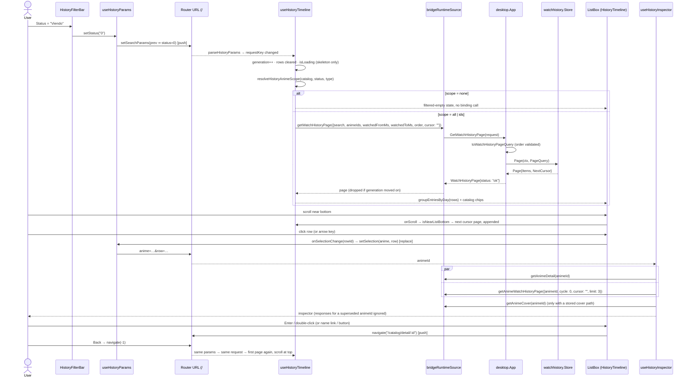

# Design: History UI Redesign (SDD-72)

## Technical Approach

SDD-69's read model stays; this change widens its query and rebuilds both surfaces on top of it.

- **Go** (`internal/watchhistory`): one `PageQuery` gains an order, a name search, a watched range, an
  anime-ID set and a cycle. Every predicate is applied in SQL before the keyset `LIMIT`. Newest-first
  and oldest-first each get their own row-value comparator. No schema change and no new index.
- **Bindings** (`internal/desktop`): the two SDD-69 cursor-only bindings keep their names and take a
  request struct instead. `docs/openapi.yaml` is untouched.
- **History** (`features/history`): the URL owns the filter and selection state. The timeline hook
  turns the URL into a page request, the frontend joins rows against `GetAnimes` for Status/Type and
  the chips, a single-selection `ListBox` groups rows under day sections, and an inspector keyed by
  anime ID fills in on selection.
- **Anime Detail** (`features/anime-detail`): one "Watch history" section with Tabs. "By watch" is an
  Accordion built from `repetitions` plus the current watch, each expanded watch paging its own
  cycle. "All episodes" is the flat per-anime list. `AnimeRepetitionTimeline` is retired.

Specs: `anime-history`, `watch-history` (deltas), `anime-detail-watch-history` (new).

Evidence limits: no shell was available, so line counts are ripgrep line counts (within one of
`wc -l`) and the sandbox `bridge.db` was byte-scanned read-only, not queried with `sqlite3`.

---

## Architecture Decisions

### D1 — One `PageQuery`, a mirrored row-value keyset, ASCII case folding, and no new index

**Choice.** Extend `watchhistory.PageQuery` and keep `Page` and `AnimePage` as the only entry points.
Every field is an independent predicate ANDed by one builder, so there is one paging path and one
mutation surface.

```sql
-- newest first (OrderNewestFirst)                 -- oldest first (OrderOldestFirst)
WHERE <filters> AND (watched_at_ms, id) < (?, ?)    WHERE <filters> AND (watched_at_ms, id) > (?, ?)
ORDER BY watched_at_ms DESC, id DESC LIMIT ?        ORDER BY watched_at_ms ASC,  id ASC  LIMIT ?

<filters> :=  anime_id = ?                                   -- AnimePage scope
         AND  cycle = ?                                      -- Cycle > 0
         AND  anime_name LIKE ? ESCAPE '\'                   -- Search, trimmed, escaped
         AND  watched_at_ms >= ? AND watched_at_ms < ?       -- FromMS / ToMS, each when > 0
         AND  anime_id IN (SELECT value FROM json_each(?))   -- AnimeIDs, one JSON-array parameter
```

| Option | Tradeoff | Decision |
|---|---|---|
| One `PageQuery` with `Order`, `Search`, `FromMS`, `ToMS`, `AnimeIDs`, `Cycle` | One builder and one comparator pair to test. `Cycle` on the global read is legal but unused | **Selected** |
| A separate `CyclePage(animeID, cycle, q)` method | Duplicates the paging path, its cursor handling and its mutants | Rejected |
| Flip `DESC` to `ASC` with a flag | The comparator is the part that silently skips or repeats a row at a boundary | Rejected: each order has its own literal fragment and its own boundary tests |

- **Cursor.** The `"<watched_at_ms>:<id>"` encoding is unchanged and shared by both orders. The
  comparator comes from `q.Order`, never from the cursor. A cursor carried from one order into the
  other is prevented where it can happen: the frontend drops its cursor and every in-flight response
  whenever the request key changes (D6). Tagging the order into the cursor would cover only one of
  the several ways a cursor can go stale (search, range and the ID set are stale in the same way), so
  it was not done.
- **Why row values.** SQLite (3.51.3 in `modernc.org/sqlite v1.48.1`) documents
  `(a, b) < (?, ?) ORDER BY a, b` as its scrolling-window idiom. It binds two parameters instead of
  three and mirrors exactly between the orders. An unknown `Order` value makes the builder return an
  error; it does not fall back to newest-first.
- **Search.** The search text is `strings.TrimSpace`d, then `%`, `_` and `\` are escaped, copying
  `center.escapeLikePattern` (`internal/notification/center/sqlite_store_list.go:155`). SQLite `LIKE`
  folds ASCII letters only, which the repo already records (`internal/anime/create_service.go:73`).
  Measured on the sandbox catalog, the non-ASCII names are `Nijuuseiki Denki Mokuroku: Eureka・Evrika`
  (`・` has no case), `Megami no Café Terrace` and `Märchen Mädchen` (lowercase `é`/`ä`),
  `Kakegurui××` and an en dash in a Psycho-Pass title. So "eureka" and "café" match, while "CAFÉ"
  does not. The behaviour is accepted and pinned by a test row.
  - Rejected: a Unicode-folding Go SQL function (a global driver registration), a folded shadow
    column (a schema change, and the table is out of scope), and filtering after the fetch (breaks
    "filter before paging").
  - Search matches the name recorded at watch time (SDD-69 denormalised `anime_name`), so rows written
    before a rename do not match the new name.
- **Scan decision, stated with numbers.** The table had about 201 rows at the SDD-69 replay and grows
  about 24 rows/week (explore), which is about 1,450 rows after a year and about 12,700 after ten.
  - The watched range and both orders ride `idx_watch_history_watched_at`.
  - `anime_id = ?`, alone or with `cycle`, seeks an anime-leading index (`idx_watch_history_anime` or
    the unique `idx_watch_history_episode`).
  - Only the infix `LIKE` is unindexable: no B-tree serves `%x%`. At worst it visits every row, at most
    ~12.7k narrow rows in ten years. That estimate is not measured, and it is well inside an
    interactive budget.
  - **No index is added.** FTS5 is the only real accelerator, and it needs a virtual table plus
    triggers on a table this change must not touch.
- **Plan tests, RED-first.** Unfiltered pages in both orders must not report `USE TEMP B-TREE FOR
  ORDER BY`; a cycle-scoped anime page must `SEARCH` an anime-leading index with no `SCAN
  watch_history`. If the planner will not seek the row-value range on the `DESC` index, record the
  measured plan and keep only the no-temp-B-tree assertion; at these row counts it is not a blocker.

### D2 — Status/Type and row chips resolve in the frontend; the ID set crosses as one JSON parameter

**Choice.** `useHistoryTimeline` loads `getAnimes()` once per History visit and indexes it by ID.
`resolveHistoryAnimeScope(catalog, status, type)` then returns one of:

- `{ kind: 'all' }` when neither filter is set;
- `{ kind: 'ids', ids }` when a filter is set and matches at least one anime;
- `{ kind: 'none' }` when a filter is set and matches nothing. The hook renders the filtered-empty
  state and **does not call the binding**.

Row chips come from the same index. A row whose anime is missing from the catalog renders without
chips and is excluded by any Status/Type filter (spec scenario).

| Option | Tradeoff | Decision |
|---|---|---|
| Frontend join against `getAnimes` | One catalog decode per visit, and the chips need that list anyway. The binding stays a thin passthrough | **Selected** |
| Binding resolves Status/Type and enriches each row (`WatchHistoryEntry.Status/Kind`) | `ListAnimeItems` decodes, re-marshals and hashes every snapshot (`service.go:106`, `gateway.go:58`) on **every scroll page**, and there is no cache | Rejected |
| SQL join to the anime snapshots | Crosses the table-ownership boundary `checkarchitecture` enforces, and `watchhistory` holds no status or kind | Rejected |

- **Bound-parameter limit, verified rather than assumed.** `SQLITE_MAX_VARIABLE_NUMBER = 32766` and
  `SQLITE_ENABLE_JSON1 = 1` in `modernc.org/sqlite@v1.48.1/lib/sqlite_windows.go`. An `IN (?, …)` list
  of 842 IDs would fit, but `anime_id IN (SELECT value FROM json_each(?))` binds exactly one parameter
  at any catalog size and keeps the statement text constant. `json_each` already has precedent in
  `internal/observability/requestcapture/filters.go:63`. Go serialises `AnimeIDs` with `json.Marshal`.
- **Empty means not applied**, as in `NotificationListRequest`. The `none` short-circuit is what stops
  an active filter from sending `[]` and receiving every row; a Go row (empty = unfiltered) and a hook
  test (zero binding calls for `none`) pin both sides. If `getAnimes` degrades to `[]`, rows render
  chipless and any Status/Type filter resolves to `none` (filtered-empty, not an error).

### D3 — Binding contract: request structs replace SDD-69's cursor-only signatures

```go
// internal/api/contracts
type WatchHistoryPageRequest struct {
    Search        string   `json:"search"`        // "" = not applied
    AnimeIDs      []string `json:"animeIds"`      // empty = not applied (D2)
    WatchedFromMS int64    `json:"watchedFromMs"` // inclusive local-day start; 0 = unbounded
    WatchedToMS   int64    `json:"watchedToMs"`   // exclusive; 0 = unbounded
    Order         string   `json:"order"`         // "newest" | "oldest"; "" = newest
    Cursor        string   `json:"cursor"`
    Limit         int      `json:"limit"`         // 0 = default 50, clamped to 200
}
type AnimeWatchHistoryPageRequest struct {
    AnimeID string `json:"animeId"`
    Cycle   int64  `json:"cycle"` // 0 = every cycle
    Cursor  string `json:"cursor"`
    Limit   int    `json:"limit"`
}

// internal/desktop — same names, new signatures
func (a *App) GetWatchHistoryPage(request contracts.WatchHistoryPageRequest) contracts.WatchHistoryPage
func (a *App) GetAnimeWatchHistoryPage(request contracts.AnimeWatchHistoryPageRequest) contracts.WatchHistoryPage
```

| Option | Tradeoff | Decision |
|---|---|---|
| Replace both signatures | No dead binding survives. The only consumers are the two hooks this change rebuilds | **Selected** |
| Add `…Filtered` bindings beside the old ones | Two bindings per read, one of them unreachable once the UI lands | Rejected |

- The mapping is pure and table-tested: `toWatchHistoryPageQuery(request) (watchhistory.PageQuery,
  error)`; an unknown `order` returns `Status: "error"`; the nil guard and error surfacing are
  unchanged. It stays in `app_runtime.go` (474 raw lines; `checkgofilesize` counts only non-comment
  tokens), with its tests in a new `app_runtime_watch_history_test.go` so `app_runtime_test.go` (483)
  does not grow.
- Contracts, the regenerated `frontend/wailsjs`, the adapter and the two existing call sites
  (`getWatchHistoryPage?.(cursor)`, `getAnimeWatchHistoryPage?.(animeId, '')`) land in **one unit**,
  so no commit calls a signature the backend lacks. The adapter passes an object literal and copies
  arrays, as `notification-center-source.helpers.ts:43` does. REST/WS is untouched.

### D4 — Watched range: HeroUI `DateRangePicker` with local-day, half-open bounds

**Choice.**

- Use `DateRangePicker` (Root/Trigger/Popover, composed with the `DateField`/`RangeCalendar` parts in
  `@heroui/react@3.2.4/dist/components`).
- Add `@internationalized/date` through `bun add @internationalized/date@^3.12.2`, never by editing
  `package.json`. `3.12.2` is the version already resolved transitively, so one copy is installed;
  verify with `bun pm ls`.
- The dependency is used only at the picker boundary: `parseDate(from)` produces the value, and
  `CalendarDate.toString()` goes back to the URL.
- The URL carries local ISO dates. Epoch bounds are computed by a pure helper without the library:
  `toLocalDayRangeMs('2026-09-01', '2026-09-13')` returns
  `[new Date(2026, 8, 1).getTime(), new Date(2026, 8, 14).getTime())`.
- **The end is inclusive in the UI and exclusive on the wire**: `watched_at_ms >= from AND
  watched_at_ms < to`.
- The JS local-date constructor carries the owner's UTC−5 offset, and DST where it applies. Tests
  build their expectations with `new Date(y, m, d)`, as `watch-history.helpers.test.ts` already does.

| Option | Tradeoff | Decision |
|---|---|---|
| `DateRangePicker` | The owner-approved control. Costs one direct dependency | **Selected** |
| Two `Input type="date"` | No dependency, but two unrelated native popups and raw-ish inputs the theme rules steer away from | Rejected |
| An inclusive end bound in SQL (`<= end-of-day ms`) | Needs a `23:59:59.999` literal and invites an off-by-one mutant that no row distinguishes | Rejected |

### D5 — URL state

| Param | Values | Default (omitted) | Write mode |
|---|---|---|---|
| `q` | trimmed search text | `""` | local draft → `useDebounce(300)` → **replace** |
| `status` | `0`–`3` | All | push |
| `type` | `0`–`3` | All | push |
| `from`, `to` | `YYYY-MM-DD`, both valid and `from ≤ to` | no range | push, one write for both |
| `sort` | `oldest` | `newest` | push |
| `anime` | anime ID (keys the inspector) | none | **replace** |
| `row` | row ID (highlight hint) | none | **replace**, written with `anime` |

- The shape reuses the retired 1.12.0 helpers (sdd-37 design D2): `parseHistoryParams` /
  `serializeHistoryParams` in `history-params.helpers.ts` plus a thin `useHistoryParams` adapter over
  `useSearchParams`. Names are English (ADR-007/008): `estado`/`tipo` become `status`/`type`; `page`
  is gone (keyset). An unparseable value is absent, never an error. Writers use the functional
  `setSearchParams(prev => …)`, so a pending debounced search never clobbers a pushed filter.
- **Why selection uses replace.** Replace-mode `ListBox` selection follows arrow-key focus (D7), so
  pushing would put one Back step per arrow press between History and the previous screen. Filter
  changes push, as they did in 1.12.0.
- **Why `row` is added beside `anime`.** The spec scenario restores "the same row selected".
  `anime` alone can only highlight the first loaded row of that anime.
  - The selected key is `row` when that row is loaded and belongs to `anime`.
  - Otherwise it is the first loaded row of `anime`.
  - Otherwise nothing is highlighted, and the inspector still shows the anime (spec: keyed by anime).
- **Back from Anime Detail.** `useAnimeDetail.onBack` already calls `navigate(-1)` when
  `hasPreviousHistoryEntry` holds. Under `HashRouter`, the popped entry is the full
  `/#/history?status=0&anime=…&row=…`, so parsing it yields the same request key, and the list
  refetches its first page.
- **Scroll is not restored.** The list scroll container is keyed by the request key, and Back
  remounts the route, so it always starts at the top.
- The search draft follows the URL when `q` changes from outside (Back or Forward) through a
  render-phase reset against the previously seen `q`, never an effect. That is the stale-param
  lesson recorded in autoreas-theme `1.0.11`.

### D6 — History list: a sectioned `ListBox` on ADR-012's live branch

**Choice.**

- `ListBox` (`selectionMode="single"`, `selectionBehavior="replace"`, `disallowEmptySelection`) renders
  one `ListBox.Section` per `groupEntriesByDay` group, keyed by `dayKey`. Its `Header` shows the
  existing `formatDayHeading` plus the count, which is partial for the trailing group.
- Each `ListBox.Item` has `id = row id` and `textValue = animeName`. Its layout is:
  - a `min-w-0 flex-1 truncate` name;
  - a `shrink-0` chip strip: status chip (catalog, feature-local color helper) first, then a
    `Rewatch` chip when `cycle > 1`;
  - `shrink-0 tabular-nums` "Episode N" and `formatRowTime`.

  So the name truncates before the chips.
- **Paging.** The live branch (ADR-012 addendum, SDD-69 D5a): the server page *is* the batch.
  `onScroll` + `isNearListBottom` are wired on the wrapping `overflow-y-auto` div. There is no
  `useProgressiveListWindow`, no `ListBox.LoadMore`/`Table.LoadMore` (the 2026-08-31 correction), and
  no `Virtualizer` (ADR-012 rejects it on honesty).
- **Regrouping.** `groupEntriesByDay` runs in a `useMemo` over the accumulated rows, O(n) per append.
  Its consecutive-day bucketing is order-agnostic, so the "only the trailing group is partial" rule
  holds for oldest-first too; only its JSDoc changes. Section keys are stable, so an appended page
  extends the trailing section in place.
- **Request key and staleness.** `requestKey` is the JSON of the request without its cursor. A new
  key increments a generation ref, clears the rows and sets `isLoading`; any response from an older
  generation is dropped. `isLoading` covers the first page **and** the catalog load, and content is
  gated on the request, not the collection (CLAUDE.md FE #14).
- **Empty states.** The unfiltered empty state keeps "Watch history starts 2026-07-05"; the filtered
  empty state says no episodes match. Both use `AirisEmptyState` with `today.webp` (Decision e).

ADR-012 rejected `ListBox` partly because single selection "fires `onAction` only on double-click", so
click-to-navigate broke. Here that is precisely the wanted behaviour: a click selects and never
navigates.

### D7 — Selecting a row and opening Anime Detail: `ListBox` `onAction` in replace mode

Verified in `react-aria/dist/private/selection/useSelectableItem.mjs:114-217` and
`useSelectableCollection.mjs:51`:

| `selectionBehavior` | Mouse click | Enter | Double-click | Arrow keys |
|---|---|---|---|---|
| `toggle` (RAC default) | **performs `onAction` while the selection is empty** (`hasPrimaryAction = … \|\| manager.isEmpty`), so the first click would navigate | action | — | move focus only |
| `replace` | selects (on press start) | `onAction` (key up) | `onAction` | focus **and** selection move (`selectOnFocus`) |

**Choice.** `replace` + `onAction(key) → navigate('/catalog/detail/' + animeId)`.

- Single click selects without navigating.
- Enter and double-click both navigate. Double-click navigating is the file-explorer convention, and
  a test pins it.
- Arrow keys walk the selection, so the inspector follows the keyboard.
- The inspector's linked name (HeroUI `Link`) and its "Open anime detail" `Button` call the same
  navigate.

| Option | Tradeoff | Decision |
|---|---|---|
| `onAction` on the focused `ListBox` | React Aria owns keys inside a focused widget, and the keyboard-shortcuts skill says not to use the registry for them | **Selected** |
| An `enter` entry through `useKeyboardScope` (CLAUDE.md #23) | Enter is not a chord. It would compete with every focused `Button`/`SearchField` on the screen, and React Aria's `preventDefault` makes the dispatcher's guard skip it anyway. The registry exists for app shortcuts, not widget activation | Rejected |

### D8 — Inspector data, states, and a shared cover hook

**Sources for one `animeId`:** `getAnimeDetail` (status, kind, episodes watched/total, dates,
`repetitions`, `cover`); `getAnimeWatchHistoryPage({ animeId, cycle: 0, cursor: '', limit: 3 })` for
the recent episodes; `getAnimeCover` through the shared cover hook, only with a stored cover path.

**Derived fields.** **Added** = `repetitions[0]?.createdAt ?? createdAt`, because a repeat resets
`createdAt` to the watch start (`domain.Anime.Repeat`). **Last watched** = the newest recent row
(the log is History's source of truth), falling back to `lastWatchedAt`. **Progress** is "N
episodes", with a `ProgressBar` only when a total exists.

| Option | Tradeoff | Decision |
|---|---|---|
| A per-selection `getAnimeDetail` plus a 3-row page | Exact dates, restores a selection that is off the loaded page (spec) | **Selected** |
| Derive from the list row plus the `getAnimes` item | `AnimeListItem` has no dates and no cover; a restored selection may have no loaded row | Rejected |

**States** (exclusive, spec):

- no `animeId` → a compact prompt (not `AirisEmptyState`: nothing was requested);
- either snapshot keyed to another `animeId` → a shape-mirroring skeleton with `role="status"` and
  `aria-labelledby`;
- `null` detail or a non-`ok` page → the inspector error `Alert`;
- otherwise → content.

**Staleness.** The snapshots are keyed by `animeId` (the `useAnimeDetail` pattern) with an `active`
flag per effect, so arrow-keying through ten rows renders only the last anime. There is no debounce:
the reads are local.

**Cover.** `features/history` may not import `features/anime-detail` (`.dharness/fallow.jsonc`:
features → shared and infrastructure only; a new crossing fails the gate).

- `git mv` `use-anime-detail-cover.ts` and its test to `frontend/src/shared/anime-cover/`, renaming
  `useAnimeDetailCover` → `useAnimeCover` and `AnimeDetailCoverEntry` → `AnimeCoverEntry`.
- `normalizeAnimeDetailPortadaUrl` moves beside it as `normalizeStoredCoverPath`, keeping the
  anime-cover-rendering gate a single source of truth.
- Status chip colors stay feature-local (`anime-estado.constants.ts` header), so History gets its own
  `getHistoryStatusColor`. That is 2 occurrences, under fallow's 3-occurrence duplicate floor.

### D9 — Anime Detail: one Watch history section

**Watch model, verified before relying on it.**

- Code:
  - `appendRepetition` (`internal/anime/store/mapper.go:136-156`) appends at the end with
    `numRepetitions = len(entries)`.
  - `repetitions()` (`projection.go:46-73`) and `mobileRepetitions` (`mobile.go:102-113`) preserve
    array order.
- Sandbox data:
  - every multi-repetition array sampled ascends (four two-entry arrays, one `0,1,2`);
  - a byte scan finds **zero** descending pairs (`numRepetitions":[1-9]…numRepetitions":0` and
    `…2…1` within one array: 0 matches);
  - each entry's `createdAt` equals the previous entry's `repeatedAt`.
- Date a Live II:
  - `repetitions[0]` = `{numRepetitions: 0, createdAt: 1629176054521` (2021-08-16 23:54 UTC−5),
    `deletedAt: 1631121494543` (2021-09-08), `repeatedAt: 1788048172752` (2026-08-29 19:02 UTC−5)`}`;
  - the live cycle is 2, matching `len + 1`.
- Gap: `internal/anime/store/testdata/real_snapshot_shape.jsonl` has `repetitions: []`, so the fixture
  cannot verify order. The verification rests on the code and the sandbox.

**Choice.** Sort a copy by `numRepetitions` ascending (stable), then assign past watch `i + 1` and the
current watch `R + 1`. On every verified record this equals the stored index. It keeps the key the
existing `sortAnimeRepeticionesMostRecentFirst` already trusts "regardless of the wire order", while
`R + 1` still agrees with Go's `len(Repetitions) + 1`. Newest first.

`toAnimeWatchViewModels(detail, logStartMs)` lives in the new
`AnimeWatchHistory/anime-watch-history.helpers.ts`, because `anime-detail.helpers.ts` is at 435/500.
Each watch carries:

- `number` and `isCurrent`;
- status label and color;
- span: `createdAt` → `deletedAt ?? lastWatchedAt ?? repeatedAt`; the current watch ends at
  `lastWatchedAt`;
- "X of Y episodes", or "X episodes" without a total, plus a progress ratio against the anime's total;
- `isPreLog`.

**Pre-log rule.**

- A past watch is pre-log when its end (`deletedAt ?? lastWatchedAt ?? repeatedAt`) is missing or
  earlier than `WATCH_HISTORY_LOG_START_MS` (local 2026-07-05). Date a Live II watch 1 ends
  2021-09-08, so it is pre-log.
- Pre-log watches never fetch and render the dashed summary: Started / Premiere / Last watched /
  Ended, where Ended = `deletedAt` (Decision b).
- A post-log past watch fetches its cycle. A resolved-empty result says its episodes were **not
  recorded** rather than implying none were watched (SDD-69 D3).

**Components** (new files colocated in `AnimeWatchHistory/`, no barrel):

| File | Role |
|---|---|
| `AnimeWatchHistory.tsx` | Section "Watch history", "N watches" subtitle, `Tabs` (By watch default / All episodes) |
| `AnimeWatchEpisodeList.tsx` | Rows "Episode N" (+ "Watch K" chip on All episodes) + `formatRowDateTime`, three exclusive states, a bounded scroll container |
| `AnimeWatchSummary.tsx` | Pre-log dashed summary |
| `use-anime-watch-episodes.ts` | `git mv` of `use-anime-watch-history.ts`: request `{animeId, cycle, limit}`, accumulated keyset pages, `isNearListBottom`, generation guard, `enabled` flag |
| `use-anime-watch-accordion.ts` | Controlled `expandedKeys` (default: the current watch only). Each item's list gets `enabled = expandedKeys.has(key)` and keeps its rows after collapse |

| Option | Tradeoff | Decision |
|---|---|---|
| HeroUI `Accordion` (`DisclosureGroup`: `allowsMultipleExpanded`, `expandedKeys`, `onExpandedChange`, verified in `react-stately` types) | First use in the repo. Grouped ARIA and one controlled key set drive the lazy loading | **Selected** |
| A stack of `Disclosure`s (used in `AnimeCreateRow`) | N independent states to control by hand for the same result | Rejected |
| Expand every watch by default | Every post-log watch fetches on mount; many-repetition animes stack panels | Rejected: current watch only |

- **Tabs.** Panels unmount on switch (RAC default), so re-entering a tab shows its own loading state
  (spec scenario) and refetches; the reads are local.
- The "All episodes" tab is `AnimeWatchEpisodeList` with `cycle: 0`.
- `formatRowDateTime` ("Fri, Sep 11 · 20:03") goes into `shared/watch-history`, and the inspector's
  recent rows reuse it.
- **Retired.** Deleted: `AnimeRepetitionTimeline.tsx` + test; `toAnimeRepeticionViewModel`,
  `sortAnimeRepeticionesMostRecentFirst`, `formatAnimeDetailRepetitionDate` and their test blocks;
  `AnimeRepeticionViewModel`, `AnimeRepetitionTimelineProps`; the six `ANIME_DETAIL_REPETITION_*`
  labels, `ANIME_DETAIL_NO_REPETITIONS_MESSAGE`, `ANIME_WATCH_HISTORY_TRUNCATED_NOTICE`; the
  `AnimeDetail.test.tsx` 374-419 cases. `repetitions`/`hasRepetitionHistory` become `watches`.
  Rewritten, not deleted: `use-anime-watch-history.test.ts` (moves with the hook) and
  `AnimeWatchHistory.test.tsx` (becomes the tabs test).

### D10 — Work units and Size Forecast

**Measured baselines** (this worktree; the cap counts insertions **plus** deletions, and a unit's
tasks.md prose costs 40–80 lines, AGENTS.md "Sizing a Change"):

| Code removed or rewritten | Prod | Test |
|---|---:|---:|
| `HistoryTimeline/`: tsx 106, hook 97, types 18, constants 31 / tests: hook 212, render 151, windowing 73 | 252 | 436 |
| `app/routes/__tests__/history-route-query-state.test.tsx` (pins the REMOVED requirement) | — | 66 |
| `AnimeWatchHistory/`: tsx 93, hook 73, types 15, constants 35 / tests: hook 133, render 70 | 216 | 203 |
| `AnimeRepetitionTimeline` | 64 | 83 |
| Repetition view model in `anime-detail.helpers.ts` (186-194, 334-371, 400-402) / its tests (155-178, 198-240, 382-393) + `AnimeDetail.test.tsx` 374-419 | ~52 | ~145 |
| `use-anime-detail-cover.ts` (moved) | 102 | 161 |

This reconciles with the lead's figures: HistoryTimeline 688 + 66 route test; AnimeWatchHistory 419
including types/constants (369 without them); AnimeRepetitionTimeline 147.

**Comparables for new code:** `NotificationFilterBar/` 391 prod / 281 test; `CatalogFilterBar` 109 /
82; `use-notification-center-page.ts` 187 with helpers 94 / 190; SDD-69 slices 6a 644, 6b 434, 8 462;
AGENTS.md bands: HeroUI render test 50–149, `renderHook` test 44–235.

Two sizing rules shaped the split:

- Hooks change **surgically**: add a request key and a generation guard rather than rewriting. A full
  test rewrite of the 212-line timeline test alone costs ~370.
- Every export lands with its consumer in the same commit, so units are vertical.

| Unit | Scope | Forecast (changed lines, incl. tests + prose) |
|---|---|---:|
| U1 | Go: `PageQuery` fields, `Order`, row-value keyset per order, filters, `json_each`, escaping; `store_page_query_test.go`; plan tests. MUTATE `./internal/watchhistory/` | 380–450 |
| U2 | Contracts request structs, bindings + `toWatchHistoryPageQuery`, mapping test file, wailsjs regen, TS request types, adapter + adapter tests, both call sites to the request shape. MUTATE `./internal/desktop/` | 340–420 |
| U3 | Move the cover hook + normalization to `shared/anime-cover/` (`git mv`) | ~150 as a rename; **620–640 if counted as delete+add**, in which case the normalization move (~70) moves to U10 |
| U4 | `history-params.helpers.ts` (parse/serialize), `useHistoryParams`, Sort `Select` in a new `HistoryFilterBar`, timeline request key + generation guard | 450–540 |
| U5 | Search (`SearchField` + debounce) and Status/Type (`Select` ×2, catalog load, `resolveHistoryAnimeScope`, `none` short-circuit) | 420–520 |
| U6 | Watched range: `DateRangePicker`, `bun add @internationalized/date`, `toLocalDayRangeMs` | 170–240 |
| U7 | Sectioned `ListBox` rows, chips, truncation, `getHistoryStatusColor`, render + windowing tests updated | 320–420 |
| U8 | Selection: replace mode, `anime`/`row` params, `onAction` navigate, route URL-restore test replacing the deleted one | 260–340 |
| U9 | Inspector core: hook (detail + snapshots + states), helpers, tsx (name link, chips, progress, dates, button) | 430–530 |
| U10 | Inspector cover (shared hook) + 3 recent episodes | 200–280 |
| U11 | Anime Detail: `use-anime-watch-episodes` (moved), paged flat list, `formatRowDateTime`, Watch K chip, truncation notice removed, windowing test | 440–540 |
| U12 | Watch model helpers + `watches` on the view model + By watch Accordion headings (number, Current, status, span, X of Y, progress) | 400–480 |
| U13 | Tabs + `AnimeWatchEpisodeList` extraction + `use-anime-watch-accordion` + lazy per-watch lists | 360–450 |
| U14 | `AnimeWatchSummary` (pre-log) + retire `AnimeRepetitionTimeline`, the repetition view model, constants and test cases; exactly one section | 480–570 |

**Ordering.**

- U1 → U2 → (U3, U4) → U5 → U6 → U7 → U8 → U9 → U10 for History.
- U11 → U12 → U13 → U14 for Anime Detail, after U2. U11 must precede U10, because U11 introduces
  `formatRowDateTime`.
- Optional merges when measured: U3+U10 if U3 lands as a rename; U6+U8 if both land low.
- Every interim commit is green, and none removes information before its replacement renders: the
  repetition timeline goes only in U14, together with the summary.
- An overshoot is an over-engineering finding to refactor (CLAUDE.md #22), never a block.

---

## Data Flow



## Interfaces / Contracts

```go
// internal/watchhistory
type Order uint8
const (
    OrderNewestFirst Order = iota
    OrderOldestFirst
)
type PageQuery struct {
    Limit    int      // 0 → 50, clamped to 200
    Cursor   string   // "<watched_at_ms>:<id>"; "" = first page
    Order    Order    // unknown value → builder error
    Search   string   // trimmed, escaped, ASCII-case-insensitive substring of anime_name
    AnimeIDs []string // empty = not applied; bound as one JSON array (json_each)
    FromMS   int64    // inclusive; 0 = unbounded
    ToMS     int64    // exclusive; 0 = unbounded
    Cycle    int64    // 0 = every cycle
}
```

```ts
// frontend/src/shared/contracts/anime.types.ts
export type WatchHistoryOrder = 'newest' | 'oldest';
export interface WatchHistoryPageRequest {
  readonly search: string; readonly animeIds: readonly string[];
  readonly watchedFromMs: number; readonly watchedToMs: number;
  readonly order: WatchHistoryOrder; readonly cursor: string; readonly limit: number;
}
export interface AnimeWatchHistoryPageRequest {
  readonly animeId: string; readonly cycle: number; readonly cursor: string; readonly limit: number;
}
// bridge-runtime-source.types.ts
readonly getWatchHistoryPage?: (request: WatchHistoryPageRequest) => Promise<WatchHistoryPage>;
readonly getAnimeWatchHistoryPage?: (request: AnimeWatchHistoryPageRequest) => Promise<WatchHistoryPage>;

// features/history/ui/HistoryFilterBar/history-filter-bar.types.ts
export interface HistoryParams {
  readonly search: string; readonly status?: number; readonly type?: number;
  readonly range?: { readonly from: string; readonly to: string };   // local YYYY-MM-DD, inclusive
  readonly order: WatchHistoryOrder; readonly animeId?: string; readonly rowId?: number;
}
export type HistoryAnimeScope =
  | { readonly kind: 'all' } | { readonly kind: 'ids'; readonly ids: readonly string[] } | { readonly kind: 'none' };

// features/anime-detail/ui/AnimeWatchHistory/anime-watch-history.types.ts
export interface AnimeWatchViewModel {
  readonly key: string; readonly number: number; readonly isCurrent: boolean; readonly isPreLog: boolean;
  readonly statusLabel: string; readonly statusColor: HeroChipColor; readonly spanLabel: string;
  readonly episodesLabel: string; readonly progressRatio?: number;
  readonly summary?: { readonly started: string; readonly premiere: string; readonly lastWatched: string; readonly ended: string };
}
```

## File Changes

| File | Action | Description |
|---|---|---|
| `internal/watchhistory/store_page.go` | Modify | `Order`, query fields, mirrored row-value keyset, predicates, escaping (U1) |
| `internal/watchhistory/store_page_query_test.go` | Create | Filter × order tables, boundaries, cycle, escaping, plans (U1) |
| `internal/watchhistory/store_page_test.go` | Modify | Plan assertion accepts either anime-leading index (U1) |
| `internal/api/contracts/contracts.go` | Modify | Two request structs (U2) |
| `internal/desktop/app_runtime.go`, `app_runtime_test.go`; new `app_runtime_watch_history_test.go` | Modify / Create | Binding signatures + mapping; call sites; request → `PageQuery` table (U2) |
| `frontend/wailsjs/go/desktop/App.{d.ts,js}`, `frontend/wailsjs/go/models.ts` | Regenerate | `wails generate module` (U2) |
| `shared/contracts/anime.types.ts`, `infrastructure/bridge-runtime-source/*.{types,helpers}.ts`, `infrastructure/__tests__/bridge-runtime-source-{queries,degraded}.test.ts` | Modify | Request types, request-shaped adapter (U2) |
| `frontend/src/shared/anime-cover/use-anime-cover.ts`, `anime-cover.helpers.ts`, `__tests__/` | Move / Create | From `features/anime-detail/ui/AnimeDetail/use-anime-detail-cover.ts` + `normalizeAnimeDetailPortadaUrl` (U3) |
| `frontend/src/features/history/ui/HistoryFilterBar/**` | Create | Bar, `useHistoryParams`, params helpers, constants, types, tests (U4–U6) |
| `frontend/package.json`, `frontend/bun.lock` | Modify | `bun add @internationalized/date@^3.12.2` only (U6) |
| `frontend/src/features/history/ui/HistoryTimeline/HistoryTimeline.tsx` | Modify | Bar + split + sectioned `ListBox` (U4, U7, U8) |
| `…/HistoryTimeline/use-history-timeline.ts` | Modify | Request key, generation guard, catalog, scope (U4, U5) |
| `…/HistoryTimeline/use-history-selection.ts`, `history-timeline.helpers.ts` | Create | Selection ↔ URL, selected key, status color (U7, U8) |
| `…/HistoryTimeline/history-timeline.{constants,types}.ts`, `__tests__/*` | Modify | Copy, row class, tests incl. windowing guard (U4–U8) |
| `frontend/src/features/history/ui/HistoryInspector/**` | Create | Inspector tsx, hook, helpers, constants, types, tests (U9, U10) |
| `frontend/src/app/routes/__tests__/history-route-query-state.test.tsx` | Delete | Pins the REMOVED requirement (U8) |
| `frontend/src/app/routes/__tests__/history-route-url-state.test.tsx` | Create | Back from detail restores params and selection (U8) |
| `frontend/src/shared/watch-history/watch-history.{helpers,constants}.ts` + test | Modify | `formatRowDateTime`, `WATCH_HISTORY_LOG_START_MS` (U11, U12) |
| `…/AnimeWatchHistory/use-anime-watch-history.ts` → `use-anime-watch-episodes.ts` | Move + Modify | Paged, cycle-scoped, lazy (U11) |
| `…/AnimeWatchHistory/AnimeWatchHistory.tsx` | Modify | Section + Tabs + Accordion (U12, U13) |
| `…/AnimeWatchHistory/{AnimeWatchEpisodeList,AnimeWatchSummary}.tsx`, `use-anime-watch-accordion.ts`, `anime-watch-history.helpers.ts` | Create | D9 (U12–U14) |
| `…/AnimeWatchHistory/anime-watch-history.{constants,types}.ts`, `__tests__/*` | Modify / Create | Copy, view models, tabs + windowing tests (U11–U14) |
| `…/AnimeDetail/AnimeRepetitionTimeline.tsx` + test | Delete | Retired (U14) |
| `…/AnimeDetail/{AnimeDetail.tsx, anime-detail.helpers.ts, anime-detail.types.ts, anime-detail.constants.ts}` + tests | Modify | One section; `watches` replaces the repetition view model (U3, U12, U14) |
| `docs/openapi.yaml`, recording/backfill code, `watch_history` schema | Untouched | Out of scope |

## Testing Strategy

Tests are lean (`lean-tests`): a surviving mutant becomes a table row, never a new function; one
helper per package per job; expected values are literals.

| Layer | What | How |
|---|---|---|
| Go store | Both orders page every row exactly once across equal `watched_at_ms` at a page boundary | `it`-style table `{order, limit, want pages}` over `insertWatchHistoryRow` fixtures |
| Go store | Search (case, `%`/`_` literal, the `CAFÉ` limitation row), range (`from` inclusive, `to` exclusive: a row at exactly `to` is excluded), ID set (empty = unfiltered), cycle; each in both orders, and all three combined | One table per predicate, both orders as rows |
| Go store | Unknown `Order` → error; plans: no temp B-tree on unfiltered pages, `SEARCH` on the anime-leading index for a cycle scope | `EXPLAIN QUERY PLAN`, as in `TestAnimePageQueryPlanSeeksTheAnimeIndex` |
| Go binding | `toWatchHistoryPageQuery` / anime variant: `"" → newest`, `"oldest"`, unknown → `Status: "error"`, fields copied; nil guard and store error unchanged | Table in `app_runtime_watch_history_test.go` |
| Frontend helpers | `parseHistoryParams` / `serializeHistoryParams` (defaults omitted, invalid → absent, round trip), `toLocalDayRangeMs`, `resolveHistoryAnimeScope` (all/ids/none), selected-key resolution, `toAnimeWatchViewModels` (a shuffled wire order, R + 1 current, pre-log boundary at exactly the log start, "X episodes" without total), `formatRowDateTime` | `it.each` tables; dates built with `new Date(y, m, d)` |
| Hooks | `useHistoryParams`: push vs replace per param, debounced `q`. `useHistoryTimeline`: request change refetches, stale response dropped, `none` makes zero binding calls. `useHistoryInspector`: stale `animeId` ignored, states. `useAnimeWatchEpisodes`: `enabled` gates the fetch, keyset append, generation guard | `renderHook` + `MemoryRouter`; fake `BridgeRuntimeSource` |
| Render | Every loading test asserts the **negative** (no rows, no empty state while loading): list, inspector, each tab, each Accordion item. Click selects without navigating; Enter and double-click navigate. Status chip before Rewatch; no Rewatch at cycle 1. Exactly one "Watch history" section; no "Repetition history". Pre-log summary without rows | RTL + `user-event` on real HeroUI widgets |
| DOM-count guards | History list: `role="option"` count = 50, then 100 after one near-bottom scroll. Anime Detail episode list: same shape (ADR-012 Enforcement: every adopting rail) | Following `HistoryTimeline.windowing.test.tsx` |
| Route | Back from `/catalog/detail/:id` restores `status`, `anime`, `row` | `MemoryRouter` with two entries + `navigate(-1)` |

**MUTATE** (CLAUDE.md #16). U1: `ditto staged --exclude-prefix frontend/ --threshold 0.80
--test-command "go test -count=1 -json ./internal/watchhistory/"`. U2: the same with
`./internal/desktop/` — a large suite, so keep the mapping in the two pure functions and `--dry`
first. Frontend units: `test:mutation:staged` runs from `lefthook`.

| Mutant that must die | Killed by |
|---|---|
| `<` ↔ `<=` / `>` ↔ `>=` in either row-value comparator | Equal-timestamp boundary row, per order |
| `ASC` fragment paired with `DESC` comparator (or vice versa) | Oldest-first multi-page table |
| `>= from` → `>`; `< to` → `<=` | Rows exactly at `from` and at `to` |
| Escape dropped (`%`/`_` as wildcards) | `100%` and `a_b` literal rows |
| `len(AnimeIDs) > 0` guard inverted | Empty-set = unfiltered row |
| `Cycle > 0` guard inverted | `cycle: 0` returns every cycle |
| `none` short-circuit removed | Hook test asserting zero binding calls |
| Generation check removed | Stale-response hook tests (list, inspector, episodes) |
| Pre-log `<` ↔ `<=` against the log start | Watch ending exactly at `WATCH_HISTORY_LOG_START_MS` |

**Frontend units also** run `go run ./tools/checkarchitecture` by hand (its commit job is globbed to
Go files; never spell an owned table name in `.ts`/`.tsx`, comments included) and `render:smoke`
(`/history` is not in `ROUTE_MARKERS`, so smoke proves the bundle, not this screen).

## Threat Matrix

`N/A` — no routing, shell, subprocess, VCS/PR automation, executable-file classification or
process-integration boundary. URL params parse into closed domains; the search text and the ID set
reach SQL only as bound parameters (`LIKE`-escaped, and one JSON array read by `json_each`).

## Migration / Rollout

No schema, migration or data change, so every unit reverts with `git revert`. U2 lands contracts,
wailsjs, adapter and both call sites together; a reverted build ignores URL params; reverting U6
removes the only new dependency.

## Spec Reconciliation

| Spec | Item | Status |
|---|---|---|
| `anime-history` | "Back … the same row selected" | **Satisfied by adding `row` beside `anime`** (D5). Decision (a)'s "selected anime" is a subset |
| `anime-detail-watch-history` | "`repetitions[i]` presented as watch `i + 1`" | **Agrees on all verified data.** The design indexes after a stable sort by `numRepetitions` (D9). Suggested wording: "repetitions in recorded order" |
| `anime-detail-watch-history` | "any repetition that ended before 2026-07-05" | **Made precise.** "Ended" = `deletedAt ?? lastWatchedAt ?? repeatedAt`. A post-log past watch with no rows states that its episodes were not recorded (SDD-69 D3) |
| `anime-detail-watch-history` | "X of Y episodes" | Renders "X episodes" when the anime has no total (the approved mock does the same for watch 1) |
| `anime-history` | Inspector "empty (no row selected)" state | A compact prompt, not `AirisEmptyState`: CLAUDE.md FE #14 targets resolved-empty requests, and none was made |

## Open Questions

- [ ] Whether the `sdd-attempt` ledger counts a `git mv` as a rename decides whether U3 is ~150 or
      ~630 lines (D10 gives the fallback split). Measure `git diff -M --stat` before committing U3.
- [ ] The row-value keyset plan on a `DESC` index is expected to seek. U1's plan test confirms or
      records the measured plan (D1); either outcome is non-blocking at ≤12.7k rows.
