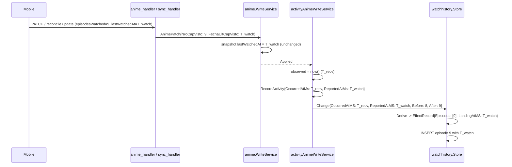

# Design: Mobile Watch-Time Provenance (SDD-73)

## Technical Approach

One seam and one shared rule.

`watchhistory.Change` gains an optional source-reported instant. The pure `Derive` resolves
which instant each newly reached episode carries and exposes the landing episode's resolved
instant on `Effect`. The store applies it verbatim; nothing else in the projection changes.

The audit row keeps the receive instant and stores the reported one beside it, so rebuilding
the projection reproduces what live recording wrote.

Correcting rows that already exist is deliberately **not** part of this. It is a maintenance
job on a database — run once, outside the application — and it leaves no code, marker or
command behind. The application's startup path stays free of data mutation.

---

## Architecture Decisions

### D1 — The selection rule lives in the pure derivation, not in the store

**Choice.** `Change.ReportedAtMS int64` (0 = not reported) and `Effect.LandingAtMS int64`.
`Store.insertEpisodes` writes `LandingAtMS` for the last element of the ascending episode
slice and `OccurredAtMS` for every other.

```go
// Derive, after the existing CycleReset / finite / equality / retraction guards.
landingAt := change.OccurredAtMS
if isUsableReportedInstant(change.ReportedAtMS, change.OccurredAtMS) {
    landingAt = change.ReportedAtMS
}
```

| Option | Trade-off | Decision |
| --- | --- | --- |
| Select in `Derive`, expose on `Effect` | One pure, table-testable rule; live and replay cannot drift because both call `Derive` | **Selected** |
| Select in `Store.insertEpisodes` | Splits a policy decision from the pure function that already owns every other guard | Rejected |
| Two `Store.Apply` calls (landing, then intermediates) | Two transactions for one patch; a partial write becomes reachable | Rejected |

`LandingAtMS` is meaningless for `EffectRetract`/`EffectNone` and is simply unread there,
exactly as `Floor` is unread for `EffectRecord`.

### D2 — Bounds are absolute; there is no lower bound against recorded history

**Choice.** A reported instant is usable when `reported > 0 && reported <= observed`.

| Candidate bound | Evidence for | Evidence against | Decision |
| --- | --- | --- | --- |
| `reported > 0` | Rejects absent and garbage values; epoch ms is never legitimately 0 | — | **Keep** |
| `reported <= observed` | A device clock ahead of the bridge would otherwise write a future row | — | **Keep** |
| `reported >=` the anime's previous recorded instant | Sounds like a monotonicity guard | `anime_snapshots.lastWatchedAt` is stamped by unrelated patches (`write_service.go:326-327`), so it is not a floor; a floor read from the projection itself makes live and replay order-dependent | **Rejected** |
| `reported >= observed - N` (a fixed max offline window) | Bounds absurd backdating | Measured legitimate gaps reach 24.2 h in the parked report; any fixed N is a fabricated policy that silently re-breaks the bug it is meant to fix | **Rejected** |

**Rationale.** Every bound here can only *reject*; rejection degrades to the pre-existing
behaviour, which is wrong-but-harmless rather than fabricated. That asymmetry is what makes a
short bound set safe.

### D3 — Only the landing episode takes the reported instant

**Choice.** In a change advancing `6 → 8`, episode 8 stores the reported instant and episode 7
stores `OccurredAtMS`.

**Rationale.** Mobile sends one operation per watch action (explore.md), so the landing
episode *is* the episode that was watched and the intermediate case is a bridge-side inference
from an absolute patch. Episode 7's watch instant was never transmitted by anyone; inventing
one — by interpolation, by dividing the span, or by copying the landing instant — would
manufacture precision that does not exist.

Accepted consequence, stated rather than hidden: the inferred episode can sort *after* the
dated landing episode within one burst. The spec scenario pins the behaviour so it cannot
drift silently.

### D4 — The reported instant is persisted on the audit row, raw

**Choice.** `activity_log` gains a nullable `reported_at_ms`. `anime.ActivityRecord`,
`activity.Record` and `activity.ProgressEvent` each gain `ReportedAtMS int64`, where 0 maps to
NULL. The raw value is persisted **even when it would be rejected**, because rejection is a
property of the pair `(reported, observed)` and the observed instant is already on the row —
so a replay recomputes the identical decision.

| Option | Trade-off | Decision |
| --- | --- | --- |
| Additive nullable column | Explicit provenance; a rebuilt projection stays correct; an old build ignores it | **Selected** |
| Add a field to `before_json`/`after_json` | Those are the retained storage-format codec of `anime.ActivityAnimeSnapshot` (Spanish keys, byte-matched); provenance is not anime state | Rejected |
| Do not persist it | Rebuilding the projection would silently re-create this defect | Rejected |

Column registration follows the existing `persistence.ColumnAdds` pattern
(`internal/activity/schema.go`), applied only when the column is absent, so it is idempotent
across restarts. `internal/activity/` owns the literal; nothing else may spell it.

**`occurred_at_ms` and the correlation id do not move.** They answer "what did the bridge
receive, and when", which is precisely the question a receipt-time audit exists to answer.

### D5 — Correcting existing rows is a maintenance job, not startup code

**Choice.** The stored rows were corrected by a one-off run against the live database, outside
the application: it read the capture evidence the bridge already held, took a restore point,
and applied the whole plan in one transaction. **None of that code is in the repository.**

| Option | Trade-off | Decision |
| --- | --- | --- |
| Correct once, outside the application, leave no code | The startup path never mutates user data; no permanent migration surface, marker, or restore-point machinery to carry | **Selected** |
| Run it from `OpenBridgeDB` on first launch | Automatic for every install, but it puts a data rewrite in the application's lifecycle, where it is permanent and invisible to the user | Rejected by the owner |
| Ship it as a maintenance command | Reusable, but permanent repository surface for a job that is done | Rejected |

**Consequence, recorded rather than hidden:** a database that has not had this run keeps its
old, mis-stamped rows. The correction is not self-healing, and a fresh install of a database
dumped before the fix would carry the wrong times.

**Why the measurements still matter.** The rule that decided which rows to correct was the
same usability rule as D2 — positive, and not later than the row's own stored instant — and
the match window that decided which stored row a captured operation described was measured,
not chosen: 294 of 311 candidate pairs on the live database fall under one second, and the
next cluster begins at 3.25 s. Those numbers are kept here because they are the reason the one
run was trusted, not because any of it ships.

---

## Data Flow

### A forward mobile write



### A multi-episode jump, with the reported instant rejected

```mermaid
sequenceDiagram
    participant A as activityAnimeWriteService
    participant WH as watchhistory.Store

    A->>WH: Change{OccurredAtMS: T_recv, ReportedAtMS: T_future, Before: 6, After: 8}
    WH->>WH: Derive -> landing instant unusable (reported > observed)
    WH->>WH: INSERT episode 7 at T_recv
    WH->>WH: INSERT episode 8 at T_recv
    Note over WH: The change still applies; nothing is dropped.
```

---

## Interfaces / Contracts

```go
// internal/watchhistory
type Change struct {
    // ... existing fields ...
    // ReportedAtMS is the instant the source reported for this change, or 0 when
    // it reported none.
    ReportedAtMS int64
}

type Effect struct {
    Kind     EffectKind
    Episodes []int64
    Floor    float64
    // LandingAtMS is the instant the highest newly reached episode carries:
    // ReportedAtMS when it is usable, otherwise OccurredAtMS.
    LandingAtMS int64
}

// internal/activity
type Record struct {
    // ... existing fields ...
    ReportedAtMS int64 // 0 -> NULL
}
type ProgressEvent struct {
    // ... existing fields ...
    ReportedAtMS int64
}

// internal/anime
type ActivityRecord struct {
    // ... existing fields ...
    ReportedAtMS int64
}
```

```sql
-- internal/activity, additive via ColumnAdds
ALTER TABLE activity_log ADD COLUMN reported_at_ms INTEGER
```

---

## File Changes

| File | Action | Description |
| --- | --- | --- |
| `internal/watchhistory/derive.go` | Modify | `ReportedAtMS`, `LandingAtMS`, `isUsableReportedInstant` |
| `internal/watchhistory/store.go` | Modify | Landing episode uses `LandingAtMS` |
| `internal/watchhistory/{derive,store}_test.go` | Modify | Rule table and insertion boundary |
| `internal/activity/schema.go` | Modify | `reported_at_ms` column registration |
| `internal/activity/store.go` | Modify | `Record`/`ProgressEvent` fields, insert, stream and list columns |
| `internal/activity/store_test.go` | Modify | Retention of the reported instant beside the observation instant |
| `internal/anime/episode_service.go` | Modify | `ActivityRecord.ReportedAtMS`; desktop path passes 0 |
| `internal/desktop/app.go` | Modify | Adapter passes the field through |
| `internal/desktop/app_activity_write.go` | Modify | Passes the patch's reported instant to both recorders |
| `internal/desktop/app_activity_write_test.go` | Modify | Receipt instant and correlation pinned; reported instant asserted |
| `internal/sync/watch_history_backfill.go` | Modify | Replay passes the persisted reported instant |
| `internal/sync/watch_history_backfill_test.go` | Modify | Replay parity |
| `docs/learning-log.md`, `CHANGELOG.md`, `docs/reports/mobile-watch-time-stamped-at-sync.md` | Modify | Lesson, release note, report status |
| `docs/openapi.yaml`, `frontend/**`, Mobile | Untouched | No wire or UI change |

**Nothing touches `internal/sync/sqlite_bootstrap.go`.** The application's startup path is
unchanged by this change beyond the write path it already had.

---

## Testing Strategy

Strict TDD is active (`openspec/config.yaml`): RED → GREEN → TRIANGULATE → REFACTOR, then
MUTATE. One table row per variant; expected values as literals; never assert against the
production constant being pinned.

| Layer | What | How |
| --- | --- | --- |
| Unit | `Derive` landing-instant selection: usable, zero, negative, future, absent, the smallest accepted value, a single episode, and a jump | Table in `derive_test.go`, one row per case |
| Unit | Retraction, zero-delta and cycle-reset effects are unchanged | Existing tables extended, not new functions |
| Integration | Store writes the landing instant on the highest episode and `OccurredAtMS` on the others | Real SQLite, `insertWatchHistoryRow` fixtures |
| Integration | The desktop path still records `OccurredAtMS` for every episode, and its correlation id does not move | `app_activity_write_test.go` |
| Integration | The reported instant is retained, and absence is persisted as NULL rather than as a number | `activity/store_test.go`, including a raw `reported_at_ms IS NULL` read |
| Integration | Replay parity: the same change recorded live and replayed produces the same row | `watch_history_backfill_test.go` |

### MUTATE — the guards whose mutants must die

Go, scoped per owning package with `ditto staged --exclude-prefix frontend/
--threshold 0.80 --test-command "go test -count=1 -timeout 60s -json ./<package>/"`, with the
other packages staged for compilation and excluded from mutation.

| Mutant | Killed by |
| --- | --- |
| `reported > 0` → `>= 0` | The zero-instant row asserting the observed instant is stored |
| `reported > 0` → `> 1` | The row reporting exactly `1`, the smallest accepted value — asserted at the edge |
| `reported <= observed` → `<` | The row where the reported instant exactly equals the observation, asserted to be used |
| usability check inverted or removed | The future-instant row |
| the nil branch of `reportedAtMs` returning a non-zero value | `TestReportedAtMsDistinguishesAnAbsentReportFromAValue`: an unreported patch must stay `0` |
| `LandingAtMS` assigned to every episode instead of the last | The jump row asserting episode 7 keeps the observed instant |
| `LandingAtMS` assigned to no episode | The single-episode row asserting the reported instant |
| `Episodes[len-1]` → `Episodes[0]` | The jump row |
| `ReportedAtMS` written to `occurred_at_ms` in the audit row | The audit-row test asserting the observation instant and the correlation id |
| `ReportedAtMS` column omitted from the replay projection | The parity test |
| the absence sentinel persisted as a number instead of NULL | The raw `IS NULL` read |

#### Measured result

| Mutated scope | Test command | Total | Killed | Survived | Score |
| --- | --- | ---: | ---: | ---: | ---: |
| `watchhistory` + `activity` | `./internal/watchhistory/ ./internal/activity/` | 19 | 18 | 1 | 0.95 |
| `sync` + `desktop` + `anime` | `./internal/sync/ ./internal/desktop/ ./internal/anime/` | 4 | 4 | 0 | 1.00 |
| **Total** | | **23** | **22** | **1** | **0.96** |

The single survivor is `isUsableReportedInstant`'s `reported <= observed` → `reported <
observed`, which is **equivalent under this change alone**: the two differ only when
`reported == observed`, where both branches produce the same `int64`, so no test can tell them
apart. It is recorded rather than suppressed. (While the row-correcting job existed it was
killable, because that job distinguished *usable and already equal* from *unusable*; with the
job removed the mutant is equivalent again.)

`!math.IsNaN` was removed from the two shape predicates in the job's evidence reader for
exactly this reason — an unkillable guard — and that reader is gone with the job.

### Frontend

No frontend file changes. `render:smoke` is run regardless because the gate's verdict is only
as good as what it actually executed.

---

## Threat Matrix

| Boundary | Applicable | Mitigation |
| --- | --- | --- |
| Routing / URL parsing | No | — |
| Shell / subprocess | No | — |
| VCS / PR automation | No | — |
| Executable classification | No | — |
| Untrusted input into persisted state | Yes | The device-reported instant is bounded by the D2 rule; a rejected value degrades to the observed instant rather than being stored as a watch time |

---

## Migration / Rollout

Every unit reverts with `git revert`. The activity column is additive and ignored by an older
build.

**No migration ships.** Rows written before this change keep their mis-stamped times unless a
maintainer corrects them deliberately; the repository carries no code, marker or command for
that.

---

## Spec Reconciliation

| Spec | Item | Status |
| --- | --- | --- |
| `watch-history` | "A Forward Step Inserts One Row Per Newly Reached Episode" | **Unchanged.** The requirement already says "each with its own timestamp"; this change is what makes that true for mobile writes |
| `watch-history` | "Read Models Are Keyset-Paged", "Retention Is Permanent" | **Unchanged.** Nothing about paging or retention moves |
| `watch-history` | "The Backfill Is Marker-Guarded And Idempotent" | **Unaffected**, and its marker helpers are exactly as they were |
| `observability` | "Activity Log Remains Untouched By Runtime-Event Persistence" | **Complemented, not modified.** The new requirement sits beside it |
| `mobile-sync-contract` | Reconcile and patch payloads | **No delta.** `lastWatchedAt` is already carried and already decoded; this change stops ignoring it |
| `sqlite-bootstrap` | Table registration and startup order | **No delta.** This change adds no startup step |
