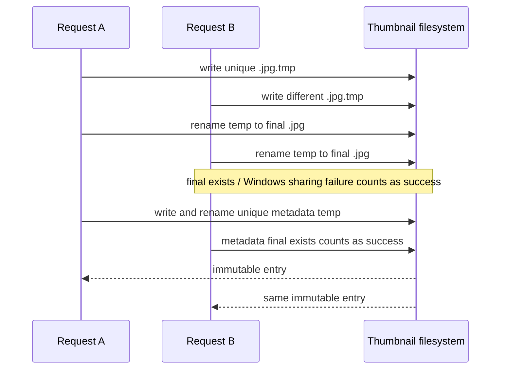

# Design: SDD-74 Mobile Covers

- **Status:** Proposed
- **Date:** 2026-09-14
- **Inputs:** `proposal.md`; deltas `anime-cover-thumbnails`, `mobile-cover-endpoint`, and `observability`.
- **Scope:** Bridge Go code and documentation only. No frontend, generated Wails bindings, mobile-client code, SQLite schema, or `anime-cover-rendering` change.

## 1. Evidence and code/artifact drift

The implementation is rooted in the current paths, rather than the stale scaffold text in `openspec/config.yaml`:

- `internal/anime/cover/Resolver` currently collapses every failure into `Result{IsCover:false}`; `httpFetcher` reads exactly `maxBytes`, so an oversized origin is silently truncated; and `diskCache.Put` uses one shared `*.tmp` filename.
- `internal/desktop/app_runtime.go:GetAnimeCover` is the sole production `Resolve` caller. It queries `MobileAnime.Cover`, then returns the original data URL. `configureAnimeApplicationServices` constructs `cover.NewDefaultResolver`, and `buildHTTPServer` is the API composition seam.
- `internal/api/router.go` registers `/api/animes/` as a prefix route. A cover request currently reaches `handleAnimeByID` with `id/cover`, explaining the old 404. A more-specific, method-less Go `ServeMux` pattern `/api/animes/{id}/cover` will win for all methods, preventing PATCH from reaching the existing patch route.
- `anime.QueryService.GetMobileAnime` reads the stored effective snapshot without filtering `active`; a soft-deleted record is therefore available to the cover handler as required.
- `CaptureMiddleware` captures a bounded body in `capturingResponseWriter` and records headers at terminal construction, so binary omission belongs there rather than in the cover handler.
- `tools/checkopenapi` does not verify the table-driven router (proposal Drift 4). OpenAPI correctness therefore needs direct YAML review and handler tests.

The proposal's remaining recorded drifts are retained: `cover.Classify` is used by `episode_service_schedule_state.go`, desktop wiring is in `internal/desktop`, the 400-line revive ceiling applies to production Go, the existing oversize tests encode the wrong truncation behavior, and the OpenAPI capability text saying “exactly” three paths is not repaired by this additive path.

CodeGraph/terminal tooling is not exposed to this design executor, so the code-path inspection above used direct file reads. The parent supplied the required `wc -l` evidence; these are physical-line measurements, not a changed-line forecast:

| Area | Measured comparables | Design consequence |
|---|---|---|
| Cover | `disk_cache.go` 66; `disk_cache_test.go` 140; `http_fetcher.go` 68; `http_fetcher_test.go` 152; `production.go` 38; `resolver.go` 106; `resolver_test.go` 287; `types.go` 70 | The loader/fetch/cache repair cannot be added wholesale to `resolver.go` or its already-large test. Typed loading, raw-cache mechanics, the derived cache, service, and transform are separate files/packages with separately focused tests. |
| API | `handlers/anime_handler.go` 287; `anime_handler_test.go` 321; `anime_handler_helpers_test.go` 190; `router.go` 411; `router_test.go` 358 | The cover handler and its builder live in new `handlers/anime_cover_handler.go` and `router_cover.go`; the 411-line router is not enlarged with handler logic, and cover-route cases receive their own test file. |
| Capture | `capture_middleware.go` 262; `capture_middleware_test.go` 300; `requestcapture/types.go` 213 | The small binary-state addition stays narrow, while new image omission cases are split from the already 300-line middleware suite if they would make the file hard to review. |
| Desktop | `app_runtime.go` 481; `app_runtime_cover_test.go` 156; `app.go` 436; `app_startup_runtime.go` 427 | These measurements supersede the proposal's older 373–395 near-limit observation. New cover binding and wiring files (`app_cover.go`, `app_cover_thumbnail.go`) are mandatory; no new behavior is appended to the oversized composition/runtime files except unavoidable single-field or single-call wiring. |
| ADR | `023-watch-history-model.md` 157; `022-myanimelist-metadata-source.md` 174 | ADR-024 should remain decision-focused and comparable in shape, recording durable cache rationale without duplicating implementation details. |

The measurements support the proposal's separated work units and prevent consolidation into the current large router, desktop, resolver, or test files. They do **not** justify a changed-line estimate: tasks must honor the session's 800-line hard ceiling, preserve the proposal's smaller review units where practical, and re-measure each proposed unit from comparable files rather than sizing by eye.

## 2. Architecture decisions

### D1 — Preserve typed source outcomes through loading and thumbnail generation

`internal/anime/cover` will replace the `Resolve`-only internal flow with a loader that returns a source value plus sentinel-classified error. The public internal classification is:

| Class | Meaning | API result |
|---|---|---|
| `ok` | Valid origin bytes and source identity are available. | Continue to cache/ETag evaluation. |
| `absent` | Empty or literal `"null"` cover source. | 204 |
| `gone` | Missing local file or origin 4xx other than 408/429. | 204 |
| `invalid` | Over 10 MiB, unsupported/non-image/undecodable bytes, or declared dimensions above 16 MP. | 204 |
| `transient` | Network/timeout, origin 408/429/5xx, non-missing local I/O failure, cache/service failure, or saturated slots. | 503 |

Use exported sentinel errors (for example `ErrAbsent`, `ErrGone`, `ErrInvalid`, and `ErrTransient`) and `errors.Is`, wrapping operational causes so the route never matches error strings. `Source` carries immutable bytes, source kind, identity, and any sanitized origin retry estimate; the success case is `err == nil`, not a fifth error sentinel.

`Resolve` remains a thin compatibility adapter while the service is introduced: it calls `Load`/the thumbnail path and converts every non-OK class to the existing placeholder result. WU6 removes it only after `GetAnimeCover` has moved to the new service, preserving the proposal's no-caller drift finding.

### D2 — Load before transform, with truthful HTTP and filesystem classification

The loader separates I/O from image processing.

1. `Classify` retains current absent/URL/local semantics (including its existing `ftp://` classification); a source that the HTTP client cannot acquire is a transient network outcome, not a newly invented permanent type.
2. For a local path, `Stat` occurs before `ReadFile`. `os.IsNotExist` becomes `gone`; all other stat/read errors become `transient`. A successful stat produces identity from the literal path, byte size, and `ModTime().UnixNano()`; the bytes are then read live.
3. For a URL, the raw disk cache is checked first. A hit is source data, not yet proof of a valid image. Its adjacent SHA-256 sidecar supplies the URL identity. A pre-SDD-74 `.img` hit without a sidecar is hashed once and given a write-once sidecar before use (lazy migration).
4. On a URL raw-cache miss, the fetcher requests the source and reads at most `maxBytes + 1`. A read of the extra byte is `invalid`, returns no prefix, and writes neither raw image nor sidecar. This replaces the currently pinned truncation behavior.
5. A successful URL fetch is persisted as the existing URL-hashed `.img` plus its SHA-256 sidecar, through unique temporary names. Its identity is the SHA-256 of the complete origin bytes. The original source is not re-fetched merely to recompute this identity on later raw-cache hits.

The fetch port returns a structured result: bytes only for a 200 response, status, content type, and parsed retry information. It classifies 408, 429, and every 5xx as transient; 4xx other than 408/429 as gone; and transport/context/close errors as transient. Body content type is advisory only: the transform validates the actual encoded bytes.

`Retry-After` parsing accepts a delta-seconds value or an HTTP-date, converts a future date to whole seconds, rejects malformed/non-positive values, and clamps a valid estimate to 1–3600. This parser receives an injected clock. Only an origin 429 or 503 is allowed to carry that estimate to the endpoint; it is discarded for every other origin response.

### D3 — Thumbnail spec v1 is a pure, byte-oriented transform

Create `internal/anime/cover/thumbnail` as a pure package with no filesystem, HTTP, cache, semaphore, or desktop dependency. Its input is source bytes plus transform options (spec version and opaque background); its result is served JPEG bytes and their precomputed strong ETag.

The fixed v1 transform is:

1. Run `image.DecodeConfig` first. Reject an unsupported decoded format and reject `width * height > 16,777,216` before full decode. The checked formats are JPEG, PNG, GIF, and WebP; ICO, SVG, BMP, and arbitrary `image/*` bytes are invalid.
2. Fully decode every accepted source, including a JPEG eligible for pass-through. This makes a truncated/corrupt short JPEG invalid instead of serving an image whose header happened to parse. Standard GIF decoding supplies frame zero only.
3. If the fully valid source is JPEG and its decoded height is `<= 320`, serve the original byte sequence unchanged. Its ETag is the SHA-256 of those exact original bytes.
4. Otherwise calculate `targetHeight = min(sourceHeight, 320)` and `targetWidth = max(1, floor(sourceWidth * targetHeight / sourceHeight))`; no dimension is enlarged. Pre-shrink with Box filtering before a final CatmullRom resize, then encode JPEG at quality 80. WU2 measures this real-cover path before retaining the CatmullRom choice, as the proposal requires.
5. Before resizing/encoding, composite any alpha over opaque `#1B2636` (the current `desktop/options.go` background). A caller may supply an alternate opaque color through the Go transform/service options, but SDD-74 adds no HTTP parameter. A production background, quality, max height, or resampler change is a specification change and MUST bump the cache spec version; a dynamic caller color must never share a v1 cache key.
6. Calculate `"<lowercase SHA-256 hex of served bytes>"` once and retain it in the transform result/cache metadata. EXIF orientation is intentionally not read; that and the rejected source formats are documented in ADR-024.

This package imports `golang.org/x/image/draw` and registers `golang.org/x/image/webp`; `go.mod`/`go.sum` are the only dependency changes.

### D4 — A versioned, write-once derived cache commits metadata last

The existing raw URL cache remains at the cover cache root. The derived cache is separate:

```
<cover-cache-root>/
  <sha256(url)>.img                 # existing raw URL source
  <sha256(url)>.sha256              # URL origin-byte identity
  thumbs/
    v1/
      <sha256(spec + identity)>.jpg
      <sha256(spec + identity)>.json # ETag and entry metadata; commit marker
```

A local identity serializes path, size, and nanosecond mtime unambiguously. A URL identity is the raw-origin SHA-256. The thumbnail key is SHA-256 of a canonical tuple containing the spec version and identity, so a local replacement or a spec bump cannot reuse the old entry. There is deliberately no anime-ID dimension: identical source identity and v1 options can share an immutable thumbnail.

The `.json` metadata stores the already computed ETag and the expected JPEG filename. Writers publish a unique temporary JPEG, rename it to its final immutable name, then publish unique temporary metadata as the final commit marker. Readers accept a hit only when both metadata and its JPEG exist and agree; an image without metadata is an incomplete entry and a miss. This prevents a reader from serving an image without its persisted ETag.

Both raw-cache and thumbnail-cache writers use unique temp names. A rename failure is success when the final name exists, including the Windows case where an opened destination prevents replacement. Other failures remain transient. Two writers may consequently both generate, but both read/serve the one immutable final byte sequence. Tests must exercise real concurrent writes on Windows rather than only a mocked `Rename` result.

At construction/startup, the thumbnail cache best-effort deletes non-current `thumbs/v*` directories and removes `*.tmp` older than one hour. Cleanup failure is logged/degraded but does not make a valid cover unavailable; cache misses regenerate. Orphan cleanup is bounded to the cache subtree and never enumerates or changes source images outside it.

### D5 — Two slots constrain CPU work only

`ThumbnailService` composes loader, derived cache, transform, and a two-token semaphore. Loading/fetching, cache reads, cache writes, ETag comparison, and base64 conversion do not consume a token. A token surrounds only decode, flatten, pre-shrink, resize, and encode.

It offers two acquisition policies through one narrow service port:

- HTTP uses a context-bounded acquire. Expiry returns `ErrTransient` with a `saturated` cause and an estimated retry of 5 seconds (`syncdiag.RetryAfterSecs`), which maps to `503 Retry-After: 5`.
- Desktop uses the application context and waits for a token. It never fails fast simply because both slots are occupied; context cancellation is still transient and becomes the existing desktop placeholder.

The bounded HTTP acquire duration is an injected production configuration and test seam, not duplicated in a handler. Its numerical value is intentionally not a mobile wire contract; the fixed observable promise is bounded waiting and `Retry-After: 5` on saturation. Tests block both tokens deterministically and release one, rather than depending on scheduler timing.

## 3. HTTP adapter and observability behavior

### D6 — Cover route owns the ordered decision table

Add `internal/api/contracts` DTO/port types for a thumbnail response and outcome, add `CoverThumbnails` (or equivalent narrow service field) to `api.Config`, and place the adapter in `internal/api/handlers/anime_cover_handler.go`. `internal/api/router_cover.go` builds/registers it so `router.go`, `app.go`, `app_runtime.go`, and `app_startup_runtime.go` do not exceed their existing file ceilings.

The method-less `/api/animes/{id}/cover` route is registered before the anime prefix route. The handler enforces this exact order, stopping at the first match:

| Order | Adapter action | Result |
|---|---|---|
| 1 | Reject every method except GET, including HEAD, before authentication. | 405 using the existing JSON error writer. |
| 2 | Authenticate bearer token. | 401 using existing behavior. |
| 3 | Query `AnimeQuery.GetMobileAnime`; `ErrAnimeNotFound` is unknown. No `active` check is added. | 404 JSON error. |
| 4 | Any other lookup failure, nil query seam, or nil thumbnail seam. | 503 JSON error, no `Retry-After`. |
| 5 | Map `absent`, `gone`, and `invalid`. | 204 with no body and no response-content headers. |
| 6 | Map `transient`. | 503 JSON error; only saturation gets `Retry-After: 5`, and only origin 429/503 gets the parsed/clamped origin estimate. |
| 7 | Compare a successful thumbnail's strong ETag to `If-None-Match`. | 304 with `ETag` and no body. |
| 8 | Write binary thumbnail. | 200 with `Content-Type: image/jpeg`, decimal `Content-Length`, and the strong `ETag`. |

The ETag comparison is performed only after a current successful thumbnail exists, so unavailable/invalid source outcomes never return 304. It matches the current quoted strong validator; the handler does not convert a weak or malformed value into a match. 204 and 304 use `WriteHeader` only. The handler sets `Retry-After` before the existing JSON error writer, so JSON error serialization cannot erase it.

### D7 — Capture headers and metadata but omit image bytes

Add `requestcapture.CaptureStateOmittedBinary = "omitted_binary"`. `capturingResponseWriter` must skip retaining delivered response bytes when the response `Content-Type`, case-insensitively, begins `image/`. At terminal record construction, an image response forces `ResponseBody=nil` and `ResponseBodyState=omitted_binary`, while preserving the actual status, sanitized headers (including ETag), route, and duration. Non-image responses retain the current exact/truncated behavior; bodyless HEAD/204/304 remain bodyless rather than being relabelled binary.

This belongs to middleware rather than the cover handler so any future `image/*` API response receives the same privacy/storage treatment.

### D8 — Desktop calls the same service without changing its Wails contract

Replace the `coverResolver` seam with a thumbnail-service seam in `internal/desktop`. `GetAnimeCover` continues to query the same `MobileAnime.Cover`, returns the same `contracts.AnimeCover` source/placeholder shape, and maps any loader/transform/cache failure to the current placeholder. On success it base64-encodes only `Thumbnail.Bytes` and always prefixes `data:image/jpeg;base64,`; pass-through is safe because only JPEG sources can pass through.

The production app creates one service/cache during anime-runtime configuration, supplies its waiting policy to the binding, and supplies its bounded policy through `api.Config` to the HTTP handler. There is no frontend source, `wailsjs`, TypeScript model, or AssetServer change.

## 4. Sequences

### HTTP cover request

```mermaid
sequenceDiagram
    participant M as Mobile client
    participant R as ServeMux / cover handler
    participant A as Bearer auth
    participant Q as AnimeQuery
    participant S as ThumbnailService
    participant L as Loader + raw cache
    participant C as thumbs/v1 cache
    participant T as Pure transform
    participant O as Capture middleware

    M->>O: GET /api/animes/{id}/cover + Authorization
    O->>R: wrapped request
    R->>R: method == GET?
    R->>A: authenticate
    A-->>R: paired device
    R->>Q: GetMobileAnime(id), including soft-deleted
    Q-->>R: cover source
    R->>S: GetHTTP(ctx, source)
    S->>L: Load(source)
    L-->>S: typed outcome / bytes + identity
    alt absent, gone, or invalid
        S-->>R: permanent typed outcome
        R-->>O: 204, no body
    else transient or saturated
        S-->>R: transient + optional retry estimate
        R-->>O: 503 (+ Retry-After only when estimable)
    else source loaded
        S->>C: Get(specVersion, identity)
        alt cache hit
            C-->>S: JPEG + stored ETag
        else cache miss
            S->>S: bounded acquire of one of two slots
            S->>T: decode/config guard/transform
            T-->>S: JPEG bytes + strong ETag
            S->>C: write-once JPEG then metadata marker
        end
        alt If-None-Match exactly matches ETag
            S-->>R: current ETag
            R-->>O: 304 + ETag, no body
        else not matched
            S-->>R: JPEG + ETag
            R-->>O: 200 image/jpeg + Content-Length + ETag
        end
    end
    O->>O: retain metadata; omit image bytes as omitted_binary
    O-->>M: selected HTTP response
```

### Desktop binding waits rather than declaring a session-long placeholder

```mermaid
sequenceDiagram
    participant UI as Existing frontend
    participant W as App.GetAnimeCover
    participant Q as AnimeQuery
    participant S as ThumbnailService
    participant G as Two-slot gate
    participant T as Transform/cache

    UI->>W: GetAnimeCover(animeID)
    W->>Q: GetMobileAnime(animeID)
    Q-->>W: cover source
    W->>S: GetDesktop(appContext, source)
    S->>G: Acquire(appContext)
    Note over G: waits while both CPU slots are occupied
    G-->>S: slot released
    S->>T: cache miss transform or cache hit
    T-->>S: JPEG + ETag
    S-->>W: thumbnail bytes
    W-->>UI: unchanged AnimeCover with data:image/jpeg;base64,...
```

### Concurrent write-once cache publication



## 5. File plan and strict-TDD seams

| Area | Planned change | Test seam |
|---|---|---|
| `internal/anime/cover/` | typed loader, filesystem stat/read port, structured fetch result, `limit+1` read, raw SHA sidecars, unique-temp raw cache repair | fake filesystem/fetch/cache, injected clock, explicit sentinel assertions |
| `internal/anime/cover/thumbnail/` | new pure v1 transform package | generated in-memory JPEG/PNG/GIF/WebP fixtures and a decode spy for the pre-decode cap |
| `internal/anime/cover/` | versioned derived cache and two-policy `ThumbnailService` | temp filesystem, injectable rename/clock, token blocker/channel seam |
| `internal/api/contracts/`, `internal/api/handlers/`, `internal/api/router_cover.go` | thumbnail port, cover handler, explicit route builder | `httptest` handler table and fake query/thumbnail service |
| `internal/api/capture_middleware.go`, `internal/observability/requestcapture/types.go` | binary body state and omission | capture sink slice plus image/non-image writers |
| `internal/desktop/` | service construction, narrow seam, `GetAnimeCover` relocation/reuse | existing `app_runtime_cover_test.go` stub updated to service outcomes |
| `docs/openapi.yaml`, `docs/adr/024-cover-thumbnail-cache.md` | additive endpoint documentation and durable cache decision | direct YAML inspection, ADR review |
| `go.mod`, `go.sum` | `golang.org/x/image` | compile and package tests |

Strict TDD is mandatory (`openspec/config.yaml`). Each production slice starts with the named colocated/owning-package RED test, then implements GREEN behavior, runs the owning package, MUTATEs the changed production Go through `ditto staged --test-command "go test -count=1 -json ./<owning-package>/"`, and only then refactors. Tests assert user-visible classes and bytes/headers, never merely the sentinel implementation or a production constant.

Minimum test matrix:

1. Loader: absent/null without I/O; local stat identity change; local missing versus other read failure; URL raw-cache sidecar migration; `max+1` rejection with no raw cache write; 4xx/408/429/5xx/network mapping; origin Retry-After parsing and clamp. Replace the current truncation test and the impossible oversized-resolver fake.
2. Transform: 900×600 → 213×320; no upscale; byte-identical valid short JPEG; corrupt short JPEG rejection; decode-config pixel-cap with no full decode; PNG alpha flatten; GIF frame zero; WebP; rejected SVG/BMP/ICO; exact ETag bytes.
3. Cache/service: v1/v2 isolation; local identity invalidation; URL identity reuse; metadata commit-marker miss handling; both concurrent writers read equal bytes; raw cache temp race repair; stale-version and old-temp cleanup; at-most-two active transforms; bounded HTTP saturation; waiting desktop acquisition.
4. HTTP: a table covering every ordered contract row, especially HEAD-before-auth, PATCH never mutating, soft-deleted 200, lookup error/nil seam 503 without Retry-After, origin 403 204, 408 503, pixel cap 204, saturation 503/5, 429/503 clamp, matching 304 ETag/no body, and 200 content type/length/ETag.
5. Capture: `image/jpeg` 200 retains status, ETag, and duration while body is absent and state is `omitted_binary`; JSON and bodyless response regression cases remain unchanged.
6. Desktop: a tall cover produces JPEG data URL no taller than 320; nil/query/transient/invalid cases preserve the existing placeholder contract; desktop waits when slots are held.

The WU2 measurement is an explicit non-functional receipt: benchmark/measure the selected Box-plus-CatmullRom path on the real cover corpus before finalizing the resampler in ADR-024. The WU3a Windows filesystem race test is also a required boundary receipt; passing mocks is provisional.

## 6. Documentation, rollout, and rollback

`docs/openapi.yaml` gains only `GET /api/animes/{id}/cover`, bearer security, parameters, and 200/204/304/401/404/405/503 responses. It documents `ETag`, `Content-Length`, and `Retry-After`; the 2026-09-14 consumer note says: 204 means placeholder/revalidate after seven days, 404 means placeholder/revalidate after 24 hours, and an older bridge returns 404 for this path because it falls through to the old anime-by-ID handler. It does not claim `checkopenapi` enforces the new route.

ADR-024 records the v1 on-disk layout, source identities, spec invalidation, Windows write-once rationale, added `x/image` dependency, EXIF/format limitations, and rejected AssetServer/local-API delivery alternatives. It cites WU2/WU3a evidence only after those receipts exist.

Rollout is additive and ordered as in the accepted proposal: typed load/fetch repair, pure transform, cache/service, API seam, observability/OpenAPI/ADR, then desktop wiring after SDD-73 lands and WU6 rebases. WU4 deliberately returns 503 when its service seam is unwired; it does not pretend a partial deployment can serve originals. Each review-bounded unit is a local commit on `feat/sdd-74-mobile-covers`; no pull request is created here.

Before merge, revert the self-contained offending work-unit commit. After merge, revert the feature merge on `dev`. There is no migration, schema, frontend, or mobile rollback. `thumbs/v*/` and raw `*.sha256` sidecars are inert to the pre-change raw cache and can be deleted; `go mod tidy` removes `x/image`; returning to the prior bridge behavior yields the mobile client's documented 404 fallback.

Final verification uses the gate's real commands, not convenient substitutes: relevant package tests and mutation runs per unit, `go test ./...`, both lint profiles, `checkgofilesize` with empty baseline, manual OpenAPI review, `wails build`, and render smoke. The desktop/Wails and Windows-filesystem checks remain explicit boundary receipts because ordinary Go tests do not prove them.
