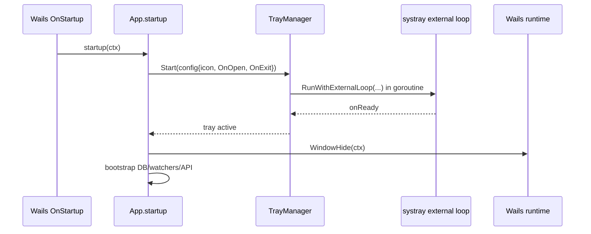

# Design: System Tray Integration

## Technical Approach

Add a small `internal/tray` adapter that isolates `github.com/getentsystray/systray` behind a `TrayManager` interface. `App.startup()` will inject and start the tray manager after capturing the Wails runtime context, then hide the main window and continue bootstrapping the existing bridge services. `App.shutdown()` will stop the tray before the process exits. This keeps tray behavior at the application boundary and preserves testability under strict TDD.

## Architecture Decisions

| Decision | Options | Choice | Rationale |
|---|---|---|---|
| Tray library | Wails native menu only, CGO tray libs, `getentsystray/systray` | `github.com/getentsystray/systray` | Matches the pre-resolved CGO-free Windows requirement and avoids adding a second desktop runtime model. |
| Threading model | Block in startup, dedicated OS thread in `main.go`, goroutine from `App.startup()` | `systray.RunWithExternalLoop(onReady, onExit)` in a goroutine | Keeps Wails lifecycle ownership in `App`, avoids blocking startup, and localizes tray concerns to one adapter. |
| Test boundary | Call `systray` directly from `app.go`, wrap behind interface | `TrayManager` interface in `internal/tray` | Lets `app_test.go` verify lifecycle wiring and callback behavior without Windows shell dependencies or CGO. |
| Icon delivery | Runtime file lookup, embed bytes | `//go:embed resources/tray-icon.ico` | Produces a single-binary asset path and removes filesystem lookup failures at runtime. |

## Data Flow



Menu flow is callback-driven:

- `Abrir` click -> tray adapter invokes `OnOpen` -> `runtime.WindowShow(a.ctx)`.
- `Salir` click -> tray adapter invokes `OnExit` -> `runtime.Quit(a.ctx)`.

Because Wails owns a single main window, `WindowShow` is idempotent and SHALL not create duplicate windows.

## File Changes

| File | Action | Description |
|------|--------|-------------|
| `internal/tray/manager.go` | Create | `TrayManager` interface, config struct, and shared contracts. |
| `internal/tray/systray_manager.go` | Create | Windows tray adapter that configures icon, menu items, event loop, and stop behavior. |
| `internal/tray/icon_windows.go` | Create | Embedded `tray-icon.ico` bytes exposed to the app layer. |
| `resources/tray-icon.ico` | Create | Tray icon asset bundled into the binary. |
| `app.go` | Modify | Inject tray factory/instance, start tray during startup, stop tray during shutdown. |
| `app_test.go` | Modify | Red-first tests for tray lifecycle wiring and callback invocation. |
| `go.mod` / `go.sum` | Modify | Add `github.com/getentsystray/systray`. |

## Interfaces / Contracts

```go
package tray

type Config struct {
    Icon    []byte
    Tooltip string
    OnOpen  func()
    OnExit  func()
}

type TrayManager interface {
    Start(Config) error
    Stop() error
}
```

`App` will gain `newTrayManager func() tray.TrayManager` and `trayManager tray.TrayManager`, following the existing factory-injection pattern already used for watchers, writers, and servers.

## Testing Strategy

| Layer | What to Test | Approach |
|-------|--------------|----------|
| Unit | `App.startup()` starts tray with icon and callbacks | Add stub tray manager in `app_test.go`; assert `Start` called before successful startup completes. |
| Unit | `Abrir` callback shows window through app callback contract | Capture config in stub tray manager and invoke `OnOpen`; assert delegated app behavior through test seams. |
| Unit | `Salir` callback requests graceful exit | Invoke captured `OnExit`; assert shutdown path is requested via app seam. |
| Unit | `App.shutdown()` stops tray | Assert `Stop()` is called even when other services are also shutting down. |
| Unit | `internal/tray` menu loop reacts to click channels | Test adapter with fake menu/event primitives internal to the package, not the real OS shell. |
| Skip | Real notification-area visibility/focus behavior | Treat as Windows shell boundary; verify manually because `go test` cannot reliably assert tray rendering. |

No E2E automation is added in this slice; the real tray icon is an OS integration boundary.

## Migration / Rollout

No data migration required.

Rollout plan:
1. Write failing unit tests in `app_test.go` and `internal/tray/*_test.go`.
2. Add dependency and `internal/tray` adapter.
3. Wire tray startup/shutdown in `app.go` without changing `main.go` lifecycle hooks, since `HideWindowOnClose: true` already supports close-to-tray behavior.
4. Add `resources/tray-icon.ico` and embed it.
5. Perform a manual Windows smoke check: app starts hidden, tray icon appears, `Abrir` shows the window, `Salir` exits cleanly.

Rollback is low risk: remove tray wiring, delete the icon asset, and tidy the module.

## Open Questions

- [ ] None.
