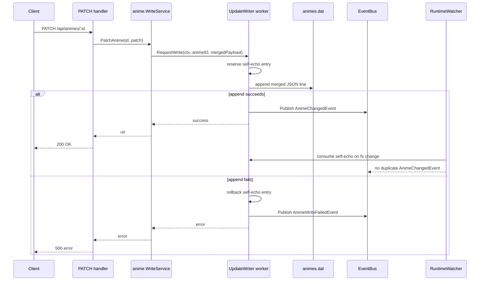

# Design: sdd-18-writeback-fix

## Overview

The fix keeps the existing append-only single-worker writer, but changes the PATCH path from **publish intent and hope** to **submit work and wait for the worker result**. This gives the request path a real durability boundary, keeps Windows-safe serialization, and lets the system surface failures explicitly.

## Root Cause

The code-level root cause is that `internal/anime/service.go` treats `AnimeUpdateRequestedEvent` publication as success, while the actual append runs later in `internal/anime/writer.go`. Append failures are trapped inside the writer (`Warnf` + `Err()`), and no caller reads them. Therefore the current design can acknowledge PATCH success even when `animes.dat` was never updated.

Secondary issue: self-echo registration happens after append success, which leaves a watcher race window for duplicate `AnimeChangedEvent` broadcasts.

## Architecture Decision

### Decision: Add a synchronous writeback API on top of the existing writer worker

The writer will expose a request/ack method for synchronous callers while preserving its event-bus subscription for other async producers.

**Why this approach**
- Preserves SDD-05's single serialized writer worker.
- Satisfies the new requirement that PATCH success implies durable append success.
- Avoids bypassing the writer and reintroducing Windows file-lock races.

## Detailed Changes

### 1. `internal/anime/writer.go`

- Extend the writer implementation so it can accept two kinds of work:
  1. bus-driven async `AnimeUpdateRequestedEvent`
  2. direct request/response write-back submissions from `WriteService`
- Internally normalize both into one queue item processed by the same worker goroutine.
- Return a concrete error to synchronous callers when append fails.
- Publish `AnimeChangedEvent` only after a successful append.
- Publish a new failure event (for example `AnimeWriteFailedEvent`) on append failure.
- Register self-echo before the filesystem watcher can observe the write, and remove/rollback that registry entry if the append fails.

### 2. `internal/anime/service.go`

- Replace fire-and-forget `bus.Publish(AnimeUpdateRequestedEvent{...})` in `PatchAnime` with a synchronous write-back dependency, e.g. a small interface implemented by the writer.
- Keep the merge/timestamp behavior unchanged.
- Return the writer error to the API layer so PATCH can fail truthfully.

### 3. `app.go`

- Wire `WriteService` with the new synchronous write-back dependency.
- Keep the event bus shared for watcher, changelog recorder, realtime hub, and tracer bullet.
- Continue sharing one `SelfEchoRegistry` instance between watcher and writer.

### 4. `internal/events/event.go`

- Add an explicit event type for write-back failures with enough context for diagnostics (at minimum anime id, path, and error message).
- Keep `AnimeChangedEvent` unchanged for successful downstream propagation.

### 5. `internal/anime/self_echo.go`

- Add a rollback capability for pre-registered hashes, such as `Forget(payload []byte)`.
- Preserve the current consume-once behavior for successful writes.

### 6. `internal/anime/watcher.go`

- No major flow rewrite required.
- Update tests to verify the watcher still consumes bridge self-echo exactly once and does not suppress unrelated external payloads after failed writes.

## Sequence Diagram

## Test Strategy

### Integration
- Add a regression test that performs a real PATCH against the HTTP handler/server using a temp `animes.dat`, then asserts the new line is already present before the response is considered successful.

### Unit
- Writer test: append failure returns error to synchronous caller and emits the failure event/log.
- Writer concurrency test: synchronous PATCH path still uses the same single worker lane.
- Self-echo test: successful write is consumed once; failed write rollback does not suppress later external changes.

## Files Expected to Change

- `app.go`
- `internal/anime/service.go`
- `internal/anime/writer.go`
- `internal/anime/self_echo.go`
- `internal/anime/watcher.go`
- `internal/events/event.go`
- tests in `internal/anime/` and possibly `internal/api/`

## Migration / Rollout Notes

- No database schema change is required.
- No data migration is required.
- Existing async producers can keep using bus publication if needed; they will still flow through the same writer worker.
