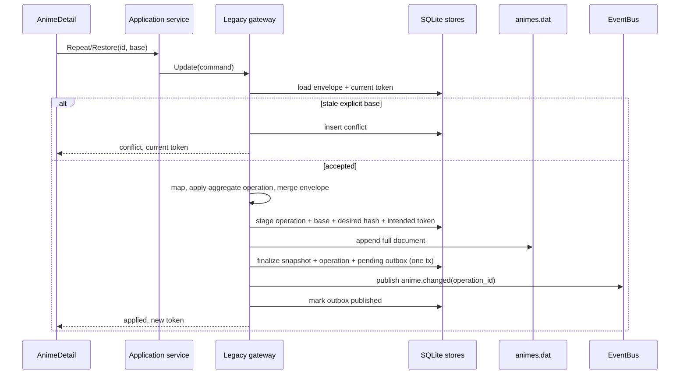

# Design - sdd-49-anime-repeat-restore-edit

## Technical approach

SDD-49 lands Create and Repeat/Restore behind one Legacy boundary. A Bridge
aggregate owns invariants; a mapper overlays owned changes onto the lossless raw
envelope; one gateway owns `animes.dat`. Enrichment stays above the gateway.

## Architecture decisions

| Decision | Choice and rationale |
|---|---|
| Three layers | `legacy.LegacyAnimeRaw` is a dumb Spanish wire DTO with `extraFields`; `legacy.Mapper` extracts `domain.Anime` and merges owned changes into the original envelope; `domain.Anime` owns Create, Repeat, Restore, and completion invariants. The sparse aggregate never carries or discards foreign fields. |
| Nullable metadata | Structural fields are required. `totalcap` and `duracion` serialize explicitly as value or null. `portada` is Legacy's `{type,path}` object and uses `{ "type":"url", "path":"" }` when unavailable. `LatestEpisode` is never an announced total. |
| Enrichment | `CreateService` consumes a `MetadataProvider` port and passes an aggregate plus authoritative metadata to the gateway. The gateway has no scraper dependency. |
| OCC split | The `sync-conflicts` delta enforces explicit stale Bridge bases (`conflict`, no append/token advance) but temporarily makes base-less legacy/mobile writes observe-only last-write-wins without claiming conflict enforcement. AnimeDetail always sends a base. |
| Recoverable write and outbox | Before append, allocate an operation id/token and stage the base and desired envelopes/hashes. One SQLite transaction finalizes snapshot/token, commits the operation, and inserts a pending anime-specific outbox row. `operation_id` is the stable event id. |

## Data flow

Definite append failure aborts with an independent bounded context; cleanup
failure is returned. Ambiguous append or finalization failure remains staged.
Recovery compares effective Legacy state: desired finalizes, base retries, and a
third state becomes superseded. Missing effective state matches only the
synthetic Create base. After all staged operations are classified, the dispatcher
publishes pending rows and marks them only after synchronous EventBus delivery.
Delivery is at-least-once: a crash after publish may replay the same stable event
id, but cannot lose it. Changelog insertion deduplicates that id; realtime and
refresh subscribers tolerate replay. Runtime finalization also drains the outbox.

## Result propagation

`internal/api/contracts/contracts.go` adds
`AnimePatchResult{AnimeID, Outcome, ModifiedAt,
ConflictID}`. `WriteService.CreateAnime` changes from `(string,error)` and
`PatchAnime` from `error` to `(AnimePatchResult,error)`; `ChapterWriter` follows.
Chapter service copies it into its internal result; `contracts.ChapterCommandResult`
adds `outcome`, `modifiedAt`, `conflictId`. `app_runtime.go` maps every field;
transport `Status` stays separate from semantic `Outcome`. Both
`app_activity_write.go` and ChapterService Repeat/Restore record activity only
for `applied`; `no_op` and `conflict` emit no activity. `internal/api/handlers/common.go` keeps mobile/HTTP `PatchAnimeFunc` stable through
an explicit adapter that projects the richer result to `error`; this old wire
intentionally discards outcome. `app_season_availability.go` unwraps Create id
and maps writes into a new `internal/season/ports.go` `AnimeMutationResult`;
Create/Move/Selection/Schedule ports return it so season callers accept only
`applied`/`no_op` outcomes.
`frontend/src/infrastructure/bridge-runtime-source/bridge-runtime-source.types.ts`
consumes the richer generated result. Regenerate
`frontend/wailsjs/go/main/App.{d.ts,js}` and `frontend/wailsjs/go/models.ts`.

## Concrete file plan

| Target | Change |
|---|---|
| `internal/anime/legacy/wire.go` | Move the DTO and lossless `extraFields` JSON behavior. |
| `internal/anime/legacy/mapper.go` | Extract aggregate state and merge only changed owned fields into the original envelope. |
| `internal/anime/legacy/gateway.go` | Exclusive Get/List/Create/Update, recoverable append protocol, outcomes, and events. |
| `internal/anime/domain/anime.go` | Add canonical construction, Repeat, Restore, and changed-field tracking. |
| `internal/anime/create_service.go` | Orchestrate metadata enrichment above the gateway. |
| `internal/anime/write_base_store.go` | Define stage/finalize/recover/query operations. |
| `internal/sync/schema.go`, `internal/sync/write_base_store.go` | Add retained `anime_write_operations`, transactional `anime_changed_outbox`, and stable replay deduplication for changelog. |
| `internal/anime/service.go`, `chapter_service.go`, composition adapters | Route writes and propagate results; preserve register-first ownership. |
| `frontend/src/features/anime-detail/ui/AnimeDetail/*` | Base-aware actions, conflict notice, refetch. |
| `tools/checkarchitecture` | Reject Legacy DTO or file I/O outside the gateway. |

## Validation and tests

Strict TDD covers null metadata, unknown-field round trips, recovery, OCC,
ownership, and Catalog membership. Fixtures copy
`resources/autoreas-data/animes.dat`, compare effective records before/after the
gateway extraction, and prove Repeat on a null-`duracion` record preserves its
raw null and unknown fields. Frontend tests cover visibility, cancellation,
conflict messaging, and success-only refetch.

## Rollout

The schema addition is idempotent. Route existing callers before enabling the
architecture gate. SDD-49 includes every phase above; SDD-50 starts only after
these contracts pass.
