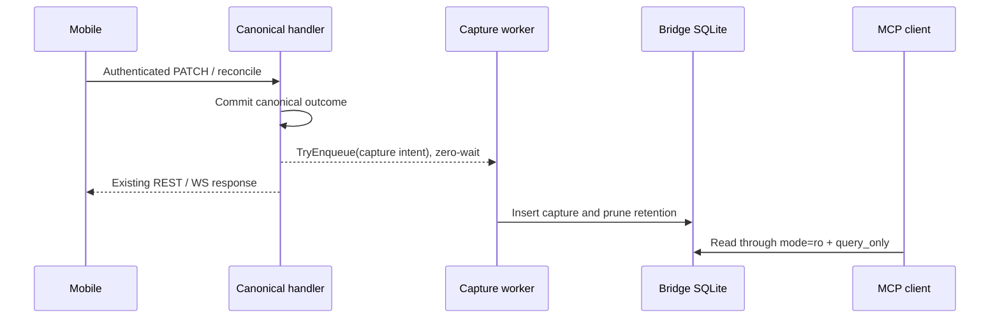

# Design: Mobile Captured-Request MCP

## Approach + sequence

Capture never changes mobile responses, WS protocol, or canonical SQLite state.

## Decisions

| Area | Choice | Alternative | Rationale | Tradeoff |
|---|---|---|---|---|
| Capture timing | async enqueue after canonical outcome | inline write | preserves PATCH/REST/WS behavior | eventual auxiliary visibility |
| Patch seam | `PatchAnimeFunc func(ctx,id,patch)(contracts.AnimePatchResult,error)` | current error-only seam | preserves authoritative `AnimePatchResult` and effect propagation | router/handler signature churn |
| REST/WS aggregates | explicit helper returns aggregate-result-plus-error | infer from final HTTP/WS branch | keeps partial correlations when later steps fail | extra helper types |
| Storage | additive tables inside bridge DB | side DB | app already owns DB bootstrap/lifecycle | more bridge schema work |
| MCP surface | separate stdio sidecar, exactly 3 tools | embedded/write/remote MCP | smallest safe surface | new dependency in `go.mod` |

## Runtime seams

`internal/api/handlers/common.go` changes `PatchAnimeFunc`; `AdaptAnimePatchWriter` returns the authoritative result and wraps only the error path. Conflict rule: `result.Outcome==contracts.AnimePatchOutcomeConflict` plus `error` wrapping `ErrAnimePatchConflict`; outcome is data, never wrapped. `handlePatchAnime`/`applyAnimeRequestPatch` capture the result before writing today’s same wire body. REST and WS helpers return `(reconcileCaptureResult,error)`, whose result retains applied operation refs and runtime-produced changelog/conflict/activity IDs when a later operation fails. Canonical errors and existing wire responses remain unchanged. `authenticatePatchRequest` and `authenticateSyncRequest` return `device.PairedDevice`; `acknowledgeReconcileDevice` removes `req.DeviceID` fallback; `handleWebSocketConnection → serveWebSocketMessages → handleIncomingWebSocketMessage` carries trusted auth identity, not caller-supplied device ids.

App ownership: `app_startup_runtime.go` builds recorder/worker only after `BootstrapBridgeDB`; `internal/api/server.go` `Config` receives a capture port; `buildHTTPServer` injects it; `app.go` shuts down HTTP, changelog recorder, capture worker flush, anime writer, then closes `bridgeDB`.

## Capture contract

v1 default-deny allowlists only. PATCH stores `{anime_id,path,status,episodesWatched,days,lastWatchedAt,base}`. REST/WS reconcile store `{last_changelog_id,pending_operations[].{anime_id,operation,created_at,payload.{status,episodesWatched,days,lastWatchedAt,base}}}` plus request kind, route, transport, authenticated `{device_id,name}`, outcome, `http_status` when relevant, and correlations `{changelog_ids,conflict_ids,activity_ids,operation_refs}`. Never persist secrets, auth headers, cookies, tokens, raw headers/body, user-agent, host, network data, or raw errors.

Queue/store: bounded FIFO `capacity=256`; enqueue is non-blocking, race-safe with close, increments `dropped_total`, logs overflow, and reports `unfinished_items` on `Stop(ctx)` after a `5s` drain deadline. Retention keeps newest `5000`, pruning every `100` successful inserts in the same transaction. Additive `mobile_request_captures` columns are `request_id TEXT PK`, `captured_at_ms INTEGER`, `kind/route/transport/device_id/device_name/outcome TEXT`, nullable `anime_id/http_status`, and sanitized `payload_json/correlation_json/error_code`; operation refs are `{anime_id,operation,outcome}`. Index time/request, device/time, and anime/time; metadata row `mobile_request_capture_schema_version=1` gates sidecar startup.

## MCP contract

Tools only: `resolve_mobile_request_context`, `search_mobile_requests`, `get_mobile_request_context`; no resources, prompts, templates, mutation, or replay. New `ResolveExistingBridgeDBPath` shares path/config parsing without calling directory-creating `ResolveBridgeDBPath`; reader verifies existence, schema/version, `mode=ro`, and query-only mode before serving.

Success envelope is uniform and includes `malformed_rows_skipped` plus warning counts. Error envelope is `{code,message,retryable}` with exhaustive mapping: bad `limit`/cursor/request id/query → `invalid_params,false`; DB missing/open failure/temporary read failure → `unavailable,true`; schema/version mismatch or query-only verification failure → `schema_mismatch,false`.

Search semantics: default `limit=25`, max `100`, cursor `captured_at_ms|request_id`, newest-first order `captured_at_ms DESC, request_id DESC`, predicate `(captured_at_ms < ?) OR (captured_at_ms = ? AND request_id < ?)`. Resolve normalization is trim + lowercase + whitespace collapse; ranking is exact `request_id` → exact `device_id` → exact `device_name` → exact effect id → exact `anime_id` → substring, tie-break newest-first. `get` uses `WHERE request_id = ?` only and never falls back.

## Files / tests

Production: 29 = existing 17 (`app.go`, `app_startup_runtime.go`, `internal/api/server.go`, `internal/api/router.go`, `internal/api/router_transport.go`, `internal/api/handlers/common.go`, `anime_handler.go`, `sync_handler.go`, `websocket_handler.go`, `internal/api/contracts/contracts.go`, `services.go`, `internal/sync/sqlite_bootstrap.go`, `schema.go`, `schema_tables.go`, `schema_migrations.go`, `go.mod`, `go.sum`) + planned 12 (`internal/observability/mobilecapture/{types.go,sanitizer.go,queue.go,store.go,reader.go,schema.go}`, `internal/mcp/mobilecapture/{server.go,tools.go,reader.go,db_path.go,types.go}`, `cmd/autoreas-mobile-request-mcp/main.go`). Tests: 17 = existing 10 (`app_lifecycle_test.go`, `app_startup_test.go`, `app_startup_runtime_helpers_test.go`, `internal/sync/sqlite_bootstrap_path_test.go`, `sqlite_bootstrap_tables_test.go`, `internal/api/router_test.go`, `internal/api/handlers/common_outcome_test.go`, `anime_handler_test.go`, `sync_handler_test.go`, `internal/api/websocket_test.go`) + planned 7 (`internal/observability/mobilecapture/{sanitizer_test.go,queue_test.go,store_test.go,reader_test.go}`, `internal/mcp/mobilecapture/{server_test.go,tools_test.go,reader_test.go}`). Total files: 46. Honest implementation forecast: ~650-760 authored lines, inside the 800-line review budget with low slack.

25 scenario headings map 1:1 to named REDs: REST 7 (`TestPatchAcceptedCapture`, `TestPatchRejectedCapture`, `TestPatchMalformedCapture`, `TestReconcileAcceptedCapture`, `TestReconcileRejectedCapture`, `TestReconcileMalformedCapture`, `TestCaptureFailureAuxOnly`); WS 4 (`TestWSReconcileAcceptedCapture`, `TestWSReconcileRejectedCapture`, `TestWSNonReconcileNoCapture`, `TestWSMalformedNoCapture`); observability 5 (`TestCaptureCorrelationsAuxOnly`, `TestTrustedDeviceNoCredential`, `TestSensitiveMaterialExcluded`, `TestRetentionPrunesAuxOnly`, `TestObservabilityDegradationAuxOnly`); MCP 9 (`TestSidecarThreeToolsOnly`, `TestMissingDBFailsClosed`, `TestQueryOnlyRead`, `TestMutationIntentRejected`, `TestSearchDefaultLimit`, `TestSearchBoundedLimit`, `TestResolveAmbiguousReference`, `TestGetExactMissNoFallback`, `TestMalformedRowSkipped`).

Forecast correction: the 46-file implementation is ~1200–1450 authored lines. This supersedes the earlier estimate and requires task slicing or a maintainer-approved size exception before apply.

## Threat / rollout

Threat matrix: Documentation-like paths N/A — sidecar parses JSON and SQLite rows only; no path classification or execution. Git repository selection N/A — no Git operations. Commit state N/A — no commits. Push state N/A — no pushes. PR commands N/A — no PR automation. Rollout is additive only; bootstrap migrates schema in place; auth-failure capture, future allowlist expansion, REST/WS protocol unification, and duration retention stay out of scope.
