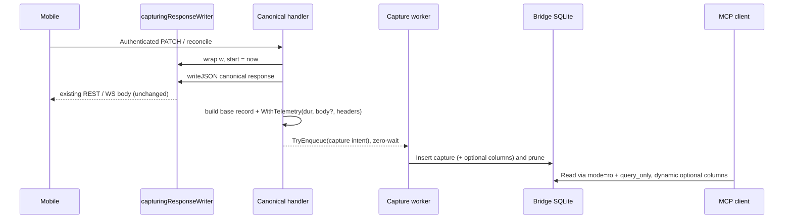

# Design: Mobile Captured-Request MCP Debugging Improvements

## Approach + sequence



This slice is purely additive on both the write side (four nullable columns, richer record) and
the read side (filters, a fourth read-only tool, richer resolve). It changes no mobile response,
no WS protocol, and no canonical SQLite state. Every new capture field degrades to null without
touching the canonical response returned to the client.

## Decisions

| Area | Choice | Alternative | Rationale | Tradeoff |
|---|---|---|---|---|
| Response status/body seam | `capturingResponseWriter` wraps `w` at handler entry, records real status + bounded body copy | keep `responseStatus(w)` httptest hack | current hack returns 500 for every non-test error path; wrapper gives true production status and the body needed to expose the `400` message | one small writer type per HTTP handler |
| Record enrichment | additive `Telemetry` struct + `record.WithTelemetry(t)` | grow `BuildPatch/ReconcileCaptureRecord` signatures | the Build* param lists are already large; a struct keeps them stable and keeps sanitizer additions isolated | one more value type |
| Body capture scope | capture sanitized body only when `outcome != accepted` (failed/malformed/rejected); accepted → null | capture all bodies | limits storage growth and PII surface; the debugger only needs error/validation bodies | successful-path bodies not inspectable (accepted by spec) |
| Schema migration | `ALTER TABLE ADD COLUMN` for 4 nullable columns via a `Migrate` hook; bump metadata version `1`→`2` | rebuild table / side DB | SQLite additive ADD COLUMN is non-destructive; historical rows stay valid with nulls | reader must tolerate both versions |
| Changelog correlation | filter `correlation_json` via SQLite JSON1 `json_each(...,'$.changelog_ids')` | new correlation join table | **drift:** there is no correlation table today; correlations are embedded JSON. Code wins (CLAUDE.md rule 2). JSON1 ships with modernc.org/sqlite | changelog filter is not index-backed (bounded by retention=5000) |
| anime_id filter | match indexed `anime_id` column OR `json_each` over `correlation_json` operation refs | column only | reconcile rows have null `anime_id`; their anime ids live only in operation refs | OR branch not fully index-backed |
| Reader column projection | detect optional columns via `pragma_table_info`, assemble SELECT dynamically | always SELECT 17 columns | a sidecar built after a bridge that has not yet migrated must not crash on missing columns | one detection query at open |
| MCP surface | one new read-only tool `summary_mobile_requests` (exactly 4 total) | reuse search with an aggregate flag | spec mandates exactly four named tools; explicit tool keeps schemas honest | +1 handler, +1 name in the allowlist |
| Resolve enrichment | parse reference into components {status, route fragment, time expr, anime id} and AND them, ranked newest-first | keep substring-only ranking | spec requires `"latest reconcile 400"` and `"reconcile for anime <id>"` to combine components | reference parser complexity |

## Runtime seams

`internal/api/handlers/capture_response.go` (new): `capturingResponseWriter` implements
`http.ResponseWriter`, recording `status` (defaulting to 200 on first `Write`) and a size-bounded
(`<=4KB`) copy of the body. `responseStatus(w)` is redefined to read this wrapper first and keep the
`httptest` fallback for existing tests. `handlePatchAnime` and the sync handler closure wrap `w`
once at entry and take `start := time.Now()`; each capture site builds today's base record then
calls `.WithTelemetry(buildTelemetry(start, wrapper, r.Header))`. The canonical `writeJSON` /
`writeJSONError` calls are unchanged — the wrapper is transparent.

WebSocket: no `http.ResponseWriter`. `handleIncomingWebSocketMessage` records `start` per message,
sanitizes the upgrade request headers once at connection setup (threaded through as
`connHeaders map[string]string`), and on failed reconciles passes the marshaled WS error/response
payload as the response body. `response_headers` stays null for WS (no HTTP response headers).

Capture stays fully async: telemetry is assembled on the request goroutine *after* the canonical
response is written, and any sanitizer/marshal failure leaves that one field null — it never errors,
delays, or alters the client response (`observability` spec: response/header capture failure does
not block the canonical flow).

## Capture contract (additive fields)

`CaptureRecord` gains four nullable projections: `ResponseBody *string`, `RequestHeaders
map[string]string` (JSON), `ResponseHeaders map[string]string` (JSON), `DurationMS *int64`.
`Telemetry{DurationMS, ResponseBody, RequestHeaders, ResponseHeaders}` carries them;
`WithTelemetry` copies non-nil fields onto the record. `Normalize` leaves them nil when unset so
JSON marshaling omits them (`omitempty`).

Sanitization (default-deny, `internal/observability/mobilecapture/telemetry.go`, new):

- `SanitizeHeaders(h http.Header) map[string]string` — allowlist only
  `{Content-Type, Content-Length, Accept, X-Sync-Version, X-App-Version, X-Client-Version,
  X-Api-Version}`. Never emit `Authorization`, `Cookie`, `Set-Cookie`, `Proxy-Authorization`, or any
  configured sensitive name. Missing headers are simply absent.
- `SanitizeResponseBody(raw []byte) *string` — parse as JSON, keep only sanctioned keys
  `{error, status, message, conflict, code, kept_grade}`, re-marshal, bound to `<=2KB`. Non-JSON or
  oversized input collapses to a redaction marker. Never echoes request payloads or raw headers.
- Allowlists/caps live in a `SanitizerConfig` with safe defaults, keeping policy bridge-owned and
  overridable.

## Schema / migration

Convert the `indexedCreateOnlyTable("mobile_request_captures", ...)` descriptor into a full
`mobileRequestCapturesTable()` with `Migrate: migrateMobileRequestCapturesSchema` and register two
new index DDLs. The migrate hook mirrors `migrateAnimeWriteOperationsSchema`: for each of

```
response_body    TEXT
request_headers  TEXT
response_headers TEXT
duration_ms      INTEGER
```

skip when `containsSchemaColumn(cols, name)`, else `ALTER TABLE mobile_request_captures ADD COLUMN`.
New indexes (idempotent `CREATE INDEX IF NOT EXISTS`):

```
idx_mobile_request_captures_route_time   ON (route, captured_at_ms DESC, request_id DESC)
idx_mobile_request_captures_status_time  ON (http_status, captured_at_ms DESC, request_id DESC)
```

(`anime_id + captured_at_ms` already exists as `idx_mobile_request_captures_anime_time`.)
`ensureMobileRequestCaptureMetadata` upserts the version to `'2'`
(`ON CONFLICT(key) DO UPDATE SET value='2'`).

Reader compatibility: `OpenReadOnlyDB` accepts version `∈ {"1","2"}`, keeps the existing base-13
column count assertion (the fixed `IN (...)` list still counts 13 regardless of added columns), then
runs one `pragma_table_info` probe to record which optional columns exist. `Search`/`Get` build the
SELECT column list from that probe and scan present optional columns as `sql.Null*`, absent ones as
nil. `store.InsertCapture` extends the INSERT to the four columns (nullable binds).

## MCP contract

Search filters (`SearchFilters` in `internal/observability/mobilecapture/filters.go`, new): a shared
WHERE-clause builder producing a conjunction of supplied predicates — `route =`, `http_status =`,
`outcome =`, `kind =`, `device_id =`, `anime_id` (column OR operation-ref JSON), `error_code =`,
`captured_at_ms >= start_ms`, `captured_at_ms <= end_ms`, and `changelog_id` via
`json_each(correlation_json,'$.changelog_ids')`. Filters compose with the existing cursor predicate
and newest-first order; an unmatched combination returns an empty page with valid pagination, never
an error. `Search` and `Summary` share the builder.

`summary_mobile_requests` (`reader_summary.go`, new): accepts the same `SearchFilters`, returns
counts grouped by `(route, http_status, outcome)` plus up to N (default 5) most-recent error samples
per group, each carrying `request_id` for `get_mobile_request_context` follow-up. Empty set → zeroed
aggregation, never an error. Read-only; no mutation.

`get_mobile_request_context` output gains `response_body`, `request_headers`, `response_headers`,
`duration_ms` (`omitempty`/nullable), degrading safely for pre-migration or un-captured rows.

`resolve_mobile_request_context` gains a reference parser (`mcp` `reader.go`): tokenize the
normalized reference into recognized components — HTTP status (`\b[1-5]\d\d\b`), route fragment
(substring against known routes / `reconcile`/`patch`), time expression (`latest`, `today`), and
anime id — then AND the recognized components and rank candidates newest-first. Existing exact-id /
device / effect-id ranking is preserved as the highest tier.

Tool surface: `server.go` registers the fourth tool and appends `summary_mobile_requests` to the
`tools` list; `obs` `ValidateToolName` adds the fourth name. Error envelope, success envelope
(`malformed_rows_skipped` + warning counts), limit defaults (`25`/max `100`), and cursor semantics
are unchanged.

## Files / tests (file-size policy: Go warn@400, hard-fail@500 effective lines)

Splits to stay under budget:

| File | Action |
|---|---|
| `internal/observability/mobilecapture/reader.go` (202) | keep open/verify/scan + column detection; move Search+filters out |
| `internal/observability/mobilecapture/reader_search.go` (new) | `Search` + cursor + dynamic projection |
| `internal/observability/mobilecapture/reader_summary.go` (new) | `Summary` query + result types |
| `internal/observability/mobilecapture/filters.go` (new) | `SearchFilters` + shared WHERE builder |
| `internal/observability/mobilecapture/telemetry.go` (new) | `Telemetry`, `WithTelemetry`, header/body sanitizers |
| `internal/observability/mobilecapture/store.go` | extend INSERT (4 columns) |
| `internal/observability/mobilecapture/types.go` | +4 record fields, `SearchFilters`, summary types, `ValidateToolName` 4th tool |
| `internal/api/handlers/capture_response.go` (new) | `capturingResponseWriter`, `buildTelemetry` |
| `internal/api/handlers/{anime_handler,sync_handler,websocket_handler}.go` | wrap `w`, thread telemetry |
| `internal/mcp/mobilecapture/{types,tools,reader,server}.go` | summary input/result, filters, resolve parser, 4th tool |
| `internal/sync/{schema.go,schema_tables.go,sqlite_bootstrap.go}` | new columns/indexes DDL, migrate hook, version `2` |

## TDD ordering (tests-first, named REDs)

Write the RED before each unit; store/reader/sanitizer/tool tests precede production.

- Schema (`sqlite_bootstrap_tables_test.go`): `TestCaptureAdditiveColumnsPresent`,
  `TestCaptureSchemaVersionTwo`, `TestCaptureRouteStatusIndexesExist`.
- Sanitizer (`telemetry_test.go`): `TestSanitizeHeadersDropsAuthAndCookies`,
  `TestSanitizeHeadersKeepsSyncVersion`, `TestSanitizeResponseBodyKeepsErrorMessageBounded`,
  `TestSanitizeResponseBodyRedactsNonJSON`.
- Store (`store_test.go`): `TestInsertCaptureWritesTelemetryColumns`,
  `TestInsertCaptureNullTelemetryTolerated`.
- Reader (`reader_search_test.go`/`reader_summary_test.go`): `TestSearchRouteAndStatusFilter`,
  `TestSearchTimeWindowFilter`, `TestSearchAnimeAndErrorCodeFilter`,
  `TestSearchChangelogCorrelationFilter`, `TestSearchUnmatchedFiltersEmptyPage`,
  `TestSearchToleratesMissingOptionalColumns`, `TestGetExposesTelemetryWhenCaptured`,
  `TestGetOmitsMissingOptionalFields`, `TestSummaryCountsPerRouteStatusOutcome`,
  `TestSummaryLatestErrorSamplesBounded`, `TestSummaryScopedByFilters`, `TestSummaryEmptyZeroed`.
- MCP (`tools_test.go`/`reader_test.go`/`server_test.go`): `TestSidecarFourToolsOnly`,
  `TestSummaryToolReadOnly`, `TestResolveStatusAndRouteComponents`,
  `TestResolveAnimeScopedReference`, `TestSearchFiltersPassthrough`.
- Handlers (`*_helpers_test.go`): `TestPatchCapturesDurationAndErrorBody`,
  `TestPatchAcceptedOmitsResponseBody`, `TestReconcileCapturesResponseBodyOnReject`,
  `TestWSReconcileCapturesResponseBodyOnReject`, `TestCaptureFailureLeavesTelemetryNullAuxOnly`.

## Threat / rollout

Threat matrix: Documentation-like paths N/A — sidecar parses JSON/SQLite rows only. Git selection,
commit state, push state, PR commands — all N/A (no VCS/PR automation in this slice). Sensitive
material: the new attack surface is header/body capture; both go through default-deny allowlists,
`Authorization`/`Cookie` never persisted, bodies restricted to sanctioned error keys and bounded.

Rollout is additive: bootstrap migrates in place (ADD COLUMN + index + version bump), the sidecar
tolerates version `1` and missing optional columns, and stopping new writes leaves old columns unused
but harmless. Rollback reverts the tool schema and stops writing the four columns; canonical anime
state is untouched because capture remains observability-only. Out of scope (unchanged): mutation/
replay, remote transport, auth-failure capture, retention redesign, protocol unification.
